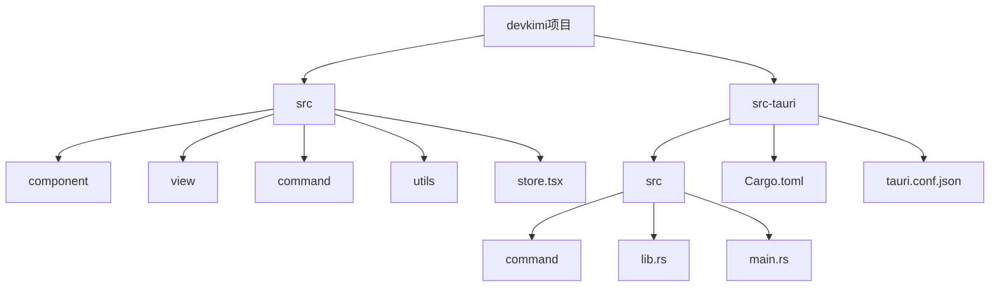
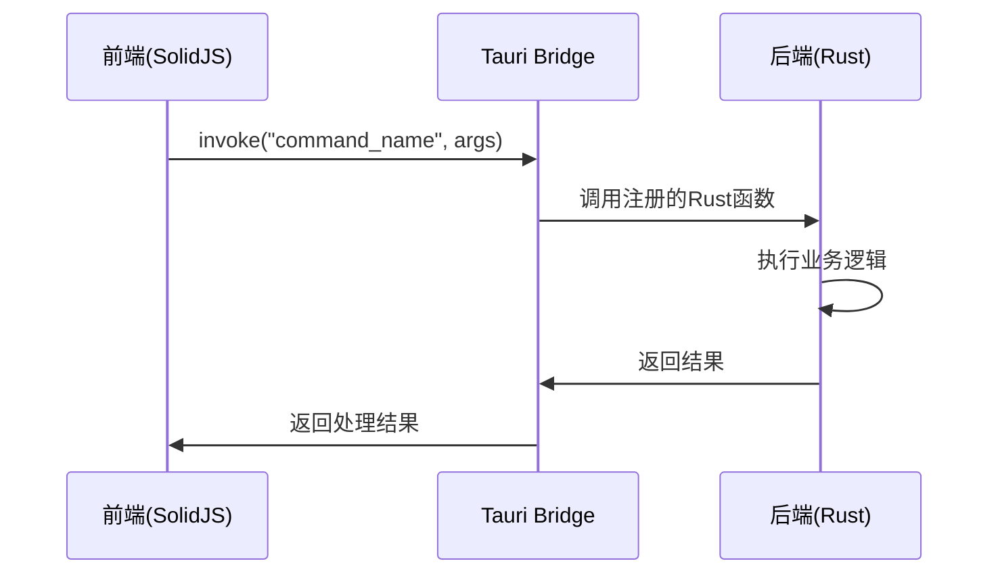
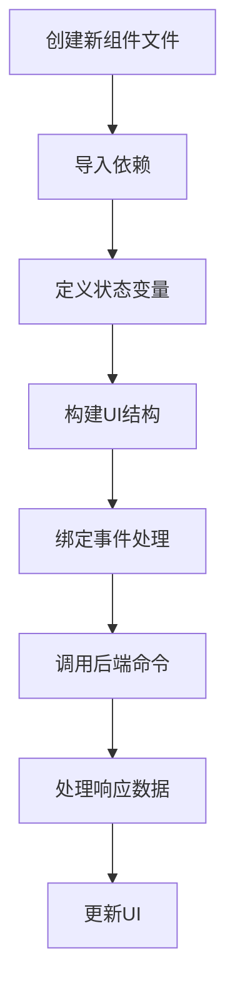
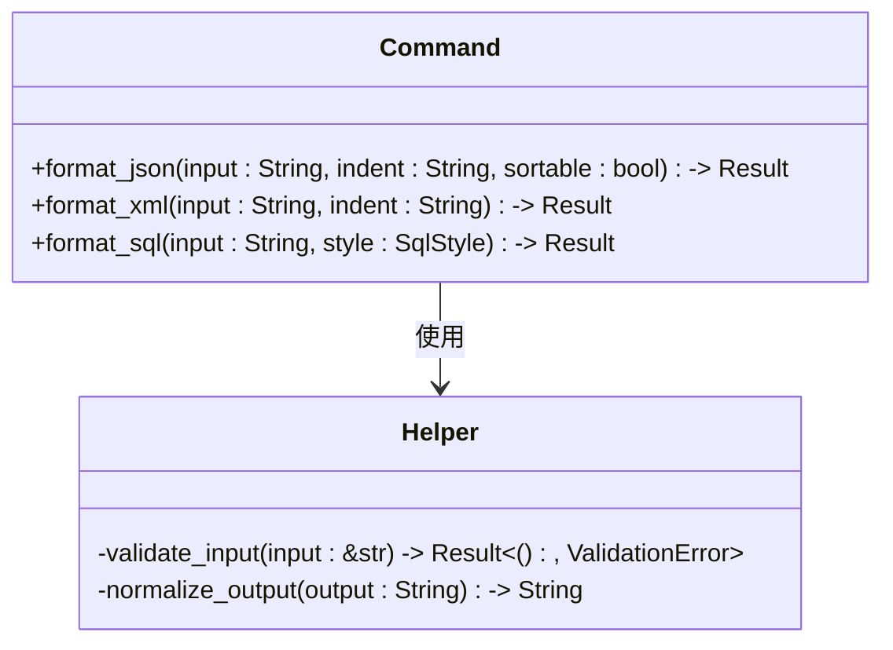

# 开发指南

<cite>
**本文档中引用的文件**  
- [README.md](file://README.md)
- [package.json](file://package.json)
- [Cargo.toml](file://src-tauri/Cargo.toml)
- [App.tsx](file://src/App.tsx)
- [routes.tsx](file://src/routes.tsx)
- [main.rs](file://src-tauri/src/main.rs)
- [tauri.conf.json](file://src-tauri/tauri.conf.json)
- [store.tsx](file://src/store.tsx)
- [json.tsx](file://src/view/formatter/json.tsx)
- [json.ts](file://src/command/formatter/json.ts)
- [lib.rs](file://src-tauri/src/lib.rs)
- [mod.rs](file://src-tauri/src/command/formatter/mod.rs)
- [formatter/json.rs](file://src-tauri/src/command/formatter/json.rs)
</cite>

## 目录
1. [简介](#简介)
2. [项目结构](#项目结构)
3. [核心架构](#核心架构)
4. [添加新功能的完整流程](#添加新功能的完整流程)
5. [前端组件开发](#前端组件开发)
6. [后端命令实现](#后端命令实现)
7. [Tauri接口绑定](#tauri接口绑定)
8. [测试与验证](#测试与验证)
9. [代码贡献规范](#代码贡献规范)
10. [调试技巧](#调试技巧)
11. [性能与质量要求](#性能与质量要求)
12. [结论](#结论)

## 简介

devkimi 是一个基于 Tauri 和 SolidJS 构建的多功能开发者工具集，旨在为开发人员提供一系列常用的开发辅助工具。该项目灵感来源于 DevToys，通过结合 Rust 的高性能和 TypeScript 的灵活性，创建了一个跨平台的桌面应用。

本开发指南旨在为贡献者提供完整的开发流程指导，涵盖从添加新功能到代码提交的全过程。文档详细说明了如何开发新的工具功能，包括前端 UI 设计、后端 Rust 逻辑实现以及两者之间的接口绑定。通过遵循本指南，开发者可以确保新功能能够无缝集成到现有系统中，并符合项目的代码质量和架构标准。

**Section sources**
- [README.md](file://README.md#L1-L122)

## 项目结构

devkimi 项目采用前后端分离的架构设计，前端使用 SolidJS 框架，后端使用 Rust 语言通过 Tauri 框架提供系统级功能。项目主要分为两个部分：`src` 目录存放前端代码，`src-tauri` 目录存放后端 Rust 代码。

前端代码组织遵循功能模块化原则，主要包含以下目录：
- `component`: 通用 UI 组件
- `view`: 功能页面组件
- `command`: 前端调用后端命令的接口
- `utils`: 工具函数
- `store.tsx`: 状态管理

后端代码采用 Rust 模块化设计，主要包含：
- `src/command`: 各类功能的 Rust 实现
- `Cargo.toml`: Rust 依赖配置
- `tauri.conf.json`: Tauri 应用配置

这种清晰的项目结构使得功能开发和维护更加高效，同时也便于新贡献者快速理解项目架构。

**Diagram sources**
- [README.md](file://README.md#L90-L114)

## 核心架构

devkimi 的核心架构基于 Tauri 框架，采用前后端分离的设计模式。前端使用 SolidJS 作为 UI 框架，通过 Tauri 提供的 `invoke` 机制与后端 Rust 代码进行通信。这种架构设计既保证了 UI 的响应性和现代性，又充分利用了 Rust 在系统级操作和计算密集型任务上的性能优势。

应用的启动流程如下：`main.rs` 文件中的 `main` 函数调用 `app_lib::run()`，该函数在 `lib.rs` 中定义。`lib.rs` 文件通过 Tauri Builder 配置应用，注册所有可用的命令处理器，并初始化必要的插件（如文件系统、剪贴板管理等）。

路由系统由 SolidJS Router 提供支持，`routes.tsx` 文件定义了所有可用的功能页面及其元数据，包括路径、标签、图标和关键词。状态管理通过 SolidJS 的 createStore 和 Tauri 的 store 插件实现，用户设置可以持久化存储在本地。

整个架构的设计充分考虑了可扩展性和维护性，新的功能模块可以通过添加相应的前端组件和后端命令轻松集成到系统中。

**Diagram sources**
- [main.rs](file://src-tauri/src/main.rs#L1-L7)
- [lib.rs](file://src-tauri/src/lib.rs#L1-L57)
- [routes.tsx](file://src/routes.tsx#L1-L223)

## 添加新功能的完整流程

添加新功能到 devkimi 项目需要遵循一个标准化的流程，确保代码质量和架构一致性。完整流程包括以下几个关键步骤：

1. **需求分析与设计**：明确新功能的需求，设计用户界面和交互流程。
2. **前端组件开发**：在 `src/view` 目录下创建新的功能页面组件。
3. **前端命令接口**：在 `src/command` 目录下定义调用后端功能的接口。
4. **后端命令实现**：在 `src-tauri/src/command` 目录下实现具体的 Rust 逻辑。
5. **Tauri 接口绑定**：在 `src-tauri/src/lib.rs` 中注册新的命令处理器。
6. **路由配置**：在 `src/routes.tsx` 中添加新功能的路由信息。
7. **测试验证**：编写测试用例，验证功能的正确性和稳定性。
8. **代码提交**：按照贡献规范提交代码，创建 Pull Request。

这个流程确保了新功能的开发有章可循，同时也便于代码审查和质量控制。每个步骤都有明确的职责和输出，使得团队协作更加高效。

**Section sources**
- [README.md](file://README.md#L56-L88)
- [routes.tsx](file://src/routes.tsx#L39-L223)

## 前端组件开发

前端组件开发是添加新功能的第一步。在 devkimi 项目中，所有功能页面都位于 `src/view` 目录下，按照功能模块进行组织。开发一个新的前端组件需要遵循以下步骤：

1. 在相应的功能目录下创建新的 `.tsx` 文件，例如添加一个新的格式化工具时，在 `src/view/formatter/` 目录下创建文件。
2. 使用 SolidJS 的响应式系统（如 `createSignal`、`createEffect`）管理组件状态。
3. 利用项目提供的通用组件（如 `Container`、`Config`、`Editor`）构建用户界面。
4. 通过导入相应的命令接口调用后端功能。
5. 实现用户交互逻辑，处理输入输出数据流。

前端组件的设计应遵循项目的 UI 规范，使用 TailwindCSS 和 DaisyUI 进行样式设计，确保界面风格的一致性。同时，组件应具有良好的可访问性和响应式设计，适配不同屏幕尺寸。

**Diagram sources**
- [json.tsx](file://src/view/formatter/json.tsx#L1-L91)
- [App.tsx](file://src/App.tsx#L1-L47)

## 后端命令实现

后端命令实现是新功能的核心逻辑部分，使用 Rust 语言编写，位于 `src-tauri/src/command` 目录下。Rust 的内存安全特性和高性能使得它非常适合处理系统级操作和计算密集型任务。

实现一个新的后端命令需要遵循以下步骤：
1. 在相应的功能模块目录下创建新的 Rust 文件，如 `src-tauri/src/command/formatter/new_formatter.rs`。
2. 定义公共函数，使用 `#[tauri::command]` 宏标记，使其可被前端调用。
3. 实现具体的业务逻辑，充分利用 Rust 生态系统中的相关库。
4. 处理错误情况，返回适当的结果或错误信息。

后端代码应注重性能优化和错误处理，确保在各种输入条件下都能稳定运行。同时，代码应具有良好的文档注释，便于其他开发者理解和维护。

**Diagram sources**
- [formatter/json.rs](file://src-tauri/src/command/formatter/json.rs)
- [Cargo.toml](file://src-tauri/Cargo.toml#L21-L58)

## Tauri接口绑定

Tauri 接口绑定是连接前端和后端的关键步骤。在 devkimi 项目中，所有可被前端调用的 Rust 函数都需要在 `src-tauri/src/lib.rs` 文件中的 `tauri::generate_handler!` 宏中注册。

接口绑定的具体步骤如下：
1. 在相应的命令模块中使用 `pub mod` 声明新创建的命令文件。
2. 在 `src-tauri/src/lib.rs` 中导入新命令函数。
3. 将新命令添加到 `invoke_handler` 的 `generate_handler!` 宏列表中。
4. 确保函数签名符合 Tauri 的要求，通常返回 `Result<T, Error>` 类型。

Tauri 的接口绑定机制通过 Rust 的宏系统实现，既保证了类型安全，又提供了灵活的扩展能力。所有注册的命令都可以通过前端的 `invoke` 函数调用，命令名称采用蛇形命名法（snake_case）。

**Section sources**
- [lib.rs](file://src-tauri/src/lib.rs#L11-L43)
- [mod.rs](file://src-tauri/src/command/formatter/mod.rs#L1-L4)

## 测试与验证

测试与验证是确保新功能质量的关键环节。devkimi 项目虽然没有显式的测试文件，但提供了完整的开发和构建工具链来支持功能验证。

测试验证的主要方法包括：
1. **开发模式测试**：使用 `pnpm dev` 或 `pnpm tauri dev` 启动开发服务器，实时查看功能效果。
2. **构建验证**：使用 `pnpm build` 和 `pnpm tauri build` 构建生产版本，验证构建过程是否成功。
3. **手动功能测试**：在应用中实际使用新功能，验证其正确性和稳定性。
4. **错误处理测试**：尝试各种边界条件和错误输入，确保应用能够优雅地处理异常情况。

建议在开发过程中频繁进行测试，及时发现和修复问题。同时，应该考虑未来添加单元测试和集成测试，以提高代码的可靠性和可维护性。

**Section sources**
- [package.json](file://package.json#L7-L11)
- [tauri.conf.json](file://src-tauri/tauri.conf.json#L6-L11)

## 代码贡献规范

虽然项目中没有找到 CONTRIBUTING.md 文件，但可以从代码库中推断出一些基本的贡献规范和最佳实践：

1. **代码风格**：遵循 TypeScript 和 Rust 的社区标准代码风格，使用项目中的 Prettier 配置进行代码格式化。
2. **命名规范**：TypeScript 文件使用驼峰命名法，Rust 文件使用蛇形命名法。
3. **模块组织**：按照功能模块组织代码，保持目录结构的清晰和一致性。
4. **文档注释**：为公共 API 添加适当的文档注释，解释函数的用途、参数和返回值。
5. **错误处理**：在 Rust 代码中使用 `Result` 类型进行错误处理，避免 panic。
6. **安全性**：遵循 Rust 的内存安全原则，避免潜在的安全漏洞。

贡献者应该在提交代码前确保代码符合这些规范，并通过项目的构建和运行测试。提交 Pull Request 时，应提供清晰的描述，说明更改的内容和目的。

**Section sources**
- [README.md](file://README.md#L120-L122)
- [package.json](file://package.json#L18-L19)

## 调试技巧

有效的调试技巧对于快速开发和问题排查至关重要。devkimi 项目提供了多种调试手段：

1. **前端调试**：使用浏览器的开发者工具查看组件状态、网络请求和控制台输出。
2. **后端调试**：在 `lib.rs` 的 `setup` 函数中，调试模式下会启用日志插件，可以输出调试信息。
3. **日志记录**：在关键代码路径添加日志输出，帮助追踪程序执行流程。
4. **断点调试**：使用支持 Rust 的 IDE（如 VS Code）设置断点进行逐步调试。
5. **状态检查**：利用 SolidJS 的响应式系统特性，监控状态变量的变化。

建议在开发过程中充分利用这些调试工具，特别是在处理复杂逻辑或难以复现的问题时。同时，应该养成良好的调试习惯，如在提交代码前清除不必要的调试输出。

**Section sources**
- [lib.rs](file://src-tauri/src/lib.rs#L44-L53)
- [store.tsx](file://src/store.tsx#L60-L63)

## 性能与质量要求

devkimi 项目对代码性能和质量有较高的要求，这体现在多个方面：

1. **性能优化**：Rust 代码在 `Cargo.toml` 中配置了发布模式的优化选项，包括链接时优化（LTO）、代码生成单元设置和调试符号剥离，以生成高性能的二进制文件。
2. **代码质量**：使用 Prettier 进行代码格式化，确保代码风格的一致性。
3. **依赖管理**：通过 `package.json` 和 `Cargo.toml` 精确管理前后端依赖，避免版本冲突。
4. **资源管理**：合理使用系统资源，避免内存泄漏和性能瓶颈。
5. **用户体验**：前端组件应具有良好的响应性，避免阻塞主线程的长时间操作。

开发者在实现新功能时，应该考虑这些性能和质量要求，特别是在处理大量数据或复杂计算时，应该采用适当的算法和数据结构，确保应用的流畅运行。

**Section sources**
- [Cargo.toml](file://src-tauri/Cargo.toml#L60-L69)
- [package.json](file://package.json#L18-L19)

## 结论

devkimi 项目提供了一个现代化的开发者工具开发框架，结合了 SolidJS 的响应式 UI 和 Rust 的系统级能力。通过遵循本文档中描述的开发流程和规范，贡献者可以高效地添加新功能并确保代码质量。

项目架构清晰，前后端职责分明，通过 Tauri 桥接器实现安全高效的通信。虽然目前缺少详细的贡献指南和测试框架，但已有的代码结构和工具链为持续开发提供了坚实的基础。

未来可以考虑完善贡献文档，添加自动化测试，以及建立更严格的代码审查流程，进一步提升项目的质量和可维护性。对于新贡献者来说，建议从简单的功能扩展开始，逐步熟悉项目的架构和开发模式。