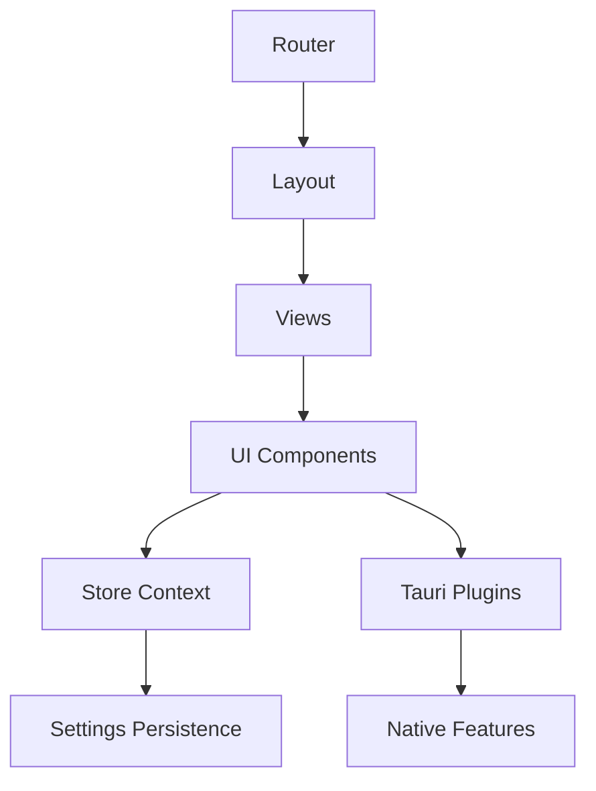
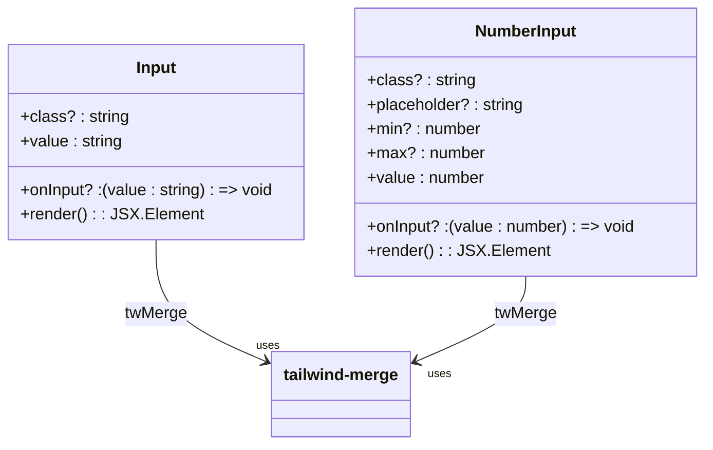
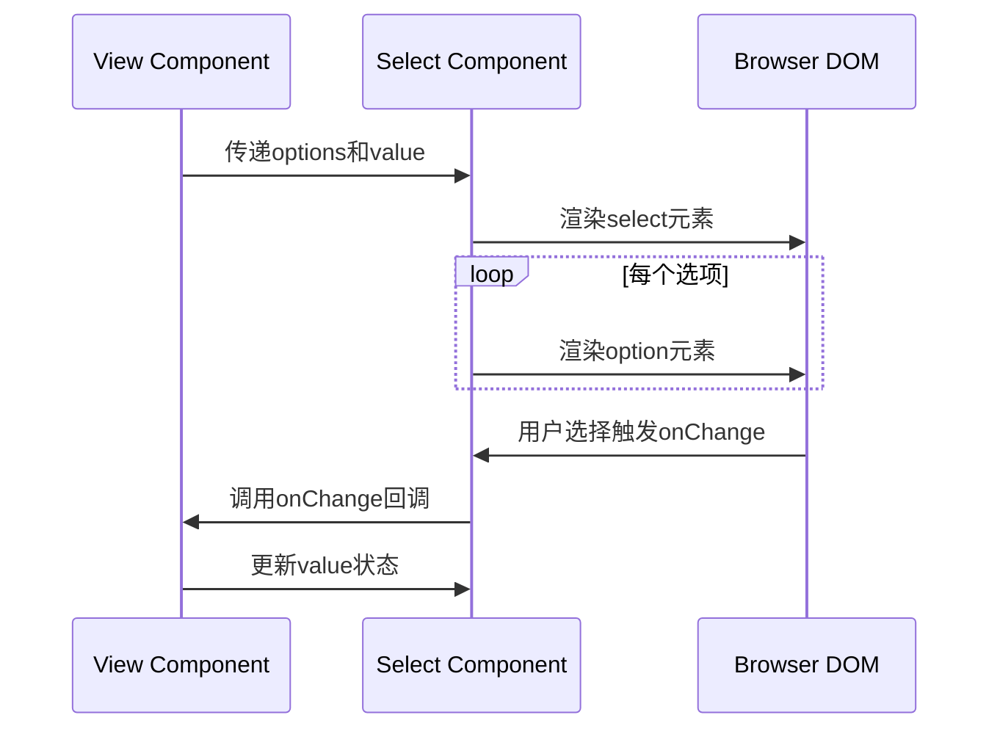
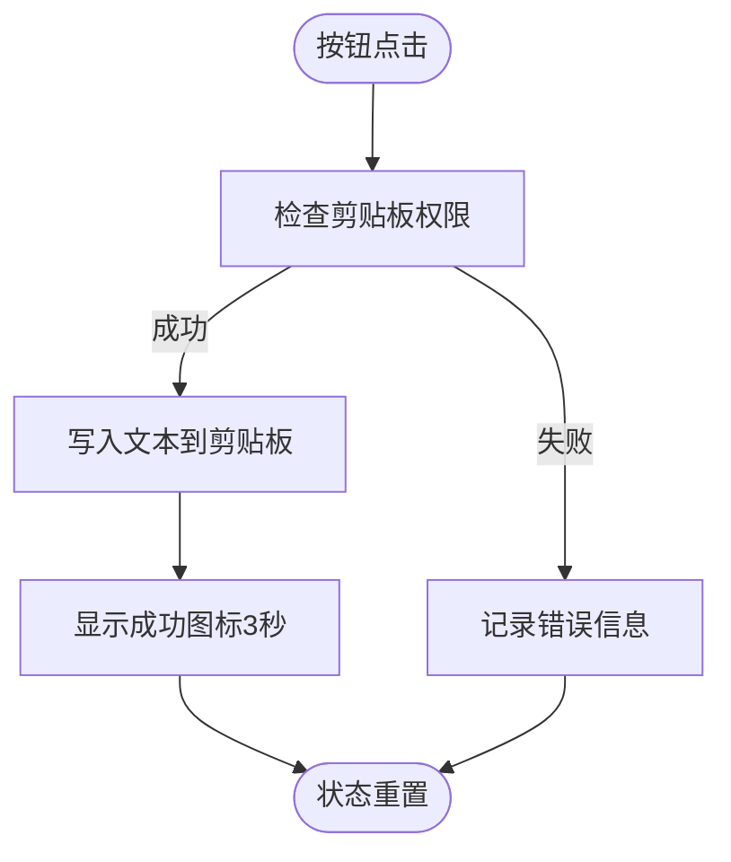

# UI组件开发

<cite>
**本文档中引用的文件**  
- [Input.tsx](file://src/component/Config/Input.tsx)
- [Select.tsx](file://src/component/Config/Select.tsx)
- [Switch.tsx](file://src/component/Config/Switch.tsx)
- [Buttons.tsx](file://src/component/Buttons.tsx)
- [Container.tsx](file://src/component/Container.tsx)
- [Content.tsx](file://src/component/Layout/Content.tsx)
- [index.css](file://src/index.css)
- [App.tsx](file://src/App.tsx)
- [store.tsx](file://src/store.tsx)
- [routes.tsx](file://src/routes.tsx)
- [package.json](file://package.json)
- [vite.config.ts](file://vite.config.ts)
- [home.tsx](file://src/view/home.tsx)
</cite>

## 目录
1. [简介](#简介)
2. [项目结构](#项目结构)
3. [核心组件](#核心组件)
4. [架构概述](#架构概述)
5. [详细组件分析](#详细组件分析)
6. [依赖分析](#依赖分析)
7. [性能考虑](#性能考虑)
8. [故障排除指南](#故障排除指南)
9. [结论](#结论)

## 简介
本文件详细说明在devkimi项目中创建可复用UI组件的最佳实践。文档涵盖使用SolidJS响应式系统构建高效组件的方法，包括props定义、事件处理和状态管理。同时阐述了使用TailwindCSS进行样式设计以及集成DaisyUI组件库来保持UI一致性的方法。通过具体示例展示Input、Select、Button等基础组件的实现方式，包括类型定义、样式定制和无障碍访问支持，并说明组件的测试策略。

## 项目结构
devkimi项目的文件组织清晰，采用功能模块化结构。核心UI组件位于`src/component`目录下，分为`Config`（配置类组件）、`Layout`（布局组件）和其他通用组件。样式系统基于TailwindCSS和DaisyUI，通过`index.css`统一配置主题。应用逻辑与视图分离，`src/view`目录存放页面级组件，`src/command`处理业务逻辑，`src/store`管理全局状态。

```mermaid
graph TB
subgraph "UI Components"
Config[Config/]
Layout[Layout/]
Buttons[Buttons.tsx]
Container[Container.tsx]
end
subgraph "Views"
Views[view/]
end
subgraph "State & Logic"
Store[store.tsx]
Command[command/]
end
subgraph "Configuration"
CSS[index.css]
Package[package.json]
Vite[vite.config.ts]
end
App[App.tsx] --> Layout
App --> Store
App --> Views
Views --> Config
Views --> Buttons
Views --> Container
Store --> CSS
```

**Diagram sources**
- [App.tsx](file://src/App.tsx#L1-L47)
- [index.css](file://src/index.css#L1-L17)

**Section sources**
- [App.tsx](file://src/App.tsx#L1-L47)
- [index.css](file://src/index.css#L1-L17)

## 核心组件
devkimi项目中的核心UI组件遵循可复用性原则，采用函数式组件模式，通过props接收外部数据和回调函数。组件设计注重类型安全，使用TypeScript接口明确定义输入输出。所有组件都利用SolidJS的响应式系统实现高效更新，避免不必要的渲染。

**Section sources**
- [Input.tsx](file://src/component/Config/Input.tsx#L1-L37)
- [Select.tsx](file://src/component/Config/Select.tsx#L1-L30)
- [Switch.tsx](file://src/component/Config/Switch.tsx#L1-L24)

## 架构概述
devkimi应用采用分层架构，顶层为路由系统（@solidjs/router），中间层为UI组件层，底层为状态管理和原生功能调用层。UI组件通过props与上层视图通信，通过事件回调与底层逻辑交互。全局状态通过SolidJS的Context API进行管理，确保主题、设置等状态的一致性传播。



**Diagram sources**
- [App.tsx](file://src/App.tsx#L1-L47)
- [store.tsx](file://src/store.tsx#L1-L88)
- [routes.tsx](file://src/routes.tsx#L1-L242)

## 详细组件分析
本节深入分析devkimi项目中的关键UI组件实现，展示如何结合SolidJS、TailwindCSS和DaisyUI构建高质量的可复用组件。

### 输入组件分析
输入组件包括Input、NumberInput和Select，它们都遵循一致的设计模式：接收value值和onInput/onChange回调，实现受控组件模式。

#### Input组件实现


**Diagram sources**
- [Input.tsx](file://src/component/Config/Input.tsx#L3-L37)

**Section sources**
- [Input.tsx](file://src/component/Config/Input.tsx#L1-L37)

#### Select组件实现
Select组件使用SolidJS的`For`控制流来渲染选项列表，通过`onChange`事件处理用户选择。



**Diagram sources**
- [Select.tsx](file://src/component/Config/Select.tsx#L4-L30)

**Section sources**
- [Select.tsx](file://src/component/Config/Select.tsx#L1-L30)

### 按钮组件分析
Buttons.tsx文件包含多种功能按钮，如复制、粘贴、清空、文件选择等，这些按钮封装了Tauri插件调用，提供一致的用户交互体验。

#### 复制按钮实现


**Diagram sources**
- [Buttons.tsx](file://src/component/Buttons.tsx#L16-L42)

**Section sources**
- [Buttons.tsx](file://src/component/Buttons.tsx#L1-L191)

### 布局组件分析
布局组件负责应用的整体结构和页面组织，确保一致的用户体验。

#### 内容区域实现
```mermaid
classDiagram
class Content {
+children? : JSX.Element
+render() : JSX.Element
}
class Breadcrumbs {
+render() : JSX.Element
}
Content --> Breadcrumbs : 包含
Content --> "flex flex-col" : CSS布局
Content --> "overflow-hidden" : 溢出处理
```

**Diagram sources**
- [Content.tsx](file://src/component/Layout/Content.tsx#L4-L14)
- [Breadcrumbs.tsx](file://src/component/Layout/Breadcrumbs.tsx)

**Section sources**
- [Content.tsx](file://src/component/Layout/Content.tsx#L1-L14)

## 依赖分析
devkimi项目的UI组件依赖于多个关键库和技术栈，形成了完整的开发体系。

```mermaid
dependencyDiagram
SolidJS --> TailwindCSS
SolidJS --> DaisyUI
SolidJS --> TauriPlugins
TailwindCSS --> DaisyUI
TailwindCSS --> tailwind-merge
TauriPlugins --> Clipboard
TauriPlugins --> FileSystem
TauriPlugins --> Dialog
```

**Diagram sources**
- [package.json](file://package.json#L1-L43)
- [vite.config.ts](file://vite.config.ts#L1-L15)
- [index.css](file://src/index.css#L1-L17)

**Section sources**
- [package.json](file://package.json#L1-L43)
- [vite.config.ts](file://vite.config.ts#L1-L15)

## 性能考虑
devkimi项目在UI组件设计中考虑了性能优化，通过SolidJS的细粒度响应式系统确保只有受影响的组件才会重新渲染。使用`createMemo`等响应式原语避免重复计算，如Switch组件中的标签文本生成。通过`lazy`路由加载实现代码分割，减少初始加载时间。TailwindCSS的JIT模式确保只生成实际使用的CSS类，减小最终包体积。

## 故障排除指南
当UI组件出现问题时，应首先检查props类型是否匹配，确保父组件传递了正确的数据类型。对于状态更新问题，验证回调函数是否正确传递和调用。样式问题通常与TailwindCSS类名拼写或DaisyUI主题配置有关，检查`index.css`中的主题设置。异步操作（如Tauri插件调用）应添加适当的错误处理，查看控制台日志获取详细错误信息。

**Section sources**
- [store.tsx](file://src/store.tsx#L81-L88)
- [Buttons.tsx](file://src/component/Buttons.tsx#L23-L24)

## 结论
devkimi项目展示了使用SolidJS、TailwindCSS和DaisyUI构建现代化桌面应用UI组件的最佳实践。通过合理的项目结构、类型安全的组件设计和高效的响应式系统，实现了高度可复用且易于维护的UI组件库。组件设计注重用户体验，集成原生功能的同时保持Web开发的灵活性。这种架构为开发功能丰富的开发者工具提供了坚实的基础。