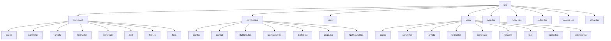
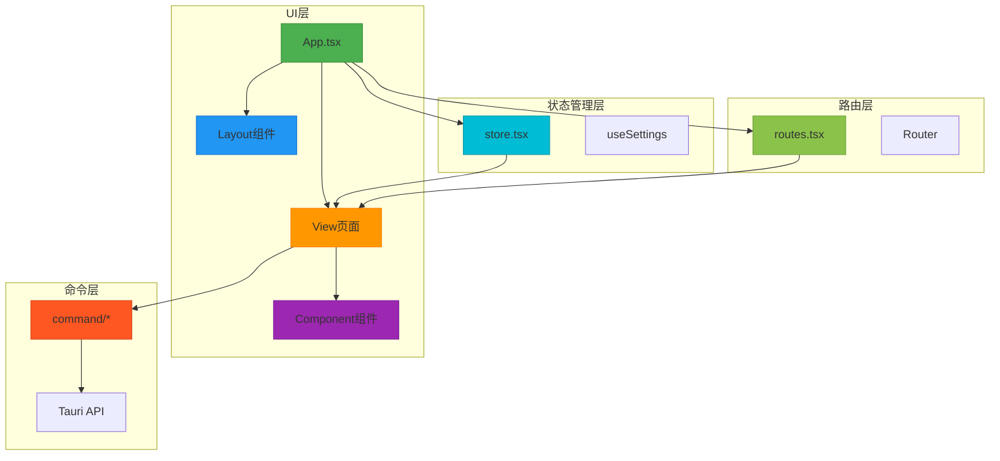
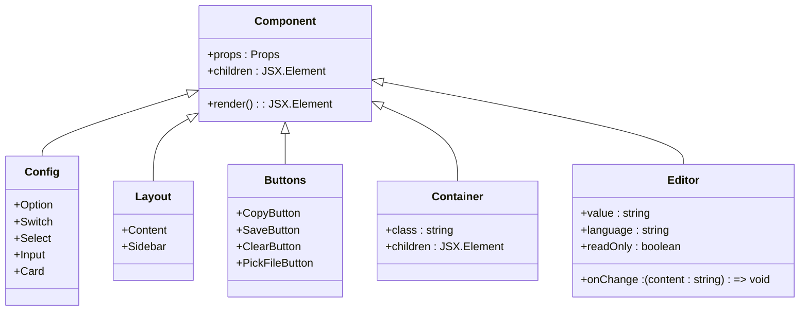
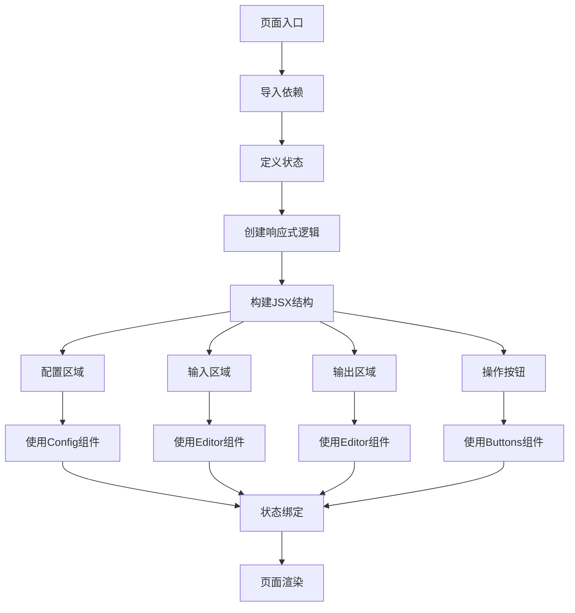
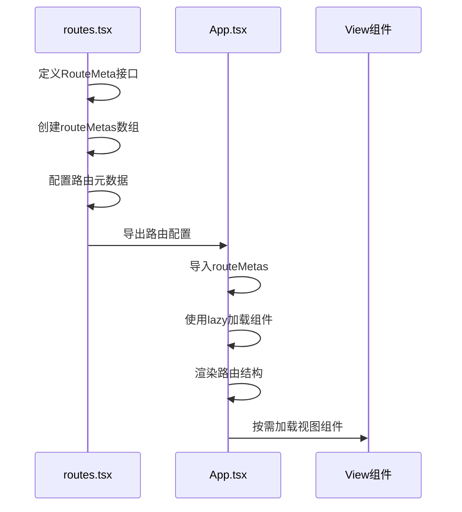
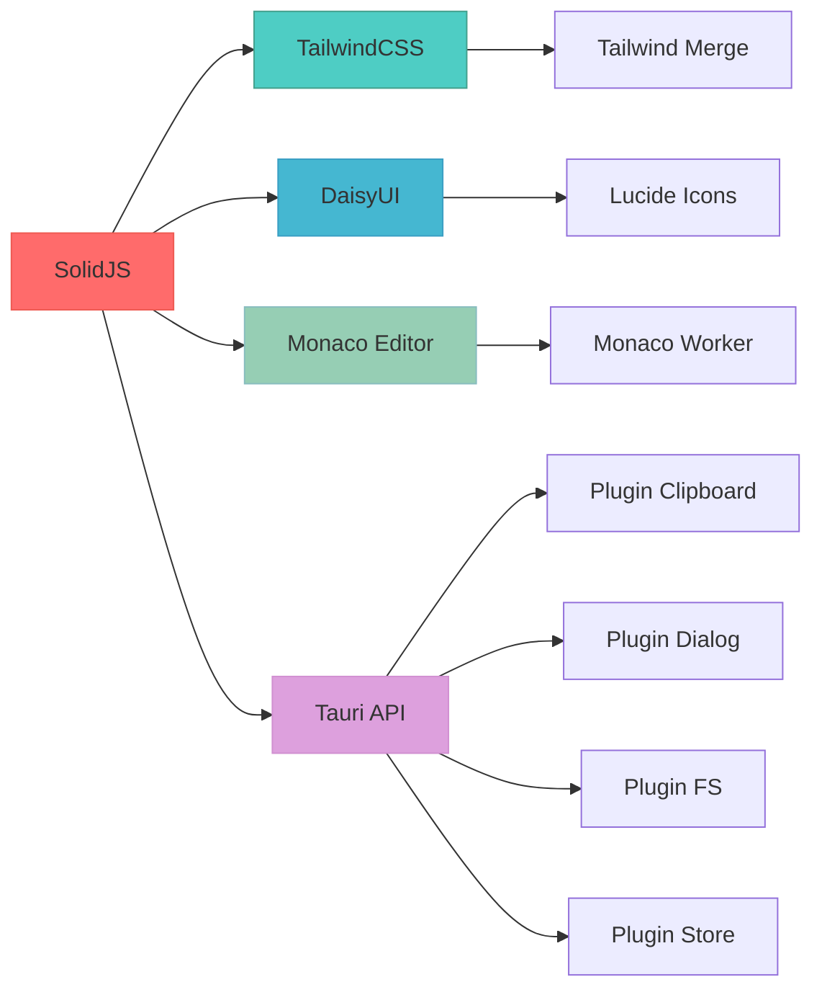

# 前端开发

<cite>
**本文档中引用的文件**  
- [App.tsx](file://src/App.tsx)
- [routes.tsx](file://src/routes.tsx)
- [store.tsx](file://src/store.tsx)
- [index.tsx](file://src/index.tsx)
- [package.json](file://package.json)
- [component/Layout/index.tsx](file://src/component/Layout/index.tsx)
- [view/home.tsx](file://src/view/home.tsx)
- [view/formatter/json.tsx](file://src/view/formatter/json.tsx)
- [component/Buttons.tsx](file://src/component/Buttons.tsx)
- [component/Container.tsx](file://src/component/Container.tsx)
- [component/Config/index.tsx](file://src/component/Config/index.tsx)
- [component/Editor.tsx](file://src/component/Editor.tsx)
- [command/formatter/json.ts](file://src/command/formatter/json.ts)
- [vite.config.ts](file://vite.config.ts)
</cite>

## 目录
1. [简介](#简介)
2. [项目结构](#项目结构)
3. [核心组件](#核心组件)
4. [架构概览](#架构概览)
5. [详细组件分析](#详细组件分析)
6. [依赖分析](#依赖分析)
7. [性能考虑](#性能考虑)
8. [故障排除指南](#故障排除指南)
9. [结论](#结论)

## 简介
本文档详细说明在devkimi项目中进行前端开发的完整流程。重点介绍如何在`src/components/`目录中创建新的可复用UI组件，包括使用SolidJS语法、TailwindCSS样式和DaisyUI组件库的最佳实践。同时阐述在`src/view/`目录中构建功能页面的步骤，涵盖状态管理、事件处理和与后端通信的实现方式。最后说明在`routes.tsx`中添加新路由的配置方法，并提供完整的开发实践指导。

## 项目结构

**图示来源**  
- [App.tsx](file://src/App.tsx#L1-L47)
- [routes.tsx](file://src/routes.tsx#L1-L242)
- [store.tsx](file://src/store.tsx#L1-L88)

**本节来源**  
- [App.tsx](file://src/App.tsx#L1-L47)
- [routes.tsx](file://src/routes.tsx#L1-L242)
- [project_structure](file://project_structure)

## 核心组件

devkimi项目的前端架构基于SolidJS框架构建，采用组件化设计模式。核心组件包括布局组件、配置组件、按钮组件、容器组件和编辑器组件等。这些组件通过合理的抽象和封装，实现了高复用性和可维护性。

在组件开发中，遵循以下最佳实践：
- 使用SolidJS的响应式系统管理组件状态
- 利用TailwindCSS进行原子化样式设计
- 遵循DaisyUI的设计规范确保UI一致性
- 通过props传递数据和回调函数实现组件通信
- 使用TypeScript定义清晰的接口类型

**本节来源**  
- [component/Buttons.tsx](file://src/component/Buttons.tsx#L1-L191)
- [component/Container.tsx](file://src/component/Container.tsx#L1-L23)
- [component/Editor.tsx](file://src/component/Editor.tsx#L1-L139)

## 架构概览

**图示来源**  
- [App.tsx](file://src/App.tsx#L1-L47)
- [routes.tsx](file://src/routes.tsx#L1-L242)
- [store.tsx](file://src/store.tsx#L1-L88)
- [index.tsx](file://src/index.tsx#L1-L37)

## 详细组件分析

### 可复用UI组件开发

在`src/component/`目录中创建新的可复用UI组件时，应遵循以下步骤和最佳实践：

#### 组件结构规范
每个组件应包含：
- 清晰的TypeScript接口定义
- 响应式状态管理
- 合理的props设计
- TailwindCSS样式应用
- DaisyUI组件集成

**图示来源**  
- [component/Config/index.tsx](file://src/component/Config/index.tsx#L1-L37)
- [component/Layout/index.tsx](file://src/component/Layout/index.tsx#L1-L26)
- [component/Buttons.tsx](file://src/component/Buttons.tsx#L1-L191)
- [component/Container.tsx](file://src/component/Container.tsx#L1-L23)
- [component/Editor.tsx](file://src/component/Editor.tsx#L1-L139)

**本节来源**  
- [component/Config/index.tsx](file://src/component/Config/index.tsx#L1-L37)
- [component/Buttons.tsx](file://src/component/Buttons.tsx#L1-L191)

#### SolidJS语法实践
使用SolidJS开发组件时的关键要点：
- 使用`createSignal`管理组件状态
- 使用`createEffect`处理副作用
- 使用`onMount`进行组件挂载后的初始化
- 使用`children`处理插槽内容
- 使用`splitProps`分离组件属性

#### TailwindCSS与DaisyUI集成
样式设计遵循以下原则：
- 使用TailwindCSS的原子化类名
- 利用`twMerge`合并和覆盖类名
- 遵循DaisyUI的主题系统
- 使用响应式设计类名
- 保持样式一致性

### 功能页面构建

在`src/view/`目录中构建功能页面的完整流程：

#### 页面结构模式
功能页面通常包含以下部分：
- 配置区域（使用Config组件）
- 输入区域（使用Editor组件）
- 操作按钮（使用Buttons组件）
- 输出区域（使用Editor组件）

**图示来源**  
- [view/formatter/json.tsx](file://src/view/formatter/json.tsx#L1-L91)
- [view/home.tsx](file://src/view/home.tsx#L1-L47)

**本节来源**  
- [view/formatter/json.tsx](file://src/view/formatter/json.tsx#L1-L91)
- [view/home.tsx](file://src/view/home.tsx#L1-L47)

#### 状态管理实现
通过`store.tsx`提供的状态管理机制：
- 使用`createStore`创建响应式状态
- 使用`useContext`访问全局状态
- 实现设置的持久化存储
- 响应式更新UI主题

#### 事件处理机制
事件处理的最佳实践：
- 使用`onClick`等原生事件处理器
- 通过props传递回调函数
- 处理异步操作的加载状态
- 实现错误边界和异常处理

#### 与后端通信
前端与后端的通信流程：
- 通过Tauri命令调用后端功能
- 使用`invoke`方法发送异步请求
- 处理Promise的resolve和reject状态
- 实现请求结果的响应式更新

### 路由配置

在`routes.tsx`中添加新路由的完整方法：

**图示来源**  
- [routes.tsx](file://src/routes.tsx#L1-L242)
- [App.tsx](file://src/App.tsx#L1-L47)

**本节来源**  
- [routes.tsx](file://src/routes.tsx#L1-L242)
- [App.tsx](file://src/App.tsx#L1-L47)

路由配置的关键要素：
- `label`: 路由显示名称
- `path`: 路由路径
- `icon`: 路由图标
- `component`: 路由组件（使用lazy加载）
- `children`: 子路由配置
- `hidden`: 是否隐藏路由

## 依赖分析

**图示来源**  
- [package.json](file://package.json#L1-L43)
- [vite.config.ts](file://vite.config.ts#L1-L15)

**本节来源**  
- [package.json](file://package.json#L1-L43)
- [vite.config.ts](file://vite.config.ts#L1-L15)

## 性能考虑

在devkimi项目中，前端性能优化主要体现在以下几个方面：

1. **懒加载机制**：所有视图组件都使用`lazy`函数进行懒加载，减少初始加载时间
2. **代码分割**：Vite自动进行代码分割，按需加载模块
3. **响应式优化**：SolidJS的细粒度响应式系统确保最小化重渲染
4. **资源管理**：Monaco Editor的worker按需加载，避免不必要的资源消耗
5. **状态持久化**：使用Tauri的store插件实现设置的高效持久化

## 故障排除指南

常见问题及解决方案：

1. **组件不更新**：检查信号(signal)是否正确使用，确保在响应式上下文中访问
2. **样式不生效**：确认TailwindCSS类名拼写正确，检查`tailwind-merge`的合并逻辑
3. **路由无法访问**：验证`routes.tsx`中的路径配置，确保lazy导入路径正确
4. **编辑器不显示**：检查Monaco Editor的worker配置，确保构建工具正确处理worker文件
5. **状态不同步**：确认store的提供者(Provider)正确包裹组件树

**本节来源**  
- [store.tsx](file://src/store.tsx#L1-L88)
- [component/Editor.tsx](file://src/component/Editor.tsx#L1-L139)
- [routes.tsx](file://src/routes.tsx#L1-L242)

## 结论

devkimi项目的前端开发流程体现了现代桌面应用开发的最佳实践。通过SolidJS的响应式系统、TailwindCSS的原子化样式、DaisyUI的设计规范和Tauri的强大后端集成，构建了一个高效、可维护的前端架构。开发者在创建新组件和页面时，应遵循既定的模式和规范，确保代码的一致性和可扩展性。路由配置、状态管理和前后端通信都有清晰的实现模式，为新功能的开发提供了坚实的基础。