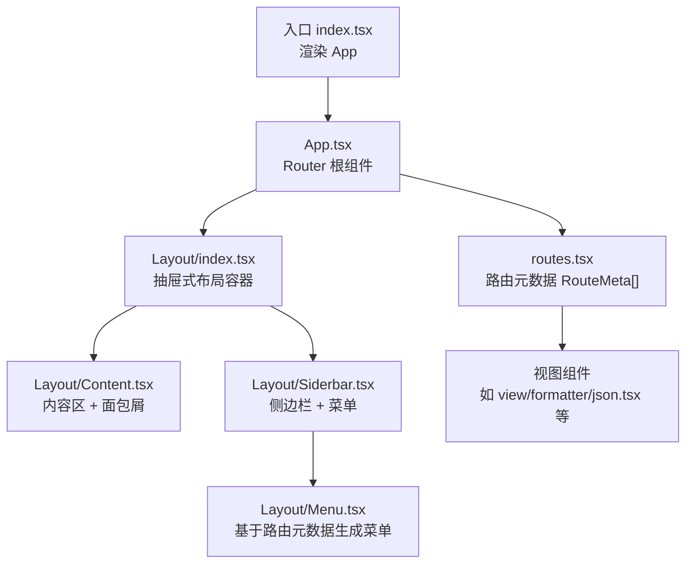
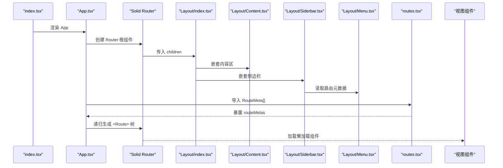
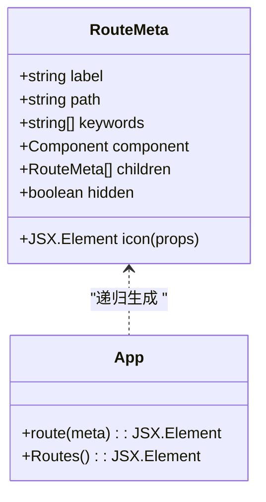
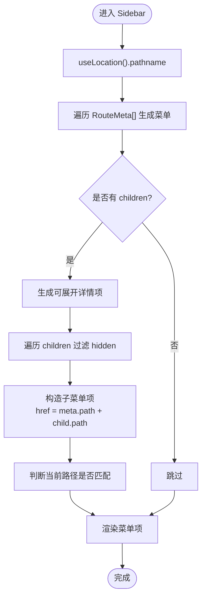
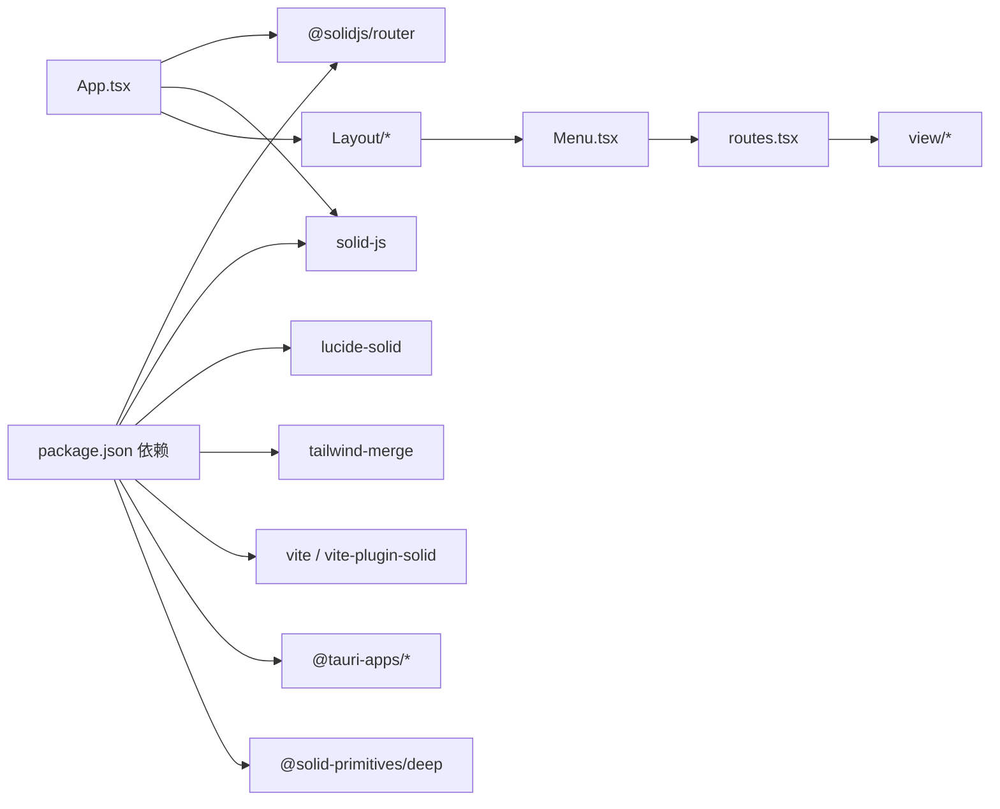

# 路由配置

<cite>
**本文引用的文件**
- [src/routes.tsx](file://src/routes.tsx)
- [src/App.tsx](file://src/App.tsx)
- [src/index.tsx](file://src/index.tsx)
- [src/component/Layout/index.tsx](file://src/component/Layout/index.tsx)
- [src/component/Layout/Content.tsx](file://src/component/Layout/Content.tsx)
- [src/component/Layout/Siderbar.tsx](file://src/component/Layout/Siderbar.tsx)
- [src/component/Layout/Menu.tsx](file://src/component/Layout/Menu.tsx)
- [src/view/home.tsx](file://src/view/home.tsx)
- [src/view/settings.tsx](file://src/view/settings.tsx)
- [src/store.tsx](file://src/store.tsx)
- [package.json](file://package.json)
</cite>

## 目录
1. [简介](#简介)
2. [项目结构](#项目结构)
3. [核心组件](#核心组件)
4. [架构总览](#架构总览)
5. [详细组件分析](#详细组件分析)
6. [依赖关系分析](#依赖关系分析)
7. [性能考虑](#性能考虑)
8. [故障排查指南](#故障排查指南)
9. [结论](#结论)
10. [附录：新增功能页面全流程示例](#附录新增功能页面全流程示例)

## 简介
本文件系统性说明 devkimi 项目中的路由配置机制，重点围绕以下方面：
- 在 routes.tsx 中如何定义路由元数据（路径、组件映射、嵌套子路由）
- 路由与应用布局（Layout）的集成方式
- 如何实现路由守卫与权限控制（当前实现与扩展建议）
- 新增功能页面的完整流程（从路由定义到页面集成）
- 代码分割策略与性能优化方法
- 路由相关单元测试思路与实践

## 项目结构
devkimi 使用 Solid Router 进行前端路由管理，采用“元数据驱动”的路由定义方式，将路由配置集中在单一文件中，再由 App 组件动态渲染为实际的路由节点。布局层通过 Layout 组件包裹 Router，形成统一的页面骨架。

图表来源
- [src/index.tsx](file://src/index.tsx#L1-L37)
- [src/App.tsx](file://src/App.tsx#L1-L47)
- [src/component/Layout/index.tsx](file://src/component/Layout/index.tsx#L1-L26)
- [src/component/Layout/Content.tsx](file://src/component/Layout/Content.tsx#L1-L14)
- [src/component/Layout/Siderbar.tsx](file://src/component/Layout/Siderbar.tsx#L1-L50)
- [src/component/Layout/Menu.tsx](file://src/component/Layout/Menu.tsx#L1-L58)
- [src/routes.tsx](file://src/routes.tsx#L1-L242)

章节来源
- [src/index.tsx](file://src/index.tsx#L1-L37)
- [src/App.tsx](file://src/App.tsx#L1-L47)
- [src/routes.tsx](file://src/routes.tsx#L1-L242)

## 核心组件
- 路由元数据模型 RouteMeta
  - 字段：label、path、keywords、icon、component、children、hidden
  - 作用：集中描述路由的标签、路径、图标、组件、子路由及隐藏属性
- 动态路由生成器
  - App.tsx 中通过递归函数将 RouteMeta[] 转换为 <Route> 树
- 布局系统
  - Layout/index.tsx 提供抽屉式布局容器
  - Content.tsx 包含面包屑与内容区
  - Sidebar.tsx 包含 Logo、菜单入口与菜单树
  - Menu.tsx 基于路由元数据生成可展开的菜单项
- 入口与挂载
  - index.tsx 渲染根 App 组件

章节来源
- [src/routes.tsx](file://src/routes.tsx#L1-L242)
- [src/App.tsx](file://src/App.tsx#L1-L47)
- [src/component/Layout/index.tsx](file://src/component/Layout/index.tsx#L1-L26)
- [src/component/Layout/Content.tsx](file://src/component/Layout/Content.tsx#L1-L14)
- [src/component/Layout/Siderbar.tsx](file://src/component/Layout/Siderbar.tsx#L1-L50)
- [src/component/Layout/Menu.tsx](file://src/component/Layout/Menu.tsx#L1-L58)
- [src/index.tsx](file://src/index.tsx#L1-L37)

## 架构总览
下图展示了从入口到路由渲染、布局集成与菜单联动的整体流程。

图表来源
- [src/index.tsx](file://src/index.tsx#L1-L37)
- [src/App.tsx](file://src/App.tsx#L1-L47)
- [src/component/Layout/index.tsx](file://src/component/Layout/index.tsx#L1-L26)
- [src/component/Layout/Content.tsx](file://src/component/Layout/Content.tsx#L1-L14)
- [src/component/Layout/Siderbar.tsx](file://src/component/Layout/Siderbar.tsx#L1-L50)
- [src/component/Layout/Menu.tsx](file://src/component/Layout/Menu.tsx#L1-L58)
- [src/routes.tsx](file://src/routes.tsx#L1-L242)

## 详细组件分析

### 路由元数据与动态路由生成
- 元数据结构
  - RouteMeta 定义了 label、path、keywords、icon、component、children、hidden 等字段
  - 支持嵌套 children 实现多级菜单与路由树
- 动态生成
  - App.tsx 的 route(meta) 函数递归地将 RouteMeta[] 转换为 <Route> 树
  - 每个 <Route> 通过 info 传递 label 与 icon，供布局或菜单使用
- 路由加载策略
  - 所有页面组件均通过 lazy 异步导入，实现按需加载与代码分割

图表来源
- [src/routes.tsx](file://src/routes.tsx#L1-L242)
- [src/App.tsx](file://src/App.tsx#L1-L47)

章节来源
- [src/routes.tsx](file://src/routes.tsx#L1-L242)
- [src/App.tsx](file://src/App.tsx#L1-L47)

### 布局与菜单集成
- Layout/index.tsx
  - 抽屉式布局容器，包含 Content 与 Sidebar
- Content.tsx
  - 内容区容器，内嵌面包屑与主内容
- Sidebar.tsx
  - 侧边栏容器，包含 Logo、工具入口与设置入口
- Menu.tsx
  - 基于 useLocation 获取当前路径，根据 RouteMeta[] 生成可展开菜单
  - 子菜单项的 href 由父路径与子路径拼接而成
  - 通过 hidden 字段过滤不显示的路由项

图表来源
- [src/component/Layout/Siderbar.tsx](file://src/component/Layout/Siderbar.tsx#L1-L50)
- [src/component/Layout/Menu.tsx](file://src/component/Layout/Menu.tsx#L1-L58)
- [src/routes.tsx](file://src/routes.tsx#L1-L242)

章节来源
- [src/component/Layout/index.tsx](file://src/component/Layout/index.tsx#L1-L26)
- [src/component/Layout/Content.tsx](file://src/component/Layout/Content.tsx#L1-L14)
- [src/component/Layout/Siderbar.tsx](file://src/component/Layout/Siderbar.tsx#L1-L50)
- [src/component/Layout/Menu.tsx](file://src/component/Layout/Menu.tsx#L1-L58)

### 路由与应用布局的集成
- App.tsx 将 Router 作为根组件，通过 root 属性包裹：
  - MetaProvider：提供页面标题与元信息
  - StoreProvider：提供全局状态上下文
  - Layout：统一布局容器
  - Suspense：对懒加载组件进行占位
- 路由树由 routeMetas 动态生成，确保布局与路由同步更新

章节来源
- [src/App.tsx](file://src/App.tsx#L1-L47)
- [src/store.tsx](file://src/store.tsx#L1-L88)

### 路由守卫与权限控制
- 当前实现
  - 路由元数据支持 hidden 字段用于隐藏菜单项
  - 菜单组件会过滤 hidden 项，但未实现访问控制逻辑
- 可扩展方案（建议）
  - 在 RouteMeta 中增加权限标识字段（如 roles、requireAuth）
  - 在 App.tsx 或 Layout 层增加前置校验逻辑，根据用户状态决定是否渲染对应路由
  - 对需要登录的页面，可在导航前拦截并重定向至登录页
  - 对特定角色限制的页面，可通过中间件或高阶组件实现

章节来源
- [src/routes.tsx](file://src/routes.tsx#L1-L242)
- [src/component/Layout/Menu.tsx](file://src/component/Layout/Menu.tsx#L1-L58)

### 新增功能页面的完整流程
以下以“新增一个文本工具”为例，展示从路由定义到页面集成的全流程。

步骤一：创建视图组件
- 在 src/view 下新增目录与组件文件，例如：src/view/text/newtool.tsx
- 组件内部实现页面逻辑与 UI

步骤二：在路由元数据中注册
- 打开 src/routes.tsx
- 在合适的功能分组下添加新的 RouteMeta 条目，设置：
  - label：页面名称
  - path：相对路径（如 /newtool）
  - icon：可选图标
  - component：使用 lazy 异步导入该组件
  - children：如有子路由可继续嵌套
  - hidden：如需隐藏菜单项可设为 true

步骤三：验证布局与菜单联动
- 启动应用后，检查侧边栏菜单是否出现新条目
- 点击菜单项，确认页面能正确加载

步骤四：页面内导航与面包屑
- 若页面需要返回首页或其他页面，可使用导航钩子或按钮触发跳转
- 面包屑由 Content.tsx 提供，无需额外处理

步骤五：构建与发布
- 使用 package.json 中的脚本进行开发与构建
- 生产环境构建会自动进行代码分割与懒加载

章节来源
- [src/routes.tsx](file://src/routes.tsx#L1-L242)
- [src/view/text/newtool.tsx](file://src/view/text/newtool.tsx#L1-L200)
- [src/component/Layout/Menu.tsx](file://src/component/Layout/Menu.tsx#L1-L58)
- [src/component/Layout/Content.tsx](file://src/component/Layout/Content.tsx#L1-L14)
- [package.json](file://package.json#L1-L43)

## 依赖关系分析
- 路由库与框架
  - @solidjs/router：提供路由与导航能力
  - solid-js：提供组件与响应式系统
- UI 与样式
  - lucide-solid：图标库
  - tailwind-merge：类名合并
  - daisyui、tailwindcss：UI 组件与样式系统
- 状态与存储
  - @solid-primitives/deep：深度追踪 store
  - @tauri-apps/plugin-store：本地持久化存储
- 构建与开发
  - vite、vite-plugin-solid：构建与开发服务器
  - solid-devtools：开发调试工具

图表来源
- [package.json](file://package.json#L1-L43)
- [src/App.tsx](file://src/App.tsx#L1-L47)
- [src/routes.tsx](file://src/routes.tsx#L1-L242)
- [src/component/Layout/Menu.tsx](file://src/component/Layout/Menu.tsx#L1-L58)

章节来源
- [package.json](file://package.json#L1-L43)
- [src/App.tsx](file://src/App.tsx#L1-L47)
- [src/routes.tsx](file://src/routes.tsx#L1-L242)

## 性能考虑
- 代码分割与懒加载
  - 所有页面组件均使用 lazy 异步导入，减少首屏体积
  - 路由切换时按需加载目标页面，提升交互流畅度
- Suspense 占位
  - 在 Router 根组件中包裹 Suspense，避免异步加载期间的空白
- 菜单渲染优化
  - 菜单组件仅在路径变化时重新计算，避免不必要的重渲染
- 构建优化
  - 使用 Vite 进行快速打包与热更新
  - Tailwind CSS 按需生成样式，减少运行时开销

章节来源
- [src/App.tsx](file://src/App.tsx#L1-L47)
- [src/routes.tsx](file://src/routes.tsx#L1-L242)

## 故障排查指南
- 页面无法显示或白屏
  - 检查组件是否正确导出默认函数
  - 确认 lazy 导入路径是否正确
  - 查看浏览器控制台错误信息
- 菜单不显示或链接无效
  - 确认 RouteMeta 中的 path 与 children 配置正确
  - 检查 hidden 是否被误设为 true
  - 确认 Menu.tsx 中的 href 拼接逻辑与父路径一致
- 路由跳转后面包屑缺失
  - 确保 Content.tsx 正常渲染
  - 检查面包屑组件是否引入并使用
- 开发时热更新异常
  - 确认 Vite 插件已安装并启用
  - 检查 solid-devtools 是否正常工作

章节来源
- [src/component/Layout/Menu.tsx](file://src/component/Layout/Menu.tsx#L1-L58)
- [src/component/Layout/Content.tsx](file://src/component/Layout/Content.tsx#L1-L14)
- [src/routes.tsx](file://src/routes.tsx#L1-L242)
- [package.json](file://package.json#L1-L43)

## 结论
devkimi 的路由体系采用“元数据驱动 + 动态生成 + 懒加载”的设计，既保证了路由配置的集中化与可维护性，又实现了良好的性能表现。通过 Layout 与 Menu 的紧密集成，用户可以直观地浏览与跳转各功能页面。未来可在现有基础上扩展路由守卫与权限控制，进一步提升安全性与可扩展性。

## 附录：新增功能页面全流程示例
以下以“新增一个文本工具”为例，给出从路由定义到页面集成的完整步骤与参考位置。

步骤一：创建视图组件
- 在 src/view/text 下新增组件文件，例如：src/view/text/newtool.tsx
- 参考现有组件结构组织页面逻辑与 UI

步骤二：在路由元数据中注册
- 在 src/routes.tsx 中定位到“文本工具”分组
- 添加新的 RouteMeta 条目，设置：
  - label：页面名称
  - path：相对路径（如 /newtool）
  - icon：可选图标
  - component：使用 lazy 异步导入该组件
  - children：如有子路由可继续嵌套
  - hidden：如需隐藏菜单项可设为 true

步骤三：验证布局与菜单联动
- 启动应用后，检查侧边栏菜单是否出现新条目
- 点击菜单项，确认页面能正确加载

步骤四：页面内导航与面包屑
- 若页面需要返回首页或其他页面，可使用导航钩子或按钮触发跳转
- 面包屑由 Content.tsx 提供，无需额外处理

步骤五：构建与发布
- 使用 package.json 中的脚本进行开发与构建
- 生产环境构建会自动进行代码分割与懒加载

章节来源
- [src/routes.tsx](file://src/routes.tsx#L1-L242)
- [src/view/text/newtool.tsx](file://src/view/text/newtool.tsx#L1-L200)
- [src/component/Layout/Menu.tsx](file://src/component/Layout/Menu.tsx#L1-L58)
- [src/component/Layout/Content.tsx](file://src/component/Layout/Content.tsx#L1-L14)
- [package.json](file://package.json#L1-L43)