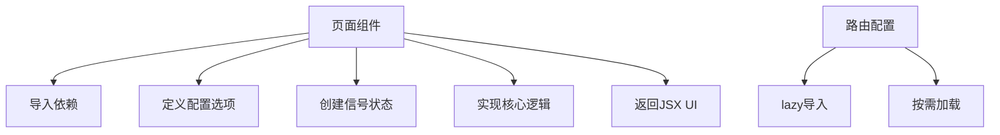
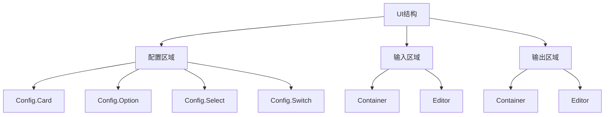
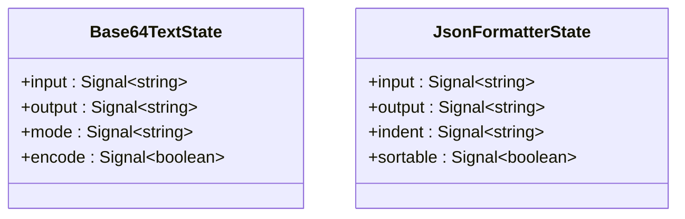
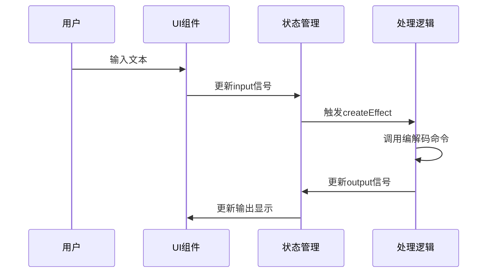
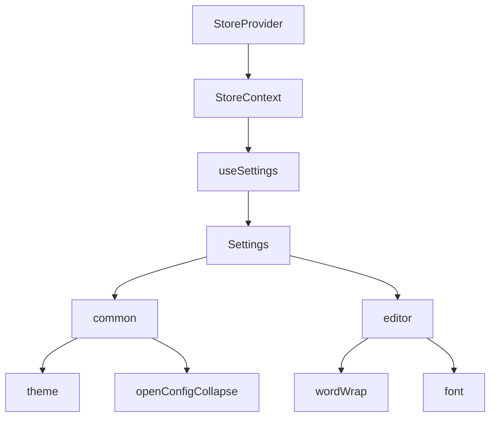
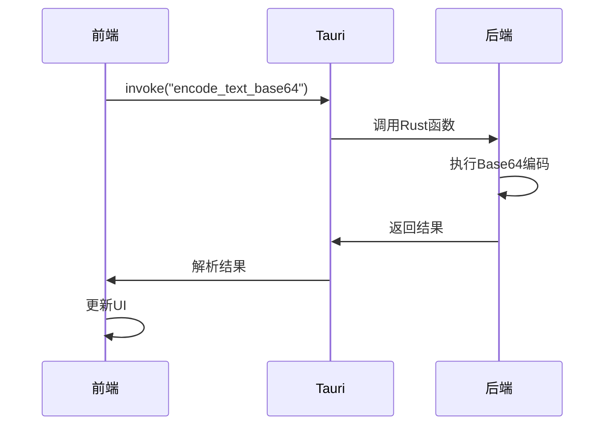
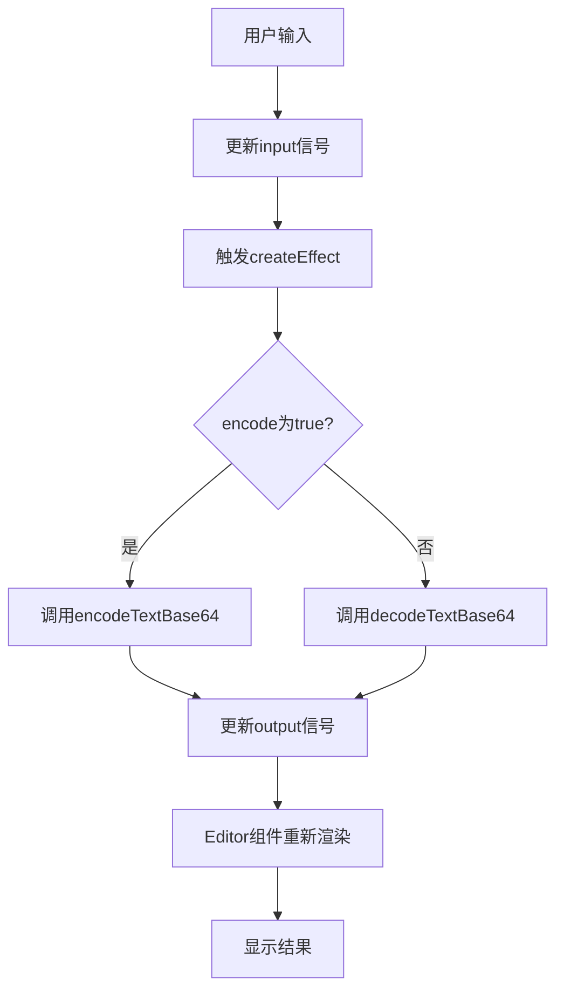
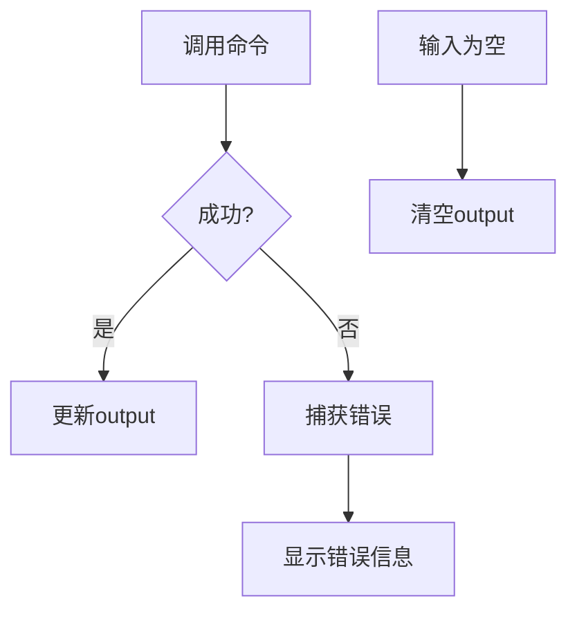

# 页面结构与实现

<cite>
**本文档中引用的文件**   
- [base64_text.tsx](file://src/view/codec/base64_text.tsx)
- [json.tsx](file://src/view/formatter/json.tsx)
- [store.tsx](file://src/store.tsx)
- [App.tsx](file://src/App.tsx)
- [routes.tsx](file://src/routes.tsx)
- [Editor.tsx](file://src/component/Editor.tsx)
- [Buttons.tsx](file://src/component/Buttons.tsx)
- [Config.tsx](file://src/component/Config/index.tsx)
- [base64_text.ts](file://src/command/codec/base64_text.ts)
- [json.ts](file://src/command/formatter/json.ts)
</cite>

## 目录
1. [项目结构概述](#项目结构概述)
2. [页面组件结构组织](#页面组件结构组织)
3. [UI构建与JSX语法](#ui构建与jsx语法)
4. [页面级状态管理](#页面级状态管理)
5. [用户交互事件处理](#用户交互事件处理)
6. [全局状态集成](#全局状态集成)
7. [后端命令调用](#后端命令调用)
8. [数据获取与UI渲染流程](#数据获取与ui渲染流程)
9. [错误处理与加载状态](#错误处理与加载状态)

## 项目结构概述

devkimi项目采用模块化结构，主要分为`src`和`src-tauri`两个核心目录。`src`目录包含前端代码，组织为`command`（命令处理）、`component`（可复用组件）、`utils`（工具函数）和`view`（页面视图）四个主要子目录。`view`目录按功能分类组织页面组件，如`codec`（编解码器）、`formatter`（格式化工具）等。`src-tauri`目录包含Rust后端逻辑，通过Tauri框架与前端交互。

**Section sources**
- [App.tsx](file://src/App.tsx#L1-L47)
- [routes.tsx](file://src/routes.tsx#L1-L242)

## 页面组件结构组织

页面组件位于`src/view`目录下，按功能模块分类组织。每个页面组件是一个独立的`.tsx`文件，遵循一致的结构模式：导入依赖、定义配置选项、创建信号状态、实现核心逻辑和返回JSX UI。页面通过`routes.tsx`中的路由配置进行注册，使用`lazy`函数实现按需加载，提高应用性能。

**Diagram sources**
- [routes.tsx](file://src/routes.tsx#L39-L237)
- [base64_text.tsx](file://src/view/codec/base64_text.tsx#L1-L111)

## UI构建与JSX语法

页面UI使用SolidJS的JSX语法构建，结合Tailwind CSS进行样式设计。UI结构通常分为三个主要部分：配置区域、输入区域和输出区域。配置区域使用`Config.Card`组件包裹，包含`Config.Option`、`Config.Select`和`Config.Switch`等子组件。输入和输出区域使用`Container`组件包裹，内部包含`Editor`组件用于文本编辑和显示。

**Diagram sources**
- [base64_text.tsx](file://src/view/codec/base64_text.tsx#L50-L108)
- [json.tsx](file://src/view/formatter/json.tsx#L35-L88)
- [Config.tsx](file://src/component/Config/index.tsx#L1-L37)

## 页面级状态管理

页面级状态使用SolidJS的`createSignal`函数管理，创建响应式信号。每个页面组件通常定义多个信号来跟踪用户输入、输出结果和配置选项。例如，在`base64_text.tsx`中，定义了`input`、`output`、`mode`和`encode`四个信号，分别用于存储输入文本、输出结果、编码模式和转换方向。

**Diagram sources**
- [base64_text.tsx](file://src/view/codec/base64_text.tsx#L25-L28)
- [json.tsx](file://src/view/formatter/json.tsx#L21-L24)

## 用户交互事件处理

用户交互事件通过SolidJS的事件处理机制处理。`createEffect`函数用于监听状态变化并自动执行相应逻辑。当用户输入发生变化时，`createEffect`会自动触发数据处理函数。按钮点击事件通过`onClick`属性绑定处理函数，如复制、保存和清空操作。

**Diagram sources**
- [base64_text.tsx](file://src/view/codec/base64_text.tsx#L30-L48)
- [Buttons.tsx](file://src/component/Buttons.tsx#L16-L42)

## 全局状态集成

全局状态通过`store.tsx`中的`StoreContext`实现，使用SolidJS的`createContext`和`createProvider`模式。页面组件通过`useSettings`钩子访问全局设置，如主题、编辑器字体和自动换行等。`StoreProvider`在`App.tsx`中作为根组件的包装器，确保所有子组件都能访问全局状态。

**Diagram sources**
- [store.tsx](file://src/store.tsx#L41-L87)
- [App.tsx](file://src/App.tsx#L32-L36)

## 后端命令调用

页面通过`command`目录中的模块调用后端Rust函数。前端使用`@tauri-apps/api/core`的`invoke`函数发送命令，后端通过Tauri的命令系统处理并返回结果。例如，`base64_text.ts`中的`encodeTextBase64`函数调用名为`encode_text_base64`的Rust命令，传递文本和模式参数。

**Diagram sources**
- [base64_text.ts](file://src/command/codec/base64_text.ts#L3-L7)
- [base64_text.tsx](file://src/view/codec/base64_text.tsx#L40-L44)

## 数据获取与UI渲染流程

从数据获取到UI渲染的完整流程包括：用户输入触发状态更新，`createEffect`监听状态变化，调用相应的命令处理函数，处理结果更新输出状态，最终反映在UI上。以`base64_text.tsx`为例，当用户输入文本时，`input`信号更新，触发`createEffect`，根据`encode`信号的值决定调用编码或解码命令，结果通过`setOutput`更新`output`信号，`Editor`组件自动重新渲染显示结果。

**Section sources**
- [base64_text.tsx](file://src/view/codec/base64_text.tsx#L30-L48)
- [json.tsx](file://src/view/formatter/json.tsx#L25-L33)

## 错误处理与加载状态

错误处理通过Promise的`catch`方法实现，当命令执行失败时，错误信息被捕获并显示在输出区域。加载状态管理通过监听输入变化自动处理，当输入为空时，输出区域清空。虽然当前实现中没有显式的加载指示器，但通过快速响应的UI更新提供了良好的用户体验。

**Section sources**
- [base64_text.tsx](file://src/view/codec/base64_text.tsx#L44-L47)
- [json.tsx](file://src/view/formatter/json.tsx#L29-L32)