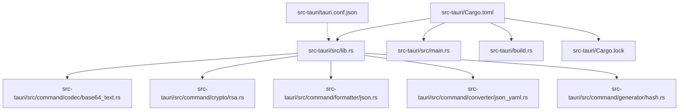
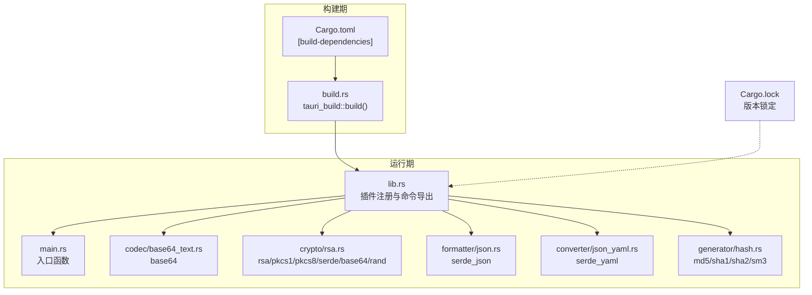
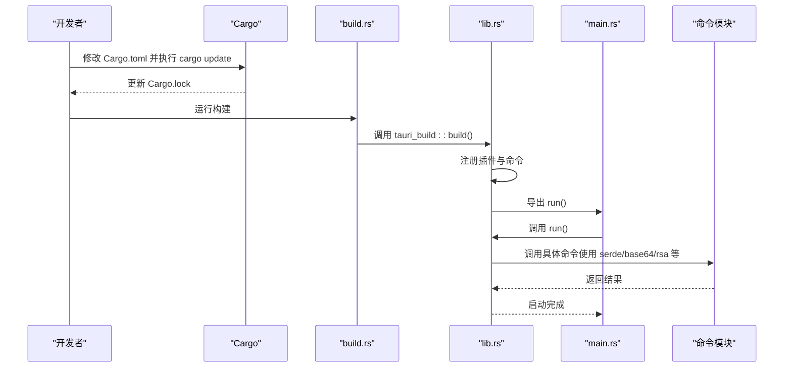
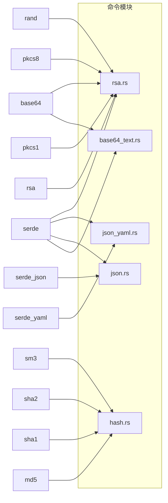

# 依赖管理

<cite>
**本文引用的文件**
- [Cargo.toml](file://src-tauri/Cargo.toml)
- [Cargo.lock](file://src-tauri/Cargo.lock)
- [lib.rs](file://src-tauri/src/lib.rs)
- [main.rs](file://src-tauri/src/main.rs)
- [error.rs](file://src-tauri/src/error.rs)
- [base64_text.rs](file://src-tauri/src/command/codec/base64_text.rs)
- [rsa.rs](file://src-tauri/src/command/crypto/rsa.rs)
- [json.rs](file://src-tauri/src/command/formatter/json.rs)
- [json_yaml.rs](file://src-tauri/src/command/converter/json_yaml.rs)
- [hash.rs](file://src-tauri/src/command/generator/hash.rs)
- [build.rs](file://src-tauri/build.rs)
- [tauri.conf.json](file://src-tauri/tauri.conf.json)
- [package.json](file://package.json)
- [README.md](file://README.md)
</cite>

## 目录
1. [简介](#简介)
2. [项目结构](#项目结构)
3. [核心组件](#核心组件)
4. [架构总览](#架构总览)
5. [详细组件分析](#详细组件分析)
6. [依赖关系分析](#依赖关系分析)
7. [性能考量](#性能考量)
8. [故障排查指南](#故障排查指南)
9. [结论](#结论)
10. [附录](#附录)

## 简介
本章节系统性说明 devkimi 项目中 Rust 后端（Tauri）的依赖管理流程，覆盖：
- 在 Cargo.toml 的 [dependencies] 中添加新 crate 的方式、版本号策略与特性配置
- 在 [dev-dependencies] 中添加测试相关依赖的方法
- 通过 Cargo.lock 实现的版本锁定与构建可重现性
- 常用功能库（如 serde、base64、serde_json、serde_yaml 等）的配置示例与使用路径
- 使用 cargo update 与 cargo check 进行依赖维护与健康检查
- 依赖安全审查与版本兼容性注意事项

## 项目结构
devkimi 的 Rust 后端位于 src-tauri 目录，包含：
- Cargo.toml：定义包元信息、依赖、构建脚本与发布配置
- Cargo.lock：锁定所有依赖的具体版本与校验和，保证构建可重现
- src/lib.rs、src/main.rs：应用入口与插件注册
- src/command/*：各功能模块的命令实现，广泛使用 serde、base64、rsa 等 crate
- build.rs：调用 tauri_build 完成构建期处理
- tauri.conf.json：Tauri 应用配置（与依赖管理间接相关）

图表来源
- [Cargo.toml](file://src-tauri/Cargo.toml#L1-L70)
- [lib.rs](file://src-tauri/src/lib.rs#L1-L57)
- [main.rs](file://src-tauri/src/main.rs#L1-L7)
- [base64_text.rs](file://src-tauri/src/command/codec/base64_text.rs#L1-L22)
- [rsa.rs](file://src-tauri/src/command/crypto/rsa.rs#L1-L78)
- [json.rs](file://src-tauri/src/command/formatter/json.rs#L1-L39)
- [json_yaml.rs](file://src-tauri/src/command/converter/json_yaml.rs#L1-L19)
- [hash.rs](file://src-tauri/src/command/generator/hash.rs#L1-L52)
- [Cargo.lock](file://src-tauri/Cargo.lock#L1-L200)
- [tauri.conf.json](file://src-tauri/tauri.conf.json#L1-L46)

章节来源
- [Cargo.toml](file://src-tauri/Cargo.toml#L1-L70)
- [lib.rs](file://src-tauri/src/lib.rs#L1-L57)
- [main.rs](file://src-tauri/src/main.rs#L1-L7)
- [README.md](file://README.md#L90-L114)

## 核心组件
- 依赖声明与版本策略
  - 在 [dependencies] 中声明生产依赖，如 base64、serde、serde_json、serde_yaml、rsa、pkcs1、pkcs8、sha1、sha2、sm3、sm4、regex、urlencoding、uuid、tauri 及其插件等
  - 对于需要启用特定功能的 crate，通过 features 字段开启，例如 serde 的 derive、serde_json 的 preserve_order、pkcs8 的 encryption、uuid 的 v1/v4/v7 等
- 构建与打包
  - build-dependencies 中包含 tauri-build，用于构建期处理
  - build.rs 调用 tauri_build::build 完成构建
- 错误模型
  - 通过自定义宏 command_error! 统一错误类型与序列化，配合 thiserror 提升错误处理一致性
- 插件体系
  - 在 lib.rs 中注册 store、opener、fs、clipboard-manager、dialog 等插件，这些插件作为依赖被使用

章节来源
- [Cargo.toml](file://src-tauri/Cargo.toml#L17-L60)
- [build.rs](file://src-tauri/build.rs#L1-L4)
- [lib.rs](file://src-tauri/src/lib.rs#L1-L57)
- [error.rs](file://src-tauri/src/error.rs#L1-L31)

## 架构总览
下图展示了 Rust 后端的依赖与模块交互关系，以及构建期与运行期的关键节点。

图表来源
- [build.rs](file://src-tauri/build.rs#L1-L4)
- [Cargo.toml](file://src-tauri/Cargo.toml#L17-L60)
- [lib.rs](file://src-tauri/src/lib.rs#L1-L57)
- [main.rs](file://src-tauri/src/main.rs#L1-L7)
- [base64_text.rs](file://src-tauri/src/command/codec/base64_text.rs#L1-L22)
- [rsa.rs](file://src-tauri/src/command/crypto/rsa.rs#L1-L78)
- [json.rs](file://src-tauri/src/command/formatter/json.rs#L1-L39)
- [json_yaml.rs](file://src-tauri/src/command/converter/json_yaml.rs#L1-L19)
- [hash.rs](file://src-tauri/src/command/generator/hash.rs#L1-L52)
- [Cargo.lock](file://src-tauri/Cargo.lock#L1-L200)

## 详细组件分析

### 依赖声明与版本策略
- 在 [dependencies] 中添加新 crate 的步骤
  - 选择合适的版本约束：建议采用语义化版本范围（如主版本号固定），或使用精确版本以确保稳定性
  - 对于需要启用特性的 crate，通过 features 指定所需功能，避免引入不必要的依赖
  - 将 crate 添加到 Cargo.toml 的 [dependencies] 区域
- 特性(features)配置示例
  - serde：启用 derive 特性以支持派生序列化/反序列化
  - serde_json：启用 preserve_order 特性以保持键顺序
  - pkcs8：启用 encryption 特性以支持加密相关能力
  - uuid：启用 v1、v4、v7 特性以支持不同版本的 UUID 生成
- 开发依赖([dev-dependencies])的添加
  - 在 [dev-dependencies] 中添加仅用于开发与测试的 crate，如测试框架、lint 工具等
  - 不要将开发依赖放入 [dependencies]，以免影响最终产物体积与安全性
- 依赖版本锁定与可重现性
  - Cargo.lock 由 Cargo 自动生成并记录每个依赖的确切版本与校验和
  - 任何团队成员或 CI 环境都应使用相同的 Cargo.lock，确保构建结果一致
  - 本地修改 Cargo.toml 后，需执行 cargo update 以更新 Cargo.lock

章节来源
- [Cargo.toml](file://src-tauri/Cargo.toml#L17-L60)
- [Cargo.lock](file://src-tauri/Cargo.lock#L1-L200)

### 常用功能库配置示例与使用路径
- serde 与 serde_json
  - Cargo.toml 中：为 serde 启用 derive；为 serde_json 启用 preserve_order
  - 使用路径：在命令模块中进行序列化/反序列化，如 json 格式化、转换器等
  - 示例路径：[json.rs](file://src-tauri/src/command/formatter/json.rs#L1-L39)、[json_yaml.rs](file://src-tauri/src/command/converter/json_yaml.rs#L1-L19)
- base64
  - Cargo.toml 中：指定版本
  - 使用路径：编码/解码文本与图片，如 base64 文本编解码
  - 示例路径：[base64_text.rs](file://src-tauri/src/command/codec/base64_text.rs#L1-L22)
- rsa、pkcs1、pkcs8
  - Cargo.toml 中：指定版本；pkcs8 启用 encryption
  - 使用路径：RSA 密钥对生成、加解密
  - 示例路径：[rsa.rs](file://src-tauri/src/command/crypto/rsa.rs#L1-L78)
- 哈希算法（md5、sha1、sha2、sm3）
  - Cargo.toml 中：指定版本
  - 使用路径：文本/文件哈希计算
  - 示例路径：[hash.rs](file://src-tauri/src/command/generator/hash.rs#L1-L52)
- 其他常用依赖
  - regex、urlencoding、uuid、log、chrono、image、qrcode、sqlformat 等
  - 使用路径：文本处理、URL 编解码、唯一标识、日志、图像处理、二维码、SQL 格式化等

章节来源
- [Cargo.toml](file://src-tauri/Cargo.toml#L20-L60)
- [base64_text.rs](file://src-tauri/src/command/codec/base64_text.rs#L1-L22)
- [rsa.rs](file://src-tauri/src/command/crypto/rsa.rs#L1-L78)
- [json.rs](file://src-tauri/src/command/formatter/json.rs#L1-L39)
- [json_yaml.rs](file://src-tauri/src/command/converter/json_yaml.rs#L1-L19)
- [hash.rs](file://src-tauri/src/command/generator/hash.rs#L1-L52)

### 构建与运行期依赖交互
- 构建期
  - build.rs 调用 tauri_build::build 完成构建期处理
  - build-dependencies 中的 tauri-build 用于生成必要的资源与配置
- 运行期
  - lib.rs 注册各类插件（store、opener、fs、clipboard-manager、dialog）
  - main.rs 作为入口调用 lib.rs::run 启动应用
  - 命令模块通过 serde、base64、rsa 等 crate 实现具体功能

图表来源
- [build.rs](file://src-tauri/build.rs#L1-L4)
- [lib.rs](file://src-tauri/src/lib.rs#L1-L57)
- [main.rs](file://src-tauri/src/main.rs#L1-L7)
- [base64_text.rs](file://src-tauri/src/command/codec/base64_text.rs#L1-L22)
- [rsa.rs](file://src-tauri/src/command/crypto/rsa.rs#L1-L78)
- [json.rs](file://src-tauri/src/command/formatter/json.rs#L1-L39)

### 依赖安全审查与版本兼容性
- 安全审查
  - 定期使用 cargo audit 或第三方工具扫描已知漏洞
  - 关注高危依赖（如 crypto、serialization、networking）的安全公告
- 版本兼容性
  - 保持 Rust 工具链版本与项目 rust-version 一致
  - 对于与系统库或平台相关的 crate，关注跨平台兼容性
  - 对于 serde 生态（serde、serde_json、serde_yaml），确保版本匹配，避免冲突
- 最佳实践
  - 优先使用语义化版本范围，避免频繁大版本升级
  - 在 PR/CI 中加入 cargo check 与 cargo clippy，确保编译与风格一致性
  - 对关键依赖进行回归测试，验证功能与性能

章节来源
- [Cargo.toml](file://src-tauri/Cargo.toml#L1-L16)
- [README.md](file://README.md#L58-L88)

## 依赖关系分析
下图展示关键模块与依赖之间的关系，突出 serde、base64、rsa、serde_json、serde_yaml、hash 等库的使用分布。

图表来源
- [base64_text.rs](file://src-tauri/src/command/codec/base64_text.rs#L1-L22)
- [rsa.rs](file://src-tauri/src/command/crypto/rsa.rs#L1-L78)
- [json.rs](file://src-tauri/src/command/formatter/json.rs#L1-L39)
- [json_yaml.rs](file://src-tauri/src/command/converter/json_yaml.rs#L1-L19)
- [hash.rs](file://src-tauri/src/command/generator/hash.rs#L1-L52)

章节来源
- [base64_text.rs](file://src-tauri/src/command/codec/base64_text.rs#L1-L22)
- [rsa.rs](file://src-tauri/src/command/crypto/rsa.rs#L1-L78)
- [json.rs](file://src-tauri/src/command/formatter/json.rs#L1-L39)
- [json_yaml.rs](file://src-tauri/src/command/converter/json_yaml.rs#L1-L19)
- [hash.rs](file://src-tauri/src/command/generator/hash.rs#L1-L52)

## 性能考量
- 构建配置
  - release 配置中启用了 LTO、优化级别与符号剥离，有助于减小二进制体积并提升运行时性能
- 依赖选择
  - 优先选择轻量级替代品（如使用 serde_json 的 preserve_order 以满足需求而非引入额外开销）
  - 对于加密与哈希库，按需启用特性，避免加载未使用的功能
- 运行期
  - 在命令模块中尽量减少不必要的字符串转换与内存分配，结合 serde 的高效序列化接口

章节来源
- [Cargo.toml](file://src-tauri/Cargo.toml#L61-L70)

## 故障排查指南
- 构建失败或版本冲突
  - 执行 cargo update 以同步 Cargo.lock
  - 使用 cargo tree 查看依赖树，定位冲突来源
- 编译错误（serde/序列化相关）
  - 检查 serde、serde_json、serde_yaml 的版本是否匹配
  - 确认 derive 特性已启用
- 运行时错误（base64/rsa/json 等）
  - 使用统一错误宏 command_error! 生成的 Error 类型，便于定位问题
  - 在命令模块中捕获并返回错误，前端可据此提示用户
- 日志与调试
  - debug 模式下自动注册日志插件，便于排查问题

章节来源
- [error.rs](file://src-tauri/src/error.rs#L1-L31)
- [lib.rs](file://src-tauri/src/lib.rs#L1-L57)
- [base64_text.rs](file://src-tauri/src/command/codec/base64_text.rs#L1-L22)
- [rsa.rs](file://src-tauri/src/command/crypto/rsa.rs#L1-L78)
- [json.rs](file://src-tauri/src/command/formatter/json.rs#L1-L39)

## 结论
devkimi 的 Rust 后端依赖管理遵循标准的 Cargo 流程：在 Cargo.toml 中声明依赖与特性，在 Cargo.lock 中锁定版本，通过构建脚本与插件体系完成打包与运行。通过合理的版本策略、特性配置与安全审查，可以有效保障构建的可重现性与功能的稳定性。建议在日常开发中坚持使用 cargo update 与 cargo check，配合 CI 的审计与测试，持续提升依赖质量与安全性。

## 附录
- 常用命令
  - cargo update：根据 Cargo.toml 更新 Cargo.lock
  - cargo check：快速检查编译与类型错误
  - cargo tree：查看依赖树，排查冲突
  - cargo audit：扫描已知漏洞
- 项目启动与构建
  - 前端：pnpm dev / pnpm build
  - 后端：cargo tauri dev / cargo tauri build（通过 Tauri CLI）

章节来源
- [README.md](file://README.md#L58-L88)
- [package.json](file://package.json#L1-L43)