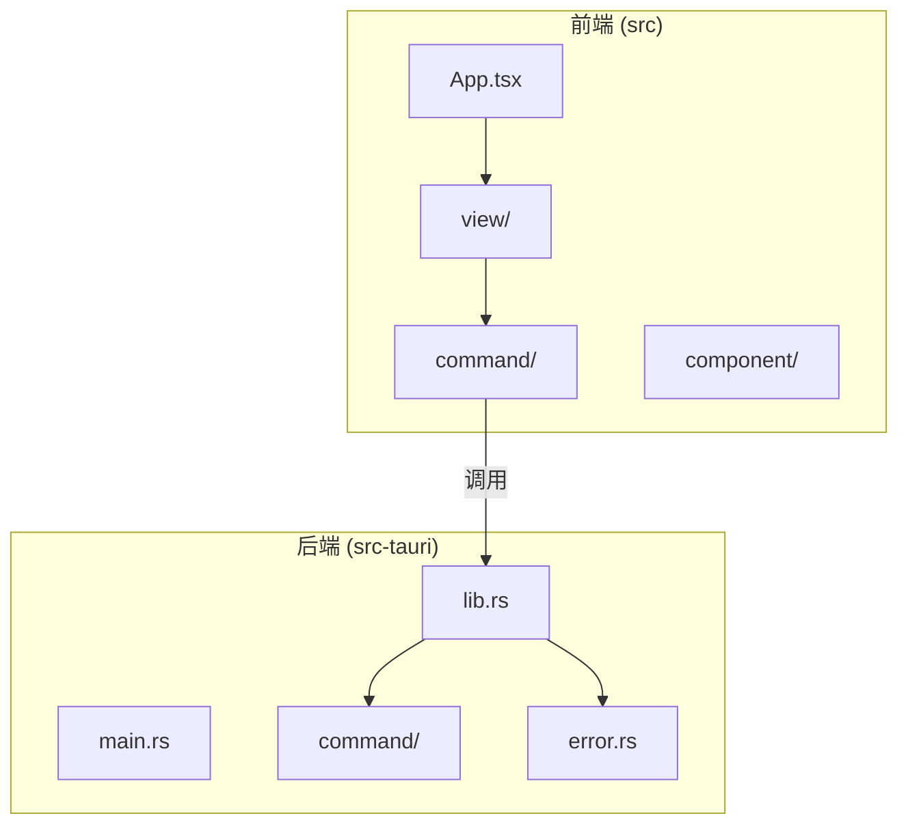
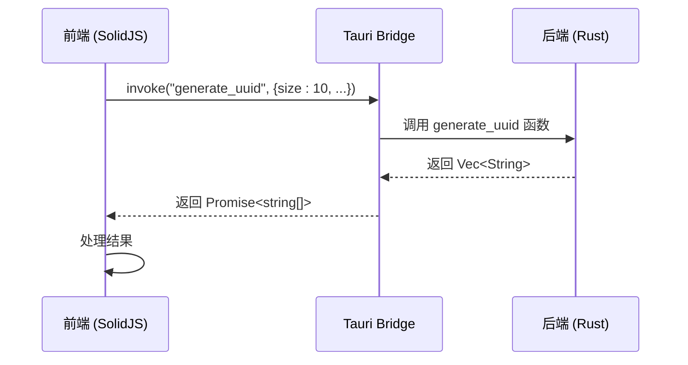
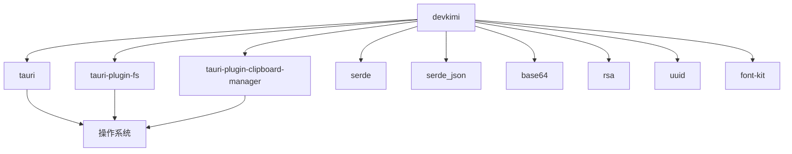

# 命令导出

<cite>
**本文档中引用的文件**  
- [lib.rs](file://src-tauri/src/lib.rs)
- [command/mod.rs](file://src-tauri/src/command/mod.rs)
- [fs.rs](file://src-tauri/src/command/fs.rs)
- [generator/uuid.rs](file://src-tauri/src/command/generator/uuid.rs)
- [formatter/json.rs](file://src-tauri/src/command/formatter/json.rs)
- [error.rs](file://src-tauri/src/error.rs)
- [font.rs](file://src-tauri/src/command/font.rs)
- [crypto/rsa.rs](file://src-tauri/src/command/crypto/rsa.rs)
- [generate/uuid.ts](file://src/command/generate/uuid.ts)
- [view/generator/uuid.tsx](file://src/view/generator/uuid.tsx)
- [command/text/markdown.ts](file://src/command/text/markdown.ts)
- [command/converter/json_yaml.ts](file://src/command/converter/json_yaml.ts)
- [command/codec/qrcode.ts](file://src/command/codec/qrcode.ts)
</cite>

## 目录
1. [简介](#简介)
2. [项目结构](#项目结构)
3. [核心组件](#核心组件)
4. [架构概述](#架构概述)
5. [详细组件分析](#详细组件分析)
6. [依赖分析](#依赖分析)
7. [性能考虑](#性能考虑)
8. [故障排除指南](#故障排除指南)
9. [结论](#结论)

## 简介
本项目 devkimi 是一个基于 Tauri 框架构建的桌面应用程序，旨在为开发者提供一系列实用工具。其核心功能通过 Rust 编写的后端命令实现，并通过 Tauri Bridge 安全地暴露给前端调用。本文档详细说明了如何将 Rust 命令导出给前端调用的实现方法，包括命令注册、模块组织、函数签名、类型安全和错误处理等关键方面。

## 项目结构
devkimi 项目采用典型的 Tauri 应用结构，分为前端（`src`）和后端（`src-tauri`）两大部分。后端使用 Rust 语言，通过 `tauri::generate_handler!` 宏将命令函数暴露给前端。前端使用 SolidJS 框架，通过 `@tauri-apps/api/core` 的 `invoke` 函数调用后端命令。



**Diagram sources**
- [lib.rs](file://src-tauri/src/lib.rs#L1-L57)
- [generate/uuid.ts](file://src/command/generate/uuid.ts#L1-L18)

**Section sources**
- [lib.rs](file://src-tauri/src/lib.rs#L1-L57)
- [generate/uuid.ts](file://src/command/generate/uuid.ts#L1-L18)

## 核心组件
本项目的核心是命令系统，它连接了前端用户界面和后端 Rust 逻辑。Rust 命令函数在 `src-tauri/src/command/` 目录下按功能模块化组织，并通过 `tauri::generate_handler!` 宏在 `lib.rs` 中注册。前端通过导入封装好的命令函数来发起异步调用。

**Section sources**
- [lib.rs](file://src-tauri/src/lib.rs#L11-L43)
- [command/mod.rs](file://src-tauri/src/command/mod.rs#L1-L8)

## 架构概述
devkimi 的架构遵循前后端分离的原则。前端负责用户交互和界面展示，后端负责执行计算密集型或系统级操作。Tauri 框架作为桥梁，通过安全的 IPC（进程间通信）机制，将前端的 JavaScript/TypeScript 调用转换为后端的 Rust 函数调用。



**Diagram sources**
- [lib.rs](file://src-tauri/src/lib.rs#L11-L43)
- [generate/uuid.ts](file://src/command/generate/uuid.ts#L9-L14)
- [generator/uuid.rs](file://src-tauri/src/command/generator/uuid.rs#L12-L30)

## 详细组件分析

### 命令注册与暴露
在 Tauri 应用中，Rust 命令函数必须使用 `#[tauri::command]` 宏进行标记，然后在 `src-tauri/src/lib.rs` 文件的 `tauri::Builder` 中通过 `tauri::generate_handler!` 宏进行注册。只有被注册的命令才能被前端访问。

```rust
// src-tauri/src/lib.rs
tauri::Builder::default()
    .invoke_handler(tauri::generate_handler![
        command::fs::open_file,
        command::generator::uuid::generate_uuid,
        // ... 其他命令
    ])
    .run(tauri::generate_context!())
    .expect("error while running tauri application");
```

**Section sources**
- [lib.rs](file://src-tauri/src/lib.rs#L11-L43)

### 命令函数签名规范
Rust 命令函数的签名需要遵循特定的规范以确保与前端的兼容性。

#### 参数传递
命令函数的参数必须是可序列化的（实现 `serde::Serialize` 和 `serde::Deserialize`）。前端通过一个包含参数名和值的对象来传递参数。例如，`generate_uuid` 函数接受 `size`, `version`, `uppercase`, `hyphen` 四个参数。

#### 返回值处理
命令函数的返回值也必须是可序列化的。推荐使用 `Result<T, Error>` 类型来处理成功和错误情况。成功时返回 `Ok(value)`，失败时返回 `Err(error)`。Tauri 会自动将 `Result` 类型转换为前端的 Promise。

#### 异步操作支持
对于可能阻塞的操作，可以使用 `#[tauri::command(async)]` 宏。这允许命令函数返回 `impl std::future::Future`，例如 `Result<T, Error>`。在 `crypto/rsa.rs` 中，`generate_rsa_key_pair` 函数被标记为异步，尽管其内部实现是同步的，这为未来可能的异步重构提供了灵活性。

```rust
// src-tauri/src/command/generator/uuid.rs
#[tauri::command]
pub fn generate_uuid(size: u16, version: Version, uppercase: bool, hyphen: bool) -> Vec<String> {
    // ...
}
```

**Section sources**
- [generator/uuid.rs](file://src-tauri/src/command/generator/uuid.rs#L12-L30)
- [formatter/json.rs](file://src-tauri/src/command/formatter/json.rs#L14-L24)
- [crypto/rsa.rs](file://src-tauri/src/command/crypto/rsa.rs#L17-L42)

### 命令模块的组织与导出
为了保持代码的清晰和可维护性，命令在 `src-tauri/src/command/` 目录下被组织成多个子模块，如 `codec`、`converter`、`generator` 等。每个子模块都有自己的 `mod.rs` 文件来声明其公共接口。

`src-tauri/src/command/mod.rs` 文件作为命令模块的根，使用 `pub mod` 语句将所有子模块公开，使得 `lib.rs` 可以通过 `command::子模块名::函数名` 的路径访问到具体的命令函数。

```rust
// src-tauri/src/command/mod.rs
pub mod codec;
pub mod converter;
pub mod font;
// ...
```

这种扁平化的模块结构清晰地定义了依赖关系，避免了复杂的嵌套。

**Section sources**
- [command/mod.rs](file://src-tauri/src/command/mod.rs#L1-L8)
- [generator/uuid.rs](file://src-tauri/src/command/generator/uuid.rs#L1-L48)

### 前端调用实现
前端通过 `@tauri-apps/api/core` 提供的 `invoke` 函数来调用后端命令。为了提高代码的可读性和可维护性，通常会为每个命令模块创建一个 TypeScript 文件，封装 `invoke` 调用。

```typescript
// src/command/generate/uuid.ts
import { invoke } from "@tauri-apps/api/core";

const generateUuid = async (
  size: number,
  version: string,
  hyphen: boolean,
  uppercase: boolean,
) => {
  return invoke<string[]>("generate_uuid", {
    size,
    version,
    hyphen,
    uppercase,
  });
};

export { generateUuid };
```

前端视图组件（如 `UuidGenerator`）则导入这些封装好的函数，并在需要时调用它们。

**Section sources**
- [generate/uuid.ts](file://src/command/generate/uuid.ts#L1-L18)
- [view/generator/uuid.tsx](file://src/view/generator/uuid.tsx#L25-L27)

### 类型安全与错误传播
项目通过多种机制确保类型安全和错误的正确传播。

#### 类型安全
- **Rust 端**: 使用强类型系统和 `serde` 派生宏（`#[derive(Serialize, Deserialize)]`）确保数据结构的类型安全。
- **前端**: 使用 TypeScript 定义函数的参数和返回值类型，如 `invoke<string[]>("generate_uuid", ...)` 明确指定了返回值为字符串数组。

#### 错误传播
- **自定义错误类型**: 项目定义了 `command_error!` 宏来创建统一的 `Error` 枚举类型。每个命令模块可以使用此宏定义自己的错误变体，这些变体最终都会被映射到同一个 `Error` 类型中。
- **错误转换**: 使用 `?` 操作符和 `.map_err(Into::into)` 将底层库的错误（如 `std::io::Error`）转换为项目定义的 `Error` 类型。
- **前端处理**: 前端通过 Promise 的 `.catch()` 方法捕获错误，并将其显示给用户。

```rust
// src-tauri/src/error.rs
#[macro_export]
macro_rules! command_error {
    ($(($ident:ident, $msg:literal $(, $($tt:tt)*)?)),+ $(,)?) => {
        #[derive(Debug, thiserror::Error)]
        pub enum Error {
            $( #[error($msg)] $ident$(($($tt)*))?, )+
        }
        $crate::serialize_error!(Error);
    };
}

// 在 fs.rs 中使用
command_error! {
    (Io, "io error: {0}", #[from] std::io::Error),
    (InvalidFileName, "invalid file name: {0}", String),
}
```

**Section sources**
- [error.rs](file://src-tauri/src/error.rs#L1-L31)
- [fs.rs](file://src-tauri/src/command/fs.rs#L30-L33)
- [formatter/json.rs](file://src-tauri/src/command/formatter/json.rs#L35-L38)

## 依赖分析
devkimi 项目的依赖关系清晰，主要依赖于 Tauri 生态系统和一系列功能库。



**Diagram sources**
- [Cargo.toml](file://src-tauri/Cargo.toml#L20-L58)

**Section sources**
- [Cargo.toml](file://src-tauri/Cargo.toml#L20-L58)

## 性能考虑
由于 Tauri 命令是通过 IPC 调用的，频繁的小型调用可能会成为性能瓶颈。对于需要生成大量数据的命令（如 `generate_uuid`），建议一次性生成并返回一个数组，而不是多次调用单个生成函数。此外，计算密集型任务（如 RSA 加密）在 Rust 端执行可以充分利用其性能优势。

## 故障排除指南
- **命令未定义错误**: 确保命令函数在 `lib.rs` 的 `tauri::generate_handler!` 宏中被正确注册。
- **类型序列化错误**: 检查命令函数的参数和返回值是否都实现了 `Serialize` 和 `Deserialize`。
- **权限错误**: 某些命令（如文件操作）可能需要在 `tauri.conf.json` 中配置相应的权限。
- **编译错误**: 确保 `command_error!` 宏中定义的错误类型与底层错误类型兼容。

**Section sources**
- [lib.rs](file://src-tauri/src/lib.rs#L11-L43)
- [error.rs](file://src-tauri/src/error.rs#L1-L31)
- [tauri.conf.json](file://src-tauri/tauri.conf.json#L1-L46)

## 结论
devkimi 项目通过 Tauri 框架成功实现了 Rust 命令到前端的导出。其核心在于使用 `#[tauri::command]` 和 `tauri::generate_handler!` 宏建立通信桥梁，通过模块化的目录结构和 `pub mod` 语句管理依赖，以及利用 `serde` 和自定义错误宏来保证类型安全和错误的优雅处理。这种设计模式为构建功能强大且安全的桌面应用提供了坚实的基础。