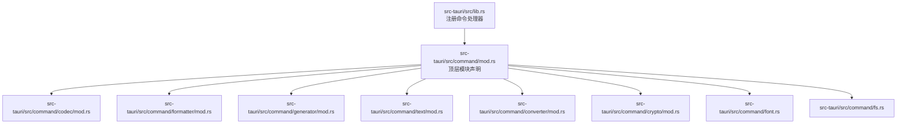
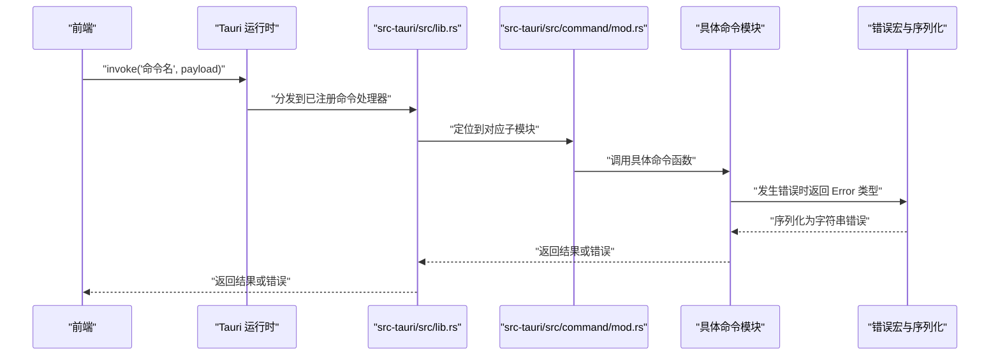
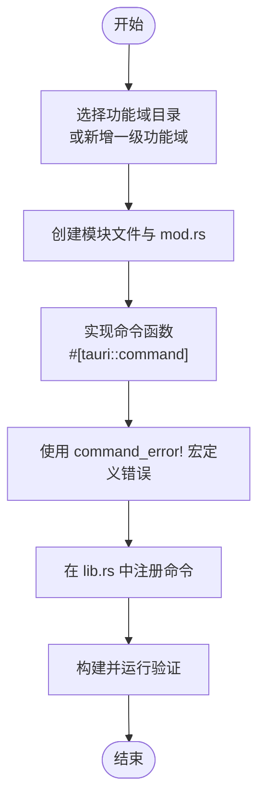
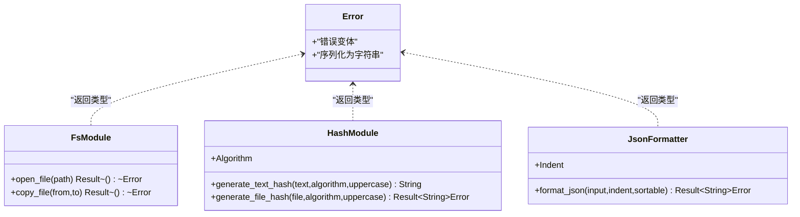
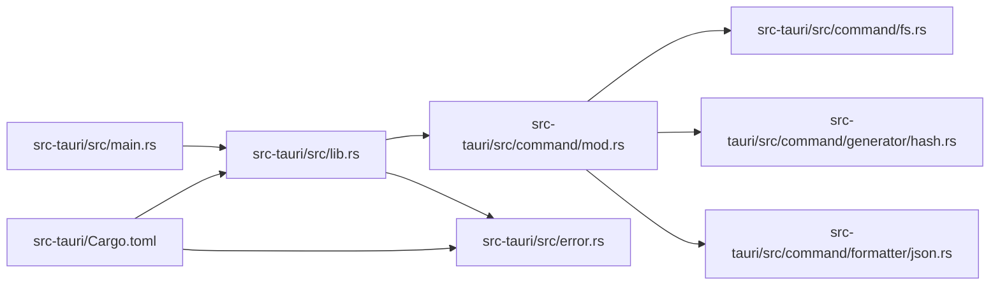

# 模块创建

<cite>
**本文引用的文件**
- [src-tauri/src/command/mod.rs](file://src-tauri/src/command/mod.rs)
- [src-tauri/src/lib.rs](file://src-tauri/src/lib.rs)
- [src-tauri/src/main.rs](file://src-tauri/src/main.rs)
- [src-tauri/src/command/fs.rs](file://src-tauri/src/command/fs.rs)
- [src-tauri/src/command/generator/hash.rs](file://src-tauri/src/command/generator/hash.rs)
- [src-tauri/src/command/formatter/json.rs](file://src-tauri/src/command/formatter/json.rs)
- [src-tauri/src/command/formatter/mod.rs](file://src-tauri/src/command/formatter/mod.rs)
- [src-tauri/src/error.rs](file://src-tauri/src/error.rs)
- [src-tauri/Cargo.toml](file://src-tauri/Cargo.toml)
- [README.md](file://README.md)
</cite>

## 目录
1. [简介](#简介)
2. [项目结构](#项目结构)
3. [核心组件](#核心组件)
4. [架构总览](#架构总览)
5. [详细组件分析](#详细组件分析)
6. [依赖分析](#依赖分析)
7. [性能考量](#性能考量)
8. [故障排查指南](#故障排查指南)
9. [结论](#结论)
10. [附录](#附录)

## 简介
本指南面向希望在 devkimi 项目中新增 Rust 功能模块的开发者，系统讲解如何在 src-tauri/src/command 目录下创建新的 Rust 文件作为功能模块，涵盖：
- 文件命名规范与目录结构设计
- 在 mod.rs 中声明与组织子模块的正确方式
- 模块内部函数定义规范（输入参数、返回类型、错误处理）
- 从模块文件创建到函数实现的完整流程
- 如何遵循项目现有的代码风格与架构模式

## 项目结构
devkimi 的后端采用 Tauri + Rust，命令层位于 src-tauri/src/command。该目录按功能域划分子模块（如 codec、formatter、generator、text、converter、crypto），每个子模块通常包含一个 mod.rs 用于导出子模块，并在同级目录下放置具体功能实现文件。

图表来源
- [src-tauri/src/lib.rs](file://src-tauri/src/lib.rs#L1-L57)
- [src-tauri/src/command/mod.rs](file://src-tauri/src/command/mod.rs#L1-L8)

章节来源
- [README.md](file://README.md#L90-L114)
- [src-tauri/src/command/mod.rs](file://src-tauri/src/command/mod.rs#L1-L8)
- [src-tauri/src/lib.rs](file://src-tauri/src/lib.rs#L1-L57)

## 核心组件
- 命令模块顶层声明：src-tauri/src/command/mod.rs 统一导出各功能域子模块，确保后续在 lib.rs 中注册时无需逐个导入。
- 命令注册中心：src-tauri/src/lib.rs 使用 tauri::generate_handler! 将所有命令函数注册为可调用接口。
- 错误宏与序列化：src-tauri/src/error.rs 提供统一的命令错误宏与序列化能力，保证错误信息在前端可读且跨平台一致。
- 示例模块：fs.rs、generator/hash.rs、formatter/json.rs 展示了标准的命令函数、枚举参数、错误定义与返回类型。

章节来源
- [src-tauri/src/command/mod.rs](file://src-tauri/src/command/mod.rs#L1-L8)
- [src-tauri/src/lib.rs](file://src-tauri/src/lib.rs#L1-L57)
- [src-tauri/src/error.rs](file://src-tauri/src/error.rs#L1-L31)
- [src-tauri/src/command/fs.rs](file://src-tauri/src/command/fs.rs#L1-L34)
- [src-tauri/src/command/generator/hash.rs](file://src-tauri/src/command/generator/hash.rs#L1-L52)
- [src-tauri/src/command/formatter/json.rs](file://src-tauri/src/command/formatter/json.rs#L1-L39)

## 架构总览
下面的时序图展示了从前端发起命令调用到 Rust 命令执行并返回结果的完整流程，体现了命令注册、模块声明与错误传播的关键节点。

图表来源
- [src-tauri/src/lib.rs](file://src-tauri/src/lib.rs#L1-L57)
- [src-tauri/src/command/mod.rs](file://src-tauri/src/command/mod.rs#L1-L8)
- [src-tauri/src/error.rs](file://src-tauri/src/error.rs#L1-L31)

## 详细组件分析

### 创建新功能模块的完整流程
- 步骤一：确定功能域与目录
  - 在 src-tauri/src/command 下选择合适的子目录（如 formatter、generator、text 等），若不存在对应目录则新建。
  - 若需要新增一级功能域，需在 src-tauri/src/command/mod.rs 中添加对应的子模块声明。
- 步骤二：创建模块文件
  - 在选定目录下创建一个与功能相关的 .rs 文件（例如 json.rs、hash.rs、uuid.rs 等）。
  - 在该目录下创建 mod.rs 并导出子模块，以便父级模块统一引用。
- 步骤三：实现命令函数
  - 使用 #[tauri::command] 标注函数，输入参数建议使用 &str、&Path 等轻量类型；复杂参数使用 serde 可序列化的结构体或枚举。
  - 返回类型遵循 Result<T, Error> 模式，其中 Error 由项目提供的 command_error! 宏统一定义。
  - 在文件末尾使用 command_error! 宏声明错误变体，必要时包含 #[from] 以自动转换底层错误类型。
- 步骤四：在顶层注册命令
  - 在 src-tauri/src/lib.rs 的 generate_handler! 列表中加入新命令函数路径，确保前端可通过 invoke 调用。
- 步骤五：验证与测试
  - 重新构建并运行应用，确认命令可被调用且错误信息可序列化显示。

章节来源
- [src-tauri/src/command/mod.rs](file://src-tauri/src/command/mod.rs#L1-L8)
- [src-tauri/src/lib.rs](file://src-tauri/src/lib.rs#L1-L57)
- [src-tauri/src/error.rs](file://src-tauri/src/error.rs#L1-L31)

### 文件命名规范与目录结构设计
- 目录命名
  - 使用小写短语，复数形式表示集合（如 formatter、generator、text），与前端 view 对应。
- 模块文件命名
  - 采用功能语义的小写短语（如 json.rs、hash.rs、uuid.rs），避免与目录名重复。
- 子模块导出
  - 每个功能域目录下均提供 mod.rs，显式导出子模块，便于父级统一引用。
- 顶层模块
  - src-tauri/src/command/mod.rs 统一导出各功能域，保持层级清晰。

章节来源
- [src-tauri/src/command/mod.rs](file://src-tauri/src/command/mod.rs#L1-L8)
- [src-tauri/src/command/formatter/mod.rs](file://src-tauri/src/command/formatter/mod.rs#L1-L4)

### 在 mod.rs 中声明与组织子模块
- 顶层声明
  - 在 src-tauri/src/command/mod.rs 中使用 pub mod 逐项声明子模块，确保父级可访问。
- 功能域内声明
  - 在各功能域目录（如 formatter、generator、text 等）的 mod.rs 中导出其子模块，形成清晰的层次结构。
- 注意事项
  - 新增一级功能域时，必须同步更新顶层 mod.rs 与 lib.rs 的注册列表。

章节来源
- [src-tauri/src/command/mod.rs](file://src-tauri/src/command/mod.rs#L1-L8)
- [src-tauri/src/command/formatter/mod.rs](file://src-tauri/src/command/formatter/mod.rs#L1-L4)

### 函数定义规范与错误处理机制
- 命令函数标注
  - 使用 #[tauri::command] 标注函数，使其成为可被前端调用的命令。
- 输入参数
  - 优先使用轻量类型（如 &str、&Path），复杂参数使用 serde 可序列化的结构体或枚举，便于跨语言传递。
- 返回类型
  - 统一返回 Result<T, Error>，其中 T 为成功结果类型（如 String、bool、自定义结构体等）。
- 错误处理
  - 使用项目提供的 command_error! 宏定义 Error 枚举，必要时使用 #[from] 自动转换底层错误（如 std::io::Error）。
  - 错误类型会通过 serialize_error! 宏自动序列化为字符串，便于前端展示。
- 示例参考
  - fs.rs：展示基础命令与错误定义。
  - generator/hash.rs：展示枚举参数与多命令函数。
  - formatter/json.rs：展示复杂参数与错误变体。

图表来源
- [src-tauri/src/command/fs.rs](file://src-tauri/src/command/fs.rs#L1-L34)
- [src-tauri/src/command/generator/hash.rs](file://src-tauri/src/command/generator/hash.rs#L1-L52)
- [src-tauri/src/command/formatter/json.rs](file://src-tauri/src/command/formatter/json.rs#L1-L39)
- [src-tauri/src/error.rs](file://src-tauri/src/error.rs#L1-L31)

章节来源
- [src-tauri/src/command/fs.rs](file://src-tauri/src/command/fs.rs#L1-L34)
- [src-tauri/src/command/generator/hash.rs](file://src-tauri/src/command/generator/hash.rs#L1-L52)
- [src-tauri/src/command/formatter/json.rs](file://src-tauri/src/command/formatter/json.rs#L1-L39)
- [src-tauri/src/error.rs](file://src-tauri/src/error.rs#L1-L31)

### 从创建到实现的完整示例（步骤指引）
- 在 formatter 目录下创建一个新文件（例如 new_feature.rs），并在 formatter/mod.rs 中导出该模块。
- 在 new_feature.rs 中：
  - 使用 #[tauri::command] 定义命令函数；
  - 使用 serde 可序列化类型作为参数；
  - 返回 Result<T, Error>，并在文件末尾使用 command_error! 宏定义错误。
- 在 src-tauri/src/lib.rs 的 generate_handler! 中加入新命令函数路径。
- 构建并运行，验证命令是否可用。

章节来源
- [src-tauri/src/command/formatter/mod.rs](file://src-tauri/src/command/formatter/mod.rs#L1-L4)
- [src-tauri/src/command/formatter/json.rs](file://src-tauri/src/command/formatter/json.rs#L1-L39)
- [src-tauri/src/lib.rs](file://src-tauri/src/lib.rs#L1-L57)
- [src-tauri/src/error.rs](file://src-tauri/src/error.rs#L1-L31)

## 依赖分析
- 顶层入口
  - src-tauri/src/main.rs 调用 app_lib::run，后者在 src-tauri/src/lib.rs 中实现。
- 命令注册
  - lib.rs 通过 generate_handler! 注册所有命令函数，这些函数分布在 command 子模块中。
- 错误系统
  - error.rs 提供 command_error! 与 serialize_error! 宏，统一错误定义与序列化。
- 依赖清单
  - Cargo.toml 定义了 Tauri、serde、thiserror 等关键依赖，为命令系统与错误处理提供基础。

图表来源
- [src-tauri/src/main.rs](file://src-tauri/src/main.rs#L1-L7)
- [src-tauri/src/lib.rs](file://src-tauri/src/lib.rs#L1-L57)
- [src-tauri/src/command/mod.rs](file://src-tauri/src/command/mod.rs#L1-L8)
- [src-tauri/src/command/fs.rs](file://src-tauri/src/command/fs.rs#L1-L34)
- [src-tauri/src/command/generator/hash.rs](file://src-tauri/src/command/generator/hash.rs#L1-L52)
- [src-tauri/src/command/formatter/json.rs](file://src-tauri/src/command/formatter/json.rs#L1-L39)
- [src-tauri/src/error.rs](file://src-tauri/src/error.rs#L1-L31)
- [src-tauri/Cargo.toml](file://src-tauri/Cargo.toml#L1-L70)

章节来源
- [src-tauri/src/main.rs](file://src-tauri/src/main.rs#L1-L7)
- [src-tauri/src/lib.rs](file://src-tauri/src/lib.rs#L1-L57)
- [src-tauri/Cargo.toml](file://src-tauri/Cargo.toml#L1-L70)

## 性能考量
- 参数与返回值
  - 优先使用轻量类型（如 &str、&Path）减少拷贝开销；复杂数据建议在前端进行分页或流式处理。
- 错误处理
  - 使用 #[from] 自动转换底层错误可减少重复包装逻辑，提升可维护性。
- I/O 与算法
  - 对大文件操作建议使用流式读取与缓冲策略；哈希计算等 CPU 密集任务可在后台线程执行，避免阻塞主线程。
- 依赖版本
  - 保持 serde、tauri、thiserror 等依赖版本稳定，有助于减少不必要的性能回归。

## 故障排查指南
- 命令未注册
  - 检查 src-tauri/src/lib.rs 的 generate_handler! 是否包含新命令路径；检查 src-tauri/src/command/mod.rs 是否导出了新模块。
- 错误无法序列化
  - 确认命令文件末尾使用了 command_error! 宏，并且错误类型实现了序列化；避免遗漏 #[from] 导致底层错误未被转换。
- 参数类型不匹配
  - 确保前端传入的参数与命令函数签名一致；复杂参数使用 serde 可序列化结构体或枚举。
- 构建失败
  - 检查 src-tauri/Cargo.toml 依赖是否齐全；清理缓存后重试构建。

章节来源
- [src-tauri/src/lib.rs](file://src-tauri/src/lib.rs#L1-L57)
- [src-tauri/src/command/mod.rs](file://src-tauri/src/command/mod.rs#L1-L8)
- [src-tauri/src/error.rs](file://src-tauri/src/error.rs#L1-L31)
- [src-tauri/Cargo.toml](file://src-tauri/Cargo.toml#L1-L70)

## 结论
通过遵循本文档的流程与规范，开发者可以在 devkimi 项目中高效地创建新的 Rust 功能模块。关键在于：
- 明确的功能域与目录结构
- 清晰的模块声明与导出
- 规范的命令函数定义与错误处理
- 在 lib.rs 中完成命令注册
- 严格遵循项目现有的代码风格与架构模式

## 附录
- 项目结构参考：README.md 中对 src-tauri/src/command 的说明
- 顶层入口：src-tauri/src/main.rs 调用 app_lib::run
- 命令注册：src-tauri/src/lib.rs 的 generate_handler!
- 错误宏：src-tauri/src/error.rs 的 command_error! 与 serialize_error!

章节来源
- [README.md](file://README.md#L90-L114)
- [src-tauri/src/main.rs](file://src-tauri/src/main.rs#L1-L7)
- [src-tauri/src/lib.rs](file://src-tauri/src/lib.rs#L1-L57)
- [src-tauri/src/error.rs](file://src-tauri/src/error.rs#L1-L31)