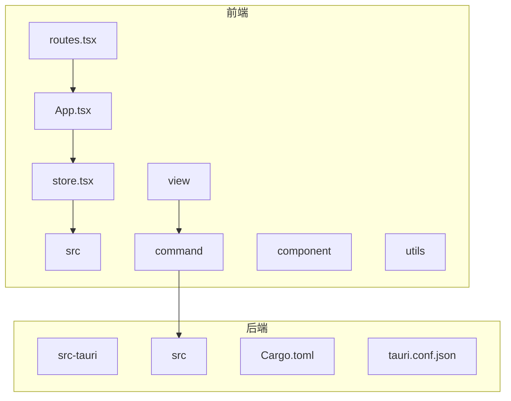
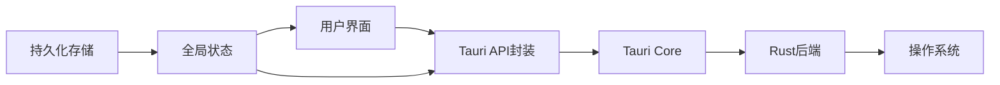
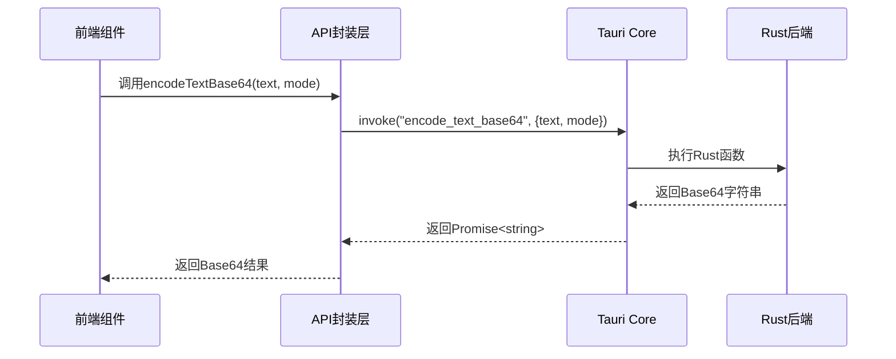
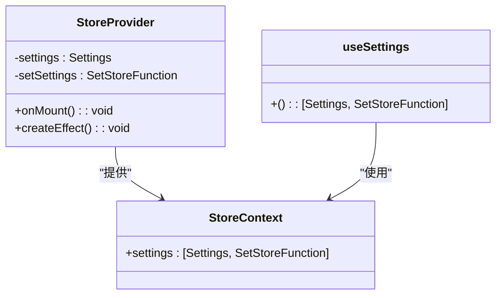
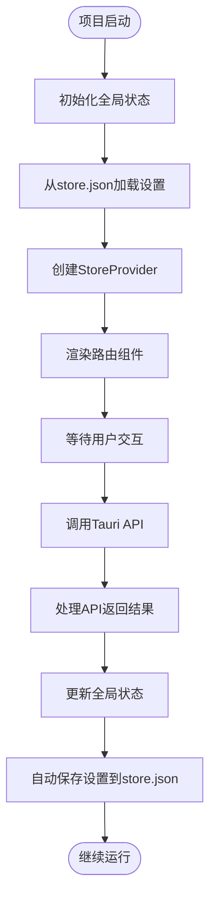
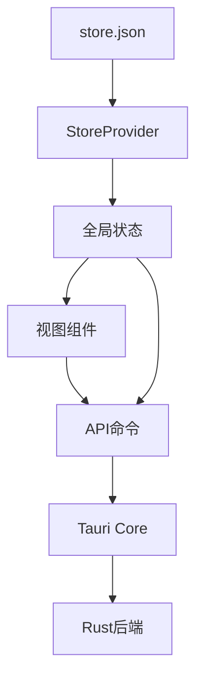

# API封装

<cite>
**本文档中引用的文件**
- [accessor.ts](file://src/utils/accessor.ts)
- [store.tsx](file://src/store.tsx)
- [base64_text.ts](file://src/command/codec/base64_text.ts)
- [base64_image.ts](file://src/command/codec/base64_image.ts)
- [rsa.ts](file://src/command/crypto/rsa.ts)
- [password.ts](file://src/command/generate/password.ts)
- [uuid.ts](file://src/command/generate/uuid.ts)
- [jsonpath.ts](file://src/command/text/jsonpath.ts)
- [fs.ts](file://src/command/fs.ts)
- [base64_text.tsx](file://src/view/codec/base64_text.tsx)
- [base64_image.tsx](file://src/view/codec/base64_image.tsx)
- [App.tsx](file://src/App.tsx)
- [routes.tsx](file://src/routes.tsx)
</cite>

## 目录
1. [引言](#引言)
2. [项目结构](#项目结构)
3. [核心组件](#核心组件)
4. [架构概述](#架构概述)
5. [详细组件分析](#详细组件分析)
6. [依赖分析](#依赖分析)
7. [性能考虑](#性能考虑)
8. [故障排除指南](#故障排除指南)
9. [结论](#结论)

## 引言
devkimi项目是一个基于Tauri框架的桌面应用程序，提供了多种开发工具功能。本文档详细说明了对Tauri API进行高级封装的最佳实践，重点阐述了utils/accessor.ts中封装模式的设计理念。文档涵盖了统一错误处理、请求日志记录、性能监控、类型安全的API客户端创建、与全局状态管理(store.tsx)的集成、认证和权限校验等横切关注点的处理。

## 项目结构
devkimi项目的结构清晰地分为前端和后端两大部分。前端代码位于src目录下，包括组件、视图、工具函数和状态管理。后端Rust代码位于src-tauri目录下，通过Tauri命令暴露给前端调用。这种分层架构使得前端可以安全地调用系统级别的功能，同时保持了代码的可维护性和可扩展性。

**图源**
- [App.tsx](file://src/App.tsx#L1-L47)
- [store.tsx](file://src/store.tsx#L1-L88)
- [routes.tsx](file://src/routes.tsx#L1-L242)

**节源**
- [App.tsx](file://src/App.tsx#L1-L47)
- [store.tsx](file://src/store.tsx#L1-L88)
- [routes.tsx](file://src/routes.tsx#L1-L242)

## 核心组件
devkimi项目的核心组件包括API封装层、状态管理层和视图层。API封装层通过Tauri的invoke函数调用后端Rust命令，提供了类型安全的接口。状态管理层使用SolidJS的createStore实现全局状态管理，并与Tauri的插件存储持久化。视图层则通过组件化的方式组织UI，实现了功能的模块化。

**节源**
- [accessor.ts](file://src/utils/accessor.ts#L1-L11)
- [store.tsx](file://src/store.tsx#L1-L88)
- [base64_text.ts](file://src/command/codec/base64_text.ts#L1-L18)

## 架构概述
devkimi项目的架构采用了前后端分离的设计模式。前端使用SolidJS框架构建响应式用户界面，通过Tauri提供的API与后端Rust代码进行通信。后端Rust代码实现了各种系统级别的功能，如文件操作、加密解密、编解码等，并通过Tauri命令暴露给前端调用。这种架构既保证了前端界面的灵活性，又充分利用了Rust语言的性能和安全性优势。

**图源**
- [accessor.ts](file://src/utils/accessor.ts#L1-L11)
- [store.tsx](file://src/store.tsx#L1-L88)
- [base64_text.ts](file://src/command/codec/base64_text.ts#L1-L18)

## 详细组件分析

### API封装层分析
API封装层是devkimi项目的核心，它通过统一的模式封装了所有Tauri API调用。每个功能模块都有对应的命令文件，如base64_text.ts、rsa.ts等，这些文件导出类型安全的异步函数，前端可以直接调用。

#### 对于API/服务组件：

**图源**
- [base64_text.ts](file://src/command/codec/base64_text.ts#L1-L18)
- [base64_image.ts](file://src/command/codec/base64_image.ts#L1-L12)

#### 对于状态管理组件：

**图源**
- [store.tsx](file://src/store.tsx#L1-L88)

**节源**
- [base64_text.ts](file://src/command/codec/base64_text.ts#L1-L18)
- [base64_image.ts](file://src/command/codec/base64_image.ts#L1-L12)
- [rsa.ts](file://src/command/crypto/rsa.ts#L1-L16)
- [password.ts](file://src/command/generate/password.ts#L1-L24)
- [uuid.ts](file://src/command/generate/uuid.ts#L1-L18)
- [jsonpath.ts](file://src/command/text/jsonpath.ts#L1-L8)
- [fs.ts](file://src/command/fs.ts#L1-L24)

### 概念概述
devkimi项目通过Tauri框架实现了桌面应用程序的现代化开发。它利用Rust语言的安全性和性能优势，同时结合前端框架的灵活性，为开发者提供了一套完整的工具集。项目的设计理念是模块化和可扩展性，每个功能都独立封装，便于维护和添加新功能。

## 依赖分析
devkimi项目的依赖关系清晰，前端组件依赖于API封装层，API封装层依赖于Tauri核心，Tauri核心与Rust后端紧密集成。状态管理独立于具体功能，为整个应用提供全局状态支持。

**图源**
- [App.tsx](file://src/App.tsx#L1-L47)
- [store.tsx](file://src/store.tsx#L1-L88)
- [routes.tsx](file://src/routes.tsx#L1-L242)

**节源**
- [App.tsx](file://src/App.tsx#L1-L47)
- [store.tsx](file://src/store.tsx#L1-L88)
- [routes.tsx](file://src/routes.tsx#L1-L242)

## 性能考虑
devkimi项目在性能方面做了充分考虑。通过SolidJS的响应式系统，只有当相关状态发生变化时才会重新渲染组件，减少了不必要的DOM操作。API调用采用异步模式，不会阻塞主线程。状态管理使用了深跟踪(deep tracking)，确保了状态更新的精确性。此外，设置信息的保存采用了防抖机制，避免了频繁的磁盘I/O操作。

## 故障排除指南
当遇到问题时，可以按照以下步骤进行排查：
1. 检查Tauri后端是否正常运行
2. 查看控制台是否有JavaScript错误
3. 检查Rust命令是否正确暴露
4. 验证API调用参数是否符合类型定义
5. 检查网络请求（如果有）是否成功
6. 查看应用日志文件

**节源**
- [store.tsx](file://src/store.tsx#L50-L65)
- [base64_text.tsx](file://src/view/codec/base64_text.tsx#L30-L48)
- [base64_image.tsx](file://src/view/codec/base64_image.tsx#L36-L57)

## 结论
devkimi项目展示了Tauri API高级封装的最佳实践。通过类型安全的API封装、响应式的状态管理、模块化的组件设计，项目实现了高效、可维护的代码结构。API封装层的设计理念值得借鉴，它不仅提供了统一的错误处理和日志记录，还通过类型系统保证了调用的安全性。与全局状态管理的集成实现了数据的持久化和同步，为用户提供了良好的使用体验。