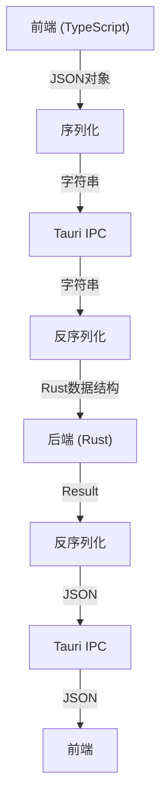
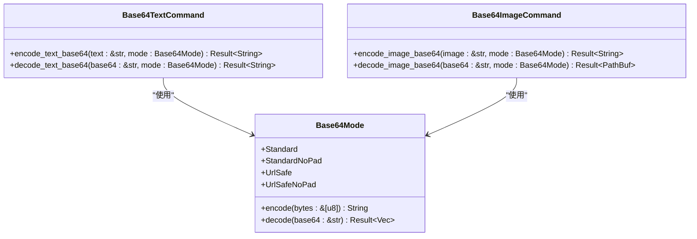

# 接口定义

<cite>
**本文档引用文件**  
- [lib.rs](file://src-tauri/src/lib.rs)
- [mod.rs](file://src-tauri/src/command/mod.rs)
- [base64_text.rs](file://src-tauri/src/command/codec/base64_text.rs)
- [base64_image.rs](file://src-tauri/src/command/codec/base64_image.rs)
- [base64_helper.rs](file://src-tauri/src/command/codec/base64_helper.rs)
- [fs.rs](file://src-tauri/src/command/fs.rs)
- [error.rs](file://src-tauri/src/error.rs)
- [json_yaml.rs](file://src-tauri/src/command/converter/json_yaml.rs)
- [password.rs](file://src-tauri/src/command/generator/password.rs)
- [Cargo.toml](file://src-tauri/Cargo.toml)
- [tauri.conf.json](file://src-tauri/tauri.conf.json)
- [base64_text.ts](file://src/command/codec/base64_text.ts)
- [password.ts](file://src/command/generate/password.ts)
</cite>

## 目录

1. [项目结构](#项目结构)  
2. [Rust命令函数签名设计](#rust命令函数签名设计)  
3. [tauri::command宏的使用](#tauricommand宏的使用)  
4. [异步命令处理](#异步命令处理)  
5. [参数序列化与反序列化机制](#参数序列化与反序列化机制)  
6. [错误处理与Result<T,E>规范](#错误处理与resultte规范)  
7. [模块组织与命令导出](#模块组织与命令导出)  
8. [实际接口定义示例](#实际接口定义示例)  
9. [接口版本控制与向后兼容性](#接口版本控制与向后兼容性)

## 项目结构

devkimi项目采用典型的Tauri架构，前后端分离清晰。Rust后端命令定义位于`src-tauri/src/command/`目录下，按功能模块组织，包括codec、converter、crypto、formatter、generator、text等子模块。前端TypeScript调用接口位于`src/command/`目录下，与后端命令一一对应。

```mermaid
graph TB
subgraph "前端 (src/)"
A[TypeScript调用]
B[command/]
C[view/]
D[App.tsx]
end
subgraph "后端 (src-tauri/)"
E[Rust命令]
F[command/]
G[lib.rs]
H[main.rs]
end
A --> |"invoke" --> E
E --> |"Result<T,E>" --> A
```

**图示来源**  
- [lib.rs](file://src-tauri/src/lib.rs#L1-L57)
- [base64_text.ts](file://src/command/codec/base64_text.ts#L1-L18)

## Rust命令函数签名设计

Tauri前后端接口通过Rust函数定义，函数签名需遵循特定规范。所有命令函数必须使用`#[tauri::command]`宏标记，参数通常使用引用类型（如`&str`）以避免所有权转移，返回值统一使用`Result<T, Error>`类型。

函数参数设计原则：
- 基本类型：使用`&str`、`u16`、`bool`等
- 复杂类型：通过`serde`序列化支持结构体
- 避免使用`String`作为参数，优先使用`&str`

返回值规范：
- 成功时返回`Ok(T)`
- 失败时返回`Err(Error)`
- `T`为具体返回类型，如`String`、`PathBuf`、`Vec<String>`等

**本节来源**  
- [base64_text.rs](file://src-tauri/src/command/codec/base64_text.rs#L8-L16)
- [fs.rs](file://src-tauri/src/command/fs.rs#L9-L17)

## tauri::command宏的使用

`#[tauri::command]`宏是Tauri接口定义的核心，用于标记可被前端调用的Rust函数。使用时需注意以下要点：

**基本用法**：
```rust
#[tauri::command]
pub fn function_name(param: &str) -> Result<String, Error> {
    // 实现逻辑
}
```

**注意事项**：
1. 函数必须为`pub`公开
2. 参数和返回值必须实现`serde::Serialize`和`serde::Deserialize`
3. 错误类型必须统一为项目定义的`Error`枚举
4. 不支持泛型函数
5. 函数名将作为前端调用的标识符

宏的处理机制在编译时将函数注册到Tauri的命令处理器中，通过`tauri::generate_handler!`宏批量导出。

**本节来源**  
- [base64_text.rs](file://src-tauri/src/command/codec/base64_text.rs#L7-L13)
- [lib.rs](file://src-tauri/src/lib.rs#L11-L43)

## 异步命令处理

对于需要异步执行的操作，Tauri支持`async fn`定义。异步命令的处理机制与同步命令类似，但需注意以下差异：

- 异步函数返回`Result<T, Error>`时，实际返回类型为`impl Future<Output = Result<T, Error>>`
- Tauri运行时自动处理异步任务调度
- 前端调用方式与同步命令完全相同
- 长时间运行的任务不会阻塞主线程

在devkimi项目中，虽然当前命令多为同步实现，但架构已支持异步扩展。对于文件I/O、网络请求等耗时操作，建议使用异步函数。

**本节来源**  
- [fs.rs](file://src-tauri/src/command/fs.rs#L9-L17)
- [base64_image.rs](file://src-tauri/src/command/codec/base64_image.rs#L8-L14)

## 参数序列化与反序列化机制

Tauri通过`serde`库实现前后端数据的序列化与反序列化。所有命令参数和返回值必须可序列化。

**基本类型处理**：
- `&str`、`String`：直接序列化为JSON字符串
- 数值类型：序列化为JSON数字
- 布尔值：序列化为JSON布尔值

**复杂数据类型处理**：
- 枚举类型：通过`#[derive(Serialize, Deserialize)]`自动生成序列化代码
- 结构体：自动映射为JSON对象
- 容器类型：`Vec<T>`、`HashMap<K,V>`等自动处理

在Base64编解码示例中，`Base64Mode`枚举通过`serde`特性实现序列化，前端可直接传递字符串形式的枚举值。



**图示来源**  
- [base64_helper.rs](file://src-tauri/src/command/codec/base64_helper.rs#L7-L13)
- [base64_text.rs](file://src-tauri/src/command/codec/base64_text.rs#L8-L16)

## 错误处理与Result<T,E>规范

项目采用统一的错误处理机制，所有命令函数返回`Result<T, Error>`类型，其中`Error`为自定义枚举类型。

**错误定义规范**：
- 使用`command_error!`宏定义错误类型
- 每个错误变体包含错误消息模板
- 支持从外部错误类型转换（`#[from]`属性）
- 实现`thiserror::Error`特性以支持错误链

在`error.rs`中定义的`serialize_error!`宏确保错误类型可序列化，使错误信息能传递到前端。

错误处理最佳实践：
1. 同步操作直接返回`Result`
2. 使用`?`操作符传播错误
3. 底层错误通过`Into::into`转换为项目错误类型
4. 提供有意义的错误消息

**本节来源**  
- [error.rs](file://src-tauri/src/error.rs#L1-L31)
- [base64_text.rs](file://src-tauri/src/command/codec/base64_text.rs#L18-L21)

## 模块组织与命令导出

项目采用分层模块组织结构，确保代码清晰可维护。

**模块结构**：
- 根模块`command/mod.rs`声明所有子模块
- 每个功能领域有独立子模块（codec、converter等）
- 子模块内按具体功能进一步划分

**命令导出流程**：
1. 在`lib.rs`中通过`tauri::generate_handler!`宏导出命令
2. 使用全路径引用命令函数
3. 所有导出的命令均可通过前端`invoke`调用

模块组织优势：
- 高内聚低耦合
- 易于单元测试
- 支持功能扩展
- 清晰的依赖关系

**本节来源**  
- [mod.rs](file://src-tauri/src/command/mod.rs#L1-L8)
- [lib.rs](file://src-tauri/src/lib.rs#L11-L43)

## 实际接口定义示例

以Base64编解码功能为例，展示完整的接口定义模式。

**后端实现**：
- `base64_helper.rs`：定义`Base64Mode`枚举和编解码方法
- `base64_text.rs`：实现文本编解码命令
- `base64_image.rs`：实现图片编解码命令

**前端调用**：
- `base64_text.ts`：定义TypeScript调用函数
- 使用`invoke` API与后端通信
- 类型安全的参数传递

接口设计特点：
- 参数最小化原则
- 功能单一职责
- 类型安全
- 错误处理完备



**图示来源**  
- [base64_helper.rs](file://src-tauri/src/command/codec/base64_helper.rs#L7-L35)
- [base64_text.rs](file://src-tauri/src/command/codec/base64_text.rs#L7-L16)
- [base64_image.rs](file://src-tauri/src/command/codec/base64_image.rs#L7-L14)

## 接口版本控制与向后兼容性

项目通过以下策略确保接口的向后兼容性：

**版本控制策略**：
- 语义化版本控制（Semantic Versioning）
- 主版本号变更表示不兼容的API修改
- 次版本号变更表示向后兼容的功能新增
- 修订号变更表示向后兼容的问题修正

**向后兼容性保障**：
1. **参数扩展**：新增参数时提供默认值，避免破坏现有调用
2. **函数重载**：保留旧接口，标记为`#[deprecated]`
3. **模块化设计**：功能隔离，避免级联影响
4. **类型安全**：编译时检查确保接口一致性

在`Cargo.toml`中定义的依赖版本采用兼容性版本约束，确保构建稳定性。

**本节来源**  
- [Cargo.toml](file://src-tauri/Cargo.toml#L1-L69)
- [tauri.conf.json](file://src-tauri/tauri.conf.json#L1-L46)