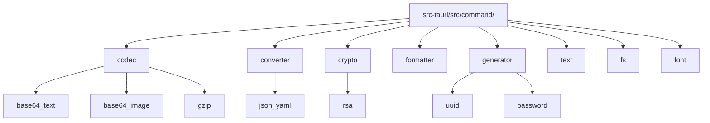
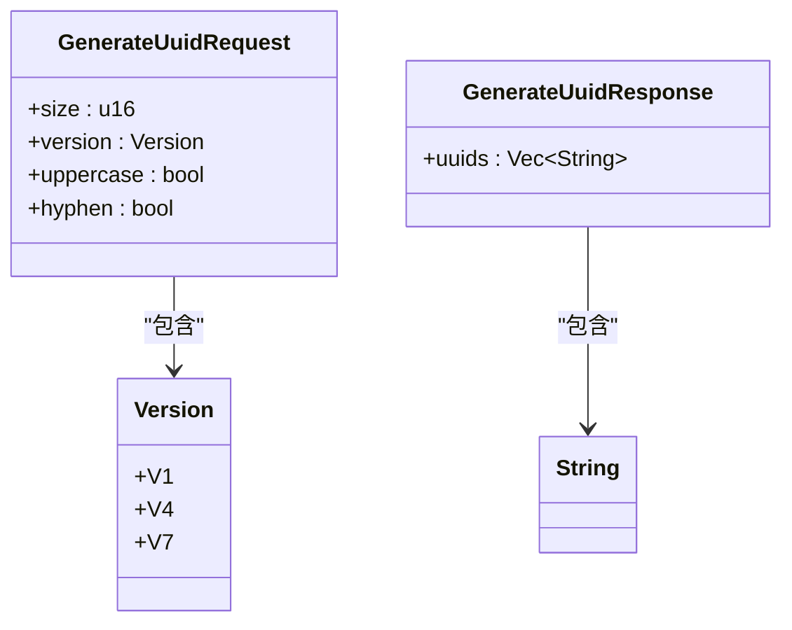
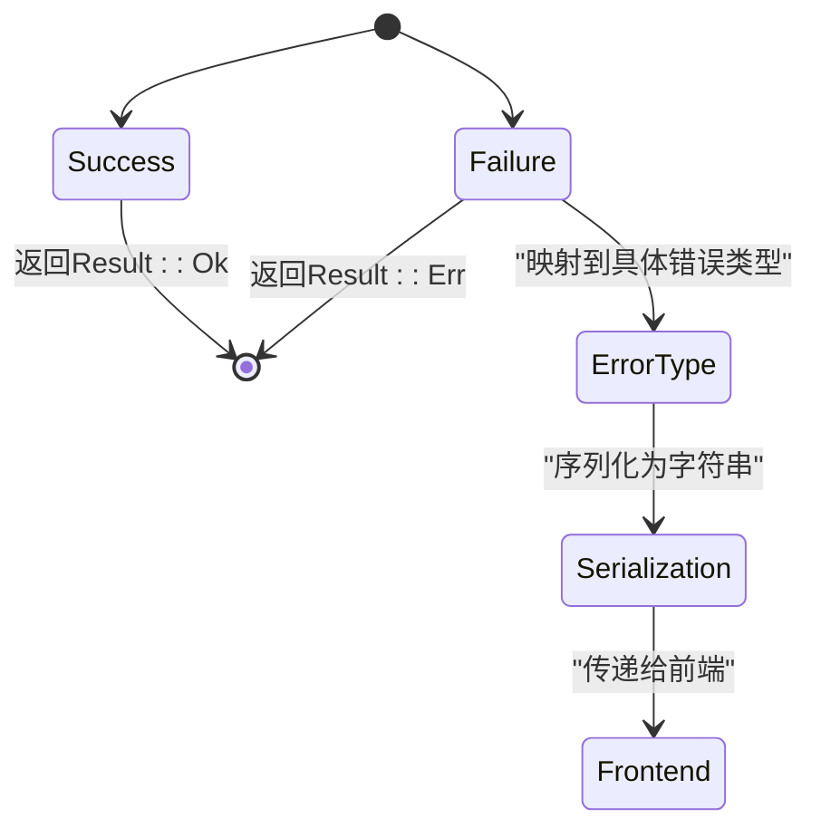
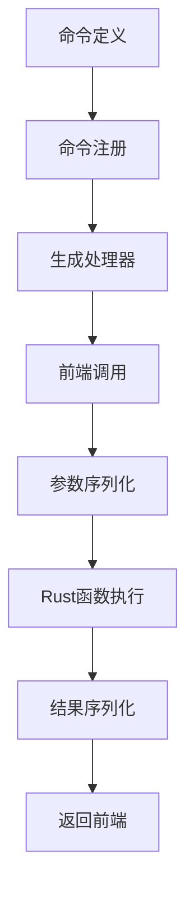
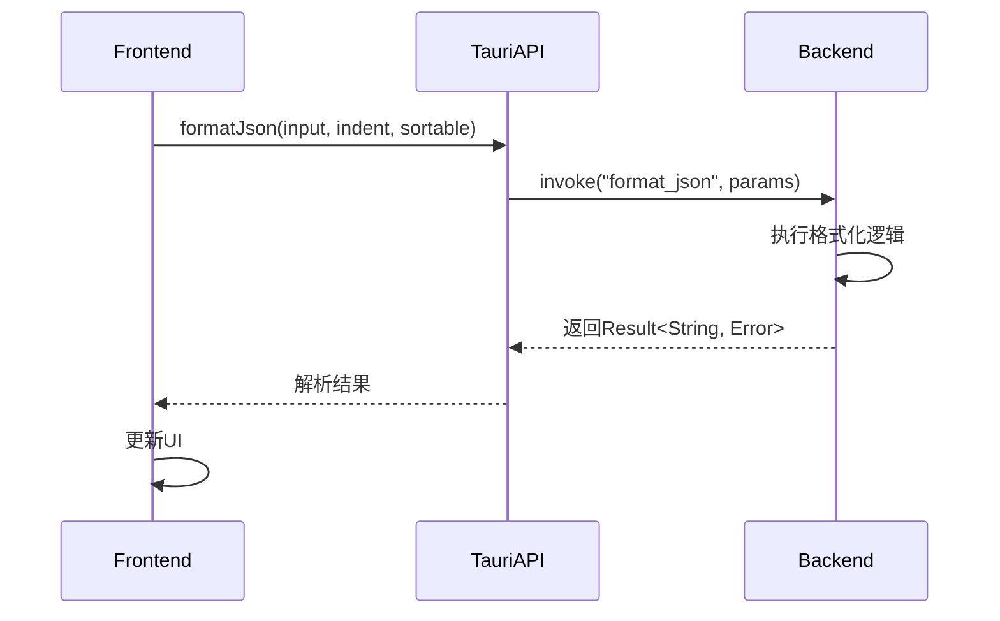
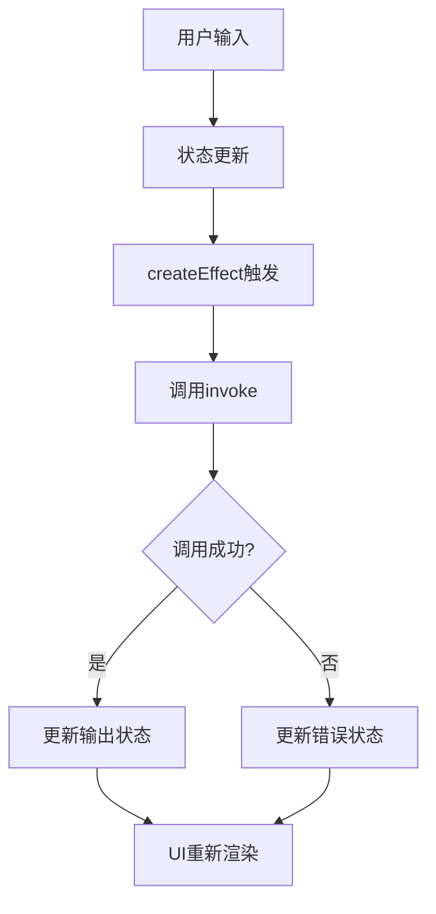
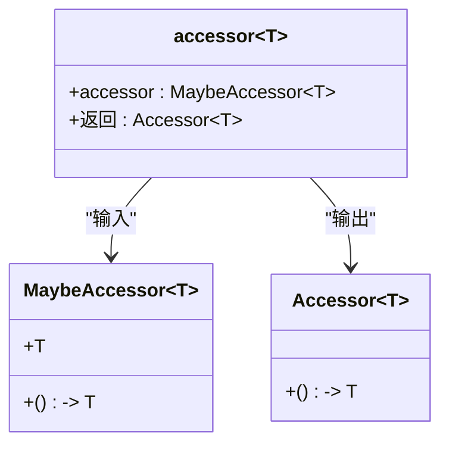
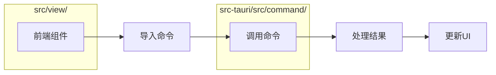
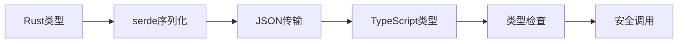
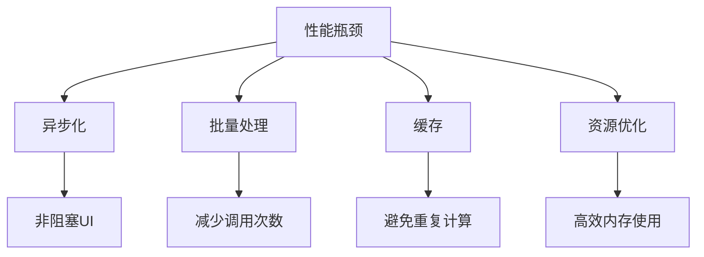

# 接口绑定

<cite>
**本文档中引用的文件**  
- [lib.rs](file://src-tauri/src/lib.rs#L1-L57)
- [main.rs](file://src-tauri/src/main.rs#L1-L7)
- [mod.rs](file://src-tauri/src/command/mod.rs#L1-L8)
- [fs.rs](file://src-tauri/src/command/fs.rs#L1-L34)
- [uuid.rs](file://src-tauri/src/command/generator/uuid.rs#L1-L48)
- [json.rs](file://src-tauri/src/command/formatter/json.rs#L1-L39)
- [rsa.rs](file://src-tauri/src/command/crypto/rsa.rs#L1-L78)
- [markdown.rs](file://src-tauri/src/command/text/markdown.rs#L1-L15)
- [json_yaml.rs](file://src-tauri/src/command/converter/json_yaml.rs#L1-L19)
- [error.rs](file://src-tauri/src/error.rs#L1-L31)
- [Cargo.toml](file://src-tauri/Cargo.toml#L1-L69)
- [uuid.tsx](file://src/view/generator/uuid.tsx#L1-L87)
- [json.tsx](file://src/view/formatter/json.tsx#L1-L91)
- [accessor.ts](file://src/utils/accessor.ts#L1-L11)
</cite>

## 目录
1. [引言](#引言)
2. [后端命令接口定义](#后端命令接口定义)
3. [前端调用实现机制](#前端调用实现机制)
4. [API调用封装最佳实践](#api调用封装最佳实践)
5. [接口兼容性测试与性能优化](#接口兼容性测试与性能优化)
6. [总结](#总结)

## 引言
devkimi项目采用Tauri框架实现跨平台桌面应用开发，通过Rust后端与TypeScript前端的深度集成，构建高性能的本地工具集。本项目的核心架构采用前后端分离模式，通过Tauri提供的`invoke`机制实现安全的跨语言调用。本文档详细说明在devkimi项目中进行前后端接口绑定的完整流程，涵盖从后端命令定义到前端调用的全过程，以及API封装、错误处理和性能优化等关键实践。

**本节来源**  
- [lib.rs](file://src-tauri/src/lib.rs#L1-L57)
- [main.rs](file://src-tauri/src/main.rs#L1-L7)

## 后端命令接口定义

### 命令模块组织结构
devkimi项目的后端命令定义位于`src-tauri/src/command/`目录下，采用功能模块化组织方式。每个功能类别（如codec、converter、crypto等）都有独立的子模块，通过`mod.rs`文件统一导出。这种分层结构提高了代码的可维护性和可扩展性。



**图示来源**  
- [mod.rs](file://src-tauri/src/command/mod.rs#L1-L8)

### 命令定义规范
Tauri命令通过`#[tauri::command]`宏进行标记，该宏将Rust函数暴露为可被前端调用的安全接口。命令函数必须遵循特定的返回值规范：使用`Result<T, Error>`类型来统一处理成功响应和错误情况。

以UUID生成器为例，`generate_uuid`函数定义了四个参数：数量（size）、版本（version）、是否大写（uppercase）和是否包含连字符（hyphen）。函数返回`Vec<String>`类型的UUID列表，通过`Result`包装以支持错误传播。



**图示来源**  
- [uuid.rs](file://src-tauri/src/command/generator/uuid.rs#L1-L48)

### 错误处理机制
项目通过自定义的`command_error!`宏实现统一的错误处理框架。该宏生成实现了`thiserror::Error` trait的`Error`枚举类型，支持多种错误类型的分类和格式化。所有命令函数的错误都会被自动转换为可序列化的字符串，确保前端能够正确接收和处理。



**图示来源**  
- [error.rs](file://src-tauri/src/error.rs#L1-L31)
- [json.rs](file://src-tauri/src/command/formatter/json.rs#L35-L38)

### 命令注册机制
所有可调用的命令必须在`src-tauri/src/lib.rs`文件中的`tauri::generate_handler!`宏中显式注册。该宏生成必要的绑定代码，将Rust函数映射到JavaScript可调用的接口。未注册的命令无法从前端访问，确保了接口的安全性。



**图示来源**  
- [lib.rs](file://src-tauri/src/lib.rs#L11-L43)

## 前端调用实现机制

### invoke方法调用模式
前端通过导入自动生成的命令函数来调用后端功能。这些函数封装了`@tauri-apps/api`的`invoke`方法，提供类型安全的调用接口。调用过程本质上是异步的Promise操作，支持标准的`.then().catch()`链式调用或`async/await`语法。

以JSON格式化功能为例，前端直接导入`formatJson`函数，传入输入文本、缩进选项和排序标志等参数。函数返回Promise，解析后得到格式化后的JSON字符串。



**图示来源**  
- [json.tsx](file://src/view/formatter/json.tsx#L27-L29)
- [json.rs](file://src-tauri/src/command/formatter/json.rs#L14-L24)

### 异步操作管理
项目采用SolidJS的响应式系统管理异步操作状态。通过`createEffect`钩子监听输入变化，自动触发后端调用并更新输出结果。这种声明式编程模式简化了状态管理，避免了传统回调地狱的问题。

在UUID生成器组件中，当用户调整配置参数时，`createEffect`会自动重新执行，调用`generateUuid`命令并更新输出显示。错误情况通过`catch`块捕获，并将错误信息显示在输出区域。



**图示来源**  
- [uuid.tsx](file://src/view/generator/uuid.tsx#L23-L28)

### 参数类型映射
Tauri自动处理Rust与JavaScript之间的类型转换。基本类型（字符串、数字、布尔值）直接映射，枚举类型转换为字符串字面量，复杂结构体通过JSON序列化传输。这种透明的类型转换机制降低了开发者的认知负担。

```mermaid
erDiagram
RUST_ENUM ||--o{ JS_STRING : "转换"
RUST_STRUCT ||--o{ JSON_OBJECT : "序列化"
PRIMITIVE_TYPES ||--o{ PRIMITIVE_TYPES : "直接映射"
class RUST_ENUM {
+V1
+V4
+V7
}
class JS_STRING {
+"V1"
+"V4"
+"V7"
}
class RUST_STRUCT {
+size: u16
+version: Version
+uppercase: bool
+hyphen: bool
}
class JSON_OBJECT {
+size: number
+version: string
+uppercase: boolean
+hyphen: boolean
}
```

**图示来源**  
- [uuid.rs](file://src-tauri/src/command/generator/uuid.rs#L4-L9)
- [uuid.tsx](file://src/view/generator/uuid.tsx#L10-L14)

## API调用封装最佳实践

### accessor工具函数
`src/utils/accessor.ts`文件提供了`accessor`工具函数，用于统一处理可能为函数或值的参数。该函数判断输入类型，如果是函数则直接返回，否则包装为返回该值的函数。这种模式提高了API的灵活性和复用性。



**图示来源**  
- [accessor.ts](file://src/utils/accessor.ts#L1-L11)

### 命令导入与使用
前端组件通过相对路径直接导入后端命令函数，如`import { generateUuid } from "../../command/generate/uuid"`。这种模块化导入方式确保了类型安全和代码可维护性。IDE可以提供完整的类型提示和错误检查。



**图示来源**  
- [uuid.tsx](file://src/view/generator/uuid.tsx#L3)
- [json.tsx](file://src/view/formatter/json.tsx#L3)

## 接口兼容性测试与性能优化

### 类型安全保证
项目通过Rust的强类型系统和TypeScript的类型检查实现端到端的类型安全。Cargo.toml中声明的依赖版本确保了构建环境的一致性，避免了依赖冲突导致的兼容性问题。



**图示来源**  
- [Cargo.toml](file://src-tauri/Cargo.toml#L20-L58)

### 性能优化策略
1. **异步调用**：使用`#[tauri::command(async)]`宏标记耗时操作，避免阻塞主线程
2. **批量处理**：如UUID生成支持批量生成，减少跨语言调用开销
3. **缓存机制**：对重复计算结果进行缓存，如Markdown解析使用thread_local存储配置
4. **资源管理**：合理使用Rust的所有权系统，避免内存泄漏



**图示来源**  
- [markdown.rs](file://src-tauri/src/command/text/markdown.rs#L1-L7)
- [uuid.rs](file://src-tauri/src/command/generator/uuid.rs#L12-L30)

## 总结
devkimi项目的前后端接口绑定流程体现了现代桌面应用开发的最佳实践。通过Tauri框架提供的安全、高效的跨语言调用机制，项目实现了Rust后端性能优势与TypeScript前端开发效率的完美结合。清晰的模块化结构、统一的错误处理机制和类型安全的接口设计，确保了系统的稳定性和可维护性。未来可进一步优化的方向包括增加接口版本控制、实现更精细的错误分类和引入性能监控机制。