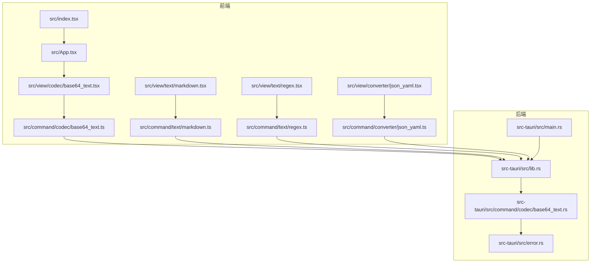
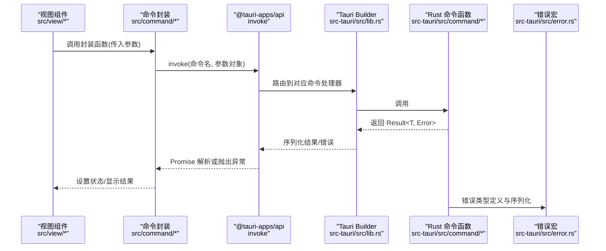
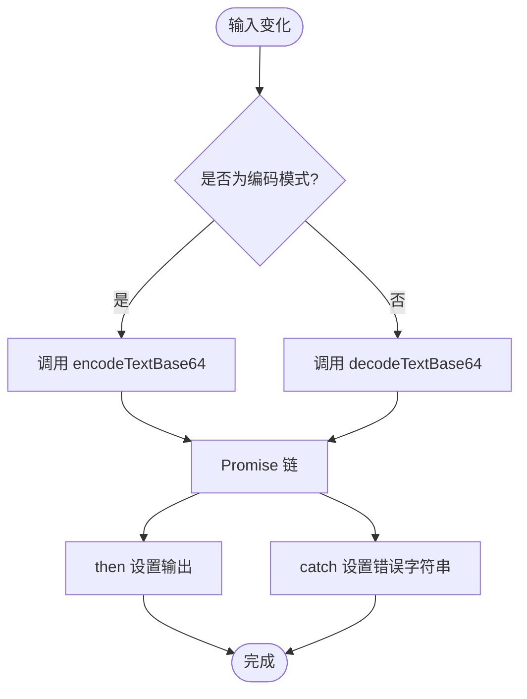
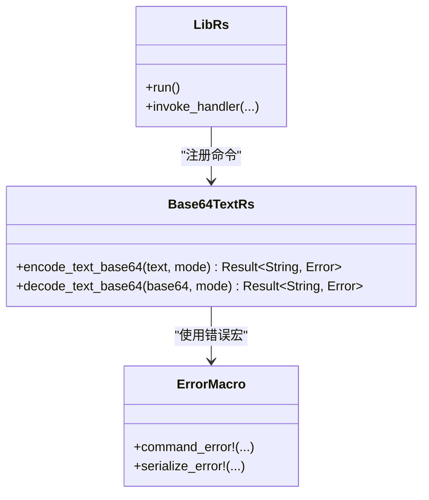
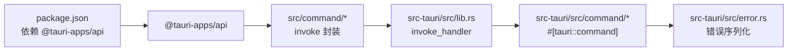
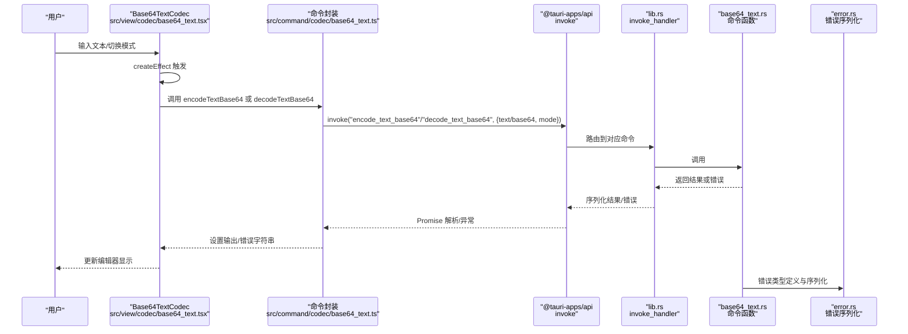

# 接口调用

<cite>
**本文引用的文件**
- [src/view/codec/base64_text.tsx](file://src/view/codec/base64_text.tsx)
- [src/command/codec/base64_text.ts](file://src/command/codec/base64_text.ts)
- [src-tauri/src/lib.rs](file://src-tauri/src/lib.rs)
- [src-tauri/src/main.rs](file://src-tauri/src/main.rs)
- [src-tauri/src/command/codec/base64_text.rs](file://src-tauri/src/command/codec/base64_text.rs)
- [src-tauri/src/error.rs](file://src-tauri/src/error.rs)
- [src/App.tsx](file://src/App.tsx)
- [src/index.tsx](file://src/index.tsx)
- [package.json](file://package.json)
- [src/view/text/markdown.tsx](file://src/view/text/markdown.tsx)
- [src/command/text/markdown.ts](file://src/command/text/markdown.ts)
- [src/view/text/regex.tsx](file://src/view/text/regex.tsx)
- [src/command/text/regex.ts](file://src/command/text/regex.ts)
- [src/view/converter/json_yaml.tsx](file://src/view/converter/json_yaml.tsx)
- [src/command/converter/json_yaml.ts](file://src/command/converter/json_yaml.ts)
</cite>

## 目录
1. [简介](#简介)
2. [项目结构](#项目结构)
3. [核心组件](#核心组件)
4. [架构总览](#架构总览)
5. [详细组件分析](#详细组件分析)
6. [依赖关系分析](#依赖关系分析)
7. [性能考量](#性能考量)
8. [故障排查指南](#故障排查指南)
9. [结论](#结论)
10. [附录](#附录)

## 简介
本文件系统性说明 devkimi 项目中前端通过 @tauri-apps/api 的 invoke 函数调用 Tauri 后端命令的实现方式，覆盖以下主题：
- 使用 invoke 进行异步调用、Promise 处理与错误捕获
- 调用参数的序列化与响应数据的类型安全处理
- 在 view 组件中调用命令的具体实现模式（以 base64_text.tsx 为例）
- 长时间运行操作与进度反馈的处理建议
- 完整数据流示例：从用户交互到后端调用再到结果展示
- 超时与重试机制的最佳实践

## 项目结构
devkimi 采用前端（SolidJS + Vite）与后端（Rust + Tauri）分离的架构。前端通过 @tauri-apps/api 的 invoke 发起命令调用；后端在 Rust 中注册命令并通过 #[tauri::command] 注解暴露给前端。

图表来源
- [src/index.tsx](file://src/index.tsx#L1-L37)
- [src/App.tsx](file://src/App.tsx#L1-L47)
- [src/view/codec/base64_text.tsx](file://src/view/codec/base64_text.tsx#L1-L111)
- [src/command/codec/base64_text.ts](file://src/command/codec/base64_text.ts#L1-L18)
- [src/view/text/markdown.tsx](file://src/view/text/markdown.tsx#L1-L60)
- [src/command/text/markdown.ts](file://src/command/text/markdown.ts#L1-L7)
- [src/view/text/regex.tsx](file://src/view/text/regex.tsx#L1-L203)
- [src/command/text/regex.ts](file://src/command/text/regex.ts#L1-L27)
- [src/view/converter/json_yaml.tsx](file://src/view/converter/json_yaml.tsx#L1-L107)
- [src/command/converter/json_yaml.ts](file://src/command/converter/json_yaml.ts#L1-L11)
- [src-tauri/src/main.rs](file://src-tauri/src/main.rs#L1-L7)
- [src-tauri/src/lib.rs](file://src-tauri/src/lib.rs#L1-L57)
- [src-tauri/src/command/codec/base64_text.rs](file://src-tauri/src/command/codec/base64_text.rs#L1-L22)
- [src-tauri/src/error.rs](file://src-tauri/src/error.rs#L1-L31)

章节来源
- [src/index.tsx](file://src/index.tsx#L1-L37)
- [src/App.tsx](file://src/App.tsx#L1-L47)
- [package.json](file://package.json#L1-L43)

## 核心组件
- 前端命令封装层：位于 src/command/*，统一导出 invoke 调用，隐藏命令名与参数结构，便于 view 层复用与类型推断。
- 视图组件层：位于 src/view/*，负责用户交互与状态管理，触发命令调用并将结果渲染到编辑器或表格。
- 后端命令层：位于 src-tauri/src/command/*，通过 #[tauri::command] 暴露函数，接收参数并返回结果或错误。
- 应用入口：前端在 src/index.tsx 渲染 App；App 在 src/App.tsx 组织路由与布局。

章节来源
- [src/command/codec/base64_text.ts](file://src/command/codec/base64_text.ts#L1-L18)
- [src/view/codec/base64_text.tsx](file://src/view/codec/base64_text.tsx#L1-L111)
- [src-tauri/src/lib.rs](file://src-tauri/src/lib.rs#L1-L57)
- [src-tauri/src/command/codec/base64_text.rs](file://src-tauri/src/command/codec/base64_text.rs#L1-L22)
- [src-tauri/src/error.rs](file://src-tauri/src/error.rs#L1-L31)
- [src/index.tsx](file://src/index.tsx#L1-L37)
- [src/App.tsx](file://src/App.tsx#L1-L47)

## 架构总览
前端通过 @tauri-apps/api 的 invoke 发送命令请求，后端在 lib.rs 中集中注册命令处理器，命令函数在 Rust 中执行业务逻辑并返回结果。错误通过统一的错误宏序列化为字符串传递给前端。

图表来源
- [src/command/codec/base64_text.ts](file://src/command/codec/base64_text.ts#L1-L18)
- [src-tauri/src/lib.rs](file://src-tauri/src/lib.rs#L1-L57)
- [src-tauri/src/command/codec/base64_text.rs](file://src-tauri/src/command/codec/base64_text.rs#L1-L22)
- [src-tauri/src/error.rs](file://src-tauri/src/error.rs#L1-L31)

## 详细组件分析

### Base64 文本编解码（view 层事件处理流程）
- 视图组件通过 createSignal 维护“编码/解码模式”“输入/输出”等状态。
- 当输入变化时，createEffect 触发条件判断：根据 encode 状态决定调用 encodeTextBase64 或 decodeTextBase64。
- Promise 链路：then 设置输出；catch 将错误转为字符串显示，避免 UI 崩溃。
- 输出通过只读编辑器展示，支持复制与保存按钮。

图表来源
- [src/view/codec/base64_text.tsx](file://src/view/codec/base64_text.tsx#L1-L111)
- [src/command/codec/base64_text.ts](file://src/command/codec/base64_text.ts#L1-L18)

章节来源
- [src/view/codec/base64_text.tsx](file://src/view/codec/base64_text.tsx#L1-L111)
- [src/command/codec/base64_text.ts](file://src/command/codec/base64_text.ts#L1-L18)

### Markdown 预览（类型安全与错误处理）
- 命令封装返回值类型为 string，前端直接设置到 innerHTML 显示预览。
- 错误处理：捕获异常并转为字符串显示，保证 UI 不中断。

章节来源
- [src/view/text/markdown.tsx](file://src/view/text/markdown.tsx#L1-L60)
- [src/command/text/markdown.ts](file://src/command/text/markdown.ts#L1-L7)

### 正则测试（复杂数据结构与类型安全）
- 命令封装返回 Capture[] 类型，前端通过 createSignal 与 For 渲染匹配信息表。
- 错误处理：console.error 记录错误，避免影响 UI。

章节来源
- [src/view/text/regex.tsx](file://src/view/text/regex.tsx#L1-L203)
- [src/command/text/regex.ts](file://src/command/text/regex.ts#L1-L27)

### JSON/YAML 转换（双向模式与语言切换）
- 通过模式开关控制方向，Promise 链设置输出，错误转字符串显示。
- 输出语言随模式动态切换。

章节来源
- [src/view/converter/json_yaml.tsx](file://src/view/converter/json_yaml.tsx#L1-L107)
- [src/command/converter/json_yaml.ts](file://src/command/converter/json_yaml.ts#L1-L11)

### 后端命令注册与错误序列化
- lib.rs 中集中注册所有命令，包含编解码、格式化、生成器、文本处理、转换器、加密等。
- error.rs 提供 command_error 宏，自动生成错误枚举并实现序列化，使 Rust 错误能以字符串形式返回前端。

图表来源
- [src-tauri/src/lib.rs](file://src-tauri/src/lib.rs#L1-L57)
- [src-tauri/src/command/codec/base64_text.rs](file://src-tauri/src/command/codec/base64_text.rs#L1-L22)
- [src-tauri/src/error.rs](file://src-tauri/src/error.rs#L1-L31)

章节来源
- [src-tauri/src/lib.rs](file://src-tauri/src/lib.rs#L1-L57)
- [src-tauri/src/command/codec/base64_text.rs](file://src-tauri/src/command/codec/base64_text.rs#L1-L22)
- [src-tauri/src/error.rs](file://src-tauri/src/error.rs#L1-L31)

## 依赖关系分析
- 前端依赖 @tauri-apps/api 提供 invoke；各 view 组件依赖对应的 command 封装。
- 后端依赖 tauri::Builder 注册命令；命令函数通过 #[tauri::command] 暴露。
- package.json 指定 @tauri-apps/api 版本，确保前后端兼容。

图表来源
- [package.json](file://package.json#L1-L43)
- [src/command/codec/base64_text.ts](file://src/command/codec/base64_text.ts#L1-L18)
- [src-tauri/src/lib.rs](file://src-tauri/src/lib.rs#L1-L57)
- [src-tauri/src/command/codec/base64_text.rs](file://src-tauri/src/command/codec/base64_text.rs#L1-L22)
- [src-tauri/src/error.rs](file://src-tauri/src/error.rs#L1-L31)

章节来源
- [package.json](file://package.json#L1-L43)
- [src-tauri/src/lib.rs](file://src-tauri/src/lib.rs#L1-L57)

## 性能考量
- 前端：尽量在 createEffect 中做轻量计算与条件触发，避免不必要的重复调用；对大文本处理建议节流或防抖。
- 后端：命令函数应避免阻塞主线程，必要时拆分为异步任务或使用通道；对大对象序列化注意内存占用。
- I/O：文件读写、网络请求等长耗时操作应在后端实现并发与取消能力，前端做好加载态与进度提示。

## 故障排查指南
- 前端 Promise 捕获：若 UI 未更新或报错，检查 then/catch 是否正确设置状态或记录日志。
- 命令名与参数：确认命令名一致且参数结构匹配；类型不匹配会导致序列化失败。
- 后端错误：查看 error.rs 宏生成的错误消息，确认错误类型是否被序列化为字符串返回。
- 调试：开发环境可在 App.tsx 中启用 Suspense 包裹，观察路由切换与组件渲染。

章节来源
- [src/view/codec/base64_text.tsx](file://src/view/codec/base64_text.tsx#L1-L111)
- [src-tauri/src/error.rs](file://src-tauri/src/error.rs#L1-L31)
- [src/App.tsx](file://src/App.tsx#L1-L47)

## 结论
devkimi 通过清晰的分层设计实现了从前端到后端的稳定调用链：前端以 invoke 为核心发起命令，命令封装提供类型安全与易用接口，后端集中注册命令并统一错误序列化。view 组件以 createEffect 驱动状态更新，Promise 链路负责结果与错误处理。该模式易于扩展与维护，适合在桌面应用中集成多种工具功能。

## 附录

### 从用户交互到结果展示的完整数据流（Base64 文本编解码）

图表来源
- [src/view/codec/base64_text.tsx](file://src/view/codec/base64_text.tsx#L1-L111)
- [src/command/codec/base64_text.ts](file://src/command/codec/base64_text.ts#L1-L18)
- [src-tauri/src/lib.rs](file://src-tauri/src/lib.rs#L1-L57)
- [src-tauri/src/command/codec/base64_text.rs](file://src-tauri/src/command/codec/base64_text.rs#L1-L22)
- [src-tauri/src/error.rs](file://src-tauri/src/error.rs#L1-L31)

### 超时与重试机制最佳实践
- 超时：前端在调用前创建定时器，超时后取消 Promise 并提示用户；后端命令应支持取消信号（如 tokio 取消），避免资源泄漏。
- 重试：对幂等操作（如格式化、转换）可自动重试，指数退避策略；对非幂等操作需谨慎，避免重复副作用。
- 进度反馈：对长耗时操作，后端可分段返回进度，前端以进度条或状态栏展示；对不可中断的任务，提供取消按钮与回滚路径。

[本节为通用指导，无需具体文件引用]