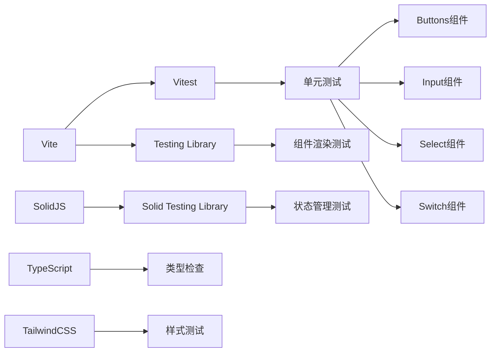
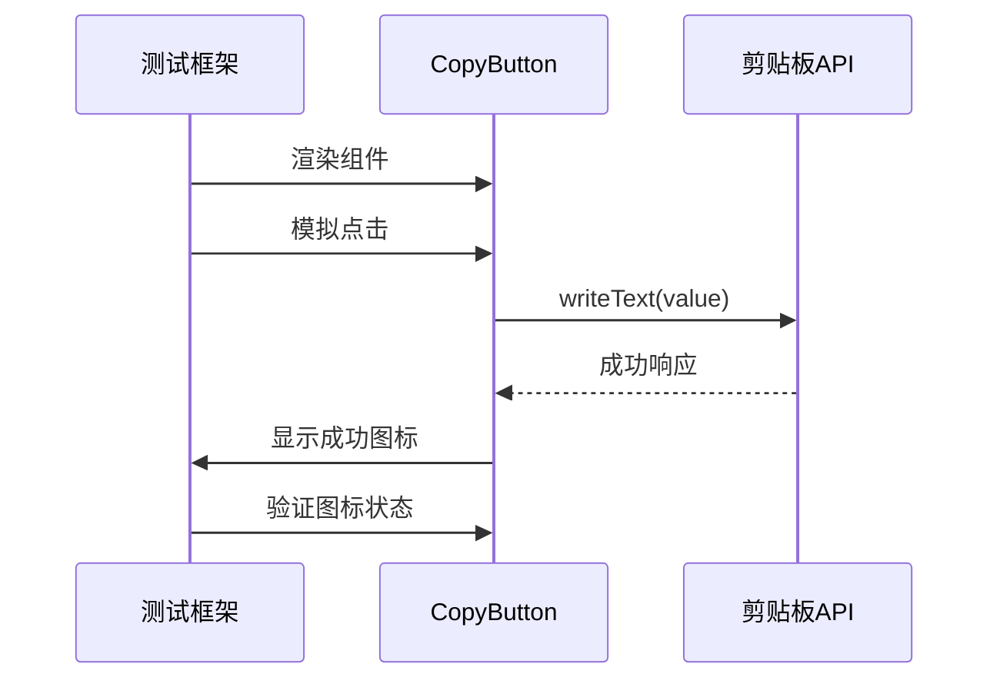
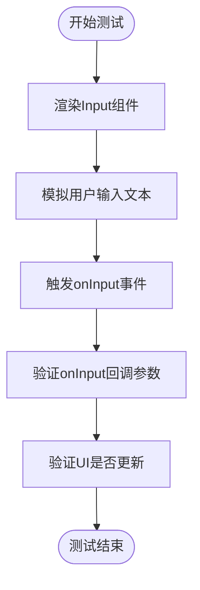
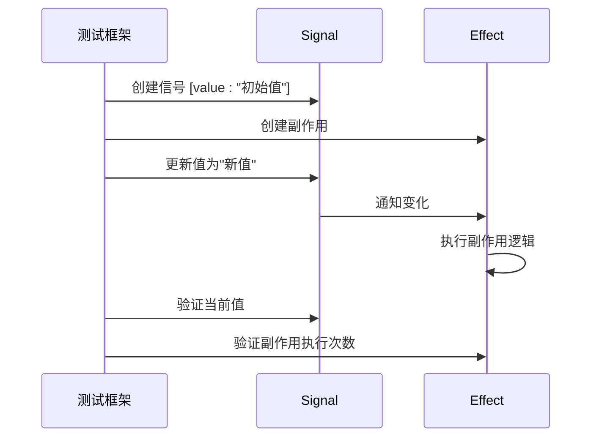
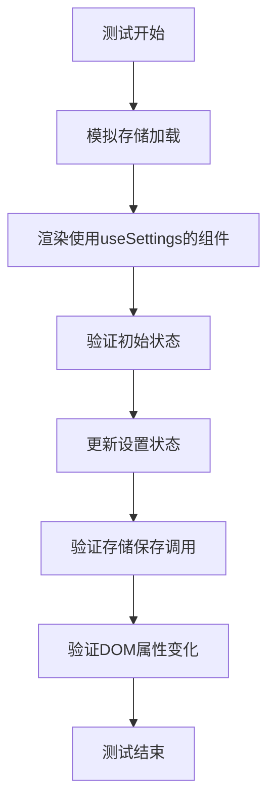
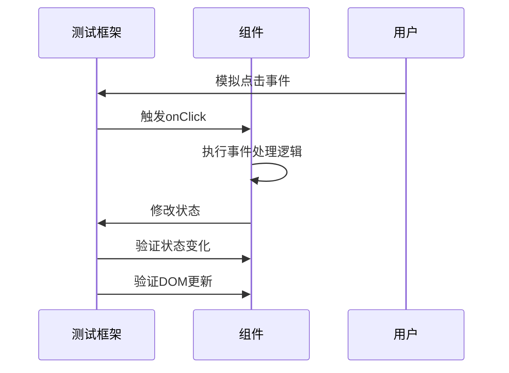
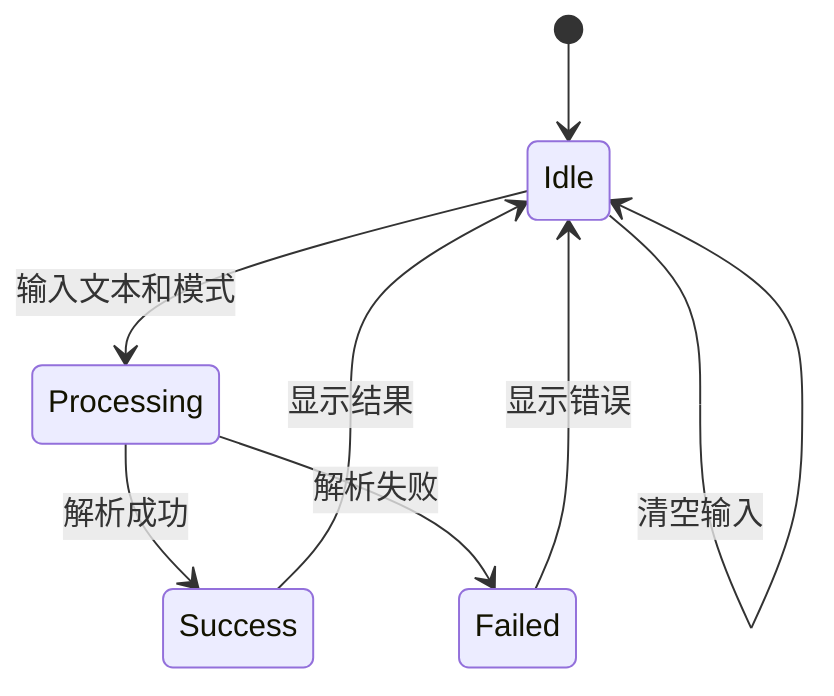
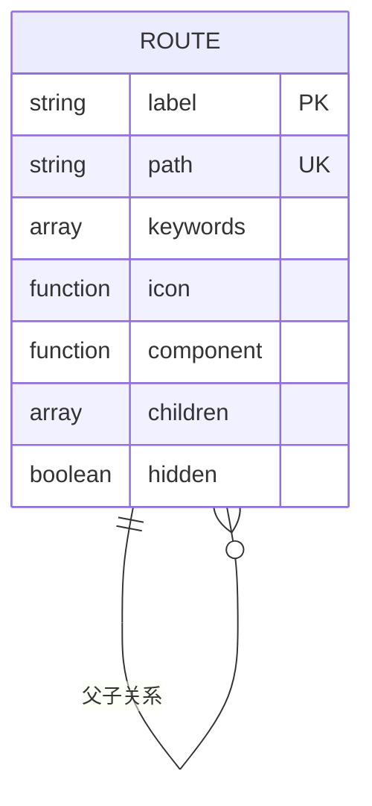
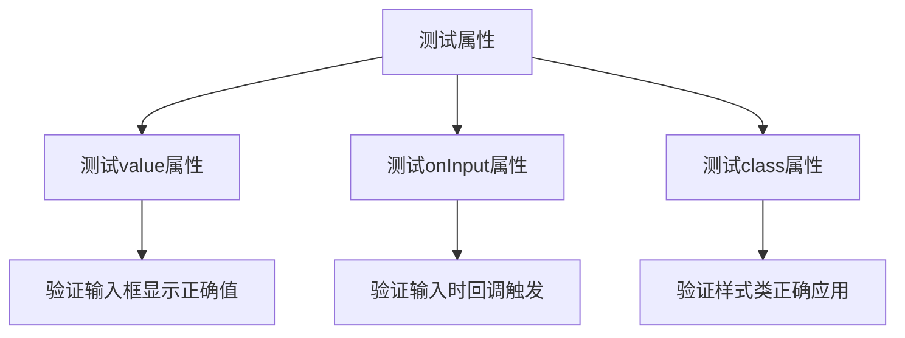
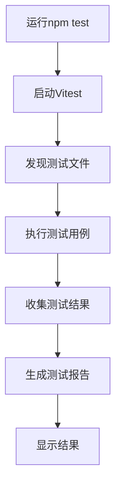

# 前端测试

<cite>
**本文档引用的文件**  
- [package.json](file://package.json)
- [vite.config.ts](file://vite.config.ts)
- [tsconfig.json](file://tsconfig.json)
- [pnpm-lock.yaml](file://pnpm-lock.yaml)
- [Buttons.tsx](file://src/component/Buttons.tsx)
- [Input.tsx](file://src/component/Config/Input.tsx)
- [Select.tsx](file://src/component/Config/Select.tsx)
- [Switch.tsx](file://src/component/Config/Switch.tsx)
- [Option.tsx](file://src/component/Config/Option.tsx)
- [Container.tsx](file://src/component/Container.tsx)
- [Editor.tsx](file://src/component/Editor.tsx)
- [App.tsx](file://src/App.tsx)
- [routes.tsx](file://src/routes.tsx)
- [regex.tsx](file://src/view/text/regex.tsx)
- [store.tsx](file://src/store.tsx)
</cite>

## 目录
1. [项目结构](#项目结构)
2. [测试工具与配置](#测试工具与配置)
3. [组件单元测试](#组件单元测试)
4. [状态管理测试](#状态管理测试)
5. [用户交互行为测试](#用户交互行为测试)
6. [路由功能测试](#路由功能测试)
7. [快照测试与属性测试](#快照测试与属性测试)
8. [测试组织结构与运行流程](#测试组织结构与运行流程)

## 项目结构

devkimi项目是一个基于SolidJS和Tauri的桌面应用，采用模块化设计，前端组件主要位于`src/component`目录下，视图组件位于`src/view`目录。项目使用Vite作为构建工具，TypeScript作为开发语言，TailwindCSS进行样式管理。

```mermaid
graph TD
A[devkimi项目] --> B[前端(src)]
A --> C[Tauri后端(src-tauri)]
B --> D[组件(component)]
B --> E[视图(view)]
B --> F[工具(utils)]
B --> G[状态(store.tsx)]
B --> H[路由(routes.tsx)]
D --> I[Buttons.tsx]
D --> J[Config/Input.tsx]
D --> K[Config/Select.tsx]
D --> L[Config/Switch.tsx]
D --> M[Editor.tsx]
E --> N[text/regex.tsx]
```

**图示来源**  
- [Buttons.tsx](file://src/component/Buttons.tsx)
- [Input.tsx](file://src/component/Config/Input.tsx)
- [Select.tsx](file://src/component/Config/Select.tsx)
- [Switch.tsx](file://src/component/Config/Switch.tsx)
- [Editor.tsx](file://src/component/Editor.tsx)
- [regex.tsx](file://src/view/text/regex.tsx)

**本节来源**  
- [package.json](file://package.json)
- [vite.config.ts](file://vite.config.ts)
- [tsconfig.json](file://tsconfig.json)

## 测试工具与配置

devkimi项目使用Vite作为构建工具，结合SolidJS生态进行前端开发。虽然项目当前配置中未显式包含Vitest等测试框架，但通过`package.json`中的依赖关系可以看出，项目具备集成现代前端测试框架的基础条件。`vite-plugin-solid`插件支持开发环境下的热更新和调试，为测试环境的搭建提供了便利。

项目使用TypeScript进行类型检查，配置了严格的类型安全选项（`"strict": true`），这有助于在编译阶段捕获潜在的错误，提高代码质量和可测试性。同时，项目依赖`@testing-library/jest-dom`（通过`vite-plugin-solid`的peerDependencies间接引用），表明其设计上支持使用测试库进行DOM断言和测试。



**图示来源**  
- [package.json](file://package.json)
- [vite.config.ts](file://vite.config.ts)
- [tsconfig.json](file://tsconfig.json)
- [pnpm-lock.yaml](file://pnpm-lock.yaml)

**本节来源**  
- [package.json](file://package.json)
- [vite.config.ts](file://vite.config.ts)
- [tsconfig.json](file://tsconfig.json)
- [pnpm-lock.yaml](file://pnpm-lock.yaml)

## 组件单元测试

在devkimi项目中，UI组件如`Buttons`、`Input`、`Select`等均采用SolidJS函数式组件实现，具有良好的可测试性。编写单元测试时，应验证组件的渲染逻辑、属性传递和基本功能。

### Buttons组件测试

`Buttons.tsx`文件定义了多个功能性按钮组件，如`CopyButton`、`PasteButton`、`ClearButton`等。测试时应验证：
- 按钮是否正确渲染
- 点击事件是否触发预期行为
- 图标和文本是否正确显示



### Input组件测试

`Input.tsx`文件中的`Input`和`NumberInput`组件用于表单输入。测试应关注：
- 输入值的双向绑定
- onInput事件的正确触发
- 样式类的正确应用



### Select组件测试

`Select.tsx`中的`Select`组件用于下拉选择。测试重点包括：
- 选项列表的正确渲染
- onChange事件的正确处理
- 当前选中状态的正确显示

```mermaid
classDiagram
class Select {
+value : string
+options : Array<{label : string, value : string}>
+onChange : (value : string) => void
+render() : JSX.Element
}
class Option {
+label : string
+value : string
}
Select --> Option : 包含多个
```

**本节来源**  
- [Buttons.tsx](file://src/component/Buttons.tsx)
- [Input.tsx](file://src/component/Config/Input.tsx)
- [Select.tsx](file://src/component/Config/Select.tsx)

## 状态管理测试

devkimi项目使用SolidJS的响应式系统进行状态管理，通过`createSignal`、`createEffect`等API实现。`store.tsx`文件实现了全局状态管理，使用Tauri的`plugin-store`进行持久化存储。

### 响应式状态测试

测试响应式状态时，应验证：
- 信号（Signal）的初始值是否正确
- 状态更新是否触发预期的副作用
- 计算属性（Memo）是否正确更新



### 全局状态管理测试

`useSettings` Hook提供了对全局设置的访问。测试应验证：
- 初始状态是否从持久化存储正确加载
- 状态更新是否正确保存到存储
- 主题切换是否正确应用到DOM



**本节来源**  
- [store.tsx](file://src/store.tsx)
- [regex.tsx](file://src/view/text/regex.tsx)

## 用户交互行为测试

用户交互行为测试关注组件对用户操作的响应，包括点击、输入、选择等操作。

### 事件处理测试

测试事件处理逻辑时，应模拟用户操作并验证结果：
- 模拟点击按钮并验证回调函数调用
- 模拟输入文本并验证状态更新
- 模拟选择选项并验证值变化



### 异步操作测试

对于涉及异步操作的组件（如`regex.tsx`中的正则解析），测试应：
- 模拟异步操作的成功和失败情况
- 验证加载状态的正确显示
- 验证错误处理逻辑



**本节来源**  
- [Buttons.tsx](file://src/component/Buttons.tsx)
- [regex.tsx](file://src/view/text/regex.tsx)

## 路由功能测试

devkimi项目使用`@solidjs/router`进行路由管理，`routes.tsx`文件定义了应用的路由结构。

### 路由配置测试

应验证路由配置的正确性：
- 路径与组件的映射关系
- 路由参数的正确传递
- 导航功能的正确实现



### 页面导航测试

测试页面间导航时，应验证：
- 点击导航链接是否正确跳转
- URL变化是否触发正确组件渲染
- 路由守卫（如有）的正确执行

```mermaid
flowchart LR
A[主页] --> |点击"格式化工具"| B[格式化工具]
B --> |点击"JSON"| C[JSON格式化]
C --> |点击"SQL"| D[SQL格式化]
D --> |点击"主页"| A
```

**本节来源**  
- [routes.tsx](file://src/routes.tsx)
- [App.tsx](file://src/App.tsx)

## 快照测试与属性测试

### 快照测试

快照测试用于捕获组件的渲染输出，确保UI不会意外变化。对于devkimi的UI组件，可以创建快照来验证：

- 组件的初始渲染状态
- 不同属性组合下的渲染结果
- 复杂组件的嵌套结构

### 属性测试

属性测试验证组件对不同属性输入的响应：
- 必需属性缺失时的降级处理
- 可选属性的正确应用
- 属性变化时的重新渲染



**本节来源**  
- [Input.tsx](file://src/component/Config/Input.tsx)
- [Select.tsx](file://src/component/Config/Select.tsx)
- [Switch.tsx](file://src/component/Config/Switch.tsx)

## 测试组织结构与运行流程

### 测试文件组织

建议的测试文件组织结构：
```
src/
├── component/
│   ├── __tests__/
│   │   ├── Buttons.test.tsx
│   │   ├── Input.test.tsx
│   │   └── Select.test.tsx
│   └── Config/
│       ├── __tests__/
│       │   └── Switch.test.tsx
```

### 测试运行流程

1. 启动测试环境
2. 加载测试文件
3. 执行测试用例
4. 生成测试报告
5. （可选）生成覆盖率报告



**本节来源**  
- [package.json](file://package.json)
- [vite.config.ts](file://vite.config.ts)