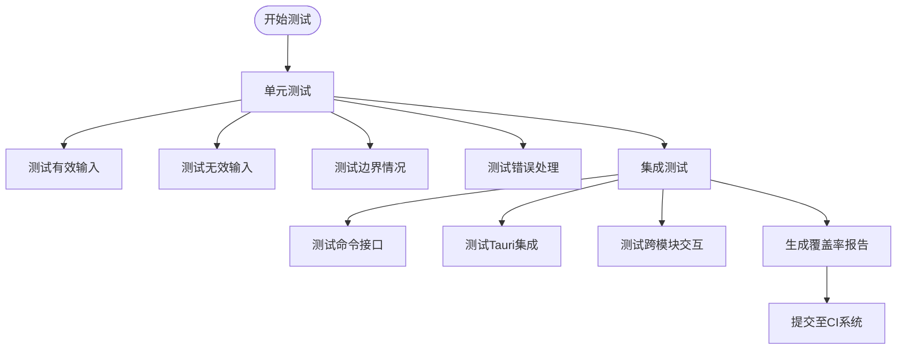
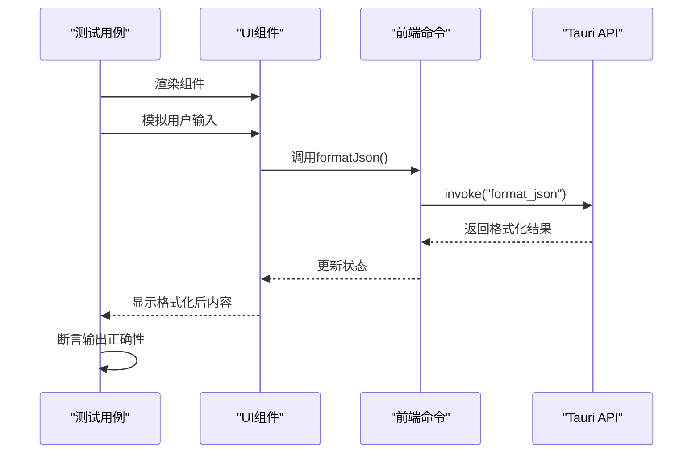
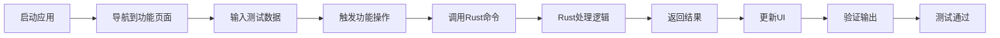
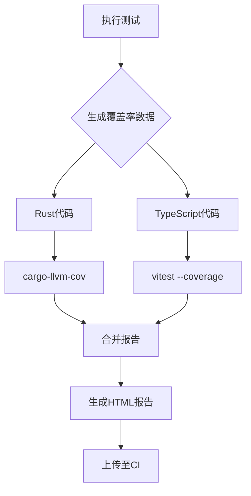
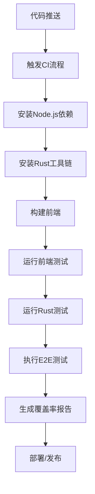

# 测试与验证

<cite>
**本文档中引用的文件**  
- [README.md](file://README.md)
- [package.json](file://package.json)
- [Cargo.toml](file://src-tauri/Cargo.toml)
- [build.rs](file://src-tauri/build.rs)
- [lib.rs](file://src-tauri/src/lib.rs)
- [mod.rs](file://src-tauri/src/command/mod.rs)
- [formatter/json.rs](file://src-tauri/src/command/formatter/json.rs)
- [codec/base64_text.rs](file://src-tauri/src/command/codec/base64_text.rs)
- [App.tsx](file://src/App.tsx)
- [routes.tsx](file://src/routes.tsx)
- [view/formatter/json.tsx](file://src/view/formatter/json.tsx)
- [command/formatter/json.ts](file://src/command/formatter/json.ts)
</cite>

## 目录
1. [简介](#简介)
2. [后端Rust测试](#后端rust测试)
3. [前端TypeScript测试](#前端typescript测试)
4. [端到端测试](#端到端测试)
5. [测试覆盖率分析](#测试覆盖率分析)
6. [持续集成配置](#持续集成配置)
7. [结论](#结论)

## 简介

devkimi 是一个基于 Tauri 和 SolidJS 构建的多功能开发者工具集，提供编解码、格式化、生成器、文本处理和转换器等五大功能模块。本项目采用 TypeScript 和 Rust 双语言架构，前端使用 SolidJS 框架，后端通过 Tauri 调用 Rust 命令实现核心功能。

为了确保软件质量，devkimi 项目需要建立完整的测试体系，涵盖后端 Rust 单元测试与集成测试、前端 TypeScript 组件测试以及跨层的端到端测试。测试流程应覆盖从功能验证到性能监控的各个方面，并通过持续集成实现自动化验证。

**Section sources**
- [README.md](file://README.md#L1-L122)

## 后端Rust测试

devkimi 的后端逻辑主要位于 `src-tauri/src/command/` 目录下，按照功能模块划分为 codec、converter、formatter、generator、text 等子模块。每个模块包含具体的 Rust 函数实现，这些函数通过 Tauri 的 `invoke_handler` 暴露给前端调用。

在 Rust 中编写测试用例遵循标准的单元测试和集成测试模式。单元测试通常写在同一个文件中，使用 `#[cfg(test)]` 标记测试模块；集成测试则放在 `tests/` 目录下作为独立文件存在。尽管当前项目结构中未显式展示测试目录，但可通过 Cargo 的测试框架添加。

测试内容应覆盖所有命令函数的关键路径，包括正常输入、边界条件和错误处理。例如，对于 JSON 格式化功能，需要测试合法 JSON 字符串的格式化输出、非法 JSON 的错误返回、空字符串处理等情况。

**Diagram sources**
- [lib.rs](file://src-tauri/src/lib.rs#L1-L57)
- [mod.rs](file://src-tauri/src/command/mod.rs#L1-L8)

**Section sources**
- [Cargo.toml](file://src-tauri/Cargo.toml#L1-L69)
- [lib.rs](file://src-tauri/src/lib.rs#L1-L57)

## 前端TypeScript测试

前端测试主要针对 UI 组件和功能页面进行验证，确保用户界面的行为符合预期。devkimi 的前端组件位于 `src/component/` 目录，功能页面位于 `src/view/` 目录，通过 SolidJS 实现响应式逻辑。

前端测试通常使用 Jest 或 Vitest 作为测试运行器，配合 Testing Library 进行组件渲染和交互模拟。测试重点包括：
- 组件渲染正确性
- 用户交互响应
- 状态管理逻辑
- 与后端命令的通信

以 JSON 格式化页面为例，测试应验证编辑器内容变化时是否正确调用 `format_json` 命令，格式化结果是否正确显示，错误情况是否有适当提示。

**Diagram sources**
- [view/formatter/json.tsx](file://src/view/formatter/json.tsx)
- [command/formatter/json.ts](file://src/command/formatter/json.ts)

**Section sources**
- [routes.tsx](file://src/routes.tsx#L1-L62)
- [App.tsx](file://src/App.tsx)

## 端到端测试

端到端测试验证整个应用的工作流程，确保前后端协同工作正常。对于 devkimi 这类桌面应用，可使用 Playwright 或 Cypress 等工具进行自动化测试。

测试场景应覆盖主要用户旅程，例如：
1. 启动应用并导航到 JSON 格式化页面
2. 输入原始 JSON 文本
3. 点击格式化按钮
4. 验证输出区域显示正确格式化的 JSON
5. 验证复制功能正常工作

端到端测试需要启动完整的应用环境，模拟真实用户操作，验证从界面交互到后端处理再到结果展示的完整链条。

**Diagram sources**
- [lib.rs](file://src-tauri/src/lib.rs#L11-L43)
- [view/formatter/json.tsx](file://src/view/formatter/json.tsx)

**Section sources**
- [lib.rs](file://src-tauri/src/lib.rs#L11-L43)

## 测试覆盖率分析

测试覆盖率分析用于衡量测试用例对代码的覆盖程度，帮助识别未被测试的代码路径。对于 Rust 代码，可以使用 `cargo-llvm-cov` 或 `tarpaulin` 工具生成覆盖率报告；对于 TypeScript 代码，可使用 `vite-plugin-istanbul` 配合 Vitest 实现。

覆盖率指标包括：
- 行覆盖率（Line Coverage）
- 分支覆盖率（Branch Coverage）
- 函数覆盖率（Function Coverage）

通过集成覆盖率工具到构建流程中，可以在每次代码变更时自动生成报告，确保新增代码都经过充分测试。

**Diagram sources**
- [Cargo.toml](file://src-tauri/Cargo.toml)
- [package.json](file://package.json)

**Section sources**
- [Cargo.toml](file://src-tauri/Cargo.toml#L60-L69)

## 持续集成配置

持续集成（CI）是保证代码质量的关键环节。devkimi 项目可通过 GitHub Actions 实现自动化测试流程。CI 配置文件应包含以下步骤：
1. 安装依赖（pnpm 和 Cargo）
2. 构建前端资源
3. 运行前端测试
4. 运行后端测试
5. 执行端到端测试
6. 生成测试覆盖率报告
7. 上传构建产物

通过 CI 系统，每次代码提交都会自动触发完整测试流程，及时发现潜在问题。

**Diagram sources**
- [package.json](file://package.json#L7-L12)
- [Cargo.toml](file://src-tauri/Cargo.toml)

**Section sources**
- [package.json](file://package.json#L7-L43)

## 结论

devkimi 项目的测试与验证体系需要构建多层次的测试策略，从前端组件到后端逻辑再到整体集成进行全面覆盖。通过合理的测试架构设计和自动化流程，可以有效保障软件质量和开发效率。

建议立即实施以下改进：
1. 在 `src-tauri/tests/` 目录下建立 Rust 集成测试
2. 添加前端组件测试用例
3. 配置 GitHub Actions 实现 CI/CD
4. 集成测试覆盖率分析工具
5. 建立端到端测试场景库

完善的测试体系不仅能提高代码可靠性，还能增强团队协作信心，为项目的长期发展奠定坚实基础。