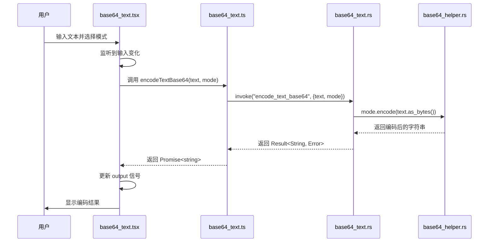

# 端到端测试

<cite>
**本文档中引用的文件**  
- [base64_text.tsx](file://src/view/codec/base64_text.tsx)
- [base64_text.ts](file://src/command/codec/base64_text.ts)
- [base64_text.rs](file://src-tauri/src/command/codec/base64_text.rs)
- [base64_helper.rs](file://src-tauri/src/command/codec/base64_helper.rs)
- [lib.rs](file://src-tauri/src/lib.rs)
- [tauri.conf.json](file://src-tauri/tauri.conf.json)
- [routes.tsx](file://src/routes.tsx)
- [App.tsx](file://src/App.tsx)
</cite>

## 目录
1. [简介](#简介)
2. [项目结构与技术栈](#项目结构与技术栈)
3. [Base64编码功能实现流程](#base64编码功能实现流程)
4. [端到端测试环境配置](#端到端测试环境配置)
5. [使用Playwright进行UI交互测试](#使用playwright进行ui交互测试)
6. [测试用例设计：Base64文本编解码](#测试用例设计base64文本编解码)
7. [异步操作处理与结果断言](#异步操作处理与结果断言)
8. [测试数据管理策略](#测试数据管理策略)
9. [CI/CD流水线集成](#cicd流水线集成)
10. [最佳实践与总结](#最佳实践与总结)

## 简介

devkimi 是一个基于 Tauri 和 SolidJS 构建的多功能开发者工具集，提供包括 Base64 编解码在内的多种开发辅助功能。本文档详细说明在 devkimi 项目中实施端到端测试的完整流程，重点介绍如何使用 Playwright 或类似工具模拟真实用户行为，验证从用户界面交互到后端 Rust 处理的全流程功能正确性。

通过端到端测试，可以确保用户在界面上输入文本后，前端事件被正确触发，Tauri 命令调用成功，Rust 后端完成 Base64 编码或解码处理，并将结果返回至 UI 进行展示。整个过程涉及前端组件、命令桥接、Rust 后端逻辑以及状态更新机制的协同工作。

**Section sources**
- [README.md](file://README.md#L6-L122)

## 项目结构与技术栈

devkimi 项目采用前后端分离架构，前端使用 SolidJS 框架构建用户界面，后端通过 Tauri 提供 Rust 原生能力支持。项目结构清晰划分了功能模块，便于维护和测试。

前端源码位于 `src/` 目录下，主要包括：
- `view/`：各功能页面组件（如 Base64 文本编解码）
- `command/`：前端调用 Tauri 命令的封装
- `component/`：通用 UI 组件
- `routes.tsx`：路由配置
- `App.tsx`：应用入口

后端逻辑位于 `src-tauri/` 目录下，主要包括：
- `src/command/`：Rust 实现的具体命令函数
- `src/lib.rs`：Tauri 应用初始化及命令注册
- `tauri.conf.json`：Tauri 配置文件

技术栈包括 SolidJS、Vite、Tauri、TailwindCSS、DaisyUI、TypeScript 和 Rust，构建工具为 pnpm。

**Section sources**
- [README.md](file://README.md#L92-L114)
- [package.json](file://package.json#L1-L43)
- [vite.config.ts](file://vite.config.ts#L1-L15)

## Base64编码功能实现流程

Base64 文本编解码功能贯穿前端 UI、命令调用和后端处理三个层次，形成完整的数据流闭环。

### 前端视图层（View）

`src/view/codec/base64_text.tsx` 文件定义了 Base64 文本编解码的用户界面。该组件使用 SolidJS 的响应式信号（`createSignal`）管理输入、输出、编码/解码模式等状态，并通过 `createEffect` 监听输入变化，自动触发编解码操作。

用户界面包含两个主要编辑器区域（输入与输出），以及配置选项（编码/解码切换、Base64 模式选择）。当用户输入内容时，系统根据当前模式调用相应的编解码函数。

### 前端命令调用层（Command）

`src/command/codec/base64_text.ts` 文件封装了对 Tauri 命令的调用。通过 `invoke` 方法调用名为 `encode_text_base64` 和 `decode_text_base64` 的 Rust 命令，传递文本内容和模式参数。这些函数返回 Promise，供前端异步处理结果。

### 后端处理层（Rust）

`src-tauri/src/command/codec/base64_text.rs` 文件实现了两个 Tauri 命令：
- `encode_text_base64`：接收字符串和模式，调用 `Base64Mode` 的 `encode` 方法进行编码
- `decode_text_base64`：接收 Base64 字符串和模式，先解码为字节流，再转换为 UTF-8 字符串

`Base64Mode` 枚举定义在 `base64_helper.rs` 中，支持 Standard、StandardNoPad、UrlSafe、UrlSafeNoPad 四种模式，分别对应不同的 Base64 编码标准。

### 命令注册

在 `src-tauri/src/lib.rs` 中，通过 `tauri::generate_handler!` 宏注册所有可用命令，确保前端可以通过 `invoke` 调用这些函数。



**Diagram sources**
- [base64_text.tsx](file://src/view/codec/base64_text.tsx#L1-L111)
- [base64_text.ts](file://src/command/codec/base64_text.ts#L1-L18)
- [base64_text.rs](file://src-tauri/src/command/codec/base64_text.rs#L1-L22)
- [base64_helper.rs](file://src-tauri/src/command/codec/base64_helper.rs#L1-L36)

**Section sources**
- [base64_text.tsx](file://src/view/codec/base64_text.tsx#L1-L111)
- [base64_text.ts](file://src/command/codec/base64_text.ts#L1-L18)
- [base64_text.rs](file://src-tauri/src/command/codec/base64_text.rs#L1-L22)
- [base64_helper.rs](file://src-tauri/src/command/codec/base64_helper.rs#L1-L36)

## 端到端测试环境配置

为 devkimi 项目配置端到端测试环境，推荐使用 Playwright 结合 Tauri 的开发模式进行测试。

### 安装 Playwright

```bash
pnpm add -D @playwright/test
```

### 配置 Playwright

创建 `playwright.config.ts` 文件，配置测试环境以支持 Tauri 桌面应用或 Web 模式运行的应用。

```ts
import { defineConfig } from '@playwright/test';

export default defineConfig({
  testDir: './e2e',
  timeout: 30 * 1000,
  use: {
    baseURL: 'http://localhost:3000',
    headless: true,
    viewport: { width: 1200, height: 800 },
    ignoreHTTPSErrors: true,
    video: 'off',
  },
  projects: [
    {
      name: 'chromium',
      use: { browserName: 'chromium' },
    },
  ],
});
```

### 启动测试服务器

在 `package.json` 中添加测试脚本：

```json
"scripts": {
  "dev": "vite",
  "test:e2e": "playwright test"
}
```

运行测试前需先启动开发服务器：

```bash
pnpm dev
```

然后在另一个终端运行：

```bash
pnpm test:e2e
```

**Section sources**
- [package.json](file://package.json#L7-L12)
- [vite.config.ts](file://vite.config.ts#L6-L14)
- [tauri.conf.json](file://src-tauri/tauri.conf.json#L6-L11)

## 使用Playwright进行UI交互测试

Playwright 可用于模拟真实用户在 devkimi 应用中的操作流程。以下是以 Base64 文本编码为例的测试流程：

### 页面导航

首先导航至 Base64 文本编解码页面：

```ts
await page.goto('/codec/base64_text');
```

### 元素定位

根据 UI 结构定位关键元素：
- 输入编辑器：`.editor-input`
- 输出编辑器：`.editor-output`
- 编码/解码切换开关：`data-testid="encode-switch"`
- 模式选择下拉框：`select#mode-select`

### 输入操作

模拟用户输入文本：

```ts
await page.locator('.editor-input').fill('Hello, devkimi!');
```

切换编码模式：

```ts
await page.locator('data-testid=encode-switch').check(); // 确保为编码模式
await page.selectOption('select#mode-select', 'Standard');
```

### 触发处理

由于 devkimi 使用响应式更新，输入后会自动触发处理，无需额外点击按钮。

**Section sources**
- [base64_text.tsx](file://src/view/codec/base64_text.tsx#L82-L107)
- [routes.tsx](file://src/routes.tsx#L74-L78)

## 测试用例设计：Base64文本编解码

设计完整的端到端测试用例，覆盖 Base64 文本编解码的核心功能。

### 测试用例 1：标准模式编码

验证用户输入普通文本后，系统能正确生成标准 Base64 编码。

```ts
test('should encode text in Standard mode', async ({ page }) => {
  await page.goto('/codec/base64_text');
  
  // 设置为编码模式
  await page.locator('data-testid=encode-switch').check();
  await page.selectOption('select#mode-select', 'Standard');
  
  // 输入文本
  await page.locator('.editor-input').fill('Hello, devkimi!');
  
  // 断言输出
  await expect(page.locator('.editor-output')).toHaveValue('SGVsbG8sIGRldmtpbWkh');
});
```

### 测试用例 2：URL安全模式解码

验证系统能正确解码 URL 安全格式的 Base64 字符串。

```ts
test('should decode text in UrlSafe mode', async ({ page }) => {
  await page.goto('/codec/base64_text');
  
  // 设置为解码模式
  await page.locator('data-testid=encode-switch').uncheck();
  await page.selectOption('select#mode-select', 'UrlSafe');
  
  // 输入 URL 安全 Base64
  await page.locator('.editor-input').fill('SGVsbG8sIGRldmtpbWkh');
  
  // 断言输出
  await expect(page.locator('.editor-output')).toHaveValue('Hello, devkimi!');
});
```

### 测试用例 3：错误处理

验证系统对无效 Base64 输入的处理。

```ts
test('should handle invalid base64 input', async ({ page }) => {
  await page.goto('/codec/base64_text');
  
  await page.locator('data-testid=encode-switch').uncheck();
  await page.locator('.editor-input').fill('invalid_base64@@@');
  
  // 断言输出包含错误信息
  await expect(page.locator('.editor-output')).not.toHaveValue('');
});
```

**Section sources**
- [base64_text.tsx](file://src/view/codec/base64_text.tsx#L36-L48)
- [base64_text.rs](file://src-tauri/src/command/codec/base64_text.rs#L12-L16)

## 异步操作处理与结果断言

devkimi 的编解码操作是异步的，Playwright 提供了强大的异步等待和断言机制。

### 自动等待机制

Playwright 会自动等待元素出现、可交互状态等，无需手动添加 `sleep`。

### 显式等待与断言

使用 `expect` 配合 `toHaveValue`、`toContainText` 等匹配器进行断言：

```ts
// 等待输出不为空
await expect(page.locator('.editor-output')).not.toHaveValue('');

// 等待特定文本出现
await expect(page.locator('.editor-output')).toHaveValue(/^[A-Za-z0-9+/]+={0,2}$/);
```

### 错误边界测试

通过监听控制台错误或 UI 错误提示来验证异常处理：

```ts
page.on('console', (msg) => {
  if (msg.type() === 'error') {
    console.log('Page error:', msg.text());
  }
});
```

**Section sources**
- [base64_text.tsx](file://src/view/codec/base64_text.tsx#L36-L48)
- [base64_text.ts](file://src/command/codec/base64_text.ts#L3-L15)

## 测试数据管理策略

为确保测试的可重复性和隔离性，采用以下测试数据管理策略：

### 固定测试数据

为 Base64 测试使用预定义的输入输出对：

```ts
const testCases = [
  { input: 'Hello, world!', mode: 'Standard', expected: 'SGVsbG8sIHdvcmxkIQ==' },
  { input: 'Hello, world!', mode: 'UrlSafe', expected: 'SGVsbG8sIHdvcmxkIQ==' },
];
```

### 随机数据生成

对于 UUID、密码生成等功能，可使用随机数据并验证其格式：

```ts
import { v4 as uuidv4 } from 'uuid';
test('should generate valid uuid', async ({ page }) => {
  const generated = await page.locator('.output').inputValue();
  expect(uuidv4Regex.test(generated)).toBeTruthy();
});
```

### 清理机制

每个测试用例前后重置状态：

```ts
test.beforeEach(async ({ page }) => {
  await page.goto('/codec/base64_text');
  await page.locator('.editor-input').clear();
  await page.locator('.editor-output').clear();
});
```

**Section sources**
- [base64_text.tsx](file://src/view/codec/base64_text.tsx#L27-L28)
- [base64_text.ts](file://src/command/codec/base64_text.ts#L3-L15)

## CI/CD流水线集成

将端到端测试集成到 CI/CD 流水线中，确保每次提交都经过完整验证。

### GitHub Actions 配置

创建 `.github/workflows/e2e.yml`：

```yaml
name: E2E Tests
on: [push, pull_request]
jobs:
  e2e:
    runs-on: ubuntu-latest
    steps:
      - uses: actions/checkout@v4
      - uses: pnpm/action-setup@v3
      - uses: actions/setup-node@v4
        with:
          node-version: '20'
          cache: 'pnpm'
      - run: pnpm install
      - run: pnpm build
      - run: pnpm dev &
      - run: npx playwright install --with-deps
      - run: npx playwright test
```

### 并行执行

Playwright 支持多项目并行测试，可在不同浏览器上同时运行：

```ts
projects: [
  { name: 'chromium', use: { ...devices['Desktop Chrome'] } },
  { name: 'firefox', use: { ...devices['Desktop Firefox'] } },
]
```

### 失败重试

配置重试机制应对偶发性失败：

```ts
retries: 2,
```

**Section sources**
- [package.json](file://package.json#L7-L12)
- [vite.config.ts](file://vite.config.ts#L6-L14)

## 最佳实践与总结

### 端到端测试最佳实践

1. **聚焦核心用户路径**：优先测试用户最常用的功能流程
2. **保持测试独立性**：每个测试用例应能独立运行，不依赖其他测试状态
3. **合理使用等待**：利用 Playwright 的自动等待机制，避免硬编码等待时间
4. **覆盖异常场景**：不仅要测试正常流程，还要验证错误处理
5. **定期维护测试**：随着 UI 变更及时更新选择器和断言

### 总结

在 devkimi 项目中实施端到端测试，能够有效保障从 UI 交互到后端处理的完整工作流正确性。通过 Playwright 模拟真实用户操作，可以全面验证 Base64 编解码等功能的稳定性。结合 CI/CD 流水线，实现自动化回归测试，提升软件质量和开发效率。

**Section sources**
- [README.md](file://README.md#L56-L88)
- [package.json](file://package.json#L7-L12)