# 添加新功能

<cite>
**本文档中引用的文件**   
- [README.md](file://README.md)
- [App.tsx](file://src/App.tsx)
- [routes.tsx](file://src/routes.tsx)
- [json.tsx](file://src/view/formatter/json.tsx)
- [base64_text.tsx](file://src/view/codec/base64_text.tsx)
- [home.tsx](file://src/view/home.tsx)
- [Buttons.tsx](file://src/component/Buttons.tsx)
- [Config](file://src/component/Config)
- [Container.tsx](file://src/component/Container.tsx)
- [Editor.tsx](file://src/component/Editor.tsx)
- [Layout](file://src/component/Layout)
- [json.ts](file://src/command/formatter/json.ts)
- [base64_text.ts](file://src/command/codec/base64_text.ts)
- [markdown.ts](file://src/command/text/markdown.ts)
- [qrcode.ts](file://src/command/codec/qrcode.ts)
- [fs.rs](file://src-tauri/src/command/fs.rs)
- [json.rs](file://src-tauri/src/command/formatter/json.rs)
- [base64_text.rs](file://src-tauri/src/command/codec/base64_text.rs)
- [qrcode.rs](file://src-tauri/src/command/codec/qrcode.rs)
- [markdown.rs](file://src-tauri/src/command/text/markdown.rs)
- [lib.rs](file://src-tauri/src/lib.rs)
- [main.rs](file://src-tauri/src/main.rs)
- [Cargo.toml](file://src-tauri/Cargo.toml)
- [tauri.conf.json](file://src-tauri/tauri.conf.json)
- [package.json](file://package.json)
</cite>

## 目录
1. [简介](#简介)
2. [项目结构](#项目结构)
3. [前端UI组件开发](#前端ui组件开发)
4. [功能页面构建](#功能页面构建)
5. [后端Rust命令实现](#后端rust命令实现)
6. [Tauri前后端绑定](#tauri前后端绑定)
7. [数据流完整示例](#数据流完整示例)
8. [功能测试与集成验证](#功能测试与集成验证)
9. [结论](#结论)

## 简介
devkimi 是一个基于 Tauri 和 SolidJS 构建的多功能开发者工具集，提供各种常用的开发辅助工具。本文档详细说明在 devkimi 项目中添加新功能的完整流程，从前端UI组件开发到后端Rust命令实现，再到Tauri前后端绑定和功能测试验证。

## 项目结构
devkimi 项目采用清晰的前后端分离架构，前端使用 SolidJS 框架，后端使用 Rust 语言通过 Tauri 框架提供原生功能。

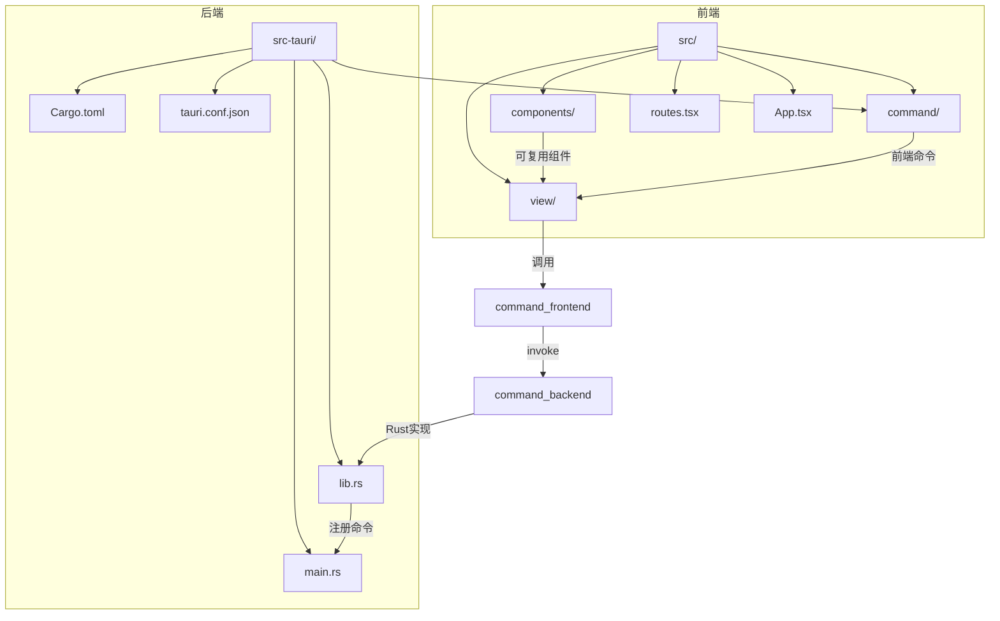

**图示来源**
- [README.md](file://README.md)
- [App.tsx](file://src/App.tsx)
- [routes.tsx](file://src/routes.tsx)
- [lib.rs](file://src-tauri/src/lib.rs)
- [main.rs](file://src-tauri/src/main.rs)

**本节来源**
- [README.md](file://README.md#L90-L114)
- [App.tsx](file://src/App.tsx#L1-L47)
- [routes.tsx](file://src/routes.tsx#L1-L242)

## 前端UI组件开发
在 devkimi 项目中，可复用的UI组件存放在 `src/component/` 目录下，这些组件遵循模块化设计原则，便于在不同功能页面中复用。

### 组件目录结构
```
src/component/
├── Config/           # 配置相关组件
│   ├── Input.tsx     # 输入框
│   ├── Option.tsx    # 配置选项
│   ├── Select.tsx    # 下拉选择
│   ├── Switch.tsx    # 开关组件
│   └── index.tsx     # 导出入口
├── Layout/           # 布局组件
│   ├── Breadcrumbs.tsx
│   ├── Content.tsx
│   ├── Menu.tsx
│   ├── Siderbar.tsx
│   └── index.tsx
├── Buttons.tsx       # 按钮组件
├── Container.tsx     # 容器组件
├── Editor.tsx        # 编辑器组件
├── Logo.tsx          # Logo组件
└── NotFound.tsx      # 404页面
```

### 核心组件分析
devkimi 的UI组件设计注重可复用性和一致性，主要包含以下几类：

#### 配置组件 (Config)
配置组件用于构建功能页面的配置区域，提供统一的UI风格。

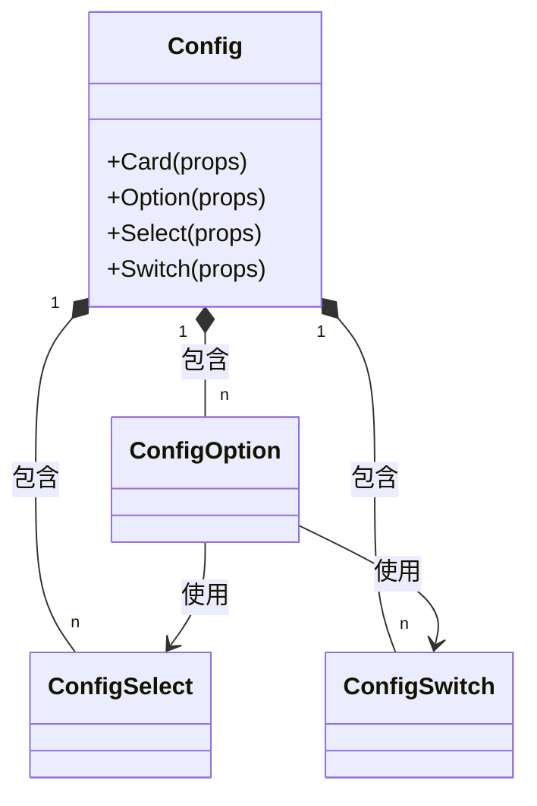

**图示来源**
- [Config](file://src/component/Config)
- [Buttons.tsx](file://src/component/Buttons.tsx#L1-L191)

#### 按钮组件 (Buttons)
按钮组件封装了常用的操作功能，如复制、粘贴、保存等。

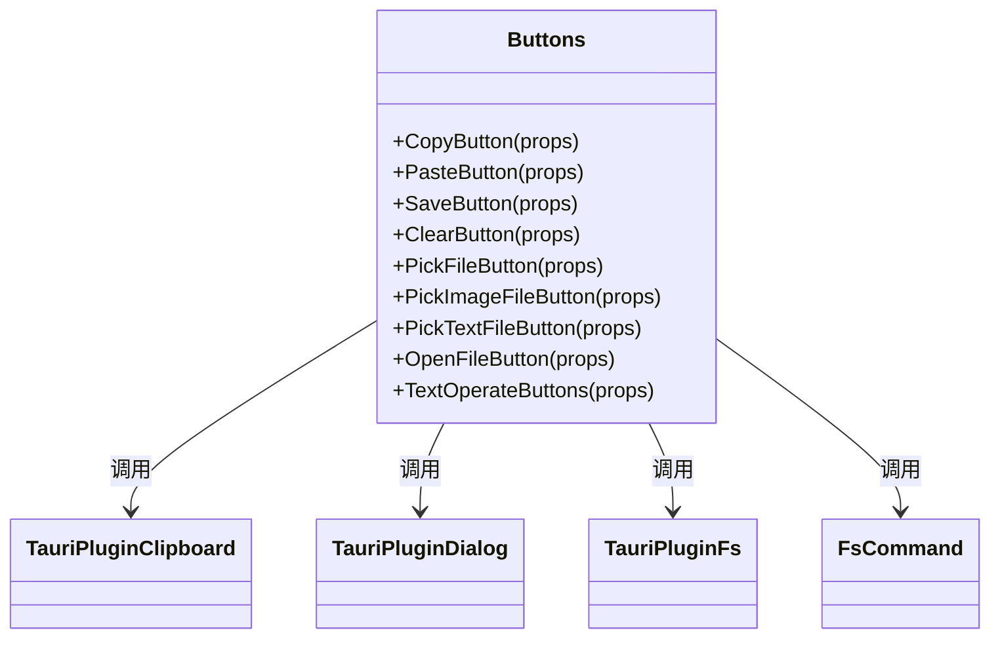

**图示来源**
- [Buttons.tsx](file://src/component/Buttons.tsx#L1-L191)
- [fs.rs](file://src-tauri/src/command/fs.rs#L1-L34)

#### 容器与布局组件
容器和布局组件提供了页面的基本结构框架。

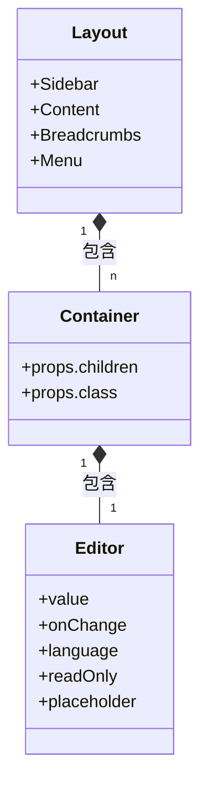

**图示来源**
- [Layout](file://src/component/Layout)
- [Container.tsx](file://src/component/Container.tsx)
- [Editor.tsx](file://src/component/Editor.tsx)

**本节来源**
- [Buttons.tsx](file://src/component/Buttons.tsx#L1-L191)
- [Config](file://src/component/Config)
- [Container.tsx](file://src/component/Container.tsx)
- [Editor.tsx](file://src/component/Editor.tsx)
- [Layout](file://src/component/Layout)

## 功能页面构建
功能页面存放在 `src/view/` 目录下，按照功能模块进行组织，每个功能模块对应一个子目录。

### 页面目录结构
```
src/view/
├── codec/               # 编解码工具
│   ├── base64_image.tsx
│   ├── base64_text.tsx
│   ├── gzip.tsx
│   ├── qrcode.tsx
│   └── url.tsx
├── converter/           # 转换器
│   ├── cron.tsx
│   ├── json_yaml.tsx
│   └── yaml_properties.tsx
├── crypto/              # 加解密
│   └── rsa.tsx
├── formatter/           # 格式化工具
│   ├── json.tsx
│   ├── sql.tsx
│   └── xml.tsx
├── generator/           # 生成器
│   ├── hash.tsx
│   ├── password.tsx
│   └── uuid.tsx
├── network/             # 网络工具
│   ├── grpc.tsx
│   └── http.tsx
├── text/                # 文本工具
│   ├── jsonpath.tsx
│   ├── markdown.tsx
│   └── regex.tsx
├── home.tsx            # 主页
└── settings.tsx        # 设置页面
```

### 页面实现模式
以 JSON 格式化页面为例，分析功能页面的实现模式。

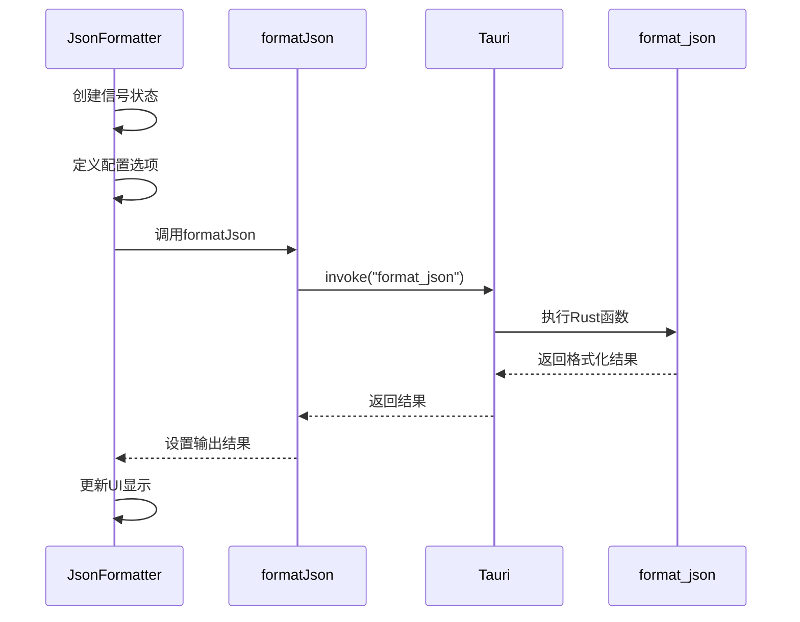

**图示来源**
- [json.tsx](file://src/view/formatter/json.tsx#L1-L91)
- [json.ts](file://src/command/formatter/json.ts#L1-L8)
- [json.rs](file://src-tauri/src/command/formatter/json.rs#L1-L39)

### 页面路由配置
所有功能页面的路由配置在 `src/routes.tsx` 文件中统一管理。

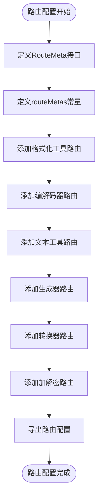

**图示来源**
- [routes.tsx](file://src/routes.tsx#L1-L242)
- [App.tsx](file://src/App.tsx#L1-L47)

**本节来源**
- [json.tsx](file://src/view/formatter/json.tsx#L1-L91)
- [base64_text.tsx](file://src/view/codec/base64_text.tsx#L1-L111)
- [home.tsx](file://src/view/home.tsx#L1-L47)
- [routes.tsx](file://src/routes.tsx#L1-L242)

## 后端Rust命令实现
后端Rust命令实现在 `src-tauri/src/command/` 目录下，按照功能模块进行组织。

### 命令目录结构
```
src-tauri/src/command/
├── codec/
│   ├── base64_image.rs
│   ├── base64_text.rs
│   ├── gzip.rs
│   ├── qrcode.rs
│   └── url.rs
├── converter/
│   ├── cron.rs
│   ├── json_yaml.rs
│   └── yaml_properties.rs
├── crypto/
│   └── rsa.rs
├── formatter/
│   ├── json.rs
│   ├── sql.rs
│   └── xml.rs
├── generator/
│   ├── hash.rs
│   ├── password.rs
│   └── uuid.rs
├── text/
│   ├── jsonpath.rs
│   ├── markdown.rs
│   └── regex.rs
├── font.rs
├── fs.rs
└── mod.rs
```

### 命令实现模式
以 Base64 文本编解码为例，分析Rust命令的实现模式。

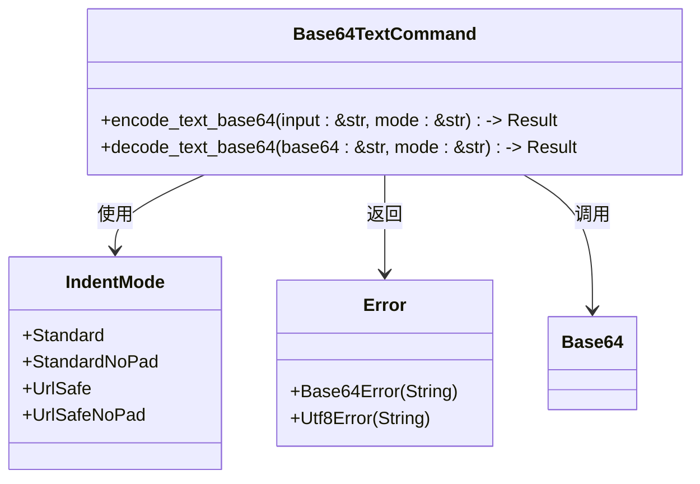

**图示来源**
- [base64_text.rs](file://src-tauri/src/command/codec/base64_text.rs)
- [json.rs](file://src-tauri/src/command/formatter/json.rs#L1-L39)

### 命令注册机制
所有Rust命令在 `src-tauri/src/lib.rs` 中通过 `tauri::generate_handler!` 宏进行注册。

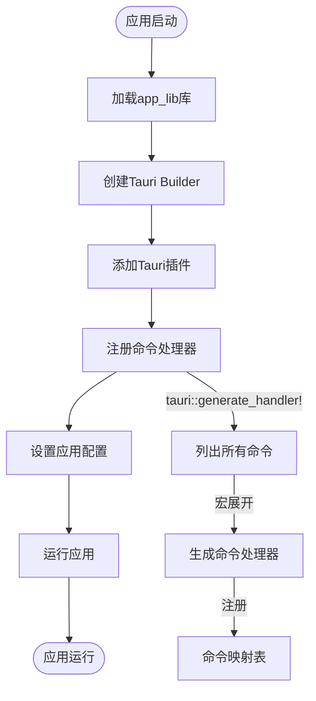

**图示来源**
- [lib.rs](file://src-tauri/src/lib.rs#L1-L57)
- [Cargo.toml](file://src-tauri/Cargo.toml#L1-L69)

**本节来源**
- [lib.rs](file://src-tauri/src/lib.rs#L1-L57)
- [json.rs](file://src-tauri/src/command/formatter/json.rs#L1-L39)
- [base64_text.rs](file://src-tauri/src/command/codec/base64_text.rs)
- [qrcode.rs](file://src-tauri/src/command/codec/qrcode.rs)
- [markdown.rs](file://src-tauri/src/command/text/markdown.rs)
- [Cargo.toml](file://src-tauri/Cargo.toml#L1-L69)

## Tauri前后端绑定
Tauri 提供了前后端通信机制，前端通过 `invoke` 调用后端命令，实现原生功能。

### 绑定流程
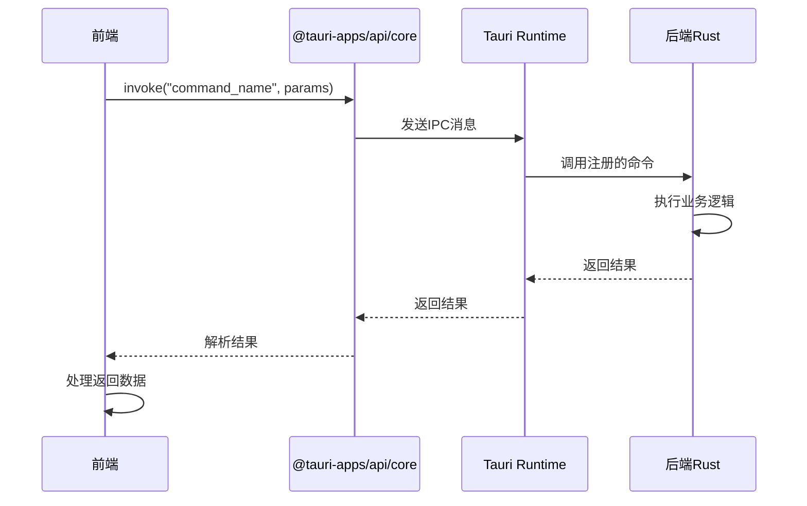

### 前端命令封装
前端命令封装在 `src/command/` 目录下，为每个功能模块提供TypeScript接口。

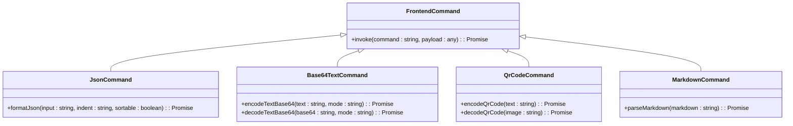

**图示来源**
- [json.ts](file://src/command/formatter/json.ts#L1-L8)
- [base64_text.ts](file://src/command/codec/base64_text.ts#L1-L17)
- [qrcode.ts](file://src/command/codec/qrcode.ts#L1-L11)
- [markdown.ts](file://src/command/text/markdown.ts#L1-L7)

### 命名规范
Tauri 前后端命令遵循统一的命名规范，确保调用的一致性。

| 前端调用 | 后端实现 | 说明 |
|---------|---------|------|
| formatJson | format_json | 驼峰命名转下划线 |
| encodeTextBase64 | encode_text_base64 | 驼峰命名转下划线 |
| decodeTextBase64 | decode_text_base64 | 驼峰命名转下划线 |
| encodeQrCode | encode_qrcode | 驼峰命名转下划线 |
| parseMarkdown | parse_markdown | 驼峰命名转下划线 |

**本节来源**
- [json.ts](file://src/command/formatter/json.ts#L1-L8)
- [base64_text.ts](file://src/command/codec/base64_text.ts#L1-L17)
- [qrcode.ts](file://src/command/codec/qrcode.ts#L1-L11)
- [markdown.ts](file://src/command/text/markdown.ts#L1-L7)
- [lib.rs](file://src-tauri/src/lib.rs#L1-L57)

## 数据流完整示例
以 Base64 文本编解码功能为例，展示从用户界面交互到后端处理并返回结果的完整数据流。

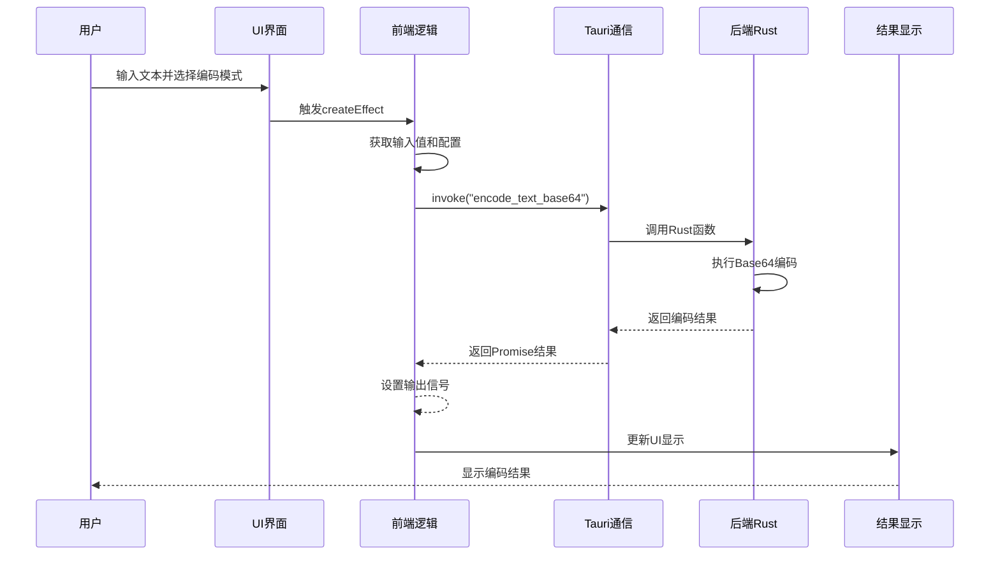

### 详细步骤说明
1. **用户交互**: 用户在UI界面输入文本并选择编码模式
2. **前端处理**: 前端组件通过SolidJS的信号系统捕获用户输入
3. **命令调用**: 前端命令模块通过`invoke`调用后端Rust命令
4. **后端执行**: Tauri运行时调用注册的Rust函数执行业务逻辑
5. **结果返回**: 后端处理完成后将结果返回给前端
6. **UI更新**: 前端接收到结果后更新UI显示

**图示来源**
- [base64_text.tsx](file://src/view/codec/base64_text.tsx#L1-L111)
- [base64_text.ts](file://src/command/codec/base64_text.ts#L1-L17)
- [base64_text.rs](file://src-tauri/src/command/codec/base64_text.rs)

## 功能测试与集成验证
为确保新功能稳定可靠，需要进行完整的功能测试和集成验证。

### 测试策略
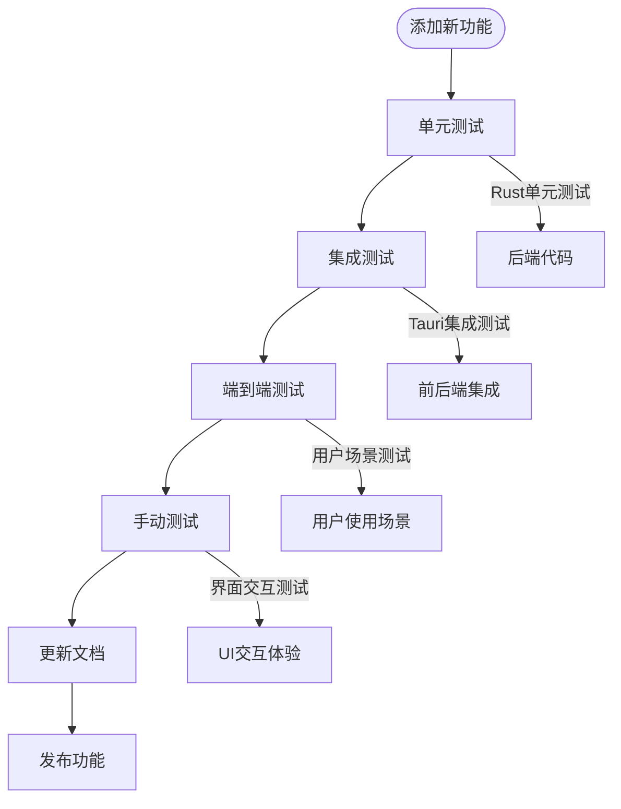

### 测试要点
1. **功能正确性**: 验证新功能的业务逻辑是否正确实现
2. **边界条件**: 测试各种边界条件和异常情况的处理
3. **性能表现**: 评估功能的性能表现，确保响应速度
4. **用户体验**: 验证UI交互是否流畅，符合用户预期
5. **兼容性**: 测试在不同环境下的兼容性表现

### 验证流程
1. **本地开发测试**: 在开发环境中进行初步功能验证
2. **跨平台测试**: 在不同操作系统上测试功能表现
3. **性能基准测试**: 对关键功能进行性能基准测试
4. **用户反馈测试**: 收集早期用户反馈并进行优化
5. **正式发布验证**: 在发布前进行全面的回归测试

**本节来源**
- [README.md](file://README.md#L56-L88)
- [package.json](file://package.json#L1-L43)
- [tauri.conf.json](file://src-tauri/tauri.conf.json#L1-L46)

## 结论
在 devkimi 项目中添加新功能需要遵循完整的开发流程，从前端UI组件开发到后端Rust命令实现，再到Tauri前后端绑定和功能测试验证。通过模块化的组件设计、清晰的目录结构和统一的通信机制，确保新功能能够稳定可靠地集成到现有系统中。开发者应遵循项目的架构规范和编码标准，确保代码质量和可维护性。