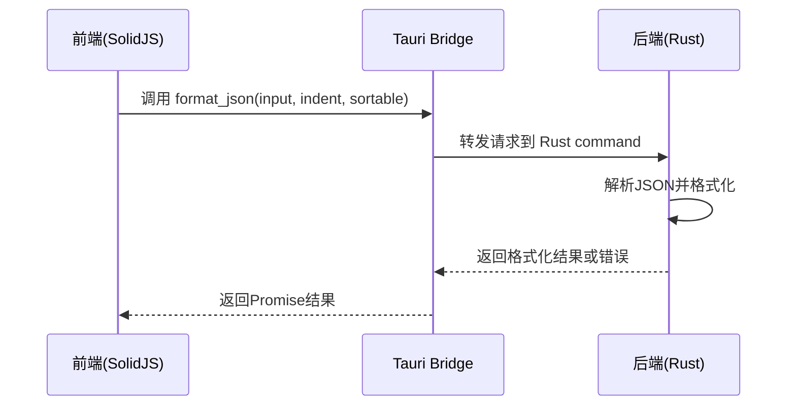
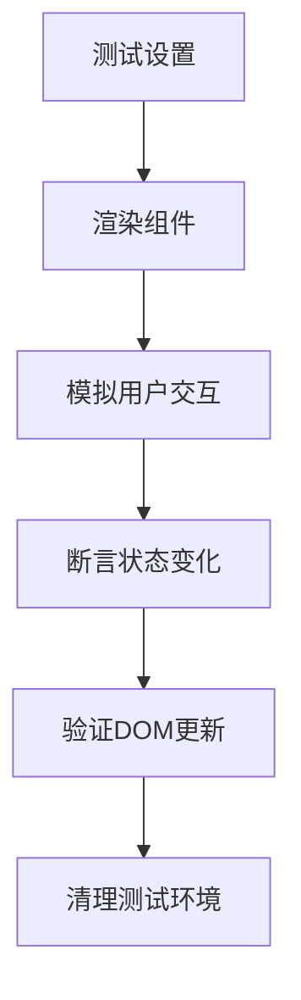
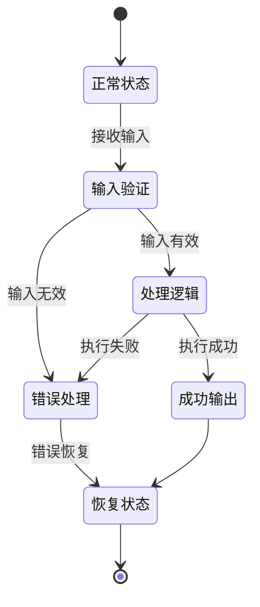
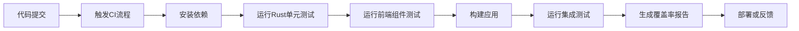

# 测试策略

<cite>
**本文档引用的文件**  
- [base64_text.rs](file://src-tauri/src/command/codec/base64_text.rs)
- [json.rs](file://src-tauri/src/command/formatter/json.rs)
- [uuid.rs](file://src-tauri/src/command/generator/uuid.rs)
- [markdown.rs](file://src-tauri/src/command/text/markdown.rs)
- [json_yaml.rs](file://src-tauri/src/command/converter/json_yaml.rs)
- [Cargo.toml](file://src-tauri/Cargo.toml)
- [lib.rs](file://src-tauri/src/lib.rs)
- [App.tsx](file://src/App.tsx)
- [home.tsx](file://src/view/home.tsx)
- [vite.config.ts](file://vite.config.ts)
</cite>

## 目录
1. [引言](#引言)
2. [单元测试策略](#单元测试策略)
3. [集成测试方案](#集成测试方案)
4. [前端组件测试](#前端组件测试)
5. [异常与边界条件测试](#异常与边界条件测试)
6. [测试覆盖率与CI/CD集成](#测试覆盖率与cicd集成)
7. [性能与回归测试](#性能与回归测试)
8. [结论](#结论)

## 引言

devkimi 是一个基于 Tauri 和 SolidJS 构建的多功能开发者工具集，提供编解码、格式化、生成器、文本处理和转换器等五大功能模块。为确保系统的稳定性和可靠性，本文档制定了全面的测试策略，涵盖从单元测试到持续集成的完整测试体系。

## 单元测试策略

devkimi 的后端逻辑使用 Rust 实现，位于 `src-tauri/src/command` 目录下，按功能模块组织。每个模块（如 codec、formatter、generator 等）包含多个子模块，每个子模块实现特定功能。

Rust 的单元测试通过 `cargo test` 命令执行，测试代码通常与实现代码位于同一文件或 `tests` 目录中。对于核心功能如编解码、格式化和生成器，应编写详尽的单元测试以验证其正确性。

例如，`base64_text.rs` 模块中的 `encode_text_base64` 和 `decode_text_base64` 函数应测试各种输入场景，包括空字符串、特殊字符、非UTF-8数据等。类似地，`json.rs` 中的 `format_json` 函数需要测试不同缩进选项（TwoSpace、FourSpace、Tab、None）和排序功能。

**单元测试实施要点：**
- 使用 `#[cfg(test)]` 标记测试模块
- 为每个公共函数编写正向和负向测试用例
- 利用 `assert_eq!`、`assert_ne!` 等宏验证输出
- 测试错误处理路径，确保返回适当的错误类型

**Section sources**
- [base64_text.rs](file://src-tauri/src/command/codec/base64_text.rs#L7-L16)
- [json.rs](file://src-tauri/src/command/formatter/json.rs#L13-L24)
- [uuid.rs](file://src-tauri/src/command/generator/uuid.rs#L11-L30)

## 集成测试方案

集成测试重点关注前后端交互的正确性。Tauri 提供了 `tauri::test` 模块和相关工具，可用于模拟 command 调用并验证其行为。

测试流程如下：
1. 启动 Tauri 应用的测试实例
2. 通过 `invoke_handler` 调用后端 command
3. 验证返回结果是否符合预期

例如，可以编写集成测试来验证前端调用 `format_json` command 时，后端能否正确返回格式化后的 JSON 字符串。测试应覆盖各种配置组合，如不同缩进大小和排序选项。



**Diagram sources**
- [lib.rs](file://src-tauri/src/lib.rs#L11-L43)
- [json.rs](file://src-tauri/src/command/formatter/json.rs#L13-L24)

**Section sources**
- [lib.rs](file://src-tauri/src/lib.rs#L11-L43)
- [json.rs](file://src-tauri/src/command/formatter/json.rs#L13-L24)

## 前端组件测试

前端使用 SolidJS 框架构建，组件位于 `src/component` 和 `src/view` 目录下。推荐使用 Vitest 作为测试框架，结合 `@testing-library/solid` 进行组件测试。

测试策略包括：
- **单元测试**：测试单个组件的渲染和交互行为
- **集成测试**：测试组件组合和状态管理
- **快照测试**：捕获组件渲染输出，防止意外变更

例如，`Container.tsx` 组件应测试其是否正确应用了传递的 class 属性，`Switch.tsx` 应测试点击事件是否正确触发状态变更。



**Diagram sources**
- [App.tsx](file://src/App.tsx#L8-L46)
- [home.tsx](file://src/view/home.tsx#L6-L46)

**Section sources**
- [App.tsx](file://src/App.tsx#L8-L46)
- [home.tsx](file://src/view/home.tsx#L6-L46)

## 异常与边界条件测试

为确保系统的健壮性，必须充分测试异常情况和边界条件。这包括：

1. **输入验证**：
   - 空输入或 null 值
   - 超长字符串
   - 特殊字符和转义序列
   - 非法编码数据

2. **错误处理**：
   - JSON 解析错误
   - Base64 解码失败
   - 文件读取权限问题
   - 网络请求超时

3. **资源限制**：
   - 大文件处理
   - 内存使用峰值
   - 并发请求处理

例如，在 `decode_text_base64` 函数中，应测试无效 Base64 字符串的处理，确保返回适当的错误信息而非崩溃。



**Diagram sources**
- [base64_text.rs](file://src-tauri/src/command/codec/base64_text.rs#L12-L16)
- [json.rs](file://src-tauri/src/command/formatter/json.rs#L14-L24)

**Section sources**
- [base64_text.rs](file://src-tauri/src/command/codec/base64_text.rs#L12-L16)
- [json.rs](file://src-tauri/src/command/formatter/json.rs#L14-L24)

## 测试覆盖率与CI/CD集成

### 测试覆盖率评估

使用 `cargo-llvm-cov` 工具评估 Rust 代码的测试覆盖率：

```bash
cargo llvm-cov --html
```

该命令生成 HTML 格式的覆盖率报告，显示哪些代码行被测试覆盖。目标是核心模块达到 80% 以上的行覆盖率。

### CI/CD自动化测试

在 CI/CD 流程中集成自动化测试，确保每次提交都经过完整测试。基于项目配置，建议的 CI 流程如下：



**CI/CD配置要点：**
- 在 `vite.config.ts` 中配置测试环境
- 使用 `pnpm test` 运行前端测试
- 使用 `cargo test` 运行后端测试
- 将覆盖率报告上传至 Codecov 或类似服务

**Section sources**
- [Cargo.toml](file://src-tauri/Cargo.toml#L20-L58)
- [vite.config.ts](file://vite.config.ts#L1-L14)

## 性能与回归测试

### 性能测试

对关键功能进行性能基准测试，使用 Rust 的 `benches` 目录和 `criterion` 库：

```rust
#[cfg(test)]
mod benchmarks {
    use criterion::{black_box, criterion_group, criterion_main, Criterion};
    
    fn benchmark_format_json(c: &mut Criterion) {
        let input = black_box("{...}");
        c.bench_function("format_json", |b| b.iter(|| format_json(input, Indent::FourSpace, false)));
    }
    
    criterion_group!(benches, benchmark_format_json);
    criterion_main!(benches);
}
```

### 回归测试

建立回归测试套件，确保新功能不会破坏现有功能：
- 维护一组标准测试用例
- 每次发布前运行完整测试套件
- 使用快照测试捕获 UI 变更

**Section sources**
- [json.rs](file://src-tauri/src/command/formatter/json.rs#L13-L24)
- [uuid.rs](file://src-tauri/src/command/generator/uuid.rs#L11-L30)

## 结论

本测试策略为 devkimi 项目提供了全面的质量保障框架。通过实施严格的单元测试、集成测试和前端组件测试，结合 CI/CD 自动化和性能基准测试，可以确保应用的稳定性、可靠性和高性能。建议开发团队遵循此策略，在开发新功能时同步编写测试代码，形成良好的测试驱动开发文化。