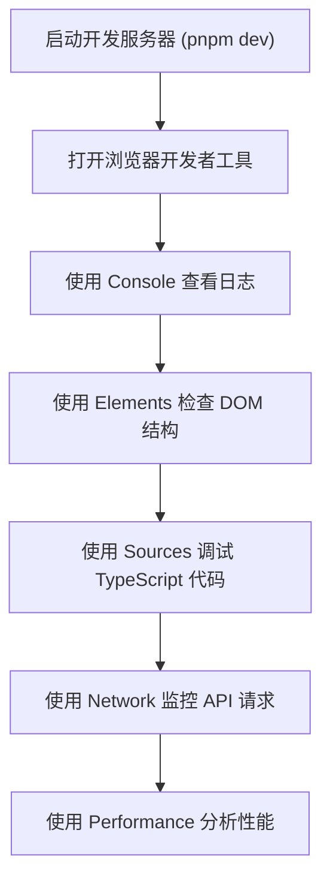
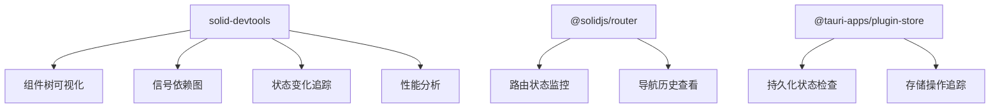
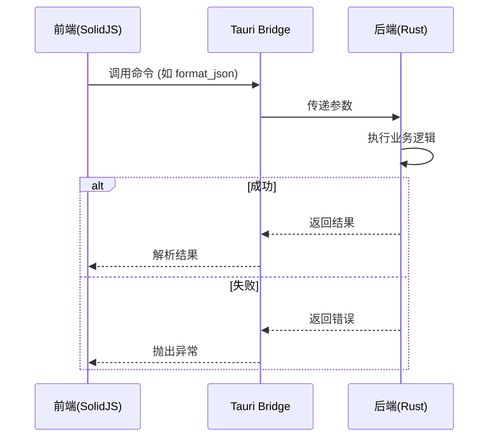
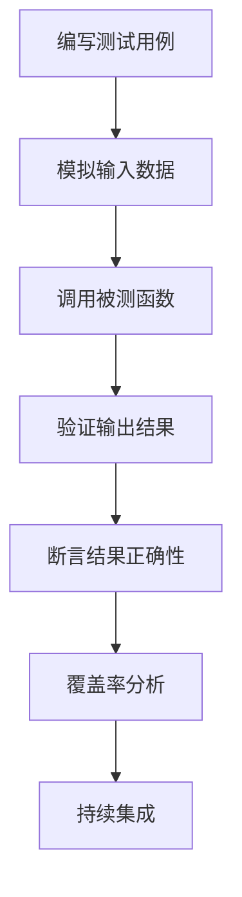
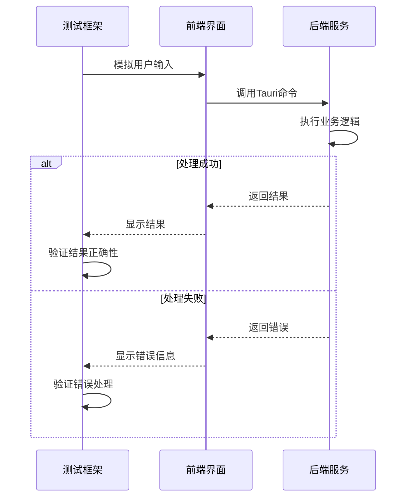
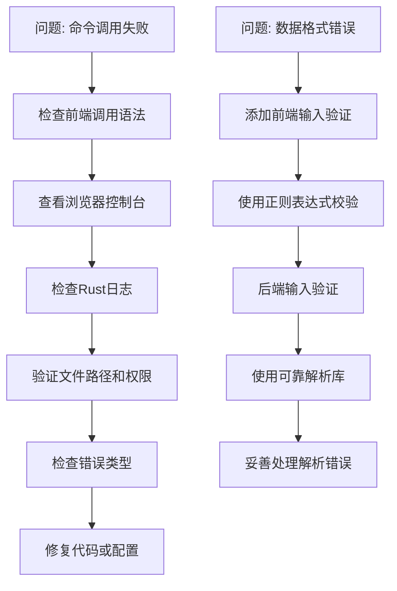
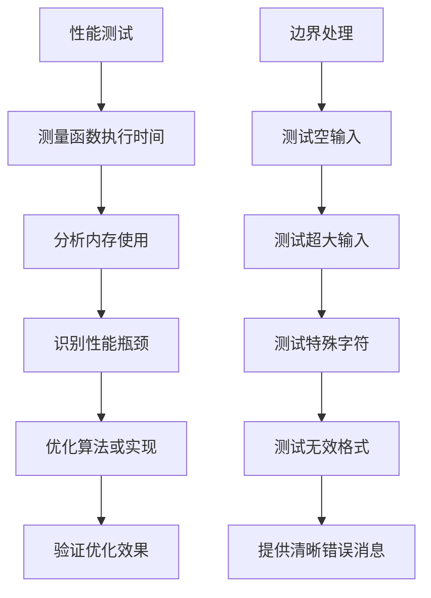

# 调试与测试

<cite>
**本文档中引用的文件**  
- [README.md](file://README.md)
- [package.json](file://package.json)
- [Cargo.toml](file://src-tauri/Cargo.toml)
- [tauri.conf.json](file://src-tauri/tauri.conf.json)
- [index.tsx](file://src/index.tsx)
- [App.tsx](file://src/App.tsx)
- [routes.tsx](file://src/routes.tsx)
- [store.tsx](file://src/store.tsx)
- [main.rs](file://src-tauri/src/main.rs)
- [lib.rs](file://src-tauri/src/lib.rs)
- [error.rs](file://src-tauri/src/error.rs)
- [fs.rs](file://src-tauri/src/command/fs.rs)
- [font.rs](file://src-tauri/src/command/font.rs)
</cite>

## 目录
1. [简介](#简介)
2. [前端调试技巧](#前端调试技巧)
3. [后端Rust代码调试](#后端rust代码调试)
4. [单元测试与集成测试](#单元测试与集成测试)
5. [常见问题排查](#常见问题排查)
6. [性能测试与边界处理](#性能测试与边界处理)
7. [自动化测试与持续集成](#自动化测试与持续集成)

## 简介

devkimi 是一个基于 Tauri 和 SolidJS 构建的多功能开发者工具集，提供编解码、格式化、生成器、文本处理和转换器等五大功能模块。本指南旨在为开发人员提供全面的调试和测试实践指导，涵盖前后端调试方法、测试策略、问题排查和最佳实践。

**Section sources**
- [README.md](file://README.md#L6-L15)

## 前端调试技巧

### 浏览器开发者工具使用

devkimi 使用 Vite 构建，支持热重载和现代浏览器调试功能。在开发模式下运行 `pnpm dev` 或 `pnpm tauri dev` 时，可以使用浏览器开发者工具进行调试。通过控制台可以查看应用日志、错误信息和性能数据。

前端代码使用 SolidJS 框架，其响应式系统可以通过开发者工具的组件树查看状态变化。在 `index.tsx` 中，项目已集成 `solid-devtools`，提供了专门的 SolidJS 调试支持，可以追踪信号（signals）和状态变化。



**Diagram sources**
- [package.json](file://package.json#L7-L11)
- [index.tsx](file://src/index.tsx#L2)

**Section sources**
- [index.tsx](file://src/index.tsx#L1-L37)
- [package.json](file://package.json#L7-L11)

### SolidJS 调试插件

devkimi 集成了 `solid-devtools` 插件，为 SolidJS 应用提供了增强的调试能力。该插件允许开发者查看组件树、信号依赖关系和状态变化历史。在开发过程中，可以通过此插件深入了解应用的响应式行为，快速定位状态管理问题。

应用的路由系统由 `@solidjs/router` 实现，状态管理使用 `@tauri-apps/plugin-store` 插件持久化设置。这些关键组件的状态变化都可以通过调试工具进行监控。



**Diagram sources**
- [package.json](file://package.json#L20)
- [App.tsx](file://src/App.tsx#L2)
- [store.tsx](file://src/store.tsx#L2)

**Section sources**
- [package.json](file://package.json#L20)
- [App.tsx](file://src/App.tsx#L1-L47)
- [store.tsx](file://src/store.tsx#L1-L88)

## 后端Rust代码调试

### Tauri 日志系统

devkimi 的后端基于 Rust 和 Tauri 框架构建。Tauri 提供了 `tauri-plugin-log` 插件用于日志记录。在 `lib.rs` 中，日志系统在调试模式下被启用，设置日志级别为 `Info`，这有助于跟踪命令调用和执行流程。

后端命令通过 `#[tauri::command]` 宏暴露给前端，所有命令调用都会被记录。错误处理使用 `thiserror` 库，提供了清晰的错误类型和消息，便于问题定位。



**Diagram sources**
- [lib.rs](file://src-tauri/src/lib.rs#L44-L53)
- [error.rs](file://src-tauri/src/error.rs#L1-L31)

**Section sources**
- [lib.rs](file://src-tauri/src/lib.rs#L44-L53)
- [error.rs](file://src-tauri/src/error.rs#L1-L31)

### Rust 调试器使用

对于复杂的逻辑错误，可以使用 Rust 调试器（如 `rust-gdb` 或 `rust-lldb`）进行调试。在 `Cargo.toml` 中，项目的 Rust 版本为 1.77.2，支持现代调试功能。通过在关键函数处设置断点，可以逐步执行代码，检查变量状态和调用栈。

后端命令组织在 `src-tauri/src/command` 目录下，按功能模块划分。每个命令模块都有清晰的错误定义，如 `fs.rs` 中定义了 `Io` 和 `InvalidFileName` 错误类型，便于调试时识别问题根源。

```mermaid
classDiagram
class Command {
<<trait>>
+execute()
}
class Error {
+Io(String)
+InvalidFileName(String)
+Font(String)
}
class Result~T,E~ {
+Ok(T)
+Err(E)
}
Command <|-- FormatJson
Command <|-- EncodeBase64
Command <|-- ParseCron
Result <|-- Command : : execute()
Error <|-- Result
```

**Diagram sources**
- [Cargo.toml](file://src-tauri/Cargo.toml#L9)
- [fs.rs](file://src-tauri/src/command/fs.rs#L30-L33)
- [font.rs](file://src-tauri/src/command/font.rs#L15-L17)

**Section sources**
- [Cargo.toml](file://src-tauri/Cargo.toml#L9)
- [fs.rs](file://src-tauri/src/command/fs.rs#L1-L34)
- [font.rs](file://src-tauri/src/command/font.rs#L1-L29)

## 单元测试与集成测试

### 单元测试策略

devkimi 的后端 Rust 代码包含单元测试，如 `font.rs` 中的 `test_get_system_fonts` 测试函数。这些测试验证单个函数的正确性，确保核心功能按预期工作。测试使用 Rust 内置的 `#[test]` 属性，可以通过 `cargo test` 命令运行。

前端 TypeScript 代码虽然没有显式的测试文件，但可以使用 Jest 或 Vitest 框架添加单元测试。建议为关键的工具函数（如编解码、格式化等）编写测试用例，确保功能的可靠性。



**Diagram sources**
- [font.rs](file://src-tauri/src/command/font.rs#L19-L28)

**Section sources**
- [font.rs](file://src-tauri/src/command/font.rs#L19-L28)

### 集成测试策略

前后端交互的测试是确保应用整体功能正确的关键。devkimi 使用 Tauri 的命令系统进行前后端通信，可以通过模拟前端调用来测试后端命令的完整执行流程。建议使用 Cypress 或 Playwright 等端到端测试框架，模拟用户操作，验证界面和功能的正确性。

对于命令调用失败的情况，应测试错误处理机制是否正常工作，确保用户能收到有意义的错误提示。数据格式错误的测试应覆盖各种边界情况，如空输入、超长字符串、特殊字符等。



**Diagram sources**
- [lib.rs](file://src-tauri/src/lib.rs#L11-L43)
- [routes.tsx](file://src/routes.tsx#L39-L237)

**Section sources**
- [lib.rs](file://src-tauri/src/lib.rs#L11-L43)
- [routes.tsx](file://src/routes.tsx#L39-L237)

## 常见问题排查

### 命令调用失败

当 Tauri 命令调用失败时，首先检查前端调用语法是否正确。确保命令名称与 `lib.rs` 中 `invoke_handler` 注册的名称完全匹配。其次，查看浏览器控制台和 Rust 日志，获取详细的错误信息。

对于文件操作相关的命令，检查文件路径是否有效，文件权限是否足够。如 `fs.rs` 中的 `copy_file` 函数，会验证源文件名的有效性，并在失败时返回 `InvalidFileName` 错误。

### 数据格式错误

数据格式错误通常发生在编解码、转换等操作中。建议在前端输入处添加数据验证，使用正则表达式或模式匹配确保输入符合预期格式。后端也应进行输入验证，如 `url.rs` 中的 URL 编解码函数应处理各种边缘情况。

对于 JSON、YAML 等结构化数据操作，使用可靠的解析库（如 `serde_json`、`serde_yaml`），并妥善处理解析错误，避免应用崩溃。



**Diagram sources**
- [lib.rs](file://src-tauri/src/lib.rs#L11-L43)
- [fs.rs](file://src-tauri/src/command/fs.rs#L17-L27)
- [Cargo.toml](file://src-tauri/Cargo.toml#L41-L43)

**Section sources**
- [lib.rs](file://src-tauri/src/lib.rs#L11-L43)
- [fs.rs](file://src-tauri/src/command/fs.rs#L1-L34)
- [Cargo.toml](file://src-tauri/Cargo.toml#L41-L43)

## 性能测试与边界处理

### 性能测试最佳实践

对于性能敏感的功能（如大文件压缩、复杂格式化），应进行性能测试。使用 Rust 的 `std::time` 模块测量关键函数的执行时间，识别性能瓶颈。对于前端，使用浏览器性能工具分析重渲染和内存使用情况。

建议设置性能基准，定期运行性能测试，确保优化不会引入回归。对于长时间运行的操作，考虑实现进度反馈和取消功能，提升用户体验。

### 边界情况处理

边界情况处理是确保应用健壮性的关键。应测试各种极端输入，如空字符串、超大文件、特殊字符、无效格式等。对于每个命令，定义明确的输入约束，并在文档中说明。

错误处理应提供有意义的错误消息，帮助用户理解问题所在。使用 `thiserror` 库的错误类型系统，可以为不同错误情况提供定制化的消息，便于调试和用户支持。



**Diagram sources**
- [lib.rs](file://src-tauri/src/lib.rs#L5)
- [Cargo.toml](file://src-tauri/Cargo.toml#L56)
- [error.rs](file://src-tauri/src/error.rs#L1-L31)

**Section sources**
- [lib.rs](file://src-tauri/src/lib.rs#L5)
- [Cargo.toml](file://src-tauri/Cargo.toml#L56)
- [error.rs](file://src-tauri/src/error.rs#L1-L31)

## 自动化测试与持续集成

### 自动化测试配置

建议在项目中添加自动化测试配置。对于前端，可以配置 Vitest 或 Jest 进行单元测试；对于后端，使用 Cargo 的内置测试功能。创建 `tests` 目录存放测试文件，编写覆盖核心功能的测试用例。

配置代码覆盖率工具（如 `tarpaulin`），确保测试覆盖率达到合理水平。将测试脚本添加到 `package.json` 的 scripts 中，便于团队成员统一执行。

### 持续集成流程

devkimi 已经在 README 中显示了构建状态徽章，表明已配置持续集成。建议使用 GitHub Actions 实现完整的 CI/CD 流程，包括代码检查、单元测试、集成测试、构建和发布。

CI 流程应包括：代码格式化检查（使用 Prettier）、类型检查（TypeScript）、前端测试、后端测试、构建应用和发布到 GitHub Releases。这确保了每次提交都经过全面验证，维护代码质量。


**Diagram sources**
- [package.json](file://package.json#L7-L11)
- [README.md](file://README.md#L4-L5)
- [Cargo.toml](file://src-tauri/Cargo.toml#L60-L69)

**Section sources**
- [package.json](file://package.json#L7-L11)
- [README.md](file://README.md#L4-L5)
- [Cargo.toml](file://src-tauri/Cargo.toml#L60-L69)