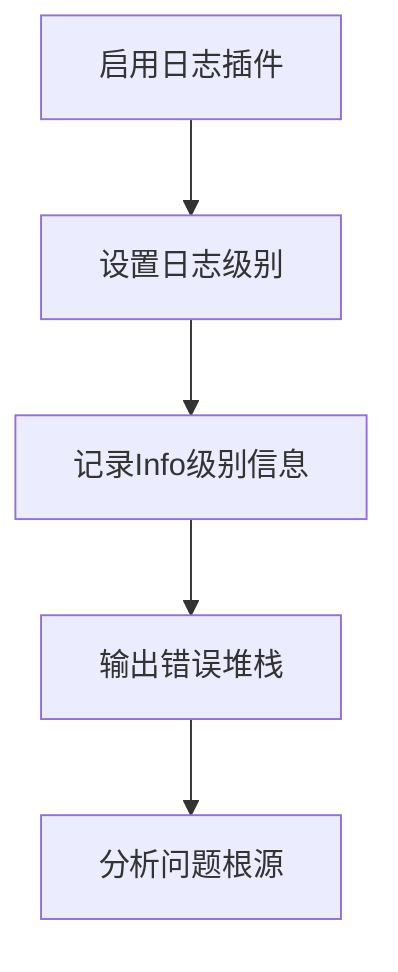
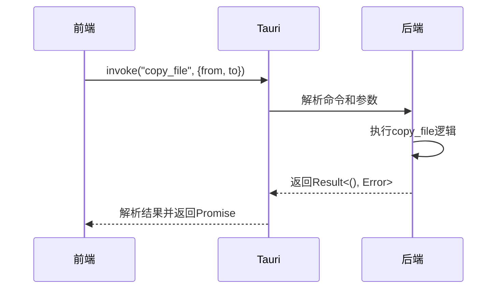
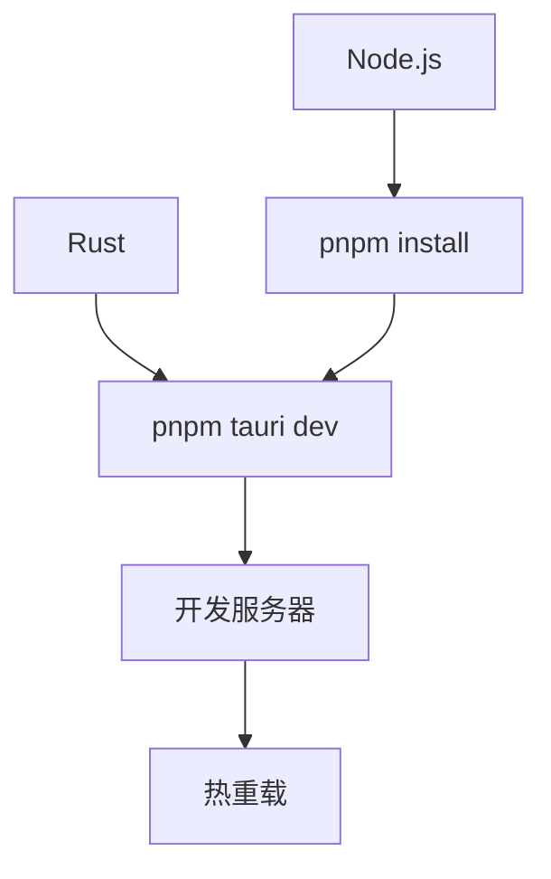

# 调试指南

<cite>
**本文档中引用的文件**  
- [index.tsx](file://src/index.tsx)
- [App.tsx](file://src/App.tsx)
- [store.tsx](file://src/store.tsx)
- [routes.tsx](file://src/routes.tsx)
- [fs.ts](file://src/command/fs.ts)
- [json.ts](file://src/command/formatter/json.ts)
- [fs.rs](file://src-tauri/src/command/fs.rs)
- [json.rs](file://src-tauri/src/command/formatter/json.rs)
- [lib.rs](file://src-tauri/src/lib.rs)
- [main.rs](file://src-tauri/src/main.rs)
- [tauri.conf.json](file://src-tauri/tauri.conf.json)
- [package.json](file://package.json)
- [vite.config.ts](file://vite.config.ts)
- [error.rs](file://src-tauri/src/error.rs)
</cite>

## 目录
1. [简介](#简介)
2. [前端调试方法](#前端调试方法)
3. [后端Rust代码调试技巧](#后端rust代码调试技巧)
4. [前后端通信调试策略](#前后端通信调试策略)
5. [常见调试场景解决方案](#常见调试场景解决方案)
6. [调试环境配置与最佳实践](#调试环境配置与最佳实践)

## 简介
devkimi 是一个基于 Tauri 和 SolidJS 构建的多功能开发者工具集，集成了编解码、格式化、生成器、文本处理和转换器等多种实用功能。本调试指南旨在为开发人员提供全面的调试支持，涵盖前端界面状态监控、SolidJS组件渲染问题排查、Tauri原生调用查看、Rust后端代码调试、日志系统使用以及前后端通信问题定位等方面的内容。通过本指南，开发者可以快速掌握项目调试的核心方法，提高开发效率和问题解决能力。

## 前端调试方法

### 使用浏览器开发者工具监控状态变化
devkimi 项目在开发模式下集成了 `solid-devtools`，可在浏览器开发者工具中直接查看 SolidJS 组件的状态变化和响应式依赖关系。在 `src/index.tsx` 文件中通过 `import "solid-devtools";` 引入了调试工具，使得开发者能够实时观察组件树结构、信号（Signal）值的变化以及组件的更新时机。

通过浏览器开发者工具的 Console 面板，可以监控应用中的各种日志输出，包括设置保存状态、错误信息等。例如，在 `store.tsx` 文件中，当设置发生变化时会输出 `"Settings saved successfully!"` 的调试信息，帮助开发者确认状态持久化是否正常工作。

**Section sources**
- [index.tsx](file://src/index.tsx#L2)
- [store.tsx](file://src/store.tsx#L62)

### 调试SolidJS组件渲染问题
SolidJS 的响应式系统基于信号（Signal）和效果（Effect），在调试组件渲染问题时，应重点关注 `createSignal`、`createEffect` 和 `createMemo` 等响应式原语的使用。在 `JsonFormatter` 组件中，通过 `createEffect` 监听输入值的变化并自动触发 JSON 格式化操作，这种模式可能导致不必要的重复渲染。

调试时可使用 `console.log` 在关键位置输出变量值，如在 `json.tsx` 文件的 `onChange` 回调中添加日志输出，以确认编辑器内容变化是否正确触发了状态更新。同时，注意检查依赖数组的完整性，确保 `createEffect` 仅在必要时执行。

**Section sources**
- [json.tsx](file://src/view/formatter/json.tsx#L70)
- [json.tsx](file://src/view/formatter/json.tsx#L25-L33)

### 通过Tauri DevTools查看原生调用
Tauri 提供了完整的 DevTools 支持，开发者可以在桌面应用中直接打开开发者工具查看原生调用情况。在开发模式下运行 `pnpm tauri dev` 启动应用后，可通过快捷键或右键菜单打开 DevTools，查看网络请求、控制台输出和源码调试信息。

通过 DevTools 的 Network 面板可以监控所有 Tauri 命令调用，每个命令调用都会显示为一个独立的请求，包含命令名称、参数和返回结果。这对于调试命令参数序列化问题、类型匹配错误等通信问题非常有帮助。

**Section sources**
- [tauri.conf.json](file://src-tauri/tauri.conf.json#L9)
- [package.json](file://package.json#L9)

## 后端Rust代码调试技巧

### 使用Rust Analyzer进行代码分析
Rust Analyzer 是推荐的 Rust 语言服务器，为 devkimi 项目提供智能代码补全、类型检查、引用查找和重构支持。在 VS Code 中安装 Rust Analyzer 扩展后，可以实时发现类型错误、未使用的变量和潜在的内存安全问题。

通过 Rust Analyzer 的 "Find All References" 和 "Go to Definition" 功能，可以快速导航到命令处理函数的实现，如 `format_json` 函数在 `json.rs` 文件中的定义。这有助于理解代码执行流程和数据类型转换过程。

**Section sources**
- [json.rs](file://src-tauri/src/command/formatter/json.rs#L14)
- [fs.rs](file://src-tauri/src/command/fs.rs#L9)

### 设置断点和查看变量状态
在调试 Rust 代码时，可以使用支持调试器的 IDE（如 VS Code 配合 CodeLLDB）设置断点并查看变量状态。在 `format_json` 函数中，可以在 `serde_json::from_str::<Value>(input)?` 这行设置断点，检查输入字符串的解析结果。

通过调试器可以查看 `value` 变量的完整结构，验证 JSON 对象排序功能是否正确执行。同时，可以检查 `indent` 参数的枚举值，确保前端传递的缩进选项被正确解析。

**Section sources**
- [json.rs](file://src-tauri/src/command/formatter/json.rs#L15)
- [json.rs](file://src-tauri/src/command/formatter/json.rs#L17)

### 利用Tauri的日志系统定位问题
devkimi 项目配置了 Tauri 的日志插件，在调试模式下会输出不同级别的日志信息。在 `lib.rs` 文件的 `setup` 函数中，通过 `tauri_plugin_log::Builder` 配置了日志级别为 `Info`，可以捕获重要的运行时信息。

日志系统帮助开发者追踪命令执行流程、错误发生位置和异常堆栈。例如，当文件操作失败时，`command_error!` 宏会生成包含详细错误信息的日志输出，便于快速定位问题根源。

**Diagram sources**
- [lib.rs](file://src-tauri/src/lib.rs#L46-L50)
- [error.rs](file://src-tauri/src/error.rs#L17-L30)

## 前后端通信调试策略

### Command调用的错误排查
devkimi 项目通过 Tauri 的 `invoke` 机制实现前后端通信。前端通过 `@tauri-apps/api/core` 的 `invoke` 函数调用后端命令，如 `fs.ts` 文件中的 `copyFile` 函数。调试通信问题时，首先需要确认命令名称是否匹配，参数类型是否正确。

在 `lib.rs` 文件中，所有可调用的命令都在 `tauri::generate_handler!` 宏中注册，必须确保前端调用的命令名称与注册名称完全一致。同时，检查参数的序列化是否正确，Rust 端的参数类型必须与前端传递的数据类型兼容。

**Diagram sources**
- [fs.ts](file://src/command/fs.ts#L10)
- [fs.rs](file://src-tauri/src/command/fs.rs#L17)
- [lib.rs](file://src-tauri/src/lib.rs#L11-L43)

### 参数序列化与类型匹配
前后端通信中的参数序列化问题常导致运行时错误。devkimi 项目使用 serde 进行数据序列化，在 Rust 端定义了清晰的数据类型，如 `Indent` 枚举类型。前端传递的参数必须能够被正确反序列化为对应的 Rust 类型。

调试时应检查 TypeScript 接口与 Rust 结构体的对应关系，确保字段名称和类型一致。对于复杂类型，可以添加调试日志输出序列化后的 JSON 字符串，验证数据结构是否符合预期。

**Section sources**
- [json.ts](file://src/command/formatter/json.ts#L3)
- [json.rs](file://src-tauri/src/command/formatter/json.rs#L5-L11)

### 错误处理机制
devkimi 项目实现了统一的错误处理机制，通过 `command_error!` 宏定义了命令层的错误类型。当后端命令执行失败时，错误会被转换为字符串消息返回给前端，前端可以通过 Promise 的 catch 分支捕获并显示错误信息。

在 `json.tsx` 文件中，`formatJson` 调用后的 catch 分支将错误信息显示在输出区域，提供了友好的用户反馈。这种错误处理模式既保证了应用的稳定性，又为调试提供了有价值的信息。

**Section sources**
- [json.tsx](file://src/view/formatter/json.tsx#L29)
- [error.rs](file://src-tauri/src/error.rs#L17-L30)

## 常见调试场景解决方案

### 命令无法调用
当遇到命令无法调用的问题时，首先检查命令名称是否在 `lib.rs` 的 `generate_handler!` 宏中正确注册。其次，确认前端 `invoke` 调用的命令名称拼写是否正确，参数对象的字段名称是否匹配。

使用浏览器开发者工具的 Console 面板查看是否有 "Command not found" 类似的错误信息。同时检查 `tauri.conf.json` 文件中的安全配置，确保没有 CSP 策略阻止命令调用。

**Section sources**
- [lib.rs](file://src-tauri/src/lib.rs#L11-L43)
- [tauri.conf.json](file://src-tauri/tauri.conf.json#L24-L32)

### 返回值异常
返回值异常通常由类型不匹配或序列化错误引起。在 Rust 端确保返回类型实现了 `Serialize` 特性，如 `String` 或 `Result<T, Error>`。使用调试器检查函数返回值的实际内容，确认数据结构是否符合预期。

在前端使用 `console.log` 输出返回结果，验证类型和值的正确性。对于复杂对象，检查是否需要自定义序列化逻辑或调整 serde 属性。

**Section sources**
- [json.rs](file://src-tauri/src/command/formatter/json.rs#L14)
- [json.tsx](file://src/view/formatter/json.tsx#L28)

### 异步处理问题
devkimi 项目中的命令调用都是异步的，使用 Promise 处理结果。常见的异步问题包括未正确处理错误、重复触发和竞态条件。在 `createEffect` 中调用命令时，应注意清理之前的异步操作，避免状态混乱。

使用 SolidJS 的 `onCleanup` 函数或信号的取消机制来管理异步操作的生命周期。对于用户频繁触发的操作，考虑添加防抖（debounce）机制，减少不必要的后端调用。

**Section sources**
- [json.tsx](file://src/view/formatter/json.tsx#L25-L33)
- [store.tsx](file://src/store.tsx#L56-L65)

## 调试环境配置与最佳实践

### 开发环境配置
devkimi 项目使用 Vite 作为构建工具，在 `vite.config.ts` 文件中配置了 SolidJS 插件和 TailwindCSS 支持。开发环境通过 `pnpm dev` 命令启动，会自动打开浏览器并启用热重载功能。

确保已安装 Node.js LTS 版本、Rust 最新稳定版和 pnpm 包管理器。通过 `pnpm install` 安装所有依赖后，即可使用 `pnpm tauri dev` 启动完整的桌面应用开发环境。

**Diagram sources**
- [vite.config.ts](file://vite.config.ts#L6-L14)
- [package.json](file://package.json#L9)

### 最佳实践
1. **启用 solid-devtools**：在开发过程中保持开发者工具启用，实时监控组件状态变化。
2. **合理使用日志**：在关键路径添加适当的日志输出，但避免在生产环境中输出敏感信息。
3. **类型安全通信**：确保前后端通信的数据结构有明确的类型定义，减少序列化错误。
4. **错误边界处理**：在 UI 层面添加错误边界，防止单个功能的错误影响整个应用。
5. **性能监控**：对于耗时操作，添加执行时间监控，及时发现性能瓶颈。

遵循这些最佳实践可以帮助开发者更高效地调试和维护 devkimi 项目，确保代码质量和用户体验。

**Section sources**
- [index.tsx](file://src/index.tsx#L2)
- [lib.rs](file://src-tauri/src/lib.rs#L46-L50)
- [store.tsx](file://src/store.tsx#L62)