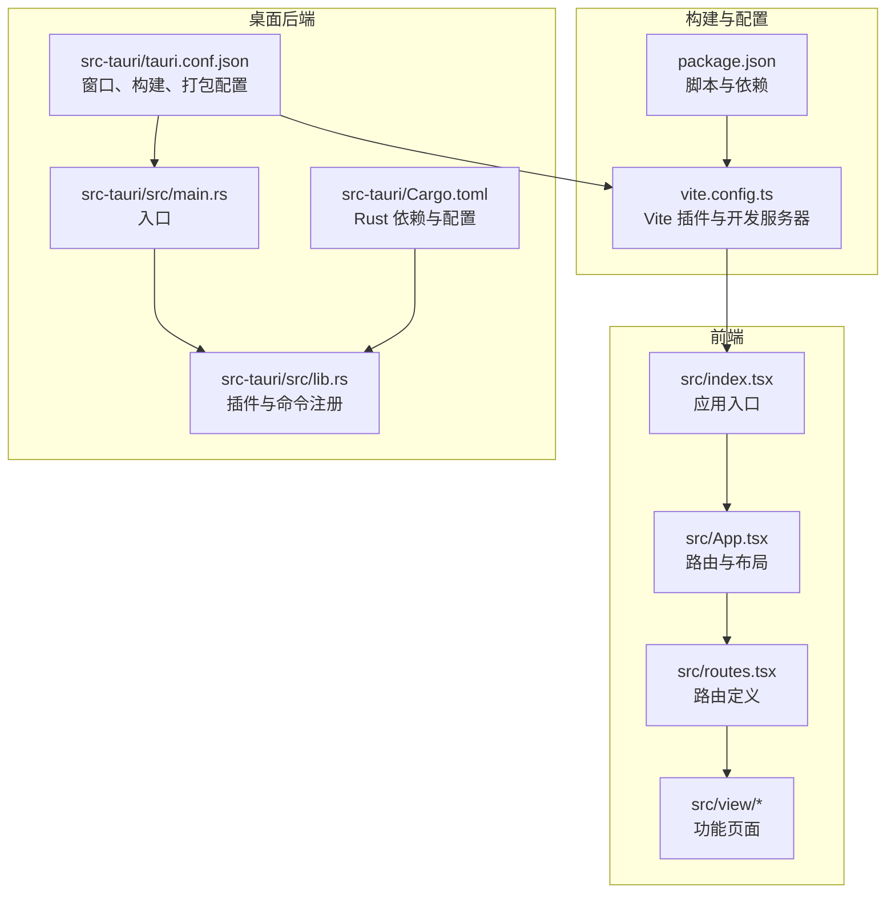
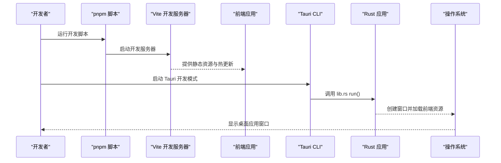
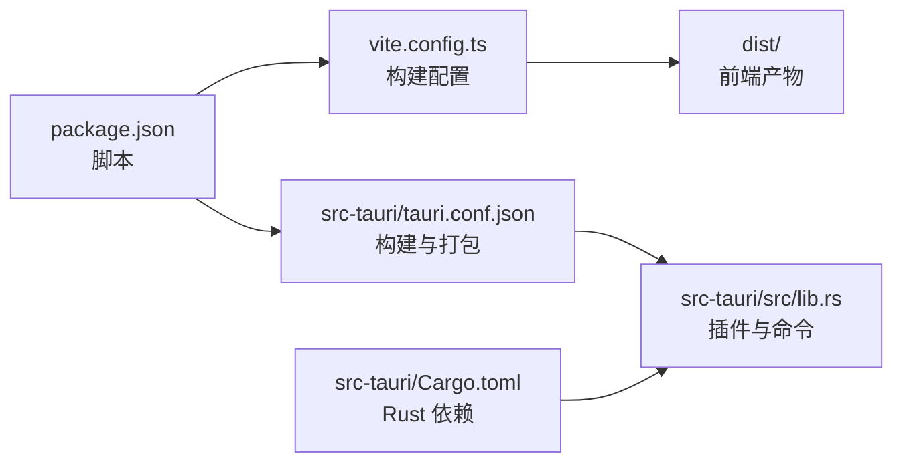

# 快速开始

<cite>
**本文引用的文件列表**
- [README.md](file://README.md)
- [package.json](file://package.json)
- [vite.config.ts](file://vite.config.ts)
- [src-tauri/tauri.conf.json](file://src-tauri/tauri.conf.json)
- [src-tauri/Cargo.toml](file://src-tauri/Cargo.toml)
- [src/index.tsx](file://src/index.tsx)
- [src/App.tsx](file://src/App.tsx)
- [src/routes.tsx](file://src/routes.tsx)
- [src/view/home.tsx](file://src/view/home.tsx)
- [src/view/codec/base64_text.tsx](file://src/view/codec/base64_text.tsx)
- [src/view/formatter/json.tsx](file://src/view/formatter/json.tsx)
- [src-tauri/src/main.rs](file://src-tauri/src/main.rs)
- [src-tauri/src/lib.rs](file://src-tauri/src/lib.rs)
</cite>

## 目录
1. [简介](#简介)
2. [项目结构](#项目结构)
3. [核心组件](#核心组件)
4. [架构总览](#架构总览)
5. [详细组件分析](#详细组件分析)
6. [依赖关系分析](#依赖关系分析)
7. [性能注意事项](#性能注意事项)
8. [故障排查指南](#故障排查指南)
9. [结论](#结论)
10. [附录](#附录)

## 简介
本指南面向初学者，帮助你在本地快速搭建 devkimi 的开发环境，并完成从安装依赖到启动开发模式再到构建桌面应用的全流程。devkimi 是一个基于 Tauri 与 SolidJS 的跨平台桌面工具集，提供编解码、格式化、生成器、文本处理、转换器与加解密等功能模块。你将学会：
- 环境要求与安装准备（Node.js、Rust、pnpm）
- 安装依赖与启动开发模式
- 构建前端与打包桌面应用
- 理解关键配置文件的作用与技术原理

## 项目结构
devkimi 采用“前端 + Tauri 后端”的双层架构：
- 前端：SolidJS + Vite + TailwindCSS/DaisyUI，位于 src/ 与根目录配置文件中
- 桌面后端：Rust（Tauri）位于 src-tauri/，包含配置与命令实现
- 构建与打包：通过 Vite 构建前端资源，再由 Tauri 将前端产物打包为桌面应用

图表来源
- [src/index.tsx](file://src/index.tsx#L1-L37)
- [src/App.tsx](file://src/App.tsx#L1-L47)
- [src/routes.tsx](file://src/routes.tsx#L1-L223)
- [vite.config.ts](file://vite.config.ts#L1-L15)
- [package.json](file://package.json#L1-L43)
- [src-tauri/src/main.rs](file://src-tauri/src/main.rs#L1-L7)
- [src-tauri/src/lib.rs](file://src-tauri/src/lib.rs#L1-L57)
- [src-tauri/tauri.conf.json](file://src-tauri/tauri.conf.json#L1-L46)
- [src-tauri/Cargo.toml](file://src-tauri/Cargo.toml#L1-L69)

章节来源
- [README.md](file://README.md#L56-L114)
- [src/index.tsx](file://src/index.tsx#L1-L37)
- [src/App.tsx](file://src/App.tsx#L1-L47)
- [src/routes.tsx](file://src/routes.tsx#L1-L223)
- [vite.config.ts](file://vite.config.ts#L1-L15)
- [package.json](file://package.json#L1-L43)
- [src-tauri/tauri.conf.json](file://src-tauri/tauri.conf.json#L1-L46)
- [src-tauri/Cargo.toml](file://src-tauri/Cargo.toml#L1-L69)

## 核心组件
- 前端入口与渲染
  - 应用入口负责挂载根元素并渲染 App 组件，开发模式下启用 DevTools。
  - 参考路径：[src/index.tsx](file://src/index.tsx#L1-L37)
- 应用与路由
  - App 使用 Router 提供页面级布局与懒加载路由，StoreProvider 提供状态上下文。
  - 参考路径：[src/App.tsx](file://src/App.tsx#L1-L47)
- 路由定义
  - routes.tsx 定义了所有功能模块的导航与子路由，采用懒加载按需加载页面组件。
  - 参考路径：[src/routes.tsx](file://src/routes.tsx#L1-L223)
- 构建与开发服务器
  - vite.config.ts 配置了 Solid 插件、TailwindCSS、开发服务器端口与构建目标。
  - 参考路径：[vite.config.ts](file://vite.config.ts#L1-L15)
- 桌面后端入口与命令注册
  - main.rs 作为 Tauri 入口，调用 lib.rs 中的 run 函数；lib.rs 注册各类插件与命令处理器。
  - 参考路径：[src-tauri/src/main.rs](file://src-tauri/src/main.rs#L1-L7)、[src-tauri/src/lib.rs](file://src-tauri/src/lib.rs#L1-L57)
- Tauri 配置
  - tauri.conf.json 控制窗口尺寸、开发/构建流程、打包图标与安全策略。
  - 参考路径：[src-tauri/tauri.conf.json](file://src-tauri/tauri.conf.json#L1-L46)
- Rust 依赖与构建配置
  - Cargo.toml 定义了 Rust 语言版本、库类型、依赖与发布配置。
  - 参考路径：[src-tauri/Cargo.toml](file://src-tauri/Cargo.toml#L1-L69)

章节来源
- [src/index.tsx](file://src/index.tsx#L1-L37)
- [src/App.tsx](file://src/App.tsx#L1-L47)
- [src/routes.tsx](file://src/routes.tsx#L1-L223)
- [vite.config.ts](file://vite.config.ts#L1-L15)
- [src-tauri/src/main.rs](file://src-tauri/src/main.rs#L1-L7)
- [src-tauri/src/lib.rs](file://src-tauri/src/lib.rs#L1-L57)
- [src-tauri/tauri.conf.json](file://src-tauri/tauri.conf.json#L1-L46)
- [src-tauri/Cargo.toml](file://src-tauri/Cargo.toml#L1-L69)

## 架构总览
下面的序列图展示了从启动到运行的关键流程，包括前端开发服务器、Tauri 开发模式与桌面应用打包。

图表来源
- [package.json](file://package.json#L1-L43)
- [vite.config.ts](file://vite.config.ts#L1-L15)
- [src-tauri/tauri.conf.json](file://src-tauri/tauri.conf.json#L1-L46)
- [src-tauri/src/lib.rs](file://src-tauri/src/lib.rs#L1-L57)
- [src-tauri/src/main.rs](file://src-tauri/src/main.rs#L1-L7)

## 详细组件分析

### 环境要求与安装准备
- 环境要求
  - Node.js：建议使用 LTS 版本，用于运行 Vite 与前端依赖。
  - Rust：建议使用最新稳定版，用于编译 Tauri 应用。
  - pnpm：作为包管理器，统一依赖与脚本执行。
- 安装依赖
  - 在项目根目录执行安装命令，拉取前端与开发依赖。
  - 参考路径：[README.md](file://README.md#L64-L68)、[package.json](file://package.json#L1-L43)

章节来源
- [README.md](file://README.md#L58-L68)
- [package.json](file://package.json#L1-L43)

### 启动开发模式
- 方式一：仅启动前端开发服务器
  - 使用 Vite 提供的开发服务器，监听本地端口，支持热更新。
  - 参考路径：[vite.config.ts](file://vite.config.ts#L1-L15)、[package.json](file://package.json#L1-L43)
- 方式二：启动 Tauri 开发模式
  - Tauri 将自动在开发前执行构建前端资源的命令，并在本地端口启动前端服务。
  - 参考路径：[src-tauri/tauri.conf.json](file://src-tauri/tauri.conf.json#L1-L46)、[package.json](file://package.json#L1-L43)

章节来源
- [README.md](file://README.md#L70-L78)
- [vite.config.ts](file://vite.config.ts#L1-L15)
- [src-tauri/tauri.conf.json](file://src-tauri/tauri.conf.json#L1-L46)
- [package.json](file://package.json#L1-L43)

### 构建与打包桌面应用
- 构建前端资源
  - 使用 Vite 将前端代码打包至 dist 目录，供 Tauri 引用。
  - 参考路径：[vite.config.ts](file://vite.config.ts#L1-L15)、[package.json](file://package.json#L1-L43)
- 构建桌面应用
  - 使用 Tauri CLI 执行打包流程，读取 tauri.conf.json 中的构建配置与图标资源。
  - 参考路径：[src-tauri/tauri.conf.json](file://src-tauri/tauri.conf.json#L1-L46)、[package.json](file://package.json#L1-L43)

章节来源
- [README.md](file://README.md#L80-L88)
- [vite.config.ts](file://vite.config.ts#L1-L15)
- [src-tauri/tauri.conf.json](file://src-tauri/tauri.conf.json#L1-L46)
- [package.json](file://package.json#L1-L43)

### 关键配置文件详解

#### vite.config.ts
- 插件与开发服务器
  - 集成 Solid 插件、TailwindCSS 插件与开发工具插件，设置开发服务器端口。
  - 参考路径：[vite.config.ts](file://vite.config.ts#L1-L15)
- 构建目标
  - 目标为现代浏览器兼容的 ESNext，有利于减少打包体积与提升性能。
  - 参考路径：[vite.config.ts](file://vite.config.ts#L1-L15)

章节来源
- [vite.config.ts](file://vite.config.ts#L1-L15)

#### src-tauri/tauri.conf.json
- 构建与开发流程
  - beforeDevCommand：开发前先执行前端构建脚本。
  - beforeBuildCommand：打包前先执行前端构建脚本。
  - frontendDist：指向打包后的前端资源目录。
  - 参考路径：[src-tauri/tauri.conf.json](file://src-tauri/tauri.conf.json#L1-L46)
- 窗口与安全
  - 定义窗口尺寸、最小尺寸、是否可调整大小与全屏等属性。
  - 安全策略中启用了资源协议作用域与资产协议。
  - 参考路径：[src-tauri/tauri.conf.json](file://src-tauri/tauri.conf.json#L1-L46)

章节来源
- [src-tauri/tauri.conf.json](file://src-tauri/tauri.conf.json#L1-L46)

#### src-tauri/Cargo.toml
- 语言与版本
  - 指定 Rust 版本与语言特性，确保跨平台兼容性。
  - 参考路径：[src-tauri/Cargo.toml](file://src-tauri/Cargo.toml#L1-L69)
- 依赖与插件
  - 包含 Tauri 核心、常用插件（剪贴板、对话框、文件系统、日志、打开器、存储）与业务相关库（如加密、图像、正则、SQL 格式化等）。
  - 参考路径：[src-tauri/Cargo.toml](file://src-tauri/Cargo.toml#L1-L69)
- 发布配置
  - dev 与 release 配置分别控制增量编译、链接时优化、优化级别与符号剥离等。
  - 参考路径：[src-tauri/Cargo.toml](file://src-tauri/Cargo.toml#L60-L69)

章节来源
- [src-tauri/Cargo.toml](file://src-tauri/Cargo.toml#L1-L69)

### 功能模块与页面示例
- 主页与导航
  - home.tsx 通过遍历路由元数据生成功能模块卡片，点击跳转对应页面。
  - 参考路径：[src/view/home.tsx](file://src/view/home.tsx#L1-L47)、[src/routes.tsx](file://src/routes.tsx#L1-L223)
- 编解码示例：Base64 文本
  - base64_text.tsx 展示了输入/输出编辑器、配置开关与按钮操作，调用后端命令进行编码/解码。
  - 参考路径：[src/view/codec/base64_text.tsx](file://src/view/codec/base64_text.tsx#L1-L111)
- 格式化示例：JSON
  - json.tsx 展示了缩进与排序配置，调用后端命令格式化 JSON。
  - 参考路径：[src/view/formatter/json.tsx](file://src/view/formatter/json.tsx#L1-L91)

章节来源
- [src/view/home.tsx](file://src/view/home.tsx#L1-L47)
- [src/routes.tsx](file://src/routes.tsx#L1-L223)
- [src/view/codec/base64_text.tsx](file://src/view/codec/base64_text.tsx#L1-L111)
- [src/view/formatter/json.tsx](file://src/view/formatter/json.tsx#L1-L91)

## 依赖关系分析
- 前端依赖
  - SolidJS、@solidjs/router、@tauri-apps/api、TailwindCSS、DaisyUI、Monaco Editor 等。
  - 参考路径：[package.json](file://package.json#L1-L43)
- Tauri 插件与能力
  - lib.rs 中注册了存储、打开器、文件系统、剪贴板、对话框与日志插件，并暴露大量命令给前端调用。
  - 参考路径：[src-tauri/src/lib.rs](file://src-tauri/src/lib.rs#L1-L57)
- 构建链路
  - package.json 的脚本驱动 Vite 构建；tauri.conf.json 的 beforeBuildCommand 与 beforeDevCommand 决定打包与开发前的前置步骤。
  - 参考路径：[package.json](file://package.json#L1-L43)、[src-tauri/tauri.conf.json](file://src-tauri/tauri.conf.json#L1-L46)

图表来源
- [package.json](file://package.json#L1-L43)
- [vite.config.ts](file://vite.config.ts#L1-L15)
- [src-tauri/tauri.conf.json](file://src-tauri/tauri.conf.json#L1-L46)
- [src-tauri/src/lib.rs](file://src-tauri/src/lib.rs#L1-L57)
- [src-tauri/Cargo.toml](file://src-tauri/Cargo.toml#L1-L69)

章节来源
- [package.json](file://package.json#L1-L43)
- [src-tauri/src/lib.rs](file://src-tauri/src/lib.rs#L1-L57)
- [src-tauri/tauri.conf.json](file://src-tauri/tauri.conf.json#L1-L46)
- [src-tauri/Cargo.toml](file://src-tauri/Cargo.toml#L1-L69)

## 性能注意事项
- 构建目标
  - vite.config.ts 将构建目标设为现代浏览器兼容的 ESNext，有助于减小包体并提升加载性能。
  - 参考路径：[vite.config.ts](file://vite.config.ts#L1-L15)
- Rust 发布配置
  - Cargo.toml 的 release 配置启用 LTO、优化级别与符号剥离，有助于减小二进制体积与提升运行效率。
  - 参考路径：[src-tauri/Cargo.toml](file://src-tauri/Cargo.toml#L60-L69)
- 插件与懒加载
  - 路由采用懒加载，减少初始包体；TailwindCSS 与 DaisyUI 通过插件按需引入，避免不必要的样式。
  - 参考路径：[src/routes.tsx](file://src/routes.tsx#L1-L223)、[vite.config.ts](file://vite.config.ts#L1-L15)

## 故障排查指南
- 前端无法启动或端口占用
  - 检查开发服务器端口是否被占用；可在 vite.config.ts 中修改端口。
  - 参考路径：[vite.config.ts](file://vite.config.ts#L1-L15)
- Tauri 开发模式无法加载前端资源
  - 确认 package.json 的构建脚本已正确执行；检查 tauri.conf.json 的 beforeDevCommand 与 beforeBuildCommand 是否可用。
  - 参考路径：[package.json](file://package.json#L1-L43)、[src-tauri/tauri.conf.json](file://src-tauri/tauri.conf.json#L1-L46)
- Rust 编译失败
  - 确认已安装 Rust 最新稳定版；检查 Cargo.toml 的 rust-version 与依赖版本是否匹配。
  - 参考路径：[src-tauri/Cargo.toml](file://src-tauri/Cargo.toml#L1-L69)
- 插件未生效
  - 确认 lib.rs 已注册所需插件；检查插件名称与版本是否与 Cargo.toml 一致。
  - 参考路径：[src-tauri/src/lib.rs](file://src-tauri/src/lib.rs#L1-L57)、[src-tauri/Cargo.toml](file://src-tauri/Cargo.toml#L1-L69)

章节来源
- [vite.config.ts](file://vite.config.ts#L1-L15)
- [package.json](file://package.json#L1-L43)
- [src-tauri/tauri.conf.json](file://src-tauri/tauri.conf.json#L1-L46)
- [src-tauri/Cargo.toml](file://src-tauri/Cargo.toml#L1-L69)
- [src-tauri/src/lib.rs](file://src-tauri/src/lib.rs#L1-L57)

## 结论
通过本指南，你可以顺利完成 devkimi 的环境搭建与开发流程。建议在熟悉基础流程后，逐步阅读各配置文件与命令实现，理解前端与 Rust 后端的协作机制，以便后续扩展更多功能模块与优化性能。

## 附录
- 常用命令
  - 安装依赖：参考路径：[README.md](file://README.md#L64-L68)、[package.json](file://package.json#L1-L43)
  - 启动开发服务器：参考路径：[README.md](file://README.md#L70-L78)、[package.json](file://package.json#L1-L43)
  - 构建前端资源：参考路径：[README.md](file://README.md#L80-L88)、[package.json](file://package.json#L1-L43)
  - 构建桌面应用：参考路径：[README.md](file://README.md#L80-L88)、[package.json](file://package.json#L1-L43)
- 配置文件速览
  - Vite：参考路径：[vite.config.ts](file://vite.config.ts#L1-L15)
  - Tauri：参考路径：[src-tauri/tauri.conf.json](file://src-tauri/tauri.conf.json#L1-L46)
  - Rust：参考路径：[src-tauri/Cargo.toml](file://src-tauri/Cargo.toml#L1-L69)