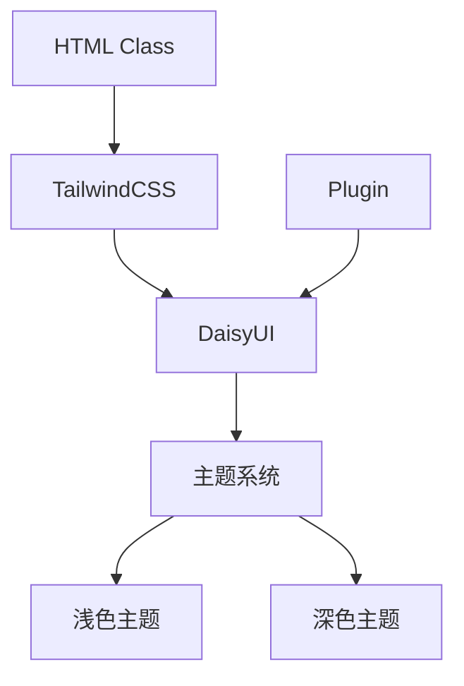
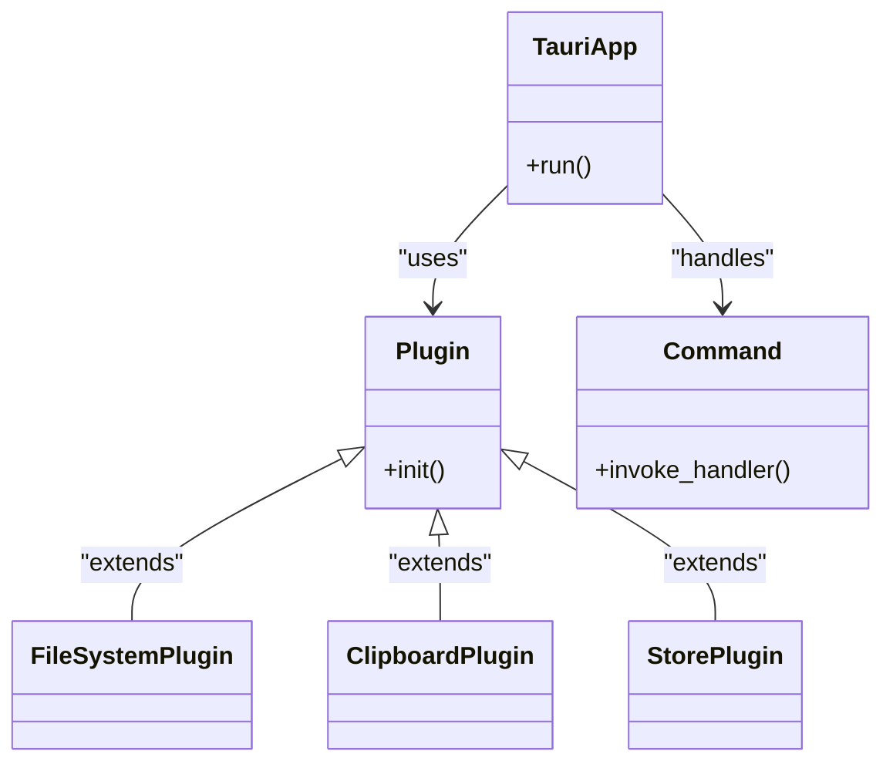
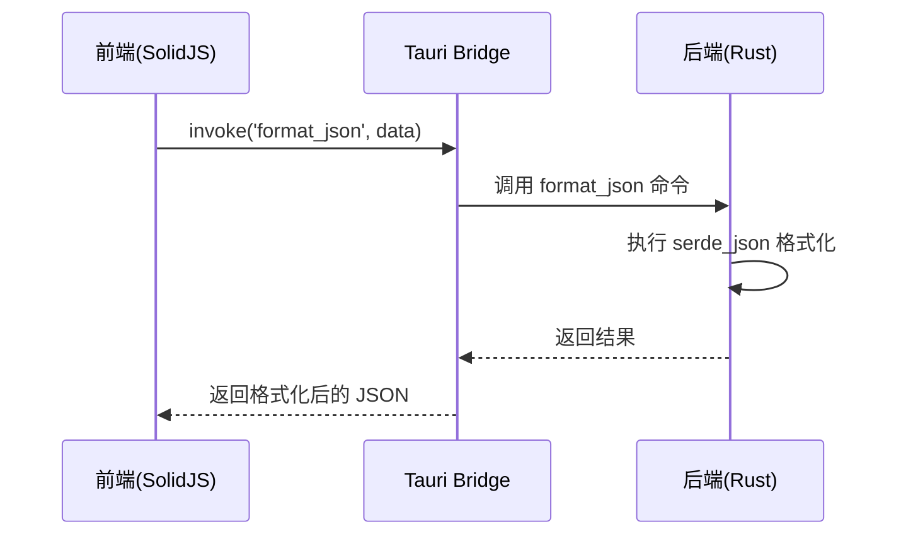

# 技术栈

<cite>
**本文档中引用的文件**  
- [package.json](file://package.json)
- [Cargo.toml](file://src-tauri/Cargo.toml)
- [vite.config.ts](file://vite.config.ts)
- [tsconfig.json](file://tsconfig.json)
- [index.tsx](file://src/index.tsx)
- [App.tsx](file://src/App.tsx)
- [routes.tsx](file://src/routes.tsx)
- [tauri.conf.json](file://src-tauri/tauri.conf.json)
- [index.css](file://src/index.css)
- [main.rs](file://src-tauri/src/main.rs)
- [lib.rs](file://src-tauri/src/lib.rs)
- [store.tsx](file://src/store.tsx)
</cite>

## 目录
1. [项目概述](#项目概述)
2. [前端技术栈](#前端技术栈)
3. [后端技术栈](#后端技术栈)
4. [构建工具与配置](#构建工具与配置)
5. [类型系统与代码质量](#类型系统与代码质量)
6. [架构协同与通信机制](#架构协同与通信机制)
7. [UI组件与主题系统](#ui组件与主题系统)
8. [状态管理与持久化](#状态管理与持久化)
9. [总结](#总结)

## 项目概述

devkimi 是一个基于 Tauri 框架构建的桌面应用程序，采用现代前端技术栈与 Rust 后端相结合的方式，实现了跨平台的本地应用开发。项目通过 SolidJS 构建响应式用户界面，利用 Tauri 提供的系统级访问能力，结合 Vite 作为构建工具，实现了快速开发与高效运行的平衡。应用功能涵盖格式化、编解码、文本处理、加密解密等多个开发者工具模块，体现了全栈技术的深度整合。

**Section sources**
- [package.json](file://package.json)
- [Cargo.toml](file://src-tauri/Cargo.toml)
- [index.html](file://index.html)

## 前端技术栈

### SolidJS 框架

项目采用 SolidJS 作为核心前端框架，这是一种高性能的声明式 JavaScript 库，具有细粒度响应式系统，能够在不使用虚拟 DOM 的情况下实现高效的 UI 更新。SolidJS 通过编译时优化将 JSX 转换为高效的原生 JavaScript 代码，显著提升了运行时性能。

路由系统由 `@solidjs/router` 提供支持，实现了基于组件的声明式路由配置。元数据管理通过 `@solidjs/meta` 实现，允许动态更新页面标题和元信息。状态管理结合了 SolidJS 内置的 `createStore` 和 `@solid-primitives/deep` 提供的深度追踪功能，确保复杂状态的高效更新。

**Section sources**
- [App.tsx](file://src/App.tsx)
- [routes.tsx](file://src/routes.tsx)
- [store.tsx](file://src/store.tsx)

### TailwindCSS 与 DaisyUI

项目使用 TailwindCSS 作为实用优先的 CSS 框架，结合 DaisyUI 组件库构建现代化的用户界面。TailwindCSS 提供了低级别的实用类，允许在 JSX 中直接编写样式，提高了开发效率和样式的可维护性。

DaisyUI 作为 TailwindCSS 的插件，提供了丰富的预设组件和主题系统，包括按钮、卡片、模态框等常用 UI 元素。项目在 `index.css` 中配置了 light 和 dark 两种主题，并通过 `data-theme` 属性实现动态切换。



**Diagram sources**
- [index.css](file://src/index.css)
- [tailwindcss](file://package.json#L14-L15)
- [daisyui](file://package.json#L17)

## 后端技术栈

### Tauri 框架

Tauri 是项目的核心后端框架，它允许使用 Rust 编写系统级代码，并通过安全的 API 与前端进行通信。Tauri 提供了轻量级的运行时，相比 Electron 显著减少了应用体积和内存占用。

在 `Cargo.toml` 中，项目依赖 `tauri` 版本 2.9.1，并启用了 `protocol-asset` 功能以支持资源协议。Tauri 插件系统被广泛使用，包括文件系统访问、剪贴板管理、对话框、存储和打开文件等功能。



**Diagram sources**
- [Cargo.toml](file://src-tauri/Cargo.toml#L48-L54)
- [lib.rs](file://src-tauri/src/lib.rs#L6-L11)
- [tauri.conf.json](file://src-tauri/tauri.conf.json)

### Rust 生态系统

项目后端充分利用了 Rust 丰富的生态系统来实现各种功能：

- **base64**: 用于 Base64 编解码
- **flate2**: 提供 GZip 压缩/解压缩功能
- **qrcode**: 生成二维码图像
- **regex**: 正则表达式处理
- **serde**: 序列化/反序列化 JSON、YAML 数据
- **quick-xml**: XML 格式化
- **sqlformat**: SQL 语句格式化
- **rsa**: RSA 加密算法实现
- **uuid**: UUID 生成
- **cron**: Cron 表达式解析
- **markdown**: Markdown 解析

这些库通过 Tauri 的命令系统暴露给前端调用，形成了前后端功能的完整闭环。

**Section sources**
- [Cargo.toml](file://src-tauri/Cargo.toml#L21-L58)
- [lib.rs](file://src-tauri/src/lib.rs#L11-L43)
- [command](file://src-tauri/src/command)

## 构建工具与配置

### Vite 构建系统

Vite 作为项目的构建工具，在 `package.json` 中配置了开发和生产构建脚本。Vite 提供了快速的冷启动和热模块替换（HMR），极大地提升了开发体验。

`vite.config.ts` 配置文件中集成了多个关键插件：
- `vite-plugin-solid`: 支持 SolidJS 的编译
- `@tailwindcss/vite`: 集成 TailwindCSS
- `solid-devtools`: 提供开发调试工具

构建配置中设置了目标环境为 `esnext`，充分利用现代浏览器的最新特性。

```mermaid
flowchart LR
A[Vite] --> B[Solid Plugin]
A --> C[Tailwind Plugin]
A --> D[Devtools Plugin]
B --> E[JSX Compilation]
C --> F[CSS Generation]
D --> G[Debug Tools]
H[Source Code] --> A
I[Build Output] <-- A
```

**Diagram sources**
- [vite.config.ts](file://vite.config.ts)
- [package.json](file://package.json#L8-L11)

### Tauri 构建配置

`tauri.conf.json` 文件定义了应用的构建和运行时配置：
- 前端资源目录指向 `../dist`
- 开发服务器端口为 3000
- 窗口初始尺寸为 1200x800
- 启用了资产协议安全配置
- 定义了多尺寸应用图标

该配置与 Vite 协同工作，形成了完整的构建流水线。

**Section sources**
- [tauri.conf.json](file://src-tauri/tauri.conf.json)
- [package.json](file://package.json#L10-L11)

## 类型系统与代码质量

### TypeScript 配置

项目采用 TypeScript 作为主要开发语言，`tsconfig.json` 配置了严格的类型检查选项：
- 启用 `strict` 模式
- 设置 JSX 保留模式，配合 SolidJS 使用
- 模块解析为 `bundler` 类型
- 目标为 `ESNext`

这些配置确保了代码的类型安全和现代 JavaScript 特性的支持。

**Section sources**
- [tsconfig.json](file://tsconfig.json)
- [App.tsx](file://src/App.tsx)
- [routes.tsx](file://src/routes.tsx)

### 代码质量工具

项目集成了多个代码质量工具：
- **Prettier**: 代码格式化工具
- **prettier-plugin-tailwindcss**: TailwindCSS 类名排序优化
- **solid-devtools**: SolidJS 专用开发调试工具

这些工具共同保证了代码风格的一致性和开发调试的便利性。

**Section sources**
- [package.json](file://package.json#L18-L20)
- [index.tsx](file://src/index.tsx#L2)

## 架构协同与通信机制

### 前后端通信

项目采用 Tauri 的命令系统实现前后端通信。在 `lib.rs` 中通过 `tauri::generate_handler!` 宏注册了多个命令处理器，覆盖了格式化、编解码、加密等核心功能。

前端通过 `@tauri-apps/api` 提供的接口调用这些命令，实现了安全的进程间通信。这种架构模式既保证了性能，又维护了良好的安全性边界。



**Diagram sources**
- [lib.rs](file://src-tauri/src/lib.rs#L11-L43)
- [command](file://src-tauri/src/command)
- [formatter](file://src-tauri/src/command/formatter)

## UI组件与主题系统

### 组件架构

项目采用组件化架构，主要组件包括：
- **Layout**: 使用 daisyUI 的 drawer 组件实现侧边栏布局
- **Menu**: 导航菜单组件
- **Editor**: 代码编辑器组件（集成 Monaco Editor）
- **Config**: 各类配置输入组件

布局系统基于 TailwindCSS 的 Flexbox 和 Grid 系统，实现了响应式设计。

**Section sources**
- [Layout](file://src/component/Layout)
- [Config](file://src/component/Config)
- [index.css](file://src/index.css)

### 主题管理

主题系统通过 `store.tsx` 中的状态管理实现。用户设置存储在 `store.json` 文件中，包含主题偏好（浅色/深色）等信息。

当设置变化时，通过 `createEffect` 监听状态变化，并动态更新 `document.documentElement` 的 `data-theme` 属性，实现主题的实时切换。

**Section sources**
- [store.tsx](file://src/store.tsx#L67-L72)
- [index.css](file://src/index.css#L6)

## 状态管理与持久化

### 状态管理

项目采用 SolidJS 的响应式状态管理机制，结合 `@solid-primitives/deep` 提供的深度追踪功能。`StoreProvider` 组件通过 Context API 提供全局状态访问。

状态结构分为 `common`（通用设置）和 `editor`（编辑器设置）两个部分，支持主题、字体、自动换行等个性化配置。

### 持久化机制

通过 `@tauri-apps/plugin-store` 实现状态持久化。`onMount` 时从 `store.json` 加载初始设置，`createEffect` 监听状态变化并自动保存。

这种机制确保了用户设置在应用重启后仍然保留，提供了良好的用户体验。

**Section sources**
- [store.tsx](file://src/store.tsx)
- [Cargo.toml](file://src-tauri/Cargo.toml#L54)
- [tauri.conf.json](file://src-tauri/tauri.conf.json)

## 总结

devkimi 项目展示了现代桌面应用开发的技术典范：前端采用 SolidJS + TailwindCSS + DaisyUI 的高效组合，后端依托 Tauri + Rust 的高性能架构，构建工具选用 Vite 实现快速迭代，类型系统通过 TypeScript 保障代码质量。

各技术组件协同工作，形成了一个完整的技术生态：
- Vite 负责前端构建和开发服务器
- SolidJS 提供响应式 UI 框架
- TailwindCSS 和 DaisyUI 构建现代化界面
- Tauri 桥接前端与 Rust 后端
- Rust 生态系统提供各种算法和工具实现
- TypeScript 确保类型安全
- Prettier 维护代码风格

这种技术栈选择既保证了开发效率，又确保了运行性能，为开发者工具类应用提供了优秀的技术基础。