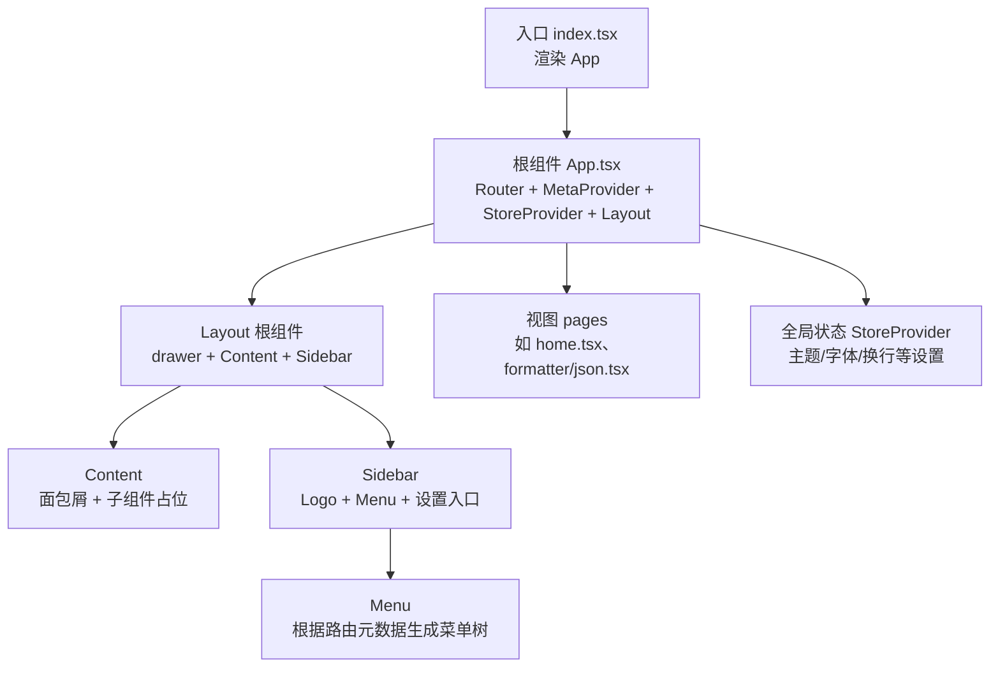
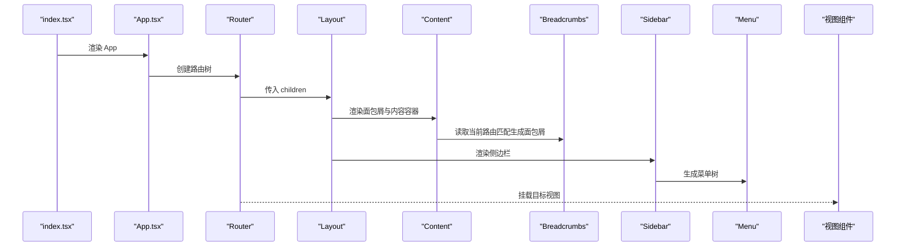
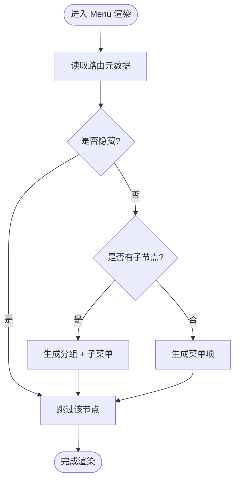
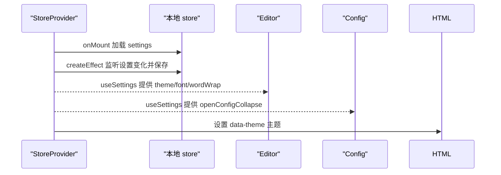
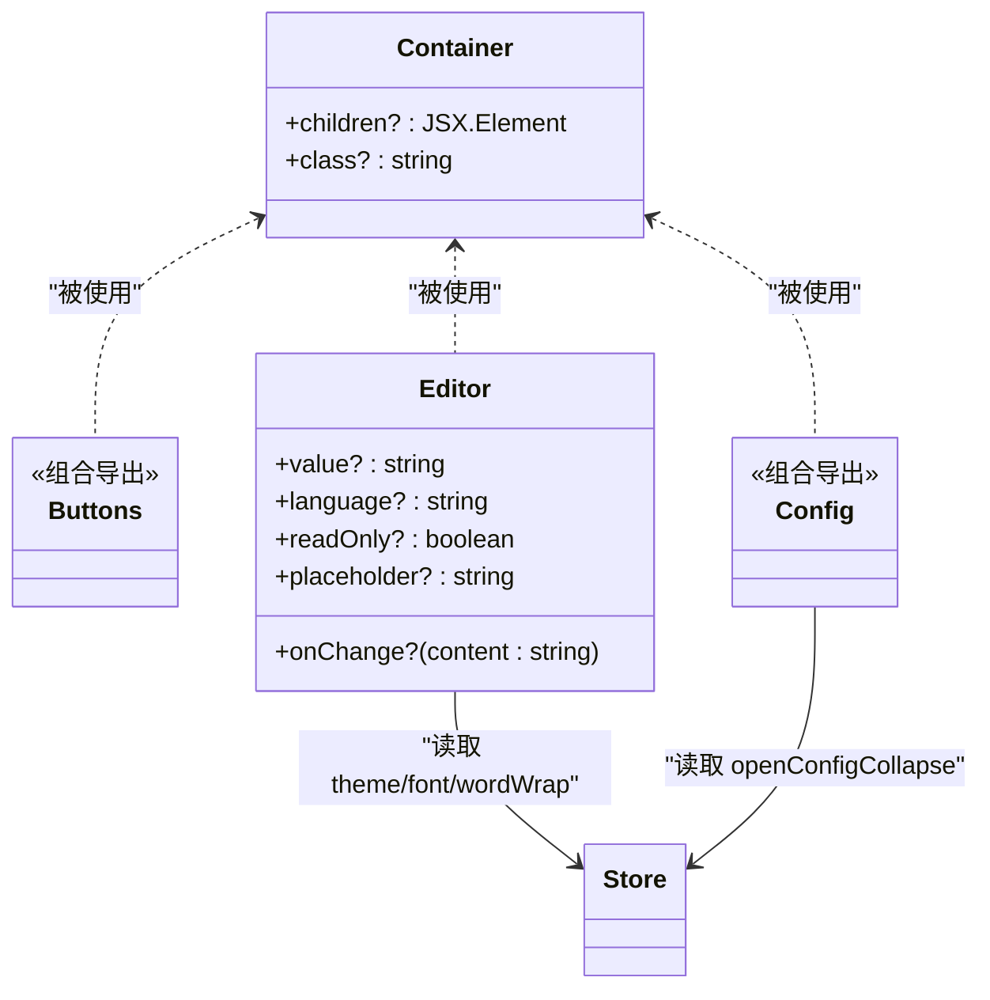
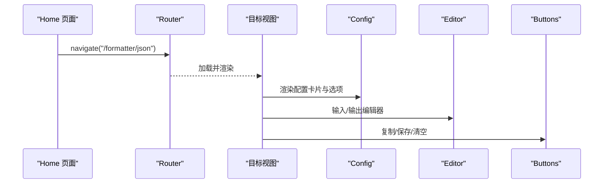
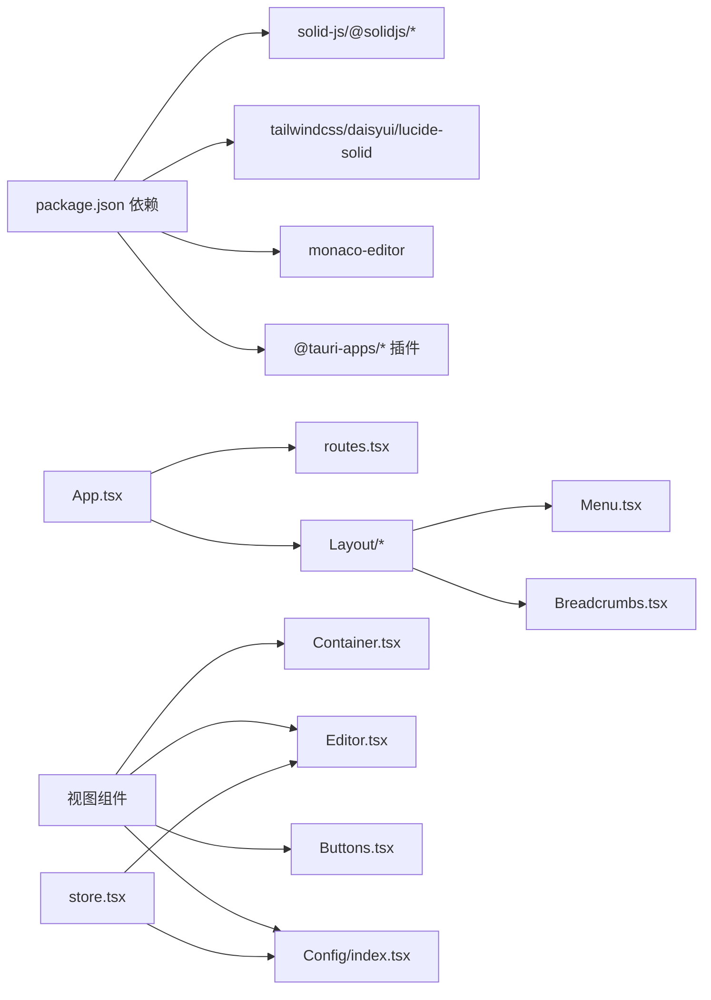

# UI组件架构

<cite>
**本文引用的文件**
- [src/App.tsx](file://src/App.tsx)
- [src/index.tsx](file://src/index.tsx)
- [src/routes.tsx](file://src/routes.tsx)
- [src/store.tsx](file://src/store.tsx)
- [src/component/Layout/index.tsx](file://src/component/Layout/index.tsx)
- [src/component/Layout/Content.tsx](file://src/component/Layout/Content.tsx)
- [src/component/Layout/Siderbar.tsx](file://src/component/Layout/Siderbar.tsx)
- [src/component/Layout/Breadcrumbs.tsx](file://src/component/Layout/Breadcrumbs.tsx)
- [src/component/Layout/Menu.tsx](file://src/component/Layout/Menu.tsx)
- [src/component/Container.tsx](file://src/component/Container.tsx)
- [src/component/Editor.tsx](file://src/component/Editor.tsx)
- [src/component/Buttons.tsx](file://src/component/Buttons.tsx)
- [src/component/Config/index.tsx](file://src/component/Config/index.tsx)
- [src/view/home.tsx](file://src/view/home.tsx)
- [src/view/formatter/json.tsx](file://src/view/formatter/json.tsx)
- [src/index.css](file://src/index.css)
- [package.json](file://package.json)
</cite>

## 目录
1. [简介](#简介)
2. [项目结构](#项目结构)
3. [核心组件](#核心组件)
4. [架构总览](#架构总览)
5. [详细组件分析](#详细组件分析)
6. [依赖分析](#依赖分析)
7. [性能考虑](#性能考虑)
8. [故障排查指南](#故障排查指南)
9. [结论](#结论)
10. [附录](#附录)

## 简介
本文件系统性梳理 devkimi 的 UI 组件架构，重点围绕基于 SolidJS 的组件化设计与 App.tsx 根组件如何协调组件树展开。文档深入解析 Layout 布局体系（Sidebar 侧边栏导航、Content 内容区、Breadcrumbs 面包屑），说明组件嵌套关系、属性传递（props）与事件处理机制，并以组件层次结构图展示从根组件到具体功能页面的完整组件树。同时提供实际代码示例路径，帮助读者快速定位实现细节与最佳实践。

## 项目结构
devkimi 采用“路由驱动 + 组件分层”的组织方式：
- 入口与根组件：index.tsx 渲染 App；App.tsx 通过 Router 包裹 Layout 并注入 StoreProvider，形成全局上下文与路由根容器。
- 路由与视图：routes.tsx 定义路由元数据（含多级分类与懒加载视图），视图文件位于 src/view 下，按功能域划分。
- 布局与通用组件：src/component 下包含 Layout 子组件（Content、Sidebar、Menu、Breadcrumbs）、通用容器 Container、编辑器 Editor、按钮 Buttons、配置 Config 等。
- 全局状态：store.tsx 提供设置存储与主题切换能力，通过 Provider 注入到组件树。



图表来源
- [src/index.tsx](file://src/index.tsx#L1-L37)
- [src/App.tsx](file://src/App.tsx#L1-L47)
- [src/component/Layout/index.tsx](file://src/component/Layout/index.tsx#L1-L26)
- [src/component/Layout/Content.tsx](file://src/component/Layout/Content.tsx#L1-L14)
- [src/component/Layout/Siderbar.tsx](file://src/component/Layout/Siderbar.tsx#L1-L50)
- [src/component/Layout/Menu.tsx](file://src/component/Layout/Menu.tsx#L1-L58)
- [src/store.tsx](file://src/store.tsx#L1-L88)
- [src/routes.tsx](file://src/routes.tsx#L1-L242)

章节来源
- [src/index.tsx](file://src/index.tsx#L1-L37)
- [src/App.tsx](file://src/App.tsx#L1-L47)
- [src/routes.tsx](file://src/routes.tsx#L1-L242)
- [src/store.tsx](file://src/store.tsx#L1-L88)

## 核心组件
- App.tsx：负责将路由元数据映射为 Route 树，注入 MetaProvider、StoreProvider、Layout 与 Suspense，形成统一的根容器。
- Layout 根组件：使用 daisyUI drawer 实现抽屉式布局，包含 Content 与 Sidebar。
- Content：承载面包屑与页面内容容器，内部使用 Container 统一风格。
- Sidebar：左侧导航，包含 Logo、Menu、设置入口与抽屉遮罩。
- Menu：根据路由元数据递归生成菜单树，支持图标、标签与子菜单。
- Breadcrumbs：基于路由匹配生成面包屑标题与路径。
- StoreProvider：提供设置上下文，持久化到本地 store，并在设置变更时更新 DOM 主题属性。
- 视图组件：如 home.tsx、formatter/json.tsx，通过 Container、Editor、Buttons、Config 等通用组件组合实现功能。

章节来源
- [src/App.tsx](file://src/App.tsx#L1-L47)
- [src/component/Layout/index.tsx](file://src/component/Layout/index.tsx#L1-L26)
- [src/component/Layout/Content.tsx](file://src/component/Layout/Content.tsx#L1-L14)
- [src/component/Layout/Siderbar.tsx](file://src/component/Layout/Siderbar.tsx#L1-L50)
- [src/component/Layout/Menu.tsx](file://src/component/Layout/Menu.tsx#L1-L58)
- [src/component/Layout/Breadcrumbs.tsx](file://src/component/Layout/Breadcrumbs.tsx#L1-L26)
- [src/store.tsx](file://src/store.tsx#L1-L88)

## 架构总览
下图展示了从入口到页面渲染的完整流程，以及布局组件之间的协作关系。



图表来源
- [src/index.tsx](file://src/index.tsx#L1-L37)
- [src/App.tsx](file://src/App.tsx#L1-L47)
- [src/component/Layout/index.tsx](file://src/component/Layout/index.tsx#L1-L26)
- [src/component/Layout/Content.tsx](file://src/component/Layout/Content.tsx#L1-L14)
- [src/component/Layout/Breadcrumbs.tsx](file://src/component/Layout/Breadcrumbs.tsx#L1-L26)
- [src/component/Layout/Siderbar.tsx](file://src/component/Layout/Siderbar.tsx#L1-L50)
- [src/component/Layout/Menu.tsx](file://src/component/Layout/Menu.tsx#L1-L58)

## 详细组件分析

### App.tsx 根组件与路由树
- 路由元数据：routes.tsx 定义了多级分类与懒加载视图，App.tsx 将其映射为 Route 树，支持父子关系与自定义信息（label、icon）。
- 根容器：在 Router 的 root 中注入 MetaProvider、StoreProvider、Layout 与 Suspense，确保全局状态、SEO 标题与异步渲染一致。
- 组合模式：通过高阶函数 route(meta) 递归生成嵌套路由，体现函数式组合与声明式路由设计。

章节来源
- [src/App.tsx](file://src/App.tsx#L1-L47)
- [src/routes.tsx](file://src/routes.tsx#L1-L242)

### Layout 布局体系
- 抽屉布局：Layout 使用 daisyUI drawer，通过隐藏的 checkbox 控制 drawer-toggle，Content 与 Sidebar 分别承载内容与导航。
- Content：包含 Breadcrumbs 与页面内容容器，使用 Container 统一风格。
- Sidebar：包含 Logo、抽屉遮罩、Menu 与设置入口；Menu 根据路由元数据生成菜单树，支持图标与子菜单。
- Breadcrumbs：基于 @solidjs/router 的 useCurrentMatches 获取当前匹配项，动态生成面包屑标题与图标。

```mermaid
classDiagram
class Layout {
+children? : JSX.Element
}
class Content {
+children? : JSX.Element
}
class Sidebar {
+props : {}
}
class Menu {
+props : {}
}
class Breadcrumbs {
+props : {}
}
Layout --> Content : "包含"
Layout --> Sidebar : "包含"
Sidebar --> Menu : "包含"
Content --> Breadcrumbs : "包含"
```

图表来源
- [src/component/Layout/index.tsx](file://src/component/Layout/index.tsx#L1-L26)
- [src/component/Layout/Content.tsx](file://src/component/Layout/Content.tsx#L1-L14)
- [src/component/Layout/Siderbar.tsx](file://src/component/Layout/Siderbar.tsx#L1-L50)
- [src/component/Layout/Menu.tsx](file://src/component/Layout/Menu.tsx#L1-L58)
- [src/component/Layout/Breadcrumbs.tsx](file://src/component/Layout/Breadcrumbs.tsx#L1-L26)

章节来源
- [src/component/Layout/index.tsx](file://src/component/Layout/index.tsx#L1-L26)
- [src/component/Layout/Content.tsx](file://src/component/Layout/Content.tsx#L1-L14)
- [src/component/Layout/Siderbar.tsx](file://src/component/Layout/Siderbar.tsx#L1-L50)
- [src/component/Layout/Menu.tsx](file://src/component/Layout/Menu.tsx#L1-L58)
- [src/component/Layout/Breadcrumbs.tsx](file://src/component/Layout/Breadcrumbs.tsx#L1-L26)

### 菜单与导航逻辑
- 菜单生成：Menu 依据路由元数据递归构建菜单树，过滤 hidden 节点，计算子路径，使用 useLocation 计算当前激活状态。
- 交互行为：点击菜单项跳转至对应路径；Sidebar 中的“所有工具”与“设置”入口分别指向首页与设置页。
- 图标与标签：每个路由项可配置 icon 与 label，Menu 会优先使用父级图标作为子项默认图标。



图表来源
- [src/component/Layout/Menu.tsx](file://src/component/Layout/Menu.tsx#L1-L58)
- [src/routes.tsx](file://src/routes.tsx#L1-L242)

章节来源
- [src/component/Layout/Menu.tsx](file://src/component/Layout/Menu.tsx#L1-L58)
- [src/component/Layout/Siderbar.tsx](file://src/component/Layout/Siderbar.tsx#L1-L50)

### 面包屑与标题管理
- 标题：Breadcrumbs 使用 @solidjs/meta 的 Title 动态设置页面标题，来源于当前路由匹配的 label。
- 面包屑：遍历 useCurrentMatches 返回的匹配链路，渲染每级的图标与标签，形成导航路径。

章节来源
- [src/component/Layout/Breadcrumbs.tsx](file://src/component/Layout/Breadcrumbs.tsx#L1-L26)

### 全局状态与主题切换
- StoreProvider：初始化本地 store，读取 settings 并持久化；监听设置变化自动保存；根据 theme 切换 HTML 的 data-theme 属性。
- useSettings：提供设置读写接口，供 Editor、Config 等组件消费。



图表来源
- [src/store.tsx](file://src/store.tsx#L1-L88)
- [src/component/Editor.tsx](file://src/component/Editor.tsx#L1-L139)
- [src/component/Config/index.tsx](file://src/component/Config/index.tsx#L1-L37)

章节来源
- [src/store.tsx](file://src/store.tsx#L1-L88)

### 通用组件与组合模式
- Container：统一的卡片容器，使用 children 高阶函数与 twMerge 合并类名，便于复用与扩展。
- Buttons：封装常用操作按钮（复制、粘贴、清空、选择文件、保存、打开文件等），支持回调与状态反馈。
- Editor：基于 Monaco Editor 的封装，支持语言、只读、占位符、主题与字体等配置，通过 useSettings 动态同步设置。
- Config：配置卡片与选项组合，支持折叠、开关、下拉、输入框等控件，统一风格与交互。



图表来源
- [src/component/Container.tsx](file://src/component/Container.tsx#L1-L23)
- [src/component/Buttons.tsx](file://src/component/Buttons.tsx#L1-L191)
- [src/component/Editor.tsx](file://src/component/Editor.tsx#L1-L139)
- [src/component/Config/index.tsx](file://src/component/Config/index.tsx#L1-L37)
- [src/store.tsx](file://src/store.tsx#L1-L88)

章节来源
- [src/component/Container.tsx](file://src/component/Container.tsx#L1-L23)
- [src/component/Buttons.tsx](file://src/component/Buttons.tsx#L1-L191)
- [src/component/Editor.tsx](file://src/component/Editor.tsx#L1-L139)
- [src/component/Config/index.tsx](file://src/component/Config/index.tsx#L1-L37)

### 视图组件示例：Home 与 JSON 格式化
- Home：遍历路由元数据，生成“分类容器 + 工具按钮”，点击后跳转至对应子页面。
- JSON 格式化：使用 Config.Card、Config.Option、Config.Switch、Config.Select 组合配置项；Editor 输入/输出双面板；Buttons 提供复制与保存。



图表来源
- [src/view/home.tsx](file://src/view/home.tsx#L1-L47)
- [src/view/formatter/json.tsx](file://src/view/formatter/json.tsx#L1-L91)
- [src/component/Config/index.tsx](file://src/component/Config/index.tsx#L1-L37)
- [src/component/Editor.tsx](file://src/component/Editor.tsx#L1-L139)
- [src/component/Buttons.tsx](file://src/component/Buttons.tsx#L1-L191)

章节来源
- [src/view/home.tsx](file://src/view/home.tsx#L1-L47)
- [src/view/formatter/json.tsx](file://src/view/formatter/json.tsx#L1-L91)

## 依赖分析
- 运行时依赖：solid-js、@solidjs/router、@solidjs/meta、monaco-editor、lucide-solid、tailwindcss、daisyui、@tauri-apps/* 系列插件。
- 构建与样式：vite、tailwind-merge、@tailwindcss/typography、@tailwindcss/vite。
- 依赖关系：App.tsx 依赖路由元数据与 Layout；Layout 依赖 Menu、Breadcrumbs；视图组件依赖 Container、Editor、Buttons、Config；StoreProvider 为 Editor、Config 提供设置。



图表来源
- [package.json](file://package.json#L1-L43)
- [src/App.tsx](file://src/App.tsx#L1-L47)
- [src/routes.tsx](file://src/routes.tsx#L1-L242)
- [src/component/Layout/Menu.tsx](file://src/component/Layout/Menu.tsx#L1-L58)
- [src/component/Layout/Breadcrumbs.tsx](file://src/component/Layout/Breadcrumbs.tsx#L1-L26)
- [src/component/Container.tsx](file://src/component/Container.tsx#L1-L23)
- [src/component/Editor.tsx](file://src/component/Editor.tsx#L1-L139)
- [src/component/Buttons.tsx](file://src/component/Buttons.tsx#L1-L191)
- [src/component/Config/index.tsx](file://src/component/Config/index.tsx#L1-L37)
- [src/store.tsx](file://src/store.tsx#L1-L88)

章节来源
- [package.json](file://package.json#L1-L43)

## 性能考虑
- 路由懒加载：视图组件通过 lazy 引入，减少首屏体积，提升启动速度。
- 响应式设置：Editor 与 Config 通过 useSettings 读取设置，避免不必要的重渲染；StoreProvider 使用 trackStore 仅在设置变化时保存。
- 组件拆分：Layout、Container、Editor 等组件职责单一，利于缓存与复用。
- 样式与主题：daisyui 主题切换通过 data-theme 属性，避免频繁重绘。

[本节为通用指导，不直接分析具体文件]

## 故障排查指南
- 根元素缺失：index.tsx 在开发环境对 root 元素进行校验，若未找到会抛出错误提示。
- 缺少 StoreProvider：useSettings 若未包裹在 StoreProvider 内会抛出异常，需检查 App.tsx 的 Provider 层级。
- 菜单不显示：确认路由元数据中 hidden 字段未误设；Menu 会过滤 hidden 节点。
- 主题不生效：检查 StoreProvider 是否正确设置 data-theme；确认 theme 值有效。
- Monaco 编辑器无内容：Editor 通过 createEffect 同步 value，若未更新请检查外部 value 变更与 onSetup 回调。

章节来源
- [src/index.tsx](file://src/index.tsx#L1-L37)
- [src/store.tsx](file://src/store.tsx#L1-L88)
- [src/component/Layout/Menu.tsx](file://src/component/Layout/Menu.tsx#L1-L58)
- [src/component/Editor.tsx](file://src/component/Editor.tsx#L1-L139)

## 结论
devkimi 的 UI 架构以 App.tsx 为根，通过 Router 与 Layout 形成清晰的容器层，配合路由元数据驱动的菜单与视图体系，实现了模块化、可扩展且易于维护的前端结构。Layout 的抽屉式布局、Breadcrumbs 的动态标题、StoreProvider 的全局状态管理，以及通用组件的组合模式，共同构成了稳定高效的组件生态。建议在新增功能时遵循现有模式：以路由元数据定义页面，使用 Container/Config/Editor/Buttons 组合实现界面，并通过 useSettings 与 StoreProvider 管理跨组件状态。

[本节为总结性内容，不直接分析具体文件]

## 附录
- 样式基础：index.css 引入 tailwindcss、@tailwindcss/typography 与 daisyui 主题，统一全局样式与主题切换。
- 组件层次结构参考：从 App -> Layout -> Content/Sidebar -> Menu/Breadcrumbs -> 视图组件，形成稳定的层级关系。

章节来源
- [src/index.css](file://src/index.css#L1-L17)