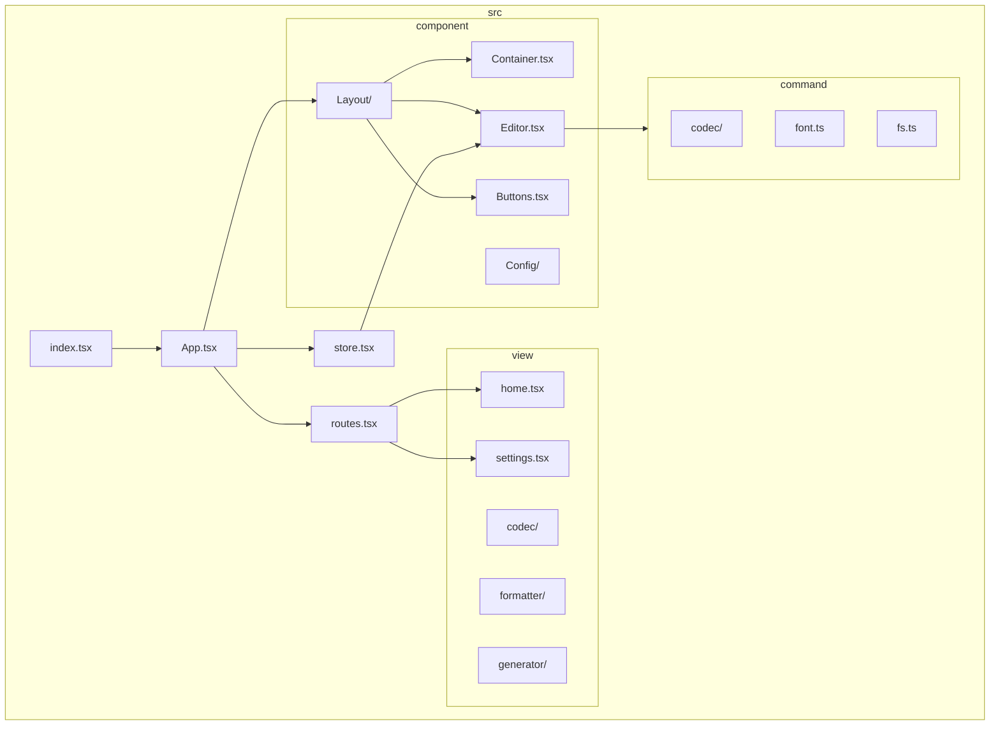
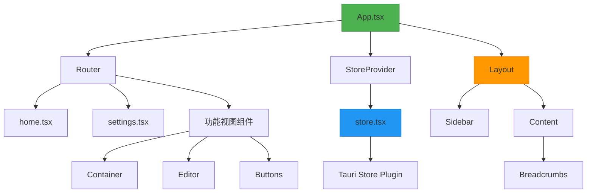
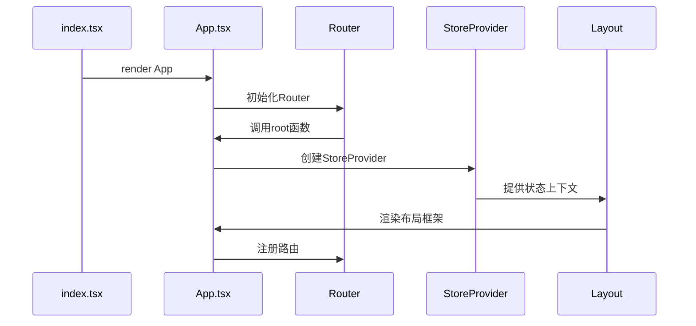
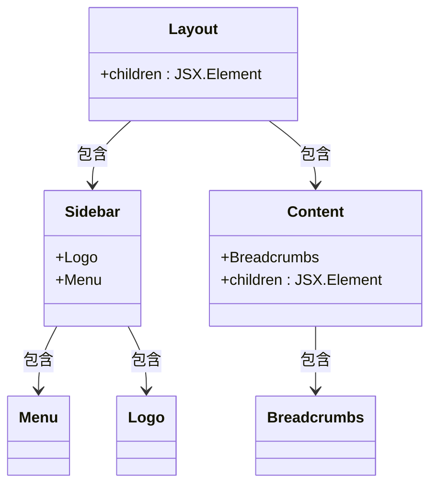
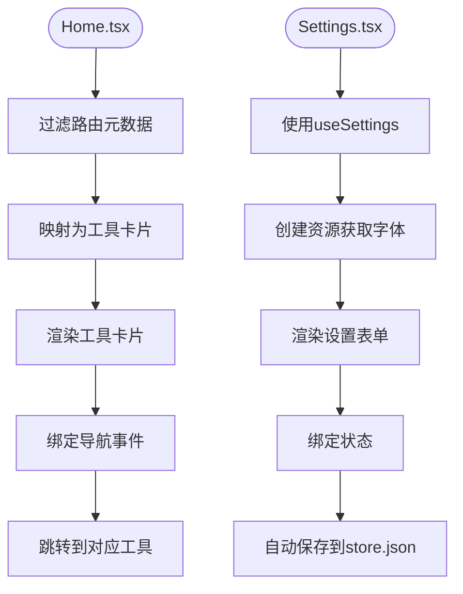
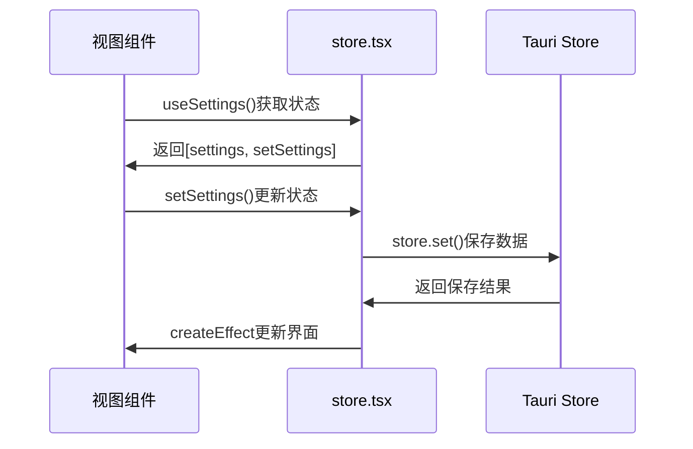
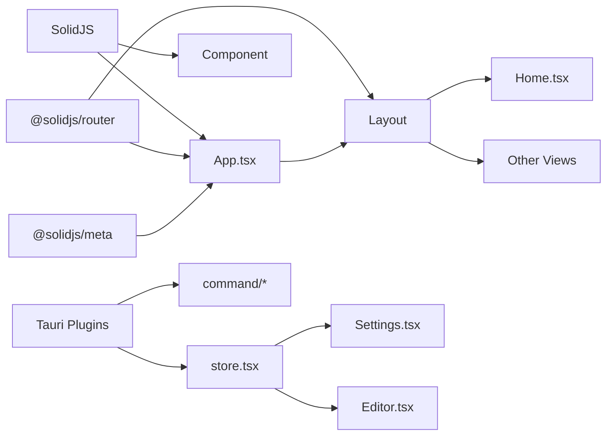

# 前端架构

<cite>
**本文档中引用的文件**  
- [App.tsx](file://src/App.tsx)
- [store.tsx](file://src/store.tsx)
- [routes.tsx](file://src/routes.tsx)
- [index.tsx](file://src/index.tsx)
- [Layout/index.tsx](file://src/component/Layout/index.tsx)
- [view/home.tsx](file://src/view/home.tsx)
- [view/settings.tsx](file://src/view/settings.tsx)
- [component/Container.tsx](file://src/component/Container.tsx)
- [component/Editor.tsx](file://src/component/Editor.tsx)
- [component/Buttons.tsx](file://src/component/Buttons.tsx)
</cite>

## 目录
1. [项目结构](#项目结构)
2. [核心组件](#核心组件)
3. [架构概述](#架构概述)
4. [详细组件分析](#详细组件分析)
5. [依赖分析](#依赖分析)
6. [性能考虑](#性能考虑)
7. [故障排除指南](#故障排除指南)
8. [结论](#结论)

## 项目结构

devkimi项目的前端代码组织清晰，采用基于功能模块的目录结构。项目根目录下的`src`文件夹包含所有前端源码，主要分为`command`、`component`、`utils`、`view`等核心目录。`component`目录存放可复用的UI组件，`view`目录存放功能视图组件，`store.tsx`实现全局状态管理，`routes.tsx`定义路由配置，`App.tsx`作为应用根组件组织整体结构。

**Diagram sources**  
- [App.tsx](file://src/App.tsx#L1-L47)
- [store.tsx](file://src/store.tsx#L1-L88)
- [routes.tsx](file://src/routes.tsx#L1-L242)
- [component/Layout/index.tsx](file://src/component/Layout/index.tsx#L1-L26)

**Section sources**  
- [App.tsx](file://src/App.tsx#L1-L47)
- [store.tsx](file://src/store.tsx#L1-L88)
- [routes.tsx](file://src/routes.tsx#L1-L242)

## 核心组件

devkimi前端架构的核心组件包括`App.tsx`作为根组件，`store.tsx`提供全局状态管理，`Layout`组件实现统一的页面布局框架。`App.tsx`通过`Router`和`StoreProvider`组织应用结构，`store.tsx`使用SolidJS的`createStore`实现响应式状态管理并与Tauri的持久化存储插件集成。`Layout`组件采用抽屉式设计，包含侧边栏导航和内容区域，为所有视图提供一致的用户体验。

**Section sources**  
- [App.tsx](file://src/App.tsx#L1-L47)
- [store.tsx](file://src/store.tsx#L1-L88)
- [component/Layout/index.tsx](file://src/component/Layout/index.tsx#L1-L26)

## 架构概述

devkimi前端采用基于SolidJS的组件化架构，遵循MVVM模式。View层由SolidJS组件构成，通过属性传递和事件通信与ViewModel层交互。`App.tsx`作为应用的根组件，通过`Router`管理路由，`StoreProvider`提供全局状态。`Layout`组件实现统一的页面框架，包含侧边栏导航和面包屑导航。功能视图组件（如`home.tsx`、`settings.tsx`）作为页面级组件，通过`routes.tsx`中的路由配置进行组织。

**Diagram sources**  
- [App.tsx](file://src/App.tsx#L1-L47)
- [store.tsx](file://src/store.tsx#L1-L88)
- [component/Layout/index.tsx](file://src/component/Layout/index.tsx#L1-L26)
- [view/home.tsx](file://src/view/home.tsx#L1-L47)
- [view/settings.tsx](file://src/view/settings.tsx#L1-L122)

## 详细组件分析

### App组件分析

`App.tsx`是应用的根组件，负责组织整体应用结构。它使用`@solidjs/router`的`Router`组件管理路由，通过`root`属性定义应用的根布局。`StoreProvider`包裹整个应用，为所有子组件提供全局状态访问。`App.tsx`动态生成路由，将`routes.tsx`中定义的路由元数据转换为实际的路由组件。

**Diagram sources**  
- [App.tsx](file://src/App.tsx#L1-L47)
- [index.tsx](file://src/index.tsx#L1-L37)

**Section sources**  
- [App.tsx](file://src/App.tsx#L1-L47)
- [index.tsx](file://src/index.tsx#L1-L37)

### Layout组件分析

`Layout`组件实现统一的页面布局框架，采用抽屉式设计。它包含`Sidebar`（侧边栏）和`Content`（内容区域）两个主要部分。`Sidebar`提供导航菜单，`Content`包含面包屑导航和主内容区域。`Layout`使用Tailwind CSS的`drawer`类实现响应式布局，确保在不同屏幕尺寸下都有良好的用户体验。

**Diagram sources**  
- [component/Layout/index.tsx](file://src/component/Layout/index.tsx#L1-L26)
- [component/Layout/Siderbar.tsx](file://src/component/Layout/Siderbar.tsx#L1-L50)
- [component/Layout/Content.tsx](file://src/component/Layout/Content.tsx#L1-L14)
- [component/Logo.tsx](file://src/component/Logo.tsx#L1-L40)

**Section sources**  
- [component/Layout/index.tsx](file://src/component/Layout/index.tsx#L1-L26)
- [component/Layout/Siderbar.tsx](file://src/component/Layout/Siderbar.tsx#L1-L50)
- [component/Layout/Content.tsx](file://src/component/Layout/Content.tsx#L1-L14)

### 功能视图组件分析

功能视图组件如`home.tsx`和`settings.tsx`遵循一致的设计模式。`home.tsx`作为主页，动态生成工具入口，根据`routes.tsx`中的路由元数据渲染工具卡片。`settings.tsx`实现应用设置界面，使用`Config`组件库构建表单，与`store.tsx`中的全局状态双向绑定，实现设置的持久化存储。

**Diagram sources**  
- [view/home.tsx](file://src/view/home.tsx#L1-L47)
- [view/settings.tsx](file://src/view/settings.tsx#L1-L122)
- [routes.tsx](file://src/routes.tsx#L1-L242)
- [store.tsx](file://src/store.tsx#L1-L88)

**Section sources**  
- [view/home.tsx](file://src/view/home.tsx#L1-L47)
- [view/settings.tsx](file://src/view/settings.tsx#L1-L122)

### MVVM模式实现

devkimi前端采用MVVM模式，View层由SolidJS组件构成，ViewModel层由`store.tsx`实现。组件通过`useSettings`钩子访问全局状态，实现单向数据流。状态变更通过`setSettings`函数触发，`createEffect`监听状态变化并自动保存到Tauri的持久化存储中。这种设计实现了View与ViewModel的松耦合，提高了代码的可维护性。

**Diagram sources**  
- [store.tsx](file://src/store.tsx#L1-L88)
- [view/settings.tsx](file://src/view/settings.tsx#L1-L122)
- [component/Editor.tsx](file://src/component/Editor.tsx#L1-L139)

**Section sources**  
- [store.tsx](file://src/store.tsx#L1-L88)
- [view/settings.tsx](file://src/view/settings.tsx#L1-L122)

## 依赖分析

devkimi前端依赖关系清晰，核心依赖包括SolidJS框架、@solidjs/router路由库、@solidjs/meta元数据管理、Tauri插件系统等。组件间依赖通过props传递和context提供，避免了复杂的依赖链。`store.tsx`作为全局状态中心，被多个组件依赖，但通过`StoreProvider`和`useSettings`实现了解耦。

**Diagram sources**  
- [App.tsx](file://src/App.tsx#L1-L47)
- [store.tsx](file://src/store.tsx#L1-L88)
- [package.json](file://package.json#L1-L20)

**Section sources**  
- [App.tsx](file://src/App.tsx#L1-L47)
- [store.tsx](file://src/store.tsx#L1-L88)

## 性能考虑

devkimi前端在性能方面做了多项优化。使用`lazy`函数实现路由组件的懒加载，减少初始加载时间。`Editor`组件使用Monaco Editor的worker模式，避免阻塞主线程。`createResource`用于异步数据获取，配合Suspense实现优雅的加载状态。状态管理使用`trackStore`精确监听变化，避免不必要的重新渲染。

## 故障排除指南

常见问题包括路由不生效、状态更新不及时、编辑器初始化失败等。路由问题通常由`routes.tsx`配置错误引起，需检查路径和组件导入。状态更新问题可能源于`setSettings`使用不当，应确保正确使用路径参数。编辑器初始化失败可能与Monaco Editor的worker配置有关，需检查worker引入是否正确。

**Section sources**  
- [App.tsx](file://src/App.tsx#L1-L47)
- [store.tsx](file://src/store.tsx#L1-L88)
- [component/Editor.tsx](file://src/component/Editor.tsx#L1-L139)

## 结论

devkimi前端架构设计良好，采用SolidJS的响应式特性构建高效、可维护的用户界面。组件化设计提高了代码复用性，MVVM模式实现了关注点分离。通过合理的状态管理和路由组织，构建了一个功能丰富且用户体验良好的桌面应用。