# 状态绑定机制

<cite>
**本文引用的文件**
- [store.tsx](file://src/store.tsx)
- [App.tsx](file://src/App.tsx)
- [settings.tsx](file://src/view/settings.tsx)
- [Input.tsx](file://src/component/Config/Input.tsx)
- [Switch.tsx](file://src/component/Config/Switch.tsx)
- [Select.tsx](file://src/component/Config/Select.tsx)
- [index.tsx](file://src/component/Config/index.tsx)
- [routes.tsx](file://src/routes.tsx)
- [Editor.tsx](file://src/component/Editor.tsx)
</cite>

## 目录
1. [引言](#引言)
2. [项目结构](#项目结构)
3. [核心组件](#核心组件)
4. [架构总览](#架构总览)
5. [详细组件分析](#详细组件分析)
6. [依赖关系分析](#依赖关系分析)
7. [性能考量](#性能考量)
8. [故障排查指南](#故障排查指南)
9. [结论](#结论)

## 引言
本文件聚焦于 devkimi 项目的“状态绑定机制”，系统性阐述基于 SolidJS 信号（Signals）的状态管理实现，重点解析全局状态 store 的定义与组织方式，说明视图组件如何通过信号订阅实现响应式更新，并给出配置组件（输入框、开关、选择器等）与全局状态的双向绑定机制。文末提供状态流图与最佳实践建议，帮助开发者正确使用与扩展状态系统，避免常见陷阱。

## 项目结构
devkimi 采用“按功能域”组织前端代码：视图层（view）、组件层（component）、工具层（utils）、命令层（command），以及入口与路由配置。状态管理的核心位于 store.tsx，全局状态通过 Provider 注入至应用根节点，各视图与配置组件通过自定义 Hook useSettings 访问与修改状态。

图表来源
- [App.tsx](file://src/App.tsx#L1-L47)
- [store.tsx](file://src/store.tsx#L1-L88)
- [settings.tsx](file://src/view/settings.tsx#L1-L122)
- [index.tsx](file://src/component/Config/index.tsx#L1-L37)
- [Input.tsx](file://src/component/Config/Input.tsx#L1-L37)
- [Select.tsx](file://src/component/Config/Select.tsx#L1-L30)
- [Switch.tsx](file://src/component/Config/Switch.tsx#L1-L24)
- [Editor.tsx](file://src/component/Editor.tsx#L94-L144)
- [routes.tsx](file://src/routes.tsx#L1-L242)

章节来源
- [App.tsx](file://src/App.tsx#L1-L47)
- [store.tsx](file://src/store.tsx#L1-L88)
- [routes.tsx](file://src/routes.tsx#L1-L242)

## 核心组件
- 全局状态定义与上下文
  - 定义 Settings 类型与默认值，使用 createStore 构建可响应的嵌套对象。
  - 使用 onMount 异步加载持久化存储，初始化状态。
  - 使用 createEffect 结合 deep-tracked 的 store 变更，自动保存到持久化存储。
  - 提供 StoreProvider 将 [settings, setSettings] 暴露为上下文，供子树消费。
  - 提供 useSettings Hook，封装上下文读取与错误处理。
- 视图组件订阅与响应式更新
  - 在设置页中，通过 useSettings 获取状态与 setter，并在多个 createEffect 中监听 settings 的变化，驱动 UI 与编辑器选项同步。
- 配置组件与状态双向绑定
  - 输入组件（字符串/数字）与选择组件（字符串）直接以受控方式绑定到状态字段。
  - 开关组件以布尔值绑定到状态字段。
  - 通过 setSettings 的路径式 setter 实现细粒度更新，避免不必要的重渲染。

章节来源
- [store.tsx](file://src/store.tsx#L1-L88)
- [settings.tsx](file://src/view/settings.tsx#L1-L122)
- [Input.tsx](file://src/component/Config/Input.tsx#L1-L37)
- [Switch.tsx](file://src/component/Config/Switch.tsx#L1-L24)
- [Select.tsx](file://src/component/Config/Select.tsx#L1-L30)

## 架构总览
下图展示了从用户交互到状态更新再到 UI 响应的整体流程，以及持久化存储的写入路径。

图表来源
- [settings.tsx](file://src/view/settings.tsx#L1-L122)
- [store.tsx](file://src/store.tsx#L1-L88)
- [Input.tsx](file://src/component/Config/Input.tsx#L1-L37)
- [Switch.tsx](file://src/component/Config/Switch.tsx#L1-L24)
- [Select.tsx](file://src/component/Config/Select.tsx#L1-L30)

## 详细组件分析

### 全局状态 Store 的定义与组织
- 数据模型
  - Settings 包含 common 与 editor 两部分，后者进一步包含 wordWrap、font.family、font.size 等字段。
  - 默认值集中定义，确保首次启动时具备合理初始状态。
- 生命周期与持久化
  - onMount 加载持久化存储中的 settings；若不存在则回退到默认值。
  - createEffect 监听 settings 的深变更（trackStore），在变更后异步写入持久化存储并保存。
- 上下文与 Hook
  - StoreProvider 将 [settings, setSettings] 注入上下文，useSettings 返回该对，未包裹 Provider 时抛出明确错误。

图表来源
- [store.tsx](file://src/store.tsx#L1-L88)

章节来源
- [store.tsx](file://src/store.tsx#L1-L88)

### 视图组件如何订阅与响应式更新
- 设置页（settings.tsx）
  - 通过 useSettings 获取状态与 setter。
  - 多个 createEffect：
    - 监听 common.theme，动态更新页面主题属性。
    - 监听 editor 字段（通过 trackStore(settings.editor)），批量更新编辑器选项（如 wordWrap、fontSize、fontFamily）。
  - 与编辑器（Editor）联动：通过 onSetup 收集编辑器实例，在 effect 中统一更新其 options；同时监听 value 变化以保持内容一致。
- 主页（home.tsx）
  - 作为导航入口，不直接依赖全局状态；但其子路由与菜单由路由元数据驱动，与设置页共同构成完整的状态使用闭环。

图表来源
- [settings.tsx](file://src/view/settings.tsx#L1-L122)
- [Editor.tsx](file://src/component/Editor.tsx#L94-L144)

章节来源
- [settings.tsx](file://src/view/settings.tsx#L1-L122)
- [Editor.tsx](file://src/component/Editor.tsx#L94-L144)

### 配置组件与全局状态的双向绑定
- 输入组件（Input/NumberInput）
  - 受控组件：value 来源于状态，onInput 回调通过 setSettings 写回状态。
  - 数字输入使用 valueAsNumber，保证数值类型一致性。
- 选择组件（Select）
  - 受控组件：value 来源于状态，onChange 通过 setSettings 写回字符串值。
- 开关组件（Switch）
  - 受控组件：value 为布尔，onChange 通过 setSettings 写回布尔值。
- 配置容器（Config/index.tsx）
  - 卡片折叠状态来自 common.openConfigCollapse，用于控制配置区域默认展开/收起。

图表来源
- [settings.tsx](file://src/view/settings.tsx#L1-L122)
- [Input.tsx](file://src/component/Config/Input.tsx#L1-L37)
- [Switch.tsx](file://src/component/Config/Switch.tsx#L1-L24)
- [Select.tsx](file://src/component/Config/Select.tsx#L1-L30)
- [index.tsx](file://src/component/Config/index.tsx#L1-L37)

章节来源
- [Input.tsx](file://src/component/Config/Input.tsx#L1-L37)
- [Switch.tsx](file://src/component/Config/Switch.tsx#L1-L24)
- [Select.tsx](file://src/component/Config/Select.tsx#L1-L30)
- [index.tsx](file://src/component/Config/index.tsx#L1-L37)
- [settings.tsx](file://src/view/settings.tsx#L1-L122)

### 状态流图：从用户交互到持久化

图表来源
- [store.tsx](file://src/store.tsx#L1-L88)
- [settings.tsx](file://src/view/settings.tsx#L1-L122)

## 依赖关系分析
- 组件耦合
  - 视图组件仅通过 useSettings 与 StoreContext 交互，低耦合高内聚。
  - 配置组件均为纯展示/受控组件，不直接依赖持久化存储，职责清晰。
- 外部依赖
  - @solid-primitives/deep：提供 trackStore，用于深度跟踪 store 变更。
  - @tauri-apps/plugin-store：提供跨平台本地存储能力。
  - lucide-solid：图标库，用于 UI 展示。
- 潜在循环依赖
  - 当前结构无明显循环依赖；StoreProvider 在 App 根部注入，子组件通过 Hook 访问，符合 SolidJS 推荐模式。

```mermaid
graph LR
Store["store.tsx"] --> Views["view/*.tsx"]
Store --> Cfg["component/Config/*.tsx"]
Views --> Cfg
Cfg --> Icons["lucide-solid"]
Store --> Deep["@solid-primitives/deep"]
Store --> Tauri["@tauri-apps/plugin-store"]
```

图表来源
- [store.tsx](file://src/store.tsx#L1-L88)
- [settings.tsx](file://src/view/settings.tsx#L1-L122)
- [index.tsx](file://src/component/Config/index.tsx#L1-L37)

章节来源
- [store.tsx](file://src/store.tsx#L1-L88)
- [settings.tsx](file://src/view/settings.tsx#L1-L122)
- [index.tsx](file://src/component/Config/index.tsx#L1-L37)

## 性能考量
- 深度跟踪与最小化更新
  - 使用 trackStore 对 settings 进行深度跟踪，避免浅比较导致的遗漏更新，同时尽量减少不必要的重渲染。
- 效率优化建议
  - 对大型编辑器或复杂视图，优先使用细粒度的 setSettings 路径式更新，避免整体替换导致的昂贵重渲染。
  - 将与 UI 无关的计算放入 createMemo 或外部缓存，减少 effect 内部开销。
  - 在持久化写入前进行必要性判断，避免频繁 save 导致 I/O 抖动。
- 可观测性
  - 在保存成功/失败时记录日志，便于定位性能瓶颈与异常。

[本节为通用性能建议，无需特定文件引用]

## 故障排查指南
- 缺少 StoreProvider
  - 现象：调用 useSettings 抛出“缺少上下文提供者”错误。
  - 排查：确认 App.tsx 已在根部包裹 StoreProvider。
- 持久化存储未生效
  - 现象：页面刷新后设置未恢复或保存失败。
  - 排查：检查 onMount 加载逻辑与 createEffect 中的 save 调用；查看控制台错误日志。
- 编辑器选项未更新
  - 现象：切换主题或编辑器设置后 UI 未变化。
  - 排查：确认 settings.editor 是否被 trackStore 监听；检查 effect 中是否正确遍历编辑器实例并调用 updateOptions。
- 受控组件未更新
  - 现象：输入框/选择器显示旧值或无法输入。
  - 排查：确认 value 与 onChange 是否正确绑定到状态字段；确保 setSettings 的路径与类型匹配。

章节来源
- [store.tsx](file://src/store.tsx#L1-L88)
- [settings.tsx](file://src/view/settings.tsx#L1-L122)
- [Editor.tsx](file://src/component/Editor.tsx#L94-L144)

## 结论
devkimi 的状态绑定机制以 SolidJS Signals 为核心，通过 createStore 构建可响应的全局状态，结合 StoreProvider 与 useSettings Hook 实现跨组件共享。配置组件采用受控方式与状态双向绑定，配合 trackStore 的深度跟踪与持久化存储，形成从用户交互到 UI 响应再到数据落盘的完整闭环。遵循本文的最佳实践与排错建议，可有效提升开发效率与系统稳定性。