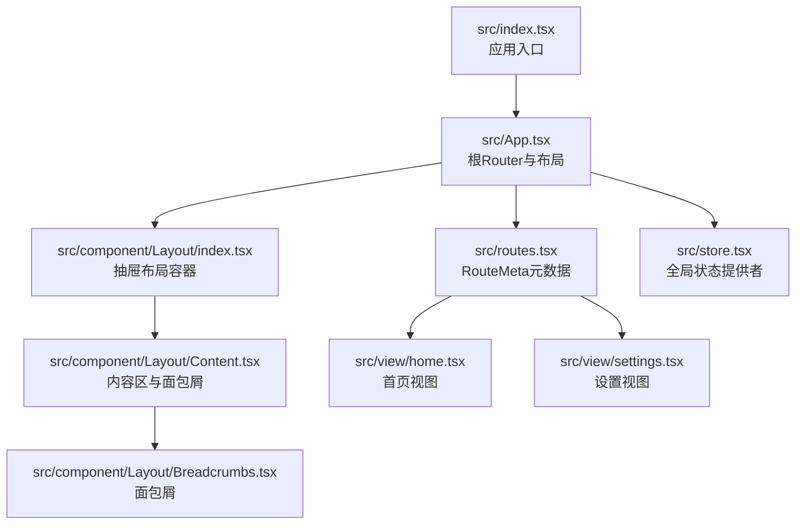
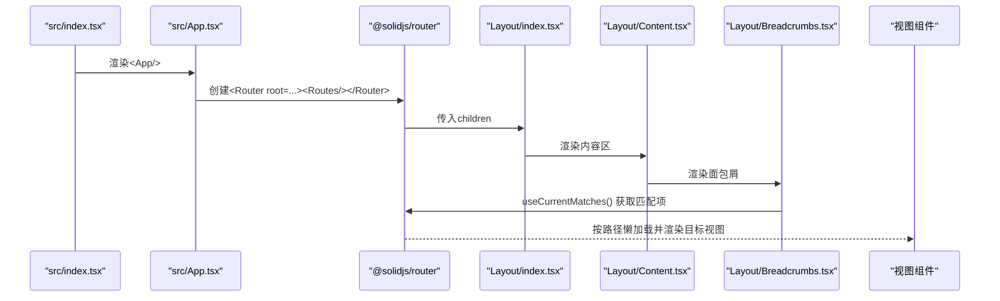
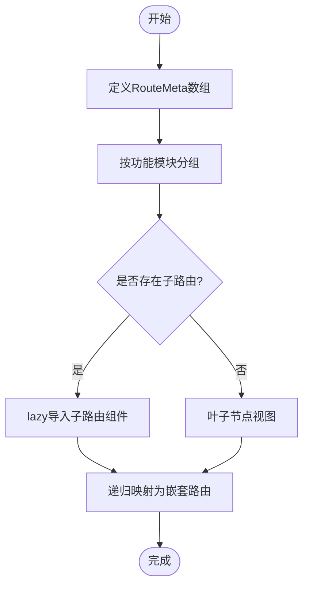
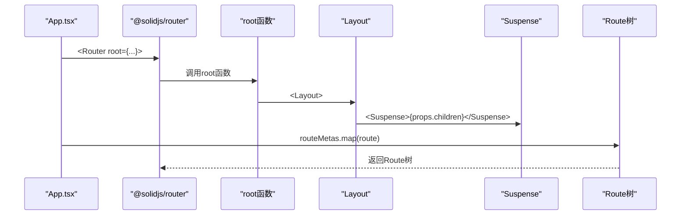
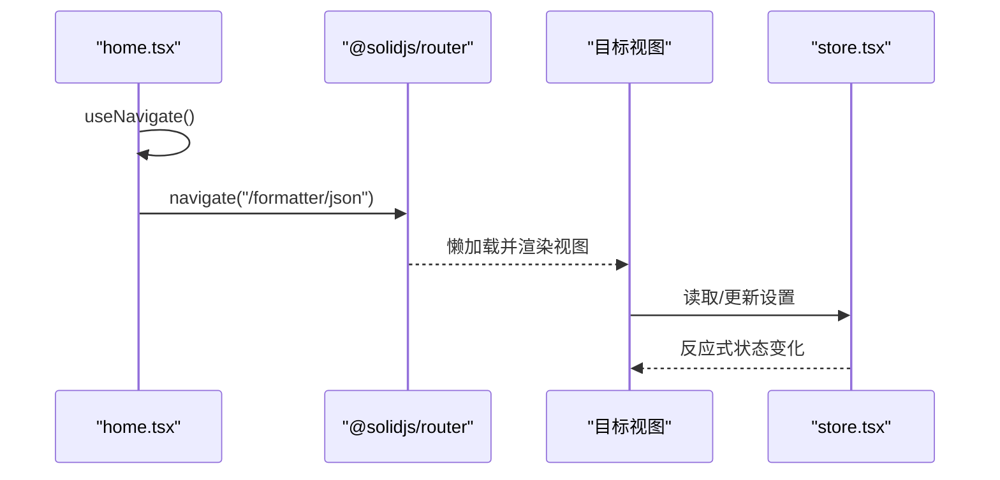
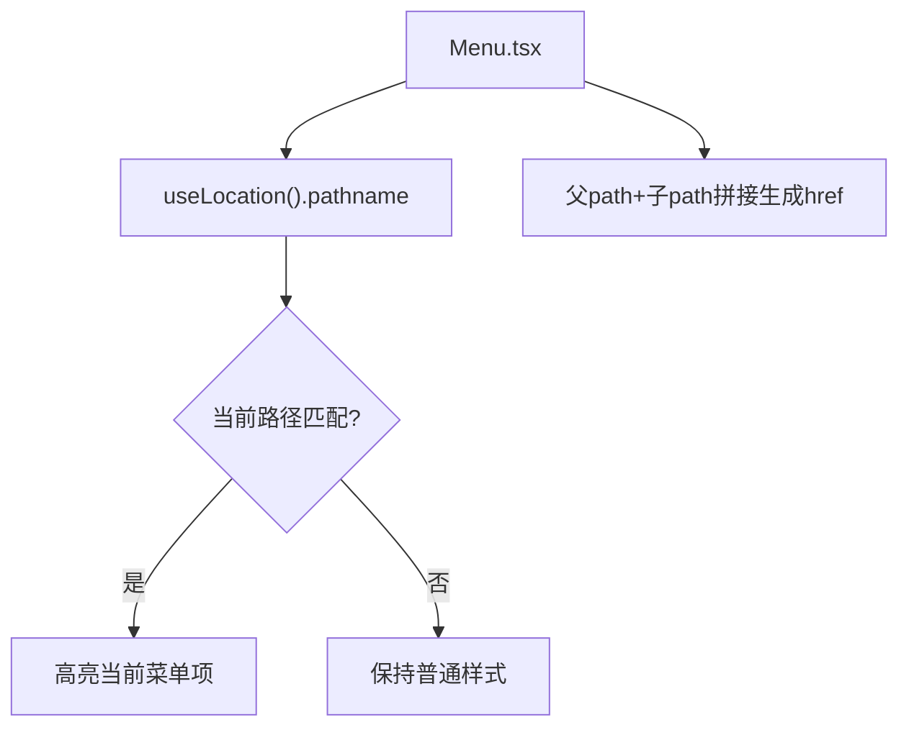
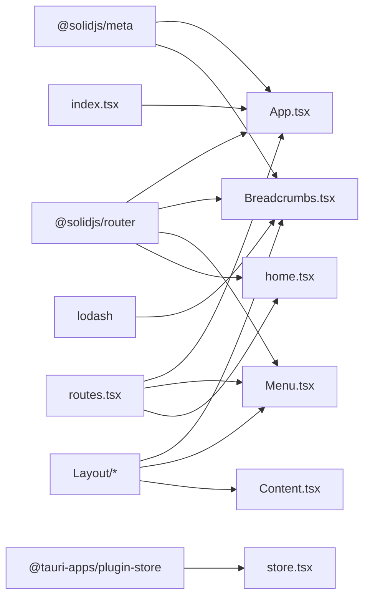

# 路由集成

<cite>
**本文引用的文件**
- [src/routes.tsx](file://src/routes.tsx)
- [src/App.tsx](file://src/App.tsx)
- [src/component/Layout/Breadcrumbs.tsx](file://src/component/Layout/Breadcrumbs.tsx)
- [src/component/Layout/Content.tsx](file://src/component/Layout/Content.tsx)
- [src/component/Layout/Menu.tsx](file://src/component/Layout/Menu.tsx)
- [src/component/Layout/index.tsx](file://src/component/Layout/index.tsx)
- [src/view/home.tsx](file://src/view/home.tsx)
- [src/view/settings.tsx](file://src/view/settings.tsx)
- [src/store.tsx](file://src/store.tsx)
- [src/index.tsx](file://src/index.tsx)
- [package.json](file://package.json)
</cite>

## 目录
1. [简介](#简介)
2. [项目结构](#项目结构)
3. [核心组件](#核心组件)
4. [架构总览](#架构总览)
5. [详细组件分析](#详细组件分析)
6. [依赖关系分析](#依赖关系分析)
7. [性能考量](#性能考量)
8. [故障排查指南](#故障排查指南)
9. [结论](#结论)
10. [附录](#附录)

## 简介
本文件面向devkimi项目，系统性梳理基于@solidjs/router的路由集成方案。重点覆盖：
- routes.tsx中的路由元数据结构与嵌套路由模式
- App.tsx如何将元数据映射为@solidjs/router的Route树，并在根层注入布局与状态
- 视图组件（home.tsx、settings.tsx）的按需加载与切换
- 面包屑组件Breadcrumbs如何与当前路由状态同步，提供位置可视化反馈
- 实际示例路径：路由定义、参数传递、嵌套路由、导航与状态管理最佳实践

## 项目结构
devkimi采用“元数据驱动路由”的设计：通过集中式的RouteMeta数组描述所有路由层级，App.tsx将其递归映射为@solidjs/router的Route树；布局层负责承载面包屑、侧边菜单与内容区；视图层按需懒加载，配合Suspense提升首屏性能。



图表来源
- [src/index.tsx](file://src/index.tsx#L1-L37)
- [src/App.tsx](file://src/App.tsx#L1-L47)
- [src/component/Layout/index.tsx](file://src/component/Layout/index.tsx#L1-L26)
- [src/component/Layout/Content.tsx](file://src/component/Layout/Content.tsx#L1-L14)
- [src/component/Layout/Breadcrumbs.tsx](file://src/component/Layout/Breadcrumbs.tsx#L1-L26)
- [src/routes.tsx](file://src/routes.tsx#L1-L242)
- [src/view/home.tsx](file://src/view/home.tsx#L1-L47)
- [src/view/settings.tsx](file://src/view/settings.tsx#L1-L122)
- [src/store.tsx](file://src/store.tsx#L1-L88)

章节来源
- [src/index.tsx](file://src/index.tsx#L1-L37)
- [src/App.tsx](file://src/App.tsx#L1-L47)
- [src/component/Layout/index.tsx](file://src/component/Layout/index.tsx#L1-L26)
- [src/component/Layout/Content.tsx](file://src/component/Layout/Content.tsx#L1-L14)
- [src/component/Layout/Breadcrumbs.tsx](file://src/component/Layout/Breadcrumbs.tsx#L1-L26)
- [src/routes.tsx](file://src/routes.tsx#L1-L242)
- [src/view/home.tsx](file://src/view/home.tsx#L1-L47)
- [src/view/settings.tsx](file://src/view/settings.tsx#L1-L122)
- [src/store.tsx](file://src/store.tsx#L1-L88)

## 核心组件
- 路由元数据与定义：routes.tsx定义了RouteMeta接口及完整的路由树，支持标签、图标、路径、关键词、隐藏、子路由与组件懒加载。
- 应用根与路由树：App.tsx将RouteMeta数组递归映射为@solidjs/router的Route树，并在根层注入MetaProvider、StoreProvider与Layout。
- 布局与面包屑：Layout由抽屉容器、内容区与面包屑组成；Breadcrumbs使用useCurrentMatches读取当前匹配项，动态渲染标题与路径片段。
- 视图与导航：home.tsx通过useNavigate根据父级+子级路径组合进行跳转；settings.tsx作为设置页，配合store.tsx的状态持久化与主题切换。
- 全局状态：store.tsx提供设置的读写、持久化与主题切换副作用。

章节来源
- [src/routes.tsx](file://src/routes.tsx#L1-L242)
- [src/App.tsx](file://src/App.tsx#L1-L47)
- [src/component/Layout/Breadcrumbs.tsx](file://src/component/Layout/Breadcrumbs.tsx#L1-L26)
- [src/component/Layout/Content.tsx](file://src/component/Layout/Content.tsx#L1-L14)
- [src/view/home.tsx](file://src/view/home.tsx#L1-L47)
- [src/view/settings.tsx](file://src/view/settings.tsx#L1-L122)
- [src/store.tsx](file://src/store.tsx#L1-L88)

## 架构总览
下图展示了从入口到路由渲染、布局与面包屑的端到端流程。



图表来源
- [src/index.tsx](file://src/index.tsx#L1-L37)
- [src/App.tsx](file://src/App.tsx#L1-L47)
- [src/component/Layout/index.tsx](file://src/component/Layout/index.tsx#L1-L26)
- [src/component/Layout/Content.tsx](file://src/component/Layout/Content.tsx#L1-L14)
- [src/component/Layout/Breadcrumbs.tsx](file://src/component/Layout/Breadcrumbs.tsx#L1-L26)

## 详细组件分析

### 路由元数据与嵌套路由（routes.tsx）
- 结构要点
  - RouteMeta接口包含：label、path、keywords、icon、component、children、hidden等字段。
  - 顶层路由树按功能模块分组（如格式化工具、编解码器、文本工具、生成器、转换器、加解密），每个模块可包含多个子路由。
  - 子路由通过lazy导入对应视图组件，实现按需加载。
  - 特殊路由：设置页与首页通过特殊path标记并隐藏于菜单，便于直接访问或重定向。
- 嵌套路由模式
  - 父子路径拼接：父path + 子path构成最终访问路径，例如“/formatter”+“/json”=“/formatter/json”。



图表来源
- [src/routes.tsx](file://src/routes.tsx#L1-L242)

章节来源
- [src/routes.tsx](file://src/routes.tsx#L1-L242)

### 应用根与路由树映射（App.tsx）
- 根层包装
  - 使用Router包裹，root函数内注入MetaProvider、StoreProvider与Layout，确保全局元信息、状态与布局可用。
  - 在Layout内部使用Suspense包裹props.children，保证懒加载视图的加载态体验。
- 路由树构建
  - 定义route(meta)函数：将单条RouteMeta映射为一个Route元素，同时递归处理其children。
  - 将routeMetas.map(route)生成完整的Route树，挂载到Router之下。



图表来源
- [src/App.tsx](file://src/App.tsx#L1-L47)

章节来源
- [src/App.tsx](file://src/App.tsx#L1-L47)

### 面包屑与路由状态同步（Breadcrumbs.tsx）
- 同步机制
  - 使用useCurrentMatches()获取当前匹配的路由序列（从父到子）。
  - 通过last()取最后一个匹配项的label作为页面标题，并在面包屑列表中逐项渲染图标与标签。
  - 同时利用Title组件动态更新浏览器标题，增强语义化与可访问性。
- 与布局协作
  - Content.tsx作为布局容器，将Breadcrumbs置于内容区顶部，形成清晰的位置反馈。

```mermaid
sequenceDiagram
participant Bread as "Breadcrumbs.tsx"
participant Router as "@solidjs/router"
participant Title as "@solidjs/meta.Title"
participant UI as "UI列表"
Bread->>Router : useCurrentMatches()
Router-->>Bread : 匹配项数组
Bread->>Bread : 计算title与面包屑项
Bread->>Title : 更新页面标题
Bread->>UI : 渲染面包屑列表
```

图表来源
- [src/component/Layout/Breadcrumbs.tsx](file://src/component/Layout/Breadcrumbs.tsx#L1-L26)
- [src/component/Layout/Content.tsx](file://src/component/Layout/Content.tsx#L1-L14)

章节来源
- [src/component/Layout/Breadcrumbs.tsx](file://src/component/Layout/Breadcrumbs.tsx#L1-L26)
- [src/component/Layout/Content.tsx](file://src/component/Layout/Content.tsx#L1-L14)

### 视图组件与导航（home.tsx、settings.tsx）
- 首页导航（home.tsx）
  - 通过useNavigate在按钮点击时跳转至“父path+子path”组合，实现从首页卡片直达具体工具页。
  - 通过routeMetas过滤出具有子路由的模块，动态渲染按钮集合。
- 设置页（settings.tsx）
  - 作为独立路由，提供界面主题、编辑器字体、自动换行等配置项。
  - 与store.tsx联动：读取设置、响应变更并持久化；同时在主题切换时更新DOM属性以应用样式。



图表来源
- [src/view/home.tsx](file://src/view/home.tsx#L1-L47)
- [src/view/settings.tsx](file://src/view/settings.tsx#L1-L122)
- [src/store.tsx](file://src/store.tsx#L1-L88)

章节来源
- [src/view/home.tsx](file://src/view/home.tsx#L1-L47)
- [src/view/settings.tsx](file://src/view/settings.tsx#L1-L122)
- [src/store.tsx](file://src/store.tsx#L1-L88)

### 菜单与导航守卫（Menu.tsx）
- 菜单渲染
  - 使用useLocation().pathname与createMemo计算当前路径，结合RouteMeta构建带子菜单的导航。
  - 子菜单项通过父path+子path拼接生成链接，active类名用于高亮当前选中项。
- 导航守卫
  - 当前实现未显式声明导航守卫；若需权限或前置校验，可在Menu.tsx或App.tsx的root函数中扩展逻辑（例如在跳转前检查登录状态或加载必要数据）。



图表来源
- [src/component/Layout/Menu.tsx](file://src/component/Layout/Menu.tsx#L1-L58)

章节来源
- [src/component/Layout/Menu.tsx](file://src/component/Layout/Menu.tsx#L1-L58)

## 依赖关系分析
- 外部依赖
  - @solidjs/router：提供路由能力（Route、Router、useCurrentMatches、useNavigate、useLocation等）
  - @solidjs/meta：提供Title与MetaProvider，用于动态标题与SEO元信息
  - lodash：用于last()等工具函数
  - @tauri-apps/plugin-store：提供跨平台本地存储能力
- 内部依赖
  - App.tsx依赖routes.tsx的RouteMeta与组件懒加载
  - Breadcrumbs.tsx依赖@solidjs/router的useCurrentMatches与@solidjs/meta的Title
  - Menu.tsx依赖@solidjs/router的useLocation与routes.tsx的RouteMeta
  - home.tsx依赖@solidjs/router的useNavigate与routes.tsx的RouteMeta
  - settings.tsx依赖store.tsx的状态上下文



图表来源
- [package.json](file://package.json#L1-L43)
- [src/App.tsx](file://src/App.tsx#L1-L47)
- [src/component/Layout/Breadcrumbs.tsx](file://src/component/Layout/Breadcrumbs.tsx#L1-L26)
- [src/component/Layout/Menu.tsx](file://src/component/Layout/Menu.tsx#L1-L58)
- [src/view/home.tsx](file://src/view/home.tsx#L1-L47)
- [src/store.tsx](file://src/store.tsx#L1-L88)
- [src/routes.tsx](file://src/routes.tsx#L1-L242)
- [src/component/Layout/Content.tsx](file://src/component/Layout/Content.tsx#L1-L14)
- [src/index.tsx](file://src/index.tsx#L1-L37)

章节来源
- [package.json](file://package.json#L1-L43)
- [src/App.tsx](file://src/App.tsx#L1-L47)
- [src/component/Layout/Breadcrumbs.tsx](file://src/component/Layout/Breadcrumbs.tsx#L1-L26)
- [src/component/Layout/Menu.tsx](file://src/component/Layout/Menu.tsx#L1-L58)
- [src/view/home.tsx](file://src/view/home.tsx#L1-L47)
- [src/store.tsx](file://src/store.tsx#L1-L88)
- [src/routes.tsx](file://src/routes.tsx#L1-L242)
- [src/component/Layout/Content.tsx](file://src/component/Layout/Content.tsx#L1-L14)
- [src/index.tsx](file://src/index.tsx#L1-L37)

## 性能考量
- 懒加载与Suspense
  - 所有视图均通过lazy导入，配合Suspense在加载期间提供占位，避免阻塞首屏渲染。
- 路由元数据复用
  - RouteMeta统一描述路由结构，减少重复配置与维护成本。
- 响应式与最小化更新
  - 面包屑与菜单使用createMemo与useCurrentMatches，仅在匹配项变化时更新，降低不必要的重渲染。
- 状态持久化
  - store.tsx在设置变更时异步保存至本地存储，避免频繁I/O操作，提高交互流畅度。

## 故障排查指南
- 页面空白或白屏
  - 检查App.tsx的Suspense包裹是否生效，确认懒加载组件路径正确。
  - 确认index.tsx的root元素存在且id正确。
- 面包屑不显示或标题异常
  - 确保Breadcrumbs.tsx在Layout/Content中被正确渲染。
  - 检查RouteMeta的info字段（label、icon）是否正确设置。
- 导航无效或跳转失败
  - 确认home.tsx的navigate调用路径为“父path+子path”组合。
  - 检查Menu.tsx的href拼接是否与RouteMeta一致。
- 设置无法持久化
  - 确认store.tsx已初始化本地存储并成功读取默认值。
  - 检查设置变更后是否触发trackStore与保存逻辑。

章节来源
- [src/App.tsx](file://src/App.tsx#L1-L47)
- [src/component/Layout/Breadcrumbs.tsx](file://src/component/Layout/Breadcrumbs.tsx#L1-L26)
- [src/component/Layout/Content.tsx](file://src/component/Layout/Content.tsx#L1-L14)
- [src/view/home.tsx](file://src/view/home.tsx#L1-L47)
- [src/component/Layout/Menu.tsx](file://src/component/Layout/Menu.tsx#L1-L58)
- [src/store.tsx](file://src/store.tsx#L1-L88)
- [src/index.tsx](file://src/index.tsx#L1-L37)

## 结论
devkimi的路由系统以元数据为中心，结合@solidjs/router实现了清晰的嵌套路由、按需加载与布局集成。通过面包屑与菜单的响应式联动，用户能够直观感知当前位置；通过store.tsx的状态持久化，设置变更得以可靠保存。整体架构具备良好的可扩展性与可维护性，适合进一步引入导航守卫、参数化路由与更复杂的权限控制。

## 附录
- 路由定义示例路径
  - [路由元数据定义](file://src/routes.tsx#L1-L242)
  - [路由树映射与根层包装](file://src/App.tsx#L1-L47)
- 导航与参数传递
  - [首页导航与路径拼接](file://src/view/home.tsx#L1-L47)
  - [菜单高亮与href拼接](file://src/component/Layout/Menu.tsx#L1-L58)
- 面包屑与标题同步
  - [面包屑与标题更新](file://src/component/Layout/Breadcrumbs.tsx#L1-L26)
- 状态管理与最佳实践
  - [设置读取、更新与持久化](file://src/store.tsx#L1-L88)
  - [应用入口与渲染](file://src/index.tsx#L1-L37)