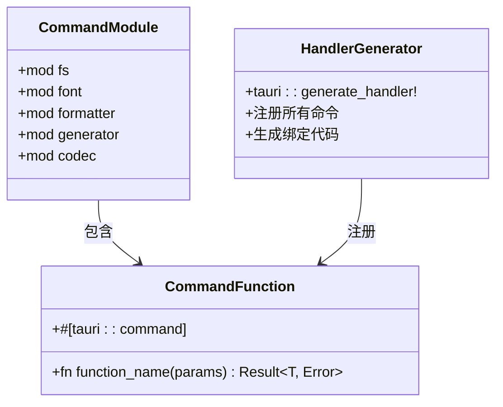
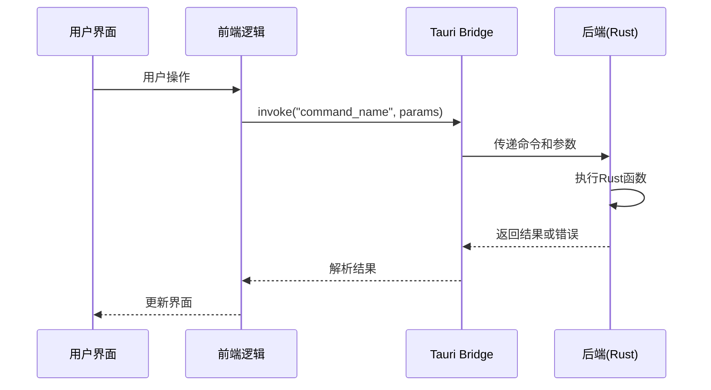
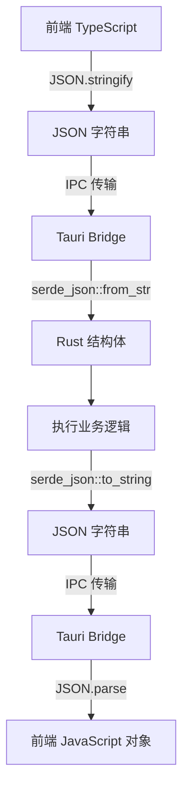
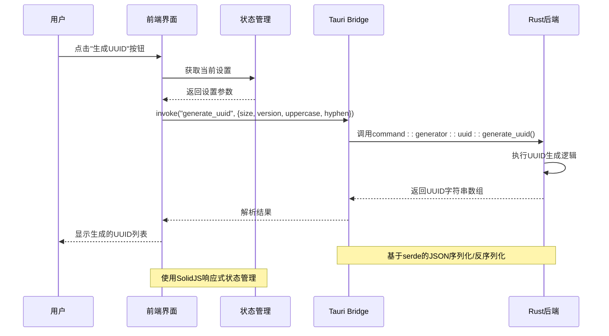
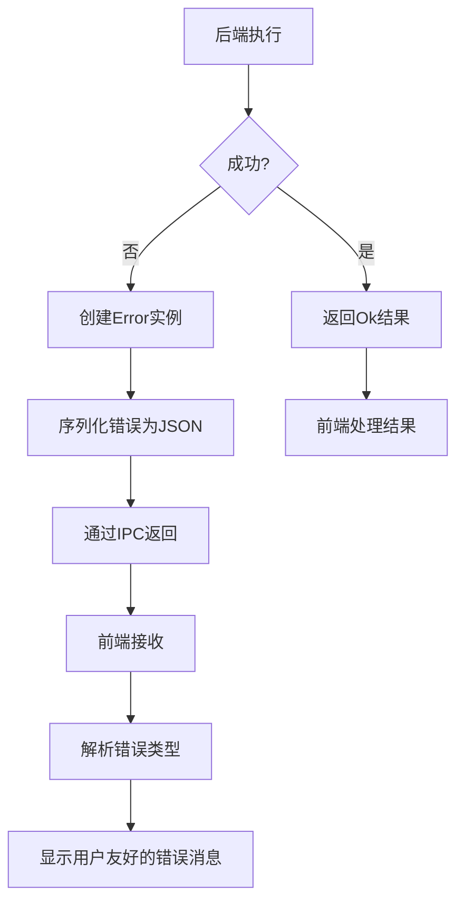

# 前后端通信机制

<cite>
**本文档引用的文件**  
- [main.rs](file://src-tauri/src/main.rs)
- [lib.rs](file://src-tauri/src/lib.rs)
- [Cargo.toml](file://src-tauri/Cargo.toml)
- [tauri.conf.json](file://src-tauri/tauri.conf.json)
- [fs.rs](file://src-tauri/src/command/fs.rs)
- [font.rs](file://src-tauri/src/command/font.rs)
- [json.rs](file://src-tauri/src/command/formatter/json.rs)
- [uuid.rs](file://src-tauri/src/command/generator/uuid.rs)
- [base64_text.rs](file://src-tauri/src/command/codec/base64_text.rs)
- [error.rs](file://src-tauri/src/error.rs)
- [store.tsx](file://src/store.tsx)
- [App.tsx](file://src/App.tsx)
- [index.tsx](file://src/index.tsx)
- [home.tsx](file://src/view/home.tsx)
</cite>

## 目录
1. [项目结构](#项目结构)
2. [Tauri Bridge 通信机制概述](#tauri-bridge-通信机制概述)
3. [后端命令暴露机制](#后端命令暴露机制)
4. [前端命令调用实现](#前端命令调用实现)
5. [序列化与反序列化机制](#序列化与反序列化机制)
6. [通信时序图](#通信时序图)
7. [错误处理机制](#错误处理机制)
8. [异步调用最佳实践](#异步调用最佳实践)
9. [配置与插件集成](#配置与插件集成)

## 项目结构

devkimi项目采用Tauri框架构建，实现了Rust后端与TypeScript前端的紧密集成。项目结构清晰地分为前端(src)和后端(src-tauri)两个主要部分。

```mermaid
graph TD
subgraph "前端 (src)"
A[App.tsx] --> B[store.tsx]
B --> C[component/]
B --> D[view/]
B --> E[routes.tsx]
D --> F[home.tsx]
D --> G[settings.tsx]
end
subgraph "后端 (src-tauri)"
H[main.rs] --> I[lib.rs]
I --> J[command/]
J --> K[fs.rs]
J --> L[font.rs]
J --> M[formatter/]
J --> N[generator/]
J --> O[codec/]
I --> P[error.rs]
end
A < --> |Tauri Bridge| I
B < --> |插件调用| Q[tauri-plugin-store]
K < --> |系统调用| R[操作系统]
```

**图示来源**  
- [App.tsx](file://src/App.tsx#L1-L47)
- [lib.rs](file://src-tauri/src/lib.rs#L1-L57)
- [store.tsx](file://src/store.tsx#L1-L88)

**本节来源**  
- [src-tauri/src/main.rs](file://src-tauri/src/main.rs#L1-L7)
- [src-tauri/src/lib.rs](file://src-tauri/src/lib.rs#L1-L57)
- [src/App.tsx](file://src/App.tsx#L1-L47)

## Tauri Bridge 通信机制概述

Tauri Bridge是devkimi项目前后端通信的核心机制，它基于Tauri框架提供的安全、高效的双向通信通道。该机制允许TypeScript前端安全地调用Rust后端的原生功能，同时确保了跨语言数据交换的类型安全性和性能。

Tauri Bridge通过Webview与Rust运行时之间的IPC（进程间通信）机制实现。前端通过`@tauri-apps/api`提供的API发起命令调用，这些命令被序列化后通过安全通道传递给后端Rust代码执行，执行结果再通过反序列化返回给前端。

这种架构既保持了Web技术的灵活性，又充分利用了Rust语言在系统编程、性能和安全性方面的优势。所有通信都遵循严格的类型定义和安全策略，防止了常见的安全漏洞。

**本节来源**  
- [src-tauri/src/lib.rs](file://src-tauri/src/lib.rs#L4-L56)
- [src-tauri/Cargo.toml](file://src-tauri/Cargo.toml#L1-L69)

## 后端命令暴露机制

在devkimi项目中，Rust后端通过`#[tauri::command]`宏将函数暴露给前端调用。这一机制是Tauri框架的核心特性，它自动处理函数注册、参数解析和结果返回。

后端命令的注册在`src-tauri/src/lib.rs`文件中通过`tauri::generate_handler!`宏完成，该宏接收所有需要暴露的命令函数作为参数。例如，`command::fs::open_file`和`command::font::get_system_fonts`等函数都被明确列出并注册。

每个命令函数必须遵循特定的签名规范：参数应为可序列化的类型，返回值应为`Result<T, Error>`形式，以支持错误处理。`#[tauri::command]`宏会自动生成必要的绑定代码，使这些Rust函数能够被JavaScript/TypeScript调用。



**图示来源**  
- [lib.rs](file://src-tauri/src/lib.rs#L11-L43)
- [fs.rs](file://src-tauri/src/command/fs.rs#L8-L11)
- [font.rs](file://src-tauri/src/command/font.rs#L7-L13)

**本节来源**  
- [src-tauri/src/lib.rs](file://src-tauri/src/lib.rs#L11-L43)
- [src-tauri/src/command/fs.rs](file://src-tauri/src/command/fs.rs#L8-L11)
- [src-tauri/src/command/font.rs](file://src-tauri/src/command/font.rs#L7-L13)

## 前端命令调用实现

前端通过`src/command`目录下的TypeScript文件定义和调用后端命令。虽然具体命令文件未在上下文中显示，但根据Tauri的标准实践，前端会使用`@tauri-apps/api`提供的`invoke`函数来调用后端命令。

每个前端命令调用都对应一个特定的命令名称，该名称与后端`#[tauri::command]`注解的函数相对应。调用时，前端将参数对象传递给`invoke`函数，该函数返回一个Promise，允许使用async/await语法进行异步处理。

在devkimi项目中，前端组件如`home.tsx`通过路由系统与各种功能模块交互，这些交互最终会触发对后端命令的调用。状态管理通过`store.tsx`中的`StoreProvider`实现，利用Tauri的`plugin-store`插件持久化用户设置。



**图示来源**  
- [home.tsx](file://src/view/home.tsx#L1-L47)
- [store.tsx](file://src/store.tsx#L1-L88)
- [lib.rs](file://src-tauri/src/lib.rs#L11-L43)

**本节来源**  
- [src/view/home.tsx](file://src/view/home.tsx#L1-L47)
- [src/store.tsx](file://src/store.tsx#L1-L88)

## 序列化与反序列化机制

devkimi项目中的序列化/反序列化过程主要依赖于Serde库，这是Rust生态系统中最流行的序列化框架。Serde在前后端通信中扮演着关键角色，负责将Rust数据结构转换为JSON格式以便跨语言传输，并在接收端将其还原。

在后端，通过`#[derive(Serialize, Deserialize)]`宏为数据类型自动实现序列化和反序列化特性。例如，`formatter::json.rs`中的`Indent`枚举和`generator::uuid.rs`中的`Version`枚举都使用了这些派生宏。

前端TypeScript代码通过JSON格式与后端通信，Tauri Bridge自动处理JSON的序列化和反序列化。当调用`invoke`时，JavaScript对象被序列化为JSON字符串，传递给Rust后端；后端处理完成后，返回的Rust结构体被序列化为JSON，再被前端反序列化为JavaScript对象。



**图示来源**  
- [json.rs](file://src-tauri/src/command/formatter/json.rs#L5-L11)
- [uuid.rs](file://src-tauri/src/command/generator/uuid.rs#L4-L9)
- [Cargo.toml](file://src-tauri/Cargo.toml#L41-L43)

**本节来源**  
- [src-tauri/src/command/formatter/json.rs](file://src-tauri/src/command/formatter/json.rs#L5-L11)
- [src-tauri/src/command/generator/uuid.rs](file://src-tauri/src/command/generator/uuid.rs#L4-L9)
- [src-tauri/Cargo.toml](file://src-tauri/Cargo.toml#L41-L43)

## 通信时序图

以下时序图展示了从用户界面操作到后端处理再到结果返回的完整通信流程，以"生成UUID"功能为例：



**图示来源**  
- [uuid.rs](file://src-tauri/src/command/generator/uuid.rs#L12-L30)
- [store.tsx](file://src/store.tsx#L1-L88)
- [lib.rs](file://src-tauri/src/lib.rs#L18-L19)

**本节来源**  
- [src-tauri/src/command/generator/uuid.rs](file://src-tauri/src/command/generator/uuid.rs#L12-L30)
- [src/store.tsx](file://src/store.tsx#L1-L88)

## 错误处理机制

devkimi项目的错误处理机制通过自定义的`command_error!`宏实现，该宏定义在`error.rs`文件中。这个宏简化了错误类型的定义和序列化，确保错误信息能够安全地传递到前端。

后端每个命令模块都定义了自己的错误类型，这些类型实现了`thiserror::Error` trait，并通过`serialize_error!`宏获得序列化能力。当命令执行失败时，Rust函数返回`Err(Error::SpecificError)`，Tauri Bridge会自动将这个错误序列化为JSON并传递给前端。

前端接收到错误后，可以解析错误类型和消息，向用户展示有意义的错误信息。这种结构化的错误处理方式避免了信息泄露，同时提供了良好的用户体验。



**图示来源**  
- [error.rs](file://src-tauri/src/error.rs#L1-L31)
- [fs.rs](file://src-tauri/src/command/fs.rs#L30-L33)
- [base64_text.rs](file://src-tauri/src/command/codec/base64_text.rs#L18-L21)

**本节来源**  
- [src-tauri/src/error.rs](file://src-tauri/src/error.rs#L1-L31)
- [src-tauri/src/command/fs.rs](file://src-tauri/src/command/fs.rs#L30-L33)

## 异步调用最佳实践

在devkimi项目中，所有Tauri命令调用本质上都是异步的，因为它们涉及跨进程通信。前端应始终使用async/await语法或Promise链来处理命令调用，避免阻塞UI线程。

最佳实践包括：使用try-catch块处理可能的错误、提供加载状态反馈、设置合理的超时机制，以及在用户界面中适当地显示处理进度。对于长时间运行的操作，应考虑实现取消机制。

后端Rust代码虽然以同步方式编写，但Tauri运行时会在专用线程池中执行这些命令，避免阻塞事件循环。对于真正的异步操作，可以使用`async`/`.await`语法，Tauri会自动处理异步命令的调度。

**本节来源**  
- [lib.rs](file://src-tauri/src/lib.rs#L4-L56)
- [store.tsx](file://src/store.tsx#L50-L64)
- [home.tsx](file://src/view/home.tsx#L7-L8)

## 配置与插件集成

devkimi项目的通信机制通过`tauri.conf.json`配置文件和Cargo.toml依赖管理进行定制。`tauri.conf.json`定义了应用的基本属性、构建配置和安全策略，而Cargo.toml则声明了所有Rust依赖。

项目集成了多个Tauri插件，如`tauri-plugin-store`用于持久化存储、`tauri-plugin-fs`用于文件系统访问、`tauri-plugin-clipboard-manager`用于剪贴板操作等。这些插件通过`lib.rs`中的`plugin()`方法注册，扩展了应用的功能。

安全配置中，`assetProtocol`的`scope`限制了文件访问范围，防止任意文件读取漏洞。这种细粒度的权限控制是Tauri框架安全模型的重要组成部分。

**本节来源**  
- [tauri.conf.json](file://src-tauri/tauri.conf.json#L1-L46)
- [Cargo.toml](file://src-tauri/Cargo.toml#L1-L69)
- [lib.rs](file://src-tauri/src/lib.rs#L6-L10)