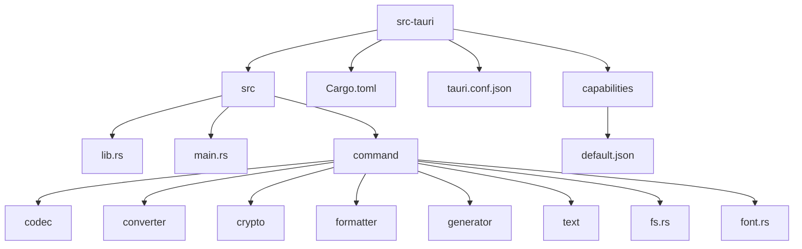
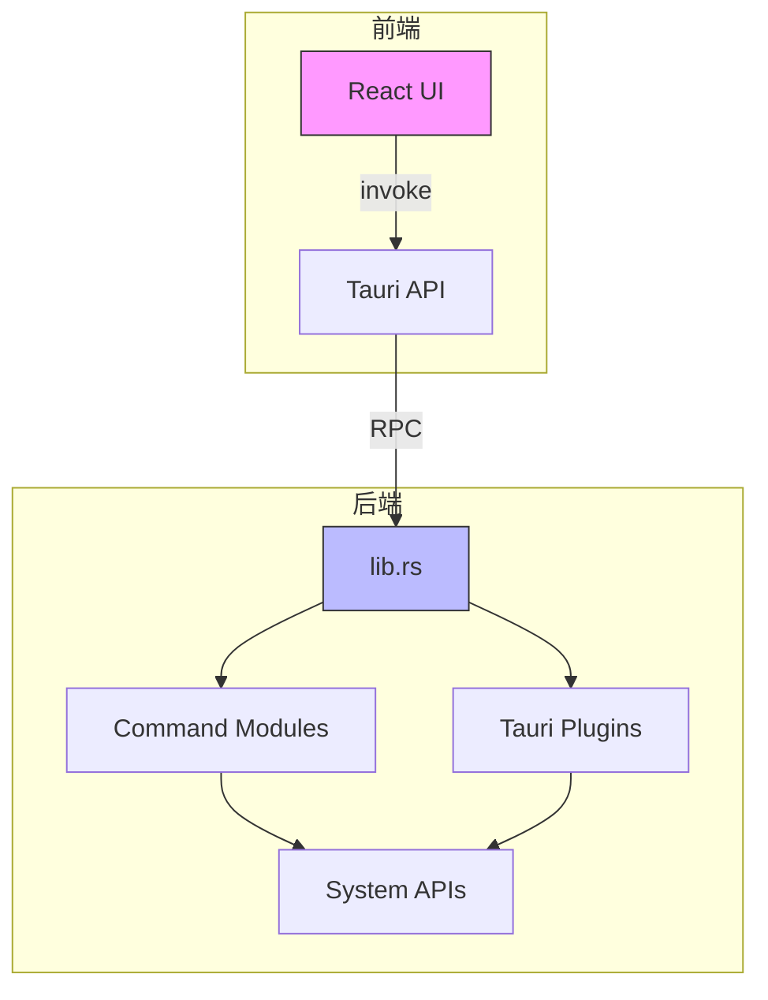
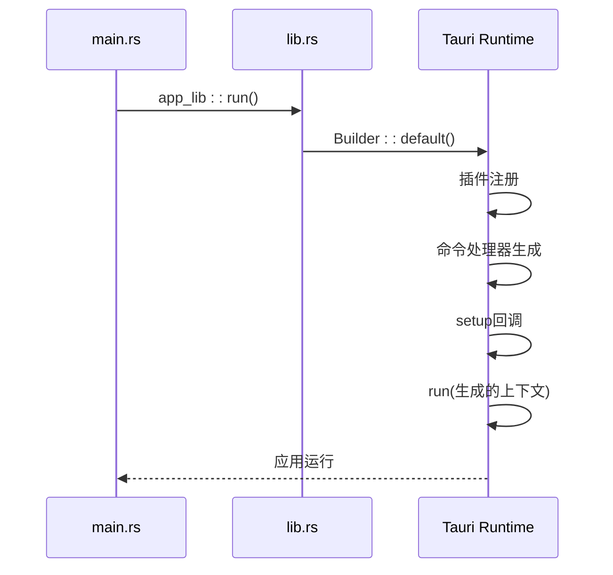
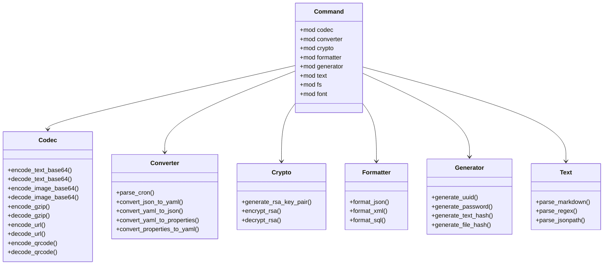
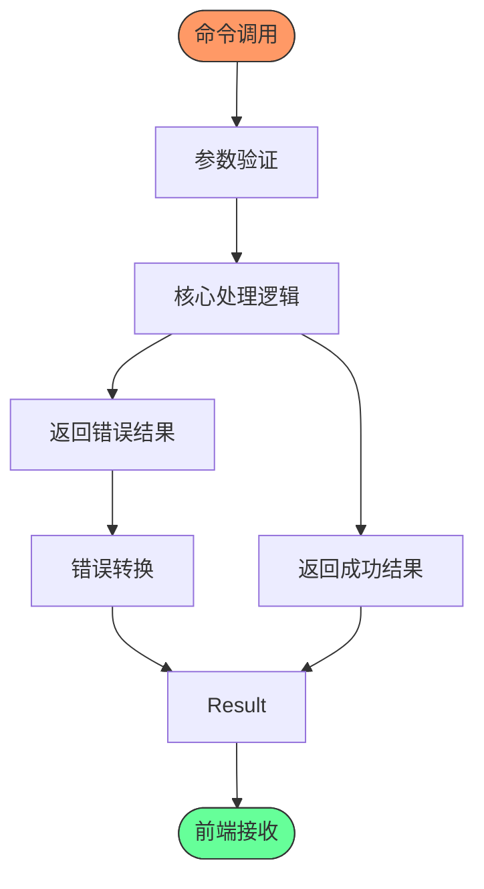
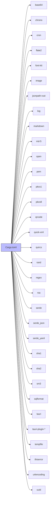
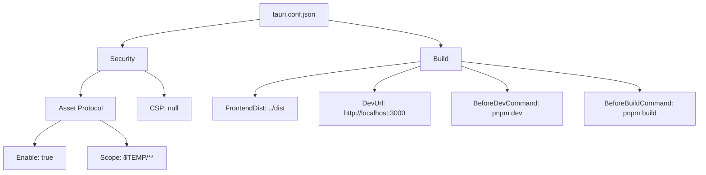

# 后端架构

<cite>
**本文档引用的文件**  
- [lib.rs](file://src-tauri/src/lib.rs)
- [Cargo.toml](file://src-tauri/Cargo.toml)
- [tauri.conf.json](file://src-tauri/tauri.conf.json)
- [main.rs](file://src-tauri/src/main.rs)
- [mod.rs](file://src-tauri/src/command/mod.rs)
- [fs.rs](file://src-tauri/src/command/fs.rs)
- [font.rs](file://src-tauri/src/command/font.rs)
- [uuid.rs](file://src-tauri/src/command/generator/uuid.rs)
- [base64_text.rs](file://src-tauri/src/command/codec/base64_text.rs)
- [json.rs](file://src-tauri/src/command/formatter/json.rs)
- [rsa.rs](file://src-tauri/src/command/crypto/rsa.rs)
- [json_yaml.rs](file://src-tauri/src/command/converter/json_yaml.rs)
- [regex.rs](file://src-tauri/src/command/text/regex.rs)
- [error.rs](file://src-tauri/src/error.rs)
- [default.json](file://src-tauri/capabilities/default.json)
</cite>

## 目录
1. [简介](#简介)
2. [项目结构](#项目结构)
3. [核心组件](#核心组件)
4. [架构概览](#架构概览)
5. [详细组件分析](#详细组件分析)
6. [依赖分析](#依赖分析)
7. [性能考虑](#性能考虑)
8. [故障排除指南](#故障排除指南)
9. [结论](#结论)

## 简介
本文档详细描述了devkimi项目的后端架构，重点分析基于Rust的Tauri后端系统。文档涵盖应用初始化流程、命令模块组织结构、依赖管理、安全配置以及前后端通信机制。通过深入分析lib.rs入口文件、Cargo.toml依赖定义和tauri.conf.json安全设置，全面揭示了该桌面应用的后端设计原理和实现方式。

## 项目结构

**图示来源**  
- [lib.rs](file://src-tauri/src/lib.rs#L1-L57)
- [Cargo.toml](file://src-tauri/Cargo.toml#L1-L69)
- [tauri.conf.json](file://src-tauri/tauri.conf.json#L1-L46)

**本节来源**  
- [src-tauri](file://src-tauri)

## 核心组件

devkimi后端的核心组件包括应用入口、命令系统、错误处理机制和插件集成。lib.rs作为主入口文件，通过Tauri Builder模式初始化应用并注册所有可用命令。命令模块按功能分类组织，每个命令都使用`#[tauri::command]`宏标记，使其能够被前端安全调用。错误处理系统通过自定义宏实现，确保所有错误都能被正确序列化并传递给前端。

**本节来源**  
- [lib.rs](file://src-tauri/src/lib.rs#L1-L57)
- [error.rs](file://src-tauri/src/error.rs#L1-L31)
- [mod.rs](file://src-tauri/src/command/mod.rs#L1-L8)

## 架构概览

**图示来源**  
- [lib.rs](file://src-tauri/src/lib.rs#L4-L56)
- [main.rs](file://src-tauri/src/main.rs#L1-L7)
- [tauri.conf.json](file://src-tauri/tauri.conf.json#L1-L46)

## 详细组件分析

### 入口文件分析

lib.rs是应用的核心入口，负责初始化Tauri应用实例并配置系统权限。文件通过Builder模式链式调用，注册了多个Tauri官方插件，包括存储、剪贴板、文件系统、对话框和打开器插件。所有命令函数通过`tauri::generate_handler!`宏批量注册，确保前端可以通过RPC机制安全调用这些函数。

**图示来源**  
- [lib.rs](file://src-tauri/src/lib.rs#L4-L56)
- [main.rs](file://src-tauri/src/main.rs#L5)

**本节来源**  
- [lib.rs](file://src-tauri/src/lib.rs#L1-L57)
- [main.rs](file://src-tauri/src/main.rs#L1-L7)

### 命令模块组织结构

命令模块采用功能分类的组织方式，每个功能类别作为一个子模块。mod.rs文件导出所有命令模块，形成清晰的命名空间层次。这种结构使得代码维护和功能扩展变得简单直观，同时也便于权限管理和安全控制。

**图示来源**  
- [mod.rs](file://src-tauri/src/command/mod.rs#L1-L8)
- [base64_text.rs](file://src-tauri/src/command/codec/base64_text.rs#L1-L22)
- [json_yaml.rs](file://src-tauri/src/command/converter/json_yaml.rs#L1-L19)
- [rsa.rs](file://src-tauri/src/command/crypto/rsa.rs#L1-L78)
- [json.rs](file://src-tauri/src/command/formatter/json.rs#L1-L39)
- [uuid.rs](file://src-tauri/src/command/generator/uuid.rs#L1-L48)
- [regex.rs](file://src-tauri/src/command/text/regex.rs#L1-L59)

**本节来源**  
- [src-tauri/src/command](file://src-tauri/src/command)

### 功能命令实现方式

各功能命令的实现遵循统一的模式：使用`#[tauri::command]`宏标记函数，接受基本类型参数，返回`Result<T, Error>`类型。错误类型通过`command_error!`宏定义，确保所有错误都能被序列化。例如，base64编解码命令使用base64库实现，JSON格式化命令使用serde_json库，RSA加密命令使用rsa库。

**图示来源**  
- [base64_text.rs](file://src-tauri/src/command/codec/base64_text.rs#L7-L22)
- [json.rs](file://src-tauri/src/command/formatter/json.rs#L13-L39)
- [rsa.rs](file://src-tauri/src/command/crypto/rsa.rs#L16-L78)

**本节来源**  
- [src-tauri/src/command](file://src-tauri/src/command)

## 依赖分析

**图示来源**  
- [Cargo.toml](file://src-tauri/Cargo.toml#L20-L58)

**本节来源**  
- [Cargo.toml](file://src-tauri/Cargo.toml#L1-L69)

### Cargo.toml依赖项分析

Cargo.toml文件定义了项目所需的所有Rust依赖项。这些依赖项支持了应用的各种功能：
- **base64**, **urlencoding**: 支持编解码功能
- **flate2**: 支持GZIP压缩解压
- **qrcode**, **quircs**: 支持二维码生成和识别
- **serde**, **serde_json**, **serde_yaml**: 支持数据序列化和格式转换
- **rsa**, **pkcs1**, **pkcs8**: 支持RSA加密解密
- **regex**: 支持正则表达式解析
- **quick-xml**: 支持XML格式化
- **sqlformat**: 支持SQL格式化
- **font-kit**: 支持系统字体访问
- **image**: 支持图片处理
- **uuid**: 支持UUID生成
- **tauri**及其插件: 提供桌面应用核心功能

**本节来源**  
- [Cargo.toml](file://src-tauri/Cargo.toml#L20-L58)

### tauri.conf.json安全配置

tauri.conf.json文件包含关键的安全配置：
- **assetProtocol**: 启用资产协议，限制访问范围为$TEMP目录
- **csp**: 内容安全策略为空，允许灵活的资源加载
- **windows**: 定义窗口尺寸和可调整性
- **build**: 配置前端构建命令和分发目录

**图示来源**  
- [tauri.conf.json](file://src-tauri/tauri.conf.json#L1-L46)

**本节来源**  
- [tauri.conf.json](file://src-tauri/tauri.conf.json#L1-L46)

### 权限设置分析

项目使用基于能力的权限系统，default.json文件定义了默认权限集：
- 文件系统读写权限限制在文本文件
- 剪贴板读写权限
- 对话框打开保存权限
- 存储插件所有权限
- 打开器权限限制在$TEMP目录

**图示来源**  
- [default.json](file://src-tauri/capabilities/default.json#L1-L31)

**本节来源**  
- [default.json](file://src-tauri/capabilities/default.json#L1-L31)

## 性能考虑

Tauri的异步运行时基于Tokio，能够高效处理系统调用和资源访问。所有命令默认在异步上下文中执行，避免阻塞主线程。对于计算密集型任务（如加密、压缩），Rust的高性能确保了快速响应。文件操作通过tauri-plugin-fs插件进行，该插件优化了跨平台文件访问性能。

**本节来源**  
- [lib.rs](file://src-tauri/src/lib.rs)
- [Cargo.toml](file://src-tauri/Cargo.toml)

## 故障排除指南

当遇到后端功能问题时，可以按照以下步骤排查：
1. 检查命令函数是否在lib.rs的generate_handler!宏中注册
2. 验证参数类型是否匹配前端调用
3. 检查错误处理是否正确实现
4. 确认所需权限已在capabilities中配置
5. 查看日志输出（仅在debug模式下启用）

**本节来源**  
- [lib.rs](file://src-tauri/src/lib.rs#L45-L51)
- [error.rs](file://src-tauri/src/error.rs#L1-L31)

## 结论

devkimi项目的后端架构采用了现代化的Rust+Tauri技术栈，具有高性能、高安全性和良好的可维护性。通过清晰的模块划分、严格的权限控制和高效的异步运行时，该架构为桌面应用提供了坚实的基础。命令系统的组织方式使得功能扩展变得简单，而Tauri的插件生态系统则大大减少了底层系统交互的复杂性。