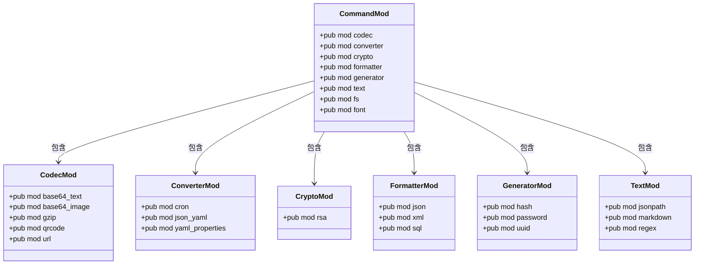

# 后端模块结构

<cite>
**本文档引用的文件**
- [lib.rs](file://src-tauri/src/lib.rs)
- [command/mod.rs](file://src-tauri/src/command/mod.rs)
- [fs.rs](file://src-tauri/src/command/fs.rs)
- [font.rs](file://src-tauri/src/command/font.rs)
- [error.rs](file://src-tauri/src/error.rs)
- [codec/base64_text.rs](file://src-tauri/src/command/codec/base64_text.rs)
- [formatter/json.rs](file://src-tauri/src/command/formatter/json.rs)
- [generator/uuid.rs](file://src-tauri/src/command/generator/uuid.rs)
- [text/markdown.rs](file://src-tauri/src/command/text/markdown.rs)
- [converter/json_yaml.rs](file://src-tauri/src/command/converter/json_yaml.rs)
- [crypto/rsa.rs](file://src-tauri/src/command/crypto/rsa.rs)
</cite>

## 目录
1. [项目结构](#项目结构)
2. [核心模块分析](#核心模块分析)
3. [架构概述](#架构概述)
4. [详细组件分析](#详细组件分析)
5. [依赖关系分析](#依赖关系分析)

## 项目结构

devkimi项目的后端模块主要位于`src-tauri/src`目录下，采用Rust的模块系统进行组织。项目结构清晰地划分为多个功能模块，包括codec、converter、crypto、formatter、generator和text等子模块，每个子模块负责特定的功能领域。


**图示来源**
- [lib.rs](file://src-tauri/src/lib.rs#L1-L57)
- [command/mod.rs](file://src-tauri/src/command/mod.rs#L1-L8)

**本节来源**
- [lib.rs](file://src-tauri/src/lib.rs#L1-L57)
- [command/mod.rs](file://src-tauri/src/command/mod.rs#L1-L8)

## 核心模块分析

devkimi后端模块的核心是通过Rust的模块系统组织的命令处理体系。`lib.rs`文件作为应用入口，初始化Tauri运行时并注册所有可用的命令。`command`模块作为根命令模块，通过`mod.rs`文件导出各个子模块，形成层次化的命令架构。

**本节来源**
- [lib.rs](file://src-tauri/src/lib.rs#L4-L56)
- [command/mod.rs](file://src-tauri/src/command/mod.rs#L1-L8)

## 架构概述

devkimi后端采用分层架构设计，以Tauri框架为基础，构建了一个模块化的命令处理系统。系统通过`lib.rs`中的`run`函数初始化Tauri应用，加载必要的插件，并注册所有命令处理器。前端通过Tauri的invoke机制调用后端功能，形成清晰的调用链路。

```mermaid
graph LR
Frontend[前端界面] --> |Tauri invoke| Tauri[Tauri Runtime]
Tauri --> Lib[lib.rs run()]
Lib --> Commands[Command Handlers]
Commands --> Codec[codec模块]
Commands --> Converter[converter模块]
Commands --> Crypto[crypto模块]
Commands --> Formatter[formatter模块]
Commands --> Generator[generator模块]
Commands --> Text[text模块]
Commands --> FS[fs模块]
Commands --> Font[font模块]
```

**图示来源**
- [lib.rs](file://src-tauri/src/lib.rs#L4-L43)
- [command/mod.rs](file://src-tauri/src/command/mod.rs#L1-L8)

## 详细组件分析

### 命令模块架构

devkimi的命令模块采用分层架构设计，每个子模块负责特定的功能领域。`command/mod.rs`文件作为命令模块的入口，通过`pub mod`声明导出所有子模块，使得这些模块中的命令可以被`lib.rs`文件引用。

#### 模块导出模式


**图示来源**
- [command/mod.rs](file://src-tauri/src/command/mod.rs#L1-L8)
- [command/codec/mod.rs](file://src-tauri/src/command/codec/mod.rs)
- [command/converter/mod.rs](file://src-tauri/src/command/converter/mod.rs)

**本节来源**
- [command/mod.rs](file://src-tauri/src/command/mod.rs#L1-L8)

### 功能模块实现

#### 编解码模块 (codec)
codec模块负责各种数据编码和解码操作，包括Base64文本/图像编码、GZIP压缩、二维码生成和URL编码等。每个功能都有独立的实现文件，通过`#[tauri::command]`宏标记为可从前端调用的命令。


**图示来源**
- [command/codec/base64_text.rs](file://src-tauri/src/command/codec/base64_text.rs#L7-L16)
- [command/codec/base64_helper.rs](file://src-tauri/src/command/codec/base64_helper.rs)

**本节来源**
- [command/codec/base64_text.rs](file://src-tauri/src/command/codec/base64_text.rs#L1-L22)

#### 格式化模块 (formatter)
formatter模块提供JSON、XML和SQL等数据格式的美化功能。以JSON格式化为例，模块支持多种缩进选项（2空格、4空格、Tab、无缩进）和对象排序功能。


**图示来源**
- [command/formatter/json.rs](file://src-tauri/src/command/formatter/json.rs#L13-L24)

**本节来源**
- [command/formatter/json.rs](file://src-tauri/src/command/formatter/json.rs#L1-L39)

#### 生成器模块 (generator)
generator模块提供UUID、密码和哈希值的生成功能。UUID生成支持v1、v4和v7版本，可配置大小写和连字符格式。


**图示来源**
- [command/generator/uuid.rs](file://src-tauri/src/command/generator/uuid.rs#L11-L30)

**本节来源**
- [command/generator/uuid.rs](file://src-tauri/src/command/generator/uuid.rs#L1-L48)

#### 文本处理模块 (text)
text模块提供Markdown解析、JSONPath查询和正则表达式测试等文本处理功能。Markdown解析使用线程局部存储来优化性能。


**图示来源**
- [command/text/markdown.rs](file://src-tauri/src/command/text/markdown.rs#L9-L13)

**本节来源**
- [command/text/markdown.rs](file://src-tauri/src/command/text/markdown.rs#L1-L15)

#### 转换器模块 (converter)
converter模块提供不同数据格式之间的转换功能，包括JSON与YAML互转、Cron表达式解析和YAML与Properties互转。


**图示来源**
- [command/converter/json_yaml.rs](file://src-tauri/src/command/converter/json_yaml.rs#L3-L6)

**本节来源**
- [command/converter/json_yaml.rs](file://src-tauri/src/command/converter/json_yaml.rs#L1-L19)

#### 加密模块 (crypto)
crypto模块提供RSA密钥生成、加密和解密功能，支持PKCS#1和PKCS#8格式。


**图示来源**
- [command/crypto/rsa.rs](file://src-tauri/src/command/crypto/rsa.rs#L16-L41)

**本节来源**
- [command/crypto/rsa.rs](file://src-tauri/src/command/crypto/rsa.rs#L1-L78)

### 错误处理机制

devkimi项目通过自定义的`command_error!`宏实现统一的错误处理机制，每个命令模块都定义了自己的错误类型，便于前端进行错误处理。


**图示来源**
- [error.rs](file://src-tauri/src/error.rs#L17-L30)
- [command/fs.rs](file://src-tauri/src/command/fs.rs#L30-L32)

**本节来源**
- [error.rs](file://src-tauri/src/error.rs#L1-L31)
- [command/fs.rs](file://src-tauri/src/command/fs.rs#L30-L33)

## 依赖关系分析

devkimi后端模块的依赖关系清晰，各模块之间耦合度低，通过Tauri的命令系统进行通信。外部依赖主要通过Cargo.toml文件管理，包括base64、serde、rsa等常用Rust库。


**图示来源**
- [Cargo.toml](file://src-tauri/Cargo.toml#L20-L58)
- [lib.rs](file://src-tauri/src/lib.rs#L1-L57)

**本节来源**
- [Cargo.toml](file://src-tauri/Cargo.toml#L1-L69)
- [lib.rs](file://src-tauri/src/lib.rs#L1-L57)