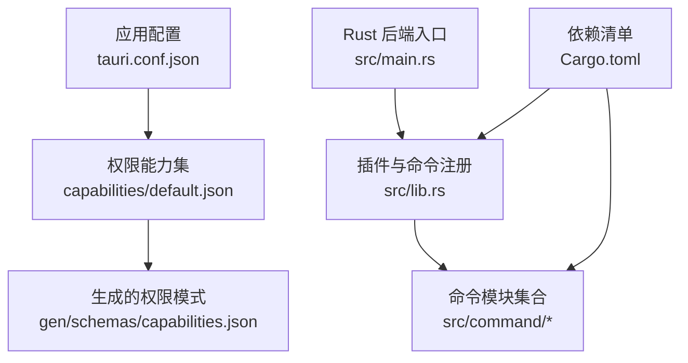
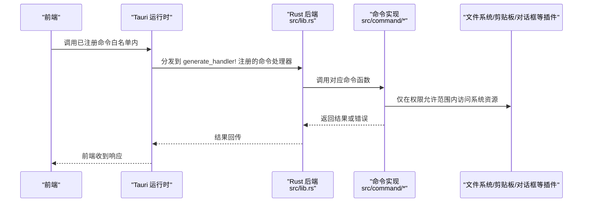
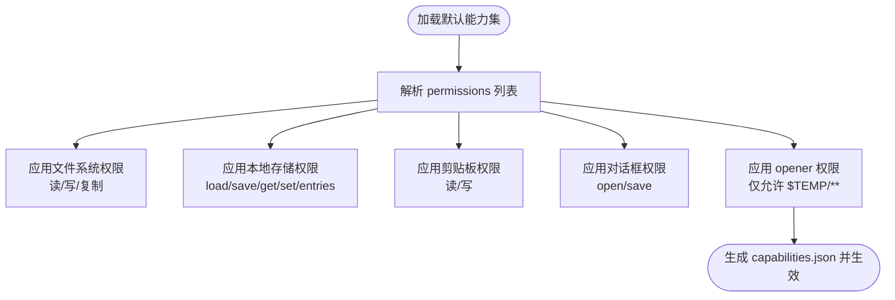
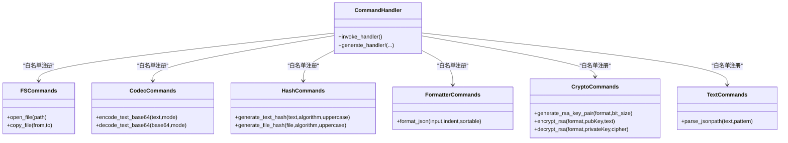
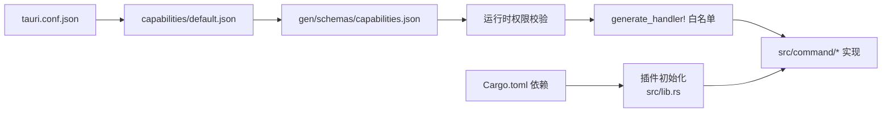

# 安全模型与权限控制

<cite>
**本文引用的文件**
- [tauri.conf.json](file://src-tauri/tauri.conf.json)
- [default.json](file://src-tauri/capabilities/default.json)
- [capabilities.json](file://src-tauri/gen/schemas/capabilities.json)
- [Cargo.toml](file://src-tauri/Cargo.toml)
- [lib.rs](file://src-tauri/src/lib.rs)
- [main.rs](file://src-tauri/src/main.rs)
- [fs.rs](file://src-tauri/src/command/fs.rs)
- [base64_text.rs](file://src-tauri/src/command/codec/base64_text.rs)
- [hash.rs](file://src-tauri/src/command/generator/hash.rs)
- [json.rs](file://src-tauri/src/command/formatter/json.rs)
- [rsa.rs](file://src-tauri/src/command/crypto/rsa.rs)
- [jsonpath.rs](file://src-tauri/src/command/text/jsonpath.rs)
- [error.rs](file://src-tauri/src/error.rs)
</cite>

## 目录
1. [引言](#引言)
2. [项目结构](#项目结构)
3. [核心组件](#核心组件)
4. [架构总览](#架构总览)
5. [详细组件分析](#详细组件分析)
6. [依赖关系分析](#依赖关系分析)
7. [性能考量](#性能考量)
8. [故障排查指南](#故障排查指南)
9. [结论](#结论)
10. [附录](#附录)

## 引言
本文件聚焦于 devkimi 项目的安全模型与权限控制，围绕以下主题展开：
- 深入解析 tauri.conf.json 中的安全配置项（包括 csp、security、app 等），说明其对应用运行时行为的影响。
- 解释 capabilities/default.json 中定义的权限能力集如何限制应用功能，以及生成的 capabilities.json 的作用。
- 阐述 Tauri 命令白名单机制如何防止恶意代码执行，并结合 Cargo.toml 中的依赖安全考虑进行说明。
- 说明应用如何通过最小权限原则访问系统资源（如文件系统、剪贴板等）。
- 提供权限配置最佳实践，帮助在功能性和安全性之间取得平衡。

## 项目结构
devkimi 的安全相关配置主要集中在 src-tauri 目录下：
- 应用配置：tauri.conf.json
- 权限能力集：capabilities/default.json 及生成的 gen/schemas/capabilities.json
- Rust 后端：src/lib.rs 中注册插件与命令；src/main.rs 启动入口；各模块命令位于 src/command/* 下
- 依赖管理：Cargo.toml 中声明了 Tauri 插件与第三方库

图表来源
- [tauri.conf.json](file://src-tauri/tauri.conf.json#L1-L46)
- [default.json](file://src-tauri/capabilities/default.json#L1-L31)
- [capabilities.json](file://src-tauri/gen/schemas/capabilities.json#L1-L1)
- [lib.rs](file://src-tauri/src/lib.rs#L1-L57)
- [main.rs](file://src-tauri/src/main.rs#L1-L7)
- [Cargo.toml](file://src-tauri/Cargo.toml#L1-L69)

章节来源
- [tauri.conf.json](file://src-tauri/tauri.conf.json#L1-L46)
- [default.json](file://src-tauri/capabilities/default.json#L1-L31)
- [capabilities.json](file://src-tauri/gen/schemas/capabilities.json#L1-L1)
- [lib.rs](file://src-tauri/src/lib.rs#L1-L57)
- [main.rs](file://src-tauri/src/main.rs#L1-L7)
- [Cargo.toml](file://src-tauri/Cargo.toml#L1-L69)

## 核心组件
- 应用配置（tauri.conf.json）
  - app.windows：窗口尺寸与可调整性等 UI 行为
  - app.security：安全策略，包含 csp 与 assetProtocol
- 权限能力集（capabilities/default.json）
  - identifier/windows/description：能力集标识、适用窗口、描述
  - permissions：权限列表，含 core:default、clipboard-manager、dialog、fs、store、opener 等
- Rust 后端（src/lib.rs）
  - 注册插件：store、opener、fs、clipboard-manager、dialog
  - 生成命令处理器：通过 generate_handler! 将命令白名单化
- 依赖（Cargo.toml）
  - tauri 与各插件版本，以及业务依赖库

章节来源
- [tauri.conf.json](file://src-tauri/tauri.conf.json#L1-L46)
- [default.json](file://src-tauri/capabilities/default.json#L1-L31)
- [lib.rs](file://src-tauri/src/lib.rs#L1-L57)
- [Cargo.toml](file://src-tauri/Cargo.toml#L1-L69)

## 架构总览
下面的序列图展示了前端调用后端命令的典型流程，以及命令白名单与权限能力集如何共同约束执行范围。

图表来源
- [lib.rs](file://src-tauri/src/lib.rs#L1-L57)
- [fs.rs](file://src-tauri/src/command/fs.rs#L1-L34)
- [base64_text.rs](file://src-tauri/src/command/codec/base64_text.rs#L1-L22)
- [hash.rs](file://src-tauri/src/command/generator/hash.rs#L1-L52)
- [json.rs](file://src-tauri/src/command/formatter/json.rs#L1-L39)
- [rsa.rs](file://src-tauri/src/command/crypto/rsa.rs#L1-L78)
- [jsonpath.rs](file://src-tauri/src/command/text/jsonpath.rs#L1-L19)

## 详细组件分析

### 应用配置（tauri.conf.json）安全项解析
- app.security.csp
  - 当前值为 null，表示未显式设置内容安全策略。建议在生产构建中明确设置 CSP，以降低 XSS 与脚本注入风险。
- app.security.assetProtocol
  - enable: true，启用协议资产，允许通过自定义协议加载资源
  - scope: ["$TEMP/**"]，限定可访问的资源范围为临时目录，有助于限制资源暴露面
- app.windows
  - 设置窗口初始宽高、最小尺寸与可调整性，影响用户体验与安全边界（例如避免过小窗口导致的 UI 欺骗）

章节来源
- [tauri.conf.json](file://src-tauri/tauri.conf.json#L1-L46)

### 权限能力集（capabilities/default.json）与生成模式
- identifier/windows/description
  - identifier: default，能力集名称
  - windows: ["main"]，仅对主窗口生效
  - description: 默认权限说明
- permissions 列表
  - core:default：基础能力
  - clipboard-manager:allow-write-text、clipboard-manager:allow-read-text：读写剪贴板文本
  - dialog:allow-open、dialog:allow-save：打开/保存对话框
  - fs:allow-read-text-file、fs:allow-write-text-file、fs:allow-copy-file：文件读取、写入与复制
  - store:allow-load、store:allow-save、store:allow-get、store:allow-set、store:allow-entries：本地存储读写
  - opener:allow-open-path：允许打开指定路径，当前限制为 $TEMP/**
- 生成模式（gen/schemas/capabilities.json）
  - 由默认能力集生成，用于运行时校验与验证，确保实际生效的权限与配置一致

图表来源
- [default.json](file://src-tauri/capabilities/default.json#L1-L31)
- [capabilities.json](file://src-tauri/gen/schemas/capabilities.json#L1-L1)

章节来源
- [default.json](file://src-tauri/capabilities/default.json#L1-L31)
- [capabilities.json](file://src-tauri/gen/schemas/capabilities.json#L1-L1)

### 命令白名单机制与最小权限原则
- 命令白名单
  - 在 src/lib.rs 中通过 generate_handler! 显式列出所有可被前端调用的命令，未在此处注册的命令无法被调用，从而有效防止任意命令执行。
- 最小权限原则
  - 仅授予完成任务所需的最小权限。例如：
    - 文件操作：仅使用 fs:allow-* 权限，且通过 opener 限制路径范围为 $TEMP/**
    - 剪贴板：仅使用 clipboard-manager:allow-read-text 与 allow-write-text
    - 对话框：仅使用 dialog:allow-open 与 dialog:allow-save
- 命令实现示例
  - 文件系统：open_file/copy_file 仅在权限允许范围内进行系统调用
  - 编解码：base64_text 仅进行内存内的字符串与字节转换
  - 哈希：hash 仅读取文件内容并计算摘要
  - JSON 格式化：json 仅进行内存内的 JSON 解析与格式化
  - RSA：仅进行密钥生成与加解密，不涉及文件系统写入

图表来源
- [lib.rs](file://src-tauri/src/lib.rs#L1-L57)
- [fs.rs](file://src-tauri/src/command/fs.rs#L1-L34)
- [base64_text.rs](file://src-tauri/src/command/codec/base64_text.rs#L1-L22)
- [hash.rs](file://src-tauri/src/command/generator/hash.rs#L1-L52)
- [json.rs](file://src-tauri/src/command/formatter/json.rs#L1-L39)
- [rsa.rs](file://src-tauri/src/command/crypto/rsa.rs#L1-L78)
- [jsonpath.rs](file://src-tauri/src/command/text/jsonpath.rs#L1-L19)

章节来源
- [lib.rs](file://src-tauri/src/lib.rs#L1-L57)
- [fs.rs](file://src-tauri/src/command/fs.rs#L1-L34)
- [base64_text.rs](file://src-tauri/src/command/codec/base64_text.rs#L1-L22)
- [hash.rs](file://src-tauri/src/command/generator/hash.rs#L1-L52)
- [json.rs](file://src-tauri/src/command/formatter/json.rs#L1-L39)
- [rsa.rs](file://src-tauri/src/command/crypto/rsa.rs#L1-L78)
- [jsonpath.rs](file://src-tauri/src/command/text/jsonpath.rs#L1-L19)

### 错误处理与安全边界
- 统一错误宏
  - 通过 command_error! 定义命令级错误类型，并自动实现序列化，便于前端统一捕获与展示
- 常见错误场景
  - IO 错误：文件读写失败、路径无效
  - 字符串/编码错误：UTF-8 解码失败、Base64 解码失败
  - 加密错误：RSA/PKCS1/PKCS8 解析失败
- 安全意义
  - 明确的错误类型与消息，避免泄露内部细节
  - 通过最小权限与白名单，减少潜在攻击面

章节来源
- [error.rs](file://src-tauri/src/error.rs#L1-L31)
- [hash.rs](file://src-tauri/src/command/generator/hash.rs#L1-L52)
- [rsa.rs](file://src-tauri/src/command/crypto/rsa.rs#L1-L78)
- [base64_text.rs](file://src-tauri/src/command/codec/base64_text.rs#L1-L22)
- [json.rs](file://src-tauri/src/command/formatter/json.rs#L1-L39)

### 依赖安全考虑（Cargo.toml）
- 插件依赖
  - tauri-plugin-store、tauri-plugin-opener、tauri-plugin-fs、tauri-plugin-clipboard-manager、tauri-plugin-dialog：均以 v2 版本引入，遵循官方安全更新节奏
- 业务依赖
  - base64、image、regex、serde_json、serde_yaml、qrcode、sqlformat、uuid 等：均为常用库，建议定期更新至安全版本
- 构建与发布
  - profile.release 中启用 LTO、strip、panic=abort 等，提升运行时安全与体积控制
- 安全建议
  - 定期审阅依赖版本，关注 CVE 与安全公告
  - 仅启用必要插件与功能，避免引入不必要的攻击面

章节来源
- [Cargo.toml](file://src-tauri/Cargo.toml#L1-L69)

## 依赖关系分析
- 配置到运行时
  - tauri.conf.json 决定应用行为与安全策略
  - capabilities/default.json 与生成的 capabilities.json 决定权限范围
  - src/lib.rs 通过 generate_handler! 将命令白名单化
- 插件到命令
  - 各插件在 src/lib.rs 中初始化，命令在 src/command/* 实现，二者通过白名单关联
- 依赖到功能
  - Cargo.toml 中的依赖决定命令可用的功能范围（如加密、图像、正则等）

图表来源
- [tauri.conf.json](file://src-tauri/tauri.conf.json#L1-L46)
- [default.json](file://src-tauri/capabilities/default.json#L1-L31)
- [capabilities.json](file://src-tauri/gen/schemas/capabilities.json#L1-L1)
- [lib.rs](file://src-tauri/src/lib.rs#L1-L57)
- [Cargo.toml](file://src-tauri/Cargo.toml#L1-L69)

章节来源
- [tauri.conf.json](file://src-tauri/tauri.conf.json#L1-L46)
- [default.json](file://src-tauri/capabilities/default.json#L1-L31)
- [capabilities.json](file://src-tauri/gen/schemas/capabilities.json#L1-L1)
- [lib.rs](file://src-tauri/src/lib.rs#L1-L57)
- [Cargo.toml](file://src-tauri/Cargo.toml#L1-L69)

## 性能考量
- 发布配置优化
  - LTO、strip、panic=abort 等选项在 release 中启用，有助于减小二进制体积并提升运行时性能
- 命令执行路径
  - 白名单机制减少无效调用开销，同时避免不必要的系统调用
- I/O 与算法
  - 文件哈希与 JSON 格式化等操作应避免大对象的重复拷贝，尽量采用就地处理或流式处理

[本节为通用指导，无需引用具体文件]

## 故障排查指南
- 前端调用命令报错
  - 检查 src/lib.rs 的 generate_handler! 是否包含该命令
  - 检查 capabilities/default.json 是否授予相应权限
- 文件访问失败
  - 确认 opener 路径是否在 $TEMP/** 以内
  - 检查 fs 权限是否正确配置
- 剪贴板/对话框异常
  - 确认 clipboard-manager 与 dialog 权限是否启用
- 加密/编码错误
  - 检查输入格式（如 Base64、PEM、JSON）是否符合预期
- 错误信息显示
  - 使用统一的错误宏，确保错误消息可读且不泄露敏感信息

章节来源
- [lib.rs](file://src-tauri/src/lib.rs#L1-L57)
- [default.json](file://src-tauri/capabilities/default.json#L1-L31)
- [error.rs](file://src-tauri/src/error.rs#L1-L31)

## 结论
devkimi 通过“配置 + 能力集 + 白名单 + 插件”的组合实现了清晰的安全边界：
- tauri.conf.json 控制运行时安全策略与资源访问范围
- capabilities/default.json 与生成的 capabilities.json 明确授权范围
- generate_handler! 将命令白名单化，杜绝任意命令执行
- Cargo.toml 中的依赖与发布配置进一步强化了整体安全性与性能

在功能与安全之间取得平衡的关键在于：尽可能使用最小权限、严格限制资源范围、保持依赖更新与配置透明。

[本节为总结，无需引用具体文件]

## 附录
- 最佳实践清单
  - 明确设置 CSP（生产环境）
  - 严格限定 assetProtocol 的 scope
  - 仅授予完成任务所需的最小权限
  - 使用 opener 限制外部路径访问范围
  - 定期更新依赖与插件版本
  - 保持 generate_handler! 白名单与权限能力集同步
  - 使用统一错误处理，避免泄露内部细节

[本节为通用指导，无需引用具体文件]