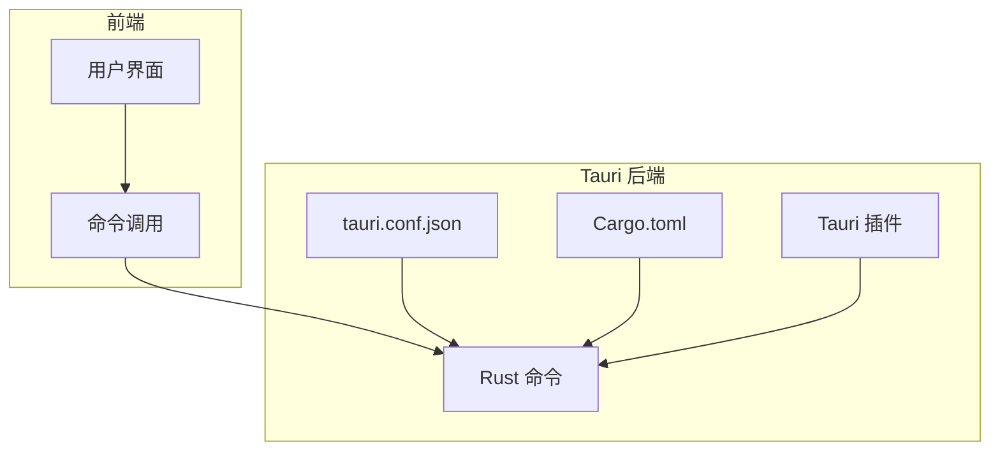
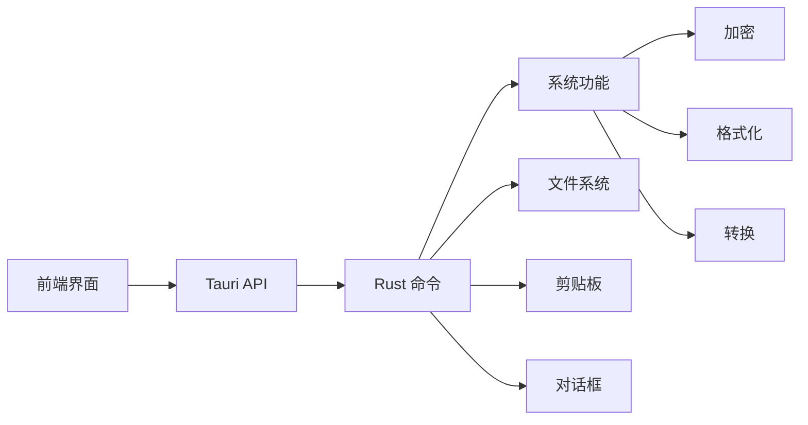
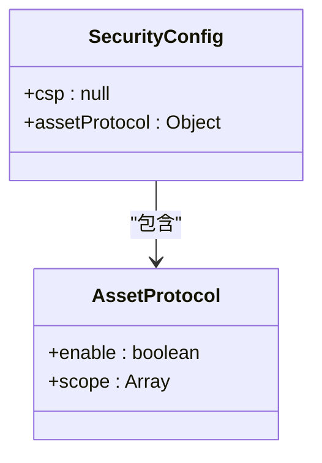
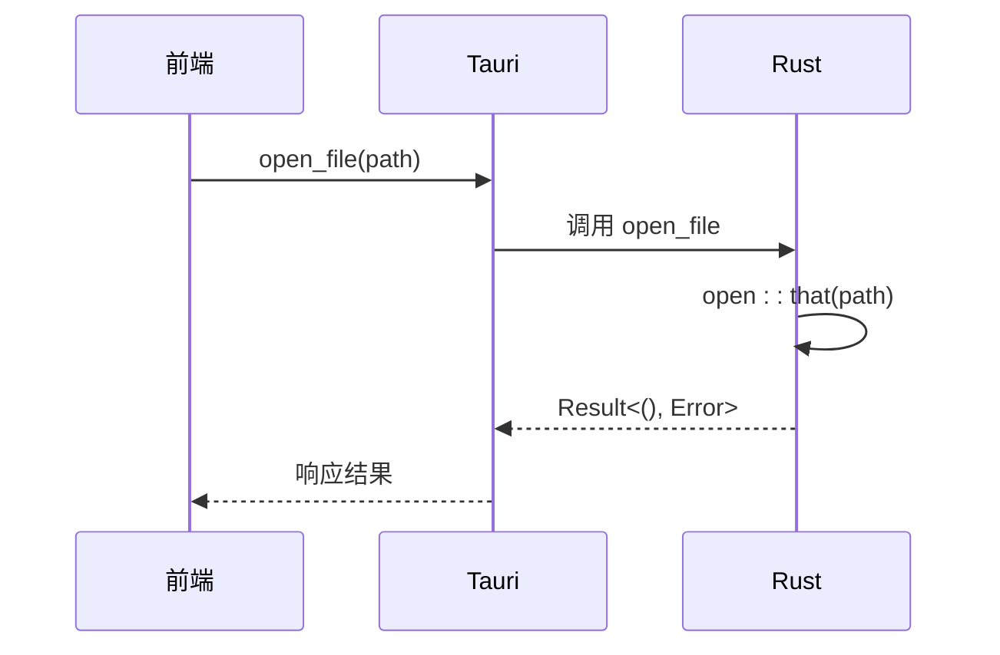
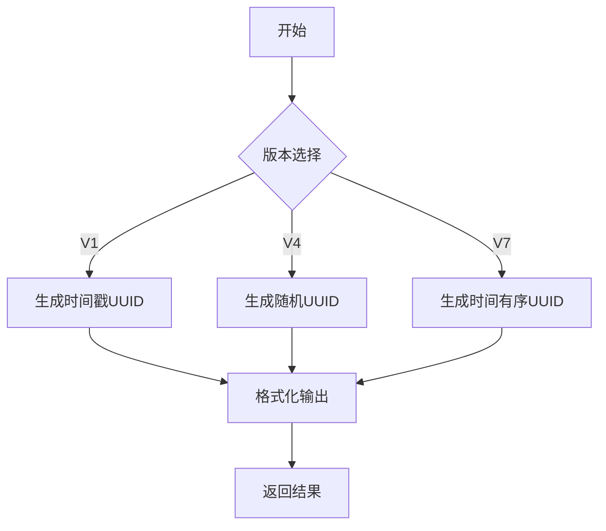
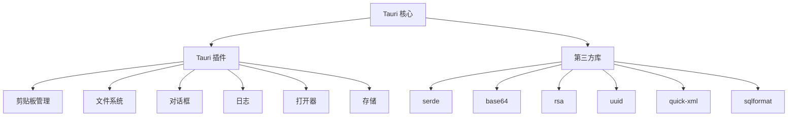

# 后端配置机制

<cite>
**本文档引用的文件**  
- [tauri.conf.json](file://src-tauri/tauri.conf.json)
- [Cargo.toml](file://src-tauri/Cargo.toml)
- [default.json](file://src-tauri/capabilities/default.json)
- [main.rs](file://src-tauri/src/main.rs)
- [lib.rs](file://src-tauri/src/lib.rs)
- [fs.rs](file://src-tauri/src/command/fs.rs)
- [font.rs](file://src-tauri/src/command/font.rs)
- [uuid.rs](file://src-tauri/src/command/generator/uuid.rs)
- [rsa.rs](file://src-tauri/src/command/crypto/rsa.rs)
- [base64_text.rs](file://src-tauri/src/command/codec/base64_text.rs)
- [json.rs](file://src-tauri/src/command/formatter/json.rs)
- [error.rs](file://src-tauri/src/error.rs)
- [build.rs](file://src-tauri/build.rs)
</cite>

## 目录
1. [简介](#简介)
2. [项目结构](#项目结构)
3. [核心组件](#核心组件)
4. [架构概述](#架构概述)
5. [详细组件分析](#详细组件分析)
6. [依赖分析](#依赖分析)
7. [性能考虑](#性能考虑)
8. [故障排除指南](#故障排除指南)
9. [结论](#结论)

## 简介
本文档深入解析devkimi项目的后端配置机制，重点分析Tauri框架的配置文件和Rust依赖项管理。文档详细说明了`tauri.conf.json`中的安全配置、权限设置、构建选项和系统集成参数，以及`Cargo.toml`中列出的Rust依赖项的版本管理和功能作用。通过配置项与实际功能的映射关系，展示关键配置对应用安全性、性能和兼容性的影响，并提供配置最佳实践和常见错误排查指南。

## 项目结构
devkimi项目采用Tauri框架构建，前端使用SolidJS，后端使用Rust。项目结构清晰，分为前端源码（`src/`）和Tauri后端（`src-tauri/`）两大部分。Tauri后端包含Rust代码、配置文件和构建脚本，实现了系统级功能的调用和安全控制。



**图示来源**  
- [tauri.conf.json](file://src-tauri/tauri.conf.json#L1-L46)
- [Cargo.toml](file://src-tauri/Cargo.toml#L1-L70)

**本节来源**  
- [tauri.conf.json](file://src-tauri/tauri.conf.json#L1-L46)
- [Cargo.toml](file://src-tauri/Cargo.toml#L1-L70)

## 核心组件
devkimi项目的核心组件包括Tauri配置系统、Rust命令实现和Tauri插件集成。`tauri.conf.json`定义了应用的基本属性、安全策略和构建选项，而`Cargo.toml`管理Rust依赖项和构建配置。Rust命令实现了各种系统级功能，如文件操作、加密解密、格式化等。

**本节来源**  
- [tauri.conf.json](file://src-tauri/tauri.conf.json#L1-L46)
- [Cargo.toml](file://src-tauri/Cargo.toml#L1-L70)
- [lib.rs](file://src-tauri/src/lib.rs#L1-L57)

## 架构概述
devkimi项目采用前后端分离架构，前端负责用户界面展示和交互，后端通过Tauri框架提供系统级功能调用。Tauri后端通过Rust命令暴露API，前端通过Tauri API调用这些命令，实现跨语言通信。安全配置和权限管理通过Tauri的能力系统实现，确保应用的安全性。



**图示来源**  
- [lib.rs](file://src-tauri/src/lib.rs#L1-L57)
- [tauri.conf.json](file://src-tauri/tauri.conf.json#L1-L46)

## 详细组件分析

### Tauri 配置分析
`tauri.conf.json`文件定义了应用的基本属性、安全策略和构建选项。其中，`build`部分配置了前端资源路径和开发/构建命令，`app`部分定义了窗口属性和安全策略，`bundle`部分配置了应用打包选项。

#### 安全配置


**图示来源**  
- [tauri.conf.json](file://src-tauri/tauri.conf.json#L24-L31)

**本节来源**  
- [tauri.conf.json](file://src-tauri/tauri.conf.json#L1-L46)

### Rust 依赖项分析
`Cargo.toml`文件管理了项目的所有Rust依赖项，包括核心功能库和Tauri插件。这些依赖项按功能分类，协同支持系统级功能的实现。

#### 依赖项功能映射
| 依赖项 | 版本 | 功能作用 | 相关功能 |
|--------|------|----------|----------|
| tauri | 2.9.1 | Tauri 框架核心 | 所有系统调用 |
| serde | 1.0 | 序列化/反序列化 | JSON/YAML 处理 |
| base64 | 0.22 | Base64 编解码 | 文本/图像编码 |
| rsa | 0.9 | RSA 加密解密 | 密钥生成/加密 |
| uuid | 1.18 | UUID 生成 | 唯一标识符生成 |
| flate2 | 1.1 | GZIP 压缩 | 数据压缩/解压 |
| quick-xml | 0.38 | XML 处理 | XML 格式化 |
| sqlformat | 0.5.0 | SQL 格式化 | SQL 代码美化 |
| cron | 0.15 | Cron 表达式解析 | 定时任务解析 |
| jsonpath-rust | 1.0 | JSONPath 解析 | JSON 数据查询 |

**本节来源**  
- [Cargo.toml](file://src-tauri/Cargo.toml#L21-L59)
- [lib.rs](file://src-tauri/src/lib.rs#L1-L57)

### 命令实现分析
Rust命令实现了各种系统级功能，通过`#[tauri::command]`宏暴露给前端调用。每个命令都有明确的输入输出和错误处理机制。

#### 文件操作命令


**图示来源**  
- [fs.rs](file://src-tauri/src/command/fs.rs#L1-L34)

**本节来源**  
- [fs.rs](file://src-tauri/src/command/fs.rs#L1-L34)
- [lib.rs](file://src-tauri/src/lib.rs#L11-L43)

#### UUID 生成命令


**图示来源**  
- [uuid.rs](file://src-tauri/src/command/generator/uuid.rs#L1-L48)

**本节来源**  
- [uuid.rs](file://src-tauri/src/command/generator/uuid.rs#L1-L48)
- [lib.rs](file://src-tauri/src/lib.rs#L18-L19)

## 依赖分析
devkimi项目的依赖关系清晰，Tauri框架作为核心，集成了多个功能插件和第三方库。这些依赖项按功能分层，确保了代码的模块化和可维护性。



**图示来源**  
- [Cargo.toml](file://src-tauri/Cargo.toml#L21-L59)
- [lib.rs](file://src-tauri/src/lib.rs#L6-L10)

**本节来源**  
- [Cargo.toml](file://src-tauri/Cargo.toml#L1-L70)
- [lib.rs](file://src-tauri/src/lib.rs#L1-L57)

## 性能考虑
devkimi项目的性能优化主要体现在构建配置和依赖管理上。`Cargo.toml`中的`[profile.release]`配置启用了链接时优化（LTO）、代码生成单元优化和符号剥离，确保了发布版本的性能和体积优化。

```toml
[profile.release]
codegen-units = 1
lto = true
opt-level = "s"
panic = "abort"
strip = true
```

这些配置优先考虑小的二进制文件大小，同时通过禁用panic处理程序来提高性能。

**本节来源**  
- [Cargo.toml](file://src-tauri/Cargo.toml#L61-L69)

## 故障排除指南
在配置和使用devkimi项目时，可能会遇到一些常见问题。以下是一些常见错误及其解决方案：

1. **构建失败**：检查`Cargo.toml`中的依赖项版本是否兼容，确保Rust版本满足要求（1.77.2）。
2. **命令调用失败**：检查`tauri.conf.json`中的权限配置，确保相关功能的权限已启用。
3. **安全策略错误**：检查`tauri.conf.json`中的`assetProtocol`范围配置，确保路径匹配。
4. **依赖项缺失**：运行`cargo build`确保所有依赖项已正确下载和编译。

**本节来源**  
- [tauri.conf.json](file://src-tauri/tauri.conf.json#L1-L46)
- [Cargo.toml](file://src-tauri/Cargo.toml#L1-L70)
- [error.rs](file://src-tauri/src/error.rs#L1-L31)

## 结论
devkimi项目的后端配置机制通过Tauri框架和Rust依赖项管理，实现了安全、高效和可维护的系统级功能调用。`tauri.conf.json`和`Cargo.toml`文件的合理配置，确保了应用的安全性、性能和兼容性。通过详细的配置分析和最佳实践，开发者可以更好地理解和优化项目配置。