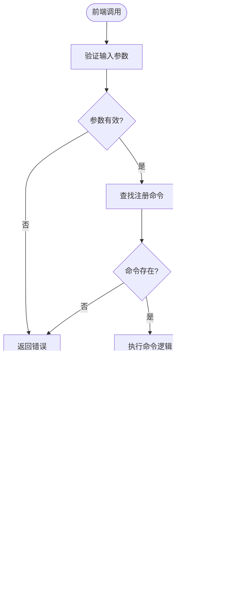

# 应用初始化流程

<cite>
**本文档中引用的文件**  
- [lib.rs](file://src-tauri/src/lib.rs)
- [main.rs](file://src-tauri/src/main.rs)
- [Cargo.toml](file://src-tauri/Cargo.toml)
- [tauri.conf.json](file://src-tauri/tauri.conf.json)
- [build.rs](file://src-tauri/build.rs)
- [command/mod.rs](file://src-tauri/src/command/mod.rs)
- [fs.rs](file://src-tauri/src/command/fs.rs)
- [font.rs](file://src-tauri/src/command/font.rs)
- [formatter/json.rs](file://src-tauri/src/command/formatter/json.rs)
- [formatter/sql.rs](file://src-tauri/src/command/formatter/sql.rs)
- [formatter/xml.rs](file://src-tauri/src/command/formatter/xml.rs)
- [generator/uuid.rs](file://src-tauri/src/command/generator/uuid.rs)
- [crypto/rsa.rs](file://src-tauri/src/command/crypto/rsa.rs)
- [error.rs](file://src-tauri/src/error.rs)
- [routes.tsx](file://src/routes.tsx)
- [package.json](file://package.json)
</cite>

## 目录
1. [简介](#简介)
2. [项目结构](#项目结构)
3. [核心组件](#核心组件)
4. [架构概述](#架构概述)
5. [详细组件分析](#详细组件分析)
6. [依赖分析](#依赖分析)
7. [性能考虑](#性能考虑)
8. [故障排除指南](#故障排除指南)
9. [结论](#结论)

## 简介
本文档详细解析devkimi项目的Tauri应用初始化流程，重点分析`lib.rs`中的应用初始化过程，包括系统权限配置、命令注册和事件监听器设置。同时说明`main.rs`中的构建配置如何与`lib.rs`协同工作，实现应用启动时的资源加载和系统集成。文档包含从应用启动到完全初始化的时序图，展示各个初始化步骤的执行顺序和依赖关系，并提供错误处理机制、初始化失败恢复策略以及性能优化建议。

## 项目结构
devkimi项目采用典型的Tauri多语言架构，前端使用TypeScript/SolidJS，后端使用Rust。项目结构清晰地分为前端和后端两个主要部分，通过Tauri框架进行集成。


**图源**  
- [src-tauri/src/lib.rs](file://src-tauri/src/lib.rs#L1-L57)
- [src-tauri/src/main.rs](file://src-tauri/src/main.rs#L1-L7)
- [src/routes.tsx](file://src/routes.tsx#L1-L62)

## 核心组件
devkimi项目的核心组件包括Tauri应用初始化器、命令处理器、系统插件和前端路由系统。`lib.rs`文件中的`run`函数是整个应用的初始化入口，负责配置Tauri应用实例，注册所有可用的命令，并设置必要的插件。

**章节源**  
- [lib.rs](file://src-tauri/src/lib.rs#L4-L57)
- [main.rs](file://src-tauri/src/main.rs#L4-L6)

## 架构概述
devkimi应用采用前后端分离的架构模式，前端负责用户界面展示和交互，后端（Rust）负责执行系统级操作和复杂计算。Tauri框架作为桥梁，通过安全的API调用机制连接前后端。


**图源**  
- [lib.rs](file://src-tauri/src/lib.rs#L5-L43)
- [Cargo.toml](file://src-tauri/Cargo.toml#L20-L59)
- [tauri.conf.json](file://src-tauri/tauri.conf.json#L1-L46)

## 详细组件分析

### Tauri应用初始化分析
`lib.rs`文件中的`run`函数是Tauri应用的初始化核心，通过链式调用配置应用的各种属性和功能。

#### 初始化流程类图


**图源**  
- [lib.rs](file://src-tauri/src/lib.rs#L5-L57)
- [Cargo.toml](file://src-tauri/Cargo.toml#L50-L55)

#### 应用初始化时序图


**图源**  
- [main.rs](file://src-tauri/src/main.rs#L5-L6)
- [lib.rs](file://src-tauri/src/lib.rs#L5-L57)
- [build.rs](file://src-tauri/build.rs#L2-L3)

### 命令注册机制分析
devkimi项目通过`tauri::generate_handler!`宏注册所有可用的命令，这些命令分布在不同的模块中，形成了一个完整的工具集。

#### 命令模块结构图


**图源**  
- [lib.rs](file://src-tauri/src/lib.rs#L11-L43)
- [command/mod.rs](file://src-tauri/src/command/mod.rs#L1-L8)

#### 命令调用流程图


**图源**  
- [formatter/json.rs](file://src-tauri/src/command/formatter/json.rs#L13-L34)
- [formatter/sql.rs](file://src-tauri/src/command/formatter/sql.rs#L18-L35)
- [formatter/xml.rs](file://src-tauri/src/command/formatter/xml.rs#L15-L37)

### 系统权限配置分析
Tauri应用的权限配置通过`tauri.conf.json`文件和`capabilities/default.json`文件共同管理，确保应用只能访问必要的系统资源。

#### 权限配置关系图


**图源**  
- [tauri.conf.json](file://src-tauri/tauri.conf.json#L1-L46)
- [gen/schemas/windows-schema.json](file://src-tauri/gen/schemas/windows-schema.json#L5173-L5234)

## 依赖分析
devkimi项目的依赖关系复杂而有序，前后端通过Tauri API进行通信，后端各模块通过Rust的模块系统组织。


**图源**  
- [Cargo.toml](file://src-tauri/Cargo.toml#L20-L59)
- [lib.rs](file://src-tauri/src/lib.rs#L6-L10)
- [package.json](file://package.json#L30-L35)

## 性能考虑
devkimi项目在性能方面进行了多方面的优化，包括构建配置、代码结构和运行时行为。

### 构建性能优化
在`Cargo.toml`文件中，项目配置了针对发布版本的优化选项，以提高最终二进制文件的性能和减小体积。

```toml
[profile.release]
codegen-units = 1      # 允许LLVM执行更好的优化
lto = true             # 启用链接时优化
opt-level = "s"        # 优先考虑小的二进制文件大小
panic = "abort"        # 通过禁用panic处理程序来提高性能
strip = true           # 确保移除调试符号
```

这些配置确保了发布版本的应用具有最佳的性能表现和最小的文件大小。

### 运行时性能优化
项目通过以下方式优化运行时性能：
1. 使用高效的Rust库进行核心计算
2. 采用异步命令处理（如RSA加密操作）
3. 在前端使用SolidJS的响应式系统减少不必要的重新渲染
4. 通过Tauri的插件系统按需加载功能

**章节源**  
- [Cargo.toml](file://src-tauri/Cargo.toml#L64-L70)
- [crypto/rsa.rs](file://src-tauri/src/command/crypto/rsa.rs#L16)
- [routes.tsx](file://src/routes.tsx#L50-L51)

## 故障排除指南
当应用初始化失败或功能异常时，可以按照以下步骤进行排查：

### 初始化失败排查流程


### 常见问题及解决方案
| 问题现象 | 可能原因 | 解决方案 |
|--------|--------|--------|
| 应用无法启动 | 配置文件错误 | 验证`tauri.conf.json`语法正确性 |
| 命令调用失败 | 命令未正确注册 | 检查`lib.rs`中的`invoke_handler`列表 |
| 插件功能异常 | 插件未正确加载 | 确认`Cargo.toml`中已添加相应依赖 |
| 构建失败 | Rust环境未配置 | 安装Rust工具链并配置环境变量 |
| 前后端通信失败 | API调用路径错误 | 检查前端调用的命令名称是否匹配 |

**章节源**  
- [lib.rs](file://src-tauri/src/lib.rs#L44-L53)
- [tauri.conf.json](file://src-tauri/tauri.conf.json#L1-L46)
- [error.rs](file://src-tauri/src/error.rs#L1-L31)

## 结论
devkimi项目的应用初始化流程设计合理，通过Tauri框架实现了前后端的高效集成。`lib.rs`文件中的初始化过程系统地配置了应用所需的所有插件和命令，确保了应用启动时的完整功能集。`main.rs`文件简洁地调用了`lib.rs`中的`run`函数，遵循了Rust项目的标准结构。

项目通过精心设计的模块化架构，将不同的功能分离到独立的模块中，提高了代码的可维护性和可扩展性。系统权限配置通过Tauri的标准机制进行管理，确保了应用的安全性。性能优化方面，项目在构建配置和运行时行为上都进行了充分考虑，为用户提供流畅的使用体验。

未来可以进一步优化的方向包括：实现更精细的权限控制、增加更多的运行时诊断功能、优化启动时间以及增强错误处理的用户体验。