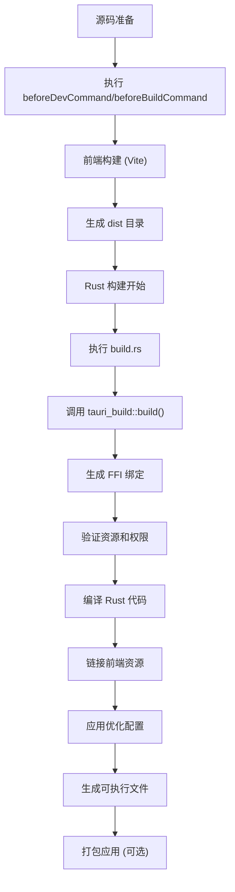

# 构建与编译机制

<cite>
**本文档引用的文件**  
- [build.rs](file://src-tauri/build.rs)
- [Cargo.toml](file://src-tauri/Cargo.toml)
- [tauri.conf.json](file://src-tauri/tauri.conf.json)
- [package.json](file://package.json)
- [vite.config.ts](file://vite.config.ts)
- [main.rs](file://src-tauri/src/main.rs)
- [lib.rs](file://src-tauri/src/lib.rs)
- [capabilities/default.json](file://src-tauri/capabilities/default.json)
</cite>

## 目录
1. [项目结构](#项目结构)
2. [构建脚本分析](#构建脚本分析)
3. [Cargo.toml 配置解析](#cargotoml-配置解析)
4. [Tauri 配置文件分析](#tauri-配置文件分析)
5. [前端构建配置](#前端构建配置)
6. [构建流程图](#构建流程图)
7. [权限与安全配置](#权限与安全配置)
8. [常见构建错误与解决方案](#常见构建错误与解决方案)

## 项目结构

devkimi 项目采用 Tauri 框架构建的桌面应用程序，具有典型的前后端分离结构。项目主要分为两个部分：前端代码位于 `src` 目录，使用 SolidJS 框架；后端 Rust 代码位于 `src-tauri` 目录，通过 Tauri 提供系统级功能。

**Section sources**
- [src-tauri](file://src-tauri)
- [src](file://src)

## 构建脚本分析

`build.rs` 是 Rust 项目的构建脚本，在编译时执行。devkimi 项目的构建脚本非常简洁，仅包含一行核心调用：

```rust
fn main() {
    tauri_build::build()
}
```

该脚本通过调用 `tauri_build::build()` 函数，触发 Tauri 的构建时逻辑。这个函数主要负责：

1. **代码生成**：为 Tauri 命令生成必要的 FFI（外部函数接口）绑定
2. **资源验证**：检查应用程序资源（如图标）的完整性
3. **平台适配**：根据目标平台生成适当的构建配置
4. **安全检查**：验证权限配置的正确性

尽管脚本本身简单，但它作为入口点，激活了 Tauri 构建系统的复杂功能链。

**Section sources**
- [build.rs](file://src-tauri/build.rs#L1-L3)

## Cargo.toml 配置解析

`Cargo.toml` 是 Rust 项目的依赖和构建配置文件，对构建过程起着关键作用。

### 包配置
```toml
[package]
name = "devkimi"
version = "0.1.1-dev"
edition = "2021"
rust-version = "1.77.2"
```

这些配置定义了项目的基本信息和 Rust 编译器版本要求，确保构建环境的一致性。

### 构建依赖
```toml
[build-dependencies]
tauri-build = { version = "2.5.1", features = [] }
```

`tauri-build` 作为构建依赖，提供了 `build.rs` 脚本中使用的 `tauri_build::build()` 函数，是构建时代码生成的核心。

### 运行时依赖
项目依赖了多个 Rust crate 来实现各种功能：
- `base64`, `flate2`, `qrcode`: 编解码功能
- `serde`, `serde_json`, `serde_yaml`: 数据序列化
- `regex`, `cron`: 文本处理
- `rsa`, `pkcs8`: 加密功能
- `tauri` 及其插件: Tauri 核心框架和功能扩展

### 构建配置文件
```toml
[profile.release]
codegen-units = 1
lto = true
opt-level = "s"
panic = "abort"
strip = true
```

这些优化配置在发布构建时启用，显著减小二进制文件大小并提升性能：
- `lto = true` 启用链接时优化，允许跨模块优化
- `opt-level = "s"` 优先优化文件大小
- `strip = true` 移除调试符号，减小最终文件大小
- `panic = "abort"` 禁用 panic 处理机制，减小体积

**Section sources**
- [Cargo.toml](file://src-tauri/Cargo.toml#L1-L70)

## Tauri 配置文件分析

`tauri.conf.json` 是 Tauri 应用的核心配置文件，定义了应用行为和构建选项。

### 应用基本信息
```json
{
  "productName": "devkimi",
  "version": "0.1.1",
  "identifier": "io.github.sodekim.devkimi"
}
```

这些字段定义了应用的显示名称、版本号和唯一标识符，用于应用分发和更新。

### 构建配置
```json
"build": {
  "frontendDist": "../dist",
  "devUrl": "http://localhost:3000",
  "beforeDevCommand": "pnpm dev",
  "beforeBuildCommand": "pnpm build"
}
```

这些配置建立了 Rust 后端与前端构建系统的集成：
- `beforeDevCommand` 和 `beforeBuildCommand` 在相应阶段自动执行前端构建命令
- `frontendDist` 指定前端构建输出目录，Tauri 将在此查找前端资源

### 窗口配置
```json
"windows": [
  {
    "title": "Devkimi",
    "width": 1200,
    "height": 800,
    "minWidth": 1200,
    "minHeight": 800
  }
]
```

定义了主窗口的初始尺寸和最小尺寸，确保应用启动时具有合适的界面布局。

### 安全配置
```json
"security": {
  "assetProtocol": {
    "enable": true,
    "scope": ["$TEMP/**"]
  }
}
```

启用资产协议并限制其作用域，允许应用安全地访问临时目录中的文件。

**Section sources**
- [tauri.conf.json](file://src-tauri/tauri.conf.json#L1-L46)

## 前端构建配置

前端构建系统基于 Vite，通过 `package.json` 和 `vite.config.ts` 进行配置。

### npm 脚本配置
```json
"scripts": {
  "start": "vite",
  "dev": "vite",
  "build": "vite build",
  "serve": "vite preview"
}
```

这些脚本定义了前端开发和构建的标准流程，与 Tauri 的 `beforeDevCommand` 和 `beforeBuildCommand` 形成完整的工作流。

### Vite 配置
```ts
export default defineConfig({
  plugins: [devtools(), solidPlugin(), tailwindcss()],
  server: {
    port: 3000,
  },
  build: {
    target: "esnext",
  },
});
```

Vite 配置集成了 SolidJS、Tailwind CSS 和开发工具，构建目标设置为 `esnext`，确保生成现代 JavaScript 代码。

**Section sources**
- [package.json](file://package.json#L1-L43)
- [vite.config.ts](file://vite.config.ts#L1-L15)

## 构建流程图



**Diagram sources**
- [tauri.conf.json](file://src-tauri/tauri.conf.json#L6-L11)
- [build.rs](file://src-tauri/build.rs#L1-L3)
- [Cargo.toml](file://src-tauri/Cargo.toml#L61-L69)

## 权限与安全配置

devkimi 项目通过多层配置确保应用的安全性。

### 能力配置
`src-tauri/capabilities/default.json` 文件定义了应用的权限：

```json
"permissions": [
  "core:default",
  "clipboard-manager:allow-write-text",
  "clipboard-manager:allow-read-text",
  "dialog:allow-open",
  "dialog:allow-save",
  "fs:allow-read-text-file",
  "fs:allow-write-text-file",
  "fs:allow-copy-file"
]
```

这些权限遵循最小权限原则，仅授予应用必需的功能：
- 剪贴板读写权限
- 文件对话框打开/保存权限
- 文本文件读写权限
- 文件复制权限

### 特定路径权限
```json
{
  "identifier": "opener:allow-open-path",
  "allow": [
    {
      "path": "$TEMP/**"
    }
  ]
}
```

`opener` 插件的权限被限制在系统临时目录，防止应用随意打开任意位置的文件，增强了安全性。

### 安全策略集成
这些权限配置与 `tauri.conf.json` 中的安全设置协同工作：
- 能力系统提供细粒度的权限控制
- CSP（内容安全策略）可进一步限制脚本执行
- 资产协议作用域限制资源访问范围

这种多层次的安全模型确保了应用既能提供必要功能，又不会过度获取系统权限。

**Section sources**
- [capabilities/default.json](file://src-tauri/capabilities/default.json#L1-L31)
- [tauri.conf.json](file://src-tauri/tauri.conf.json#L24-L32)

## 常见构建错误与解决方案

### 1. 依赖解析失败
**错误现象**：`cargo build` 报错无法解析依赖
**可能原因**：
- 网络问题导致无法访问 crates.io
- 本地 Cargo 缓存损坏
- 依赖版本冲突

**解决方案**：
```bash
# 清理 Cargo 缓存
cargo clean
# 更新依赖锁文件
cargo update
# 重新构建
cargo build
```

### 2. 前端资源找不到
**错误现象**：构建成功但运行时提示找不到前端资源
**可能原因**：
- `beforeBuildCommand` 未正确执行
- 前端构建失败
- `frontendDist` 路径配置错误

**解决方案**：
1. 手动执行 `pnpm build` 确保前端能成功构建
2. 检查 `dist` 目录是否存在且包含正确文件
3. 验证 `tauri.conf.json` 中的 `frontendDist` 路径

### 3. 权限配置错误
**错误现象**：应用运行时某些功能无法使用
**可能原因**：
- 必需的权限未在能力文件中声明
- 路径权限范围设置过窄

**解决方案**：
1. 检查 `capabilities/default.json` 是否包含所需权限
2. 根据功能需求调整路径权限范围
3. 重新构建以应用新的权限配置

### 4. 构建性能问题
**现象**：构建时间过长
**优化建议**：
- 开发阶段使用 `profile.dev` 配置的增量编译
- 确保 `incremental = true`
- 使用 SSD 存储以提高 I/O 性能
- 考虑使用 `sccache` 进行编译缓存

### 5. 平台特定问题
**Windows**：确保 `windows_subsystem = "windows"` 属性存在，防止发布版本出现控制台窗口
**macOS**：需要正确的代码签名和公证才能分发
**Linux**：注意不同发行版的依赖差异

**Section sources**
- [Cargo.toml](file://src-tauri/Cargo.toml#L61-L69)
- [tauri.conf.json](file://src-tauri/tauri.conf.json#L6-L11)
- [main.rs](file://src-tauri/src/main.rs#L2)