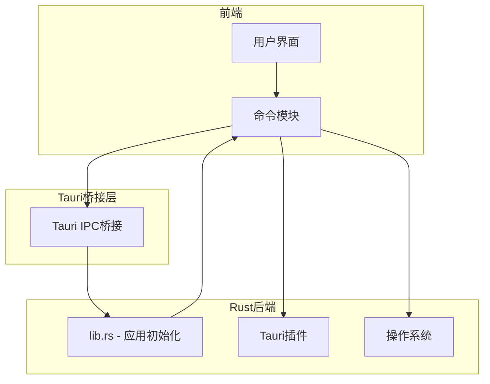
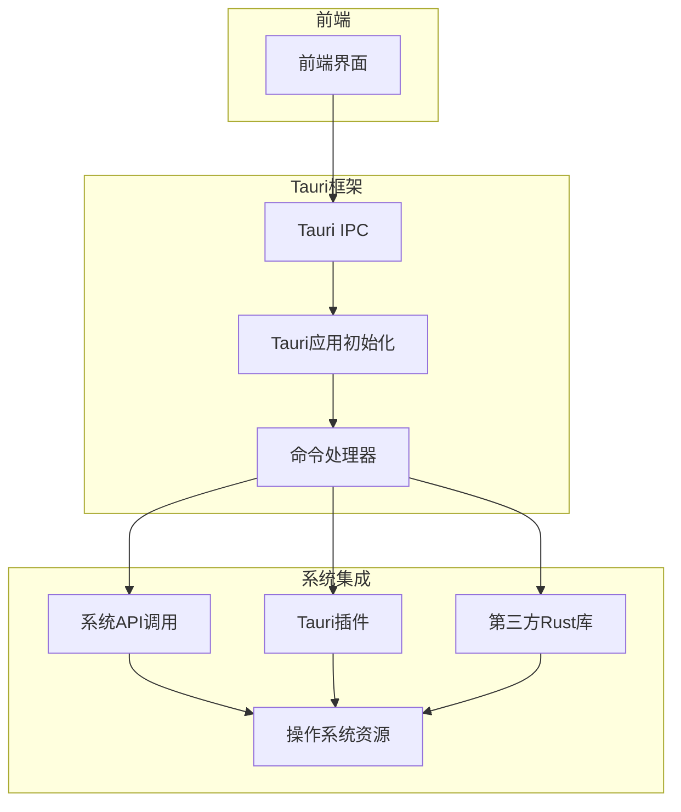
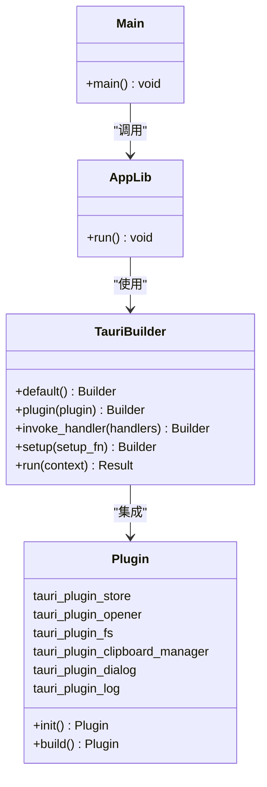
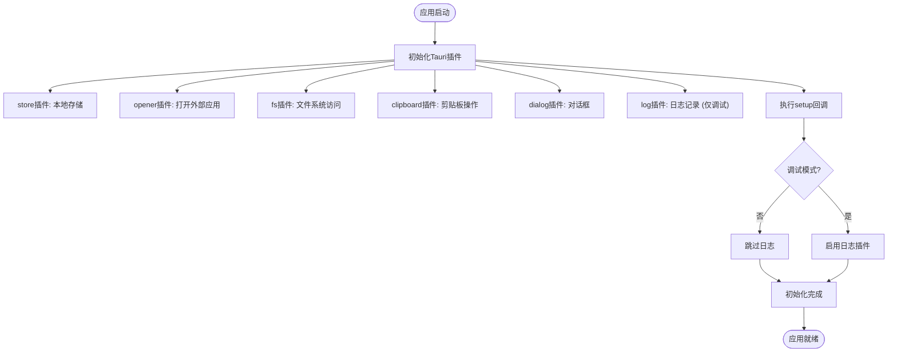
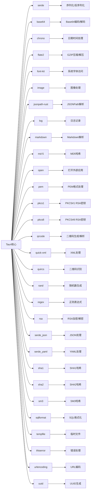
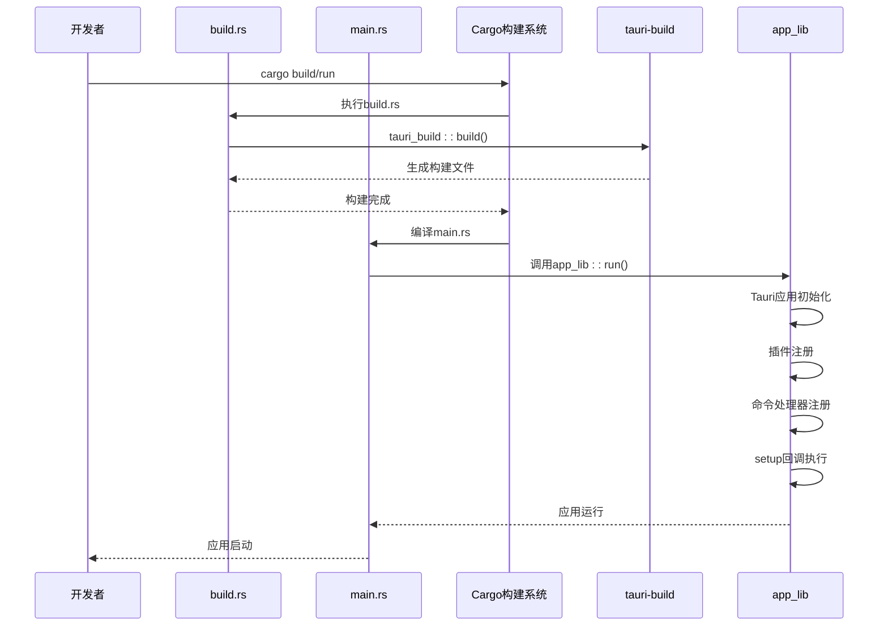
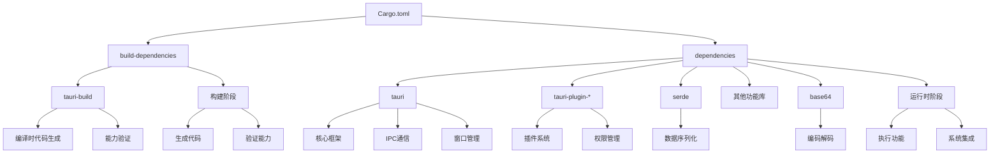
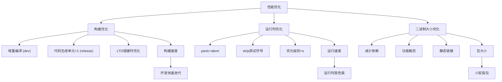
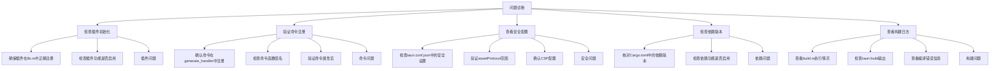

# 系统集成机制

<cite>
**本文档中引用的文件**  
- [lib.rs](file://src-tauri/src/lib.rs)
- [main.rs](file://src-tauri/src/main.rs)
- [Cargo.toml](file://src-tauri/Cargo.toml)
- [tauri.conf.json](file://src-tauri/tauri.conf.json)
- [build.rs](file://src-tauri/build.rs)
- [fs.rs](file://src-tauri/src/command/fs.rs)
- [font.rs](file://src-tauri/src/command/font.rs)
- [uuid.rs](file://src-tauri/src/command/generator/uuid.rs)
- [rsa.rs](file://src-tauri/src/command/crypto/rsa.rs)
- [base64_text.rs](file://src-tauri/src/command/codec/base64_text.rs)
- [json.rs](file://src-tauri/src/command/formatter/json.rs)
- [error.rs](file://src-tauri/src/error.rs)
</cite>

## 目录
1. [简介](#简介)
2. [项目结构](#项目结构)
3. [核心组件](#核心组件)
4. [架构概览](#架构概览)
5. [详细组件分析](#详细组件分析)
6. [依赖分析](#依赖分析)
7. [性能考虑](#性能考虑)
8. [故障排除指南](#故障排除指南)
9. [结论](#结论)

## 简介
本文档深入解析devkimi项目的系统集成机制，重点阐述Tauri后端如何与操作系统进行深度集成。文档详细说明了应用初始化流程、系统权限配置、Rust依赖项的功能支持、安全配置策略以及构建系统协同工作机制。通过系统调用流程图，展示了从前端请求到系统资源访问的完整路径。

## 项目结构
devkimi项目采用典型的Tauri应用结构，分为前端（src）和后端（src-tauri）两个主要部分。前端使用TypeScript/React技术栈，后端使用Rust语言通过Tauri框架与操作系统交互。



**Diagram sources**
- [src-tauri/src/lib.rs](file://src-tauri/src/lib.rs#L4-L56)
- [src-tauri/Cargo.toml](file://src-tauri/Cargo.toml#L20-L58)

**Section sources**
- [src-tauri/src/lib.rs](file://src-tauri/src/lib.rs#L1-L57)
- [src-tauri/Cargo.toml](file://src-tauri/Cargo.toml#L1-L69)

## 核心组件
本项目的核心组件包括Tauri应用初始化、系统级命令实现、插件集成和构建配置。这些组件共同实现了前端与操作系统的安全、高效集成。

**Section sources**
- [src-tauri/src/lib.rs](file://src-tauri/src/lib.rs#L4-L56)
- [src-tauri/src/main.rs](file://src-tauri/src/main.rs#L4-L6)

## 架构概览
devkimi项目采用分层架构，通过Tauri框架实现前端与Rust后端的安全通信。Rust后端通过系统API和第三方库与操作系统进行交互，提供各种系统级功能。



**Diagram sources**
- [src-tauri/src/lib.rs](file://src-tauri/src/lib.rs#L4-L56)
- [src-tauri/Cargo.toml](file://src-tauri/Cargo.toml#L20-L58)

## 详细组件分析

### 应用初始化分析
Tauri应用的初始化过程在lib.rs文件中定义，通过Builder模式配置应用的各种特性和插件。



**Diagram sources**
- [src-tauri/src/lib.rs](file://src-tauri/src/lib.rs#L4-L56)
- [src-tauri/src/main.rs](file://src-tauri/src/main.rs#L4-L6)

**Section sources**
- [src-tauri/src/lib.rs](file://src-tauri/src/lib.rs#L4-L56)
- [src-tauri/src/main.rs](file://src-tauri/src/main.rs#L4-L6)

### 系统权限配置分析
系统权限通过Tauri插件机制进行配置，每个插件提供特定的系统功能访问权限。



**Diagram sources**
- [src-tauri/src/lib.rs](file://src-tauri/src/lib.rs#L6-L53)
- [src-tauri/Cargo.toml](file://src-tauri/Cargo.toml#L49-L54)

**Section sources**
- [src-tauri/src/lib.rs](file://src-tauri/src/lib.rs#L6-L53)
- [src-tauri/Cargo.toml](file://src-tauri/Cargo.toml#L49-L54)

### Rust依赖项分析
Cargo.toml中列出的Rust依赖项为系统级功能实现提供了基础支持。



**Diagram sources**
- [src-tauri/Cargo.toml](file://src-tauri/Cargo.toml#L20-L58)
- [src-tauri/src/command/mod.rs](file://src-tauri/src/command/mod.rs#L1-L8)

**Section sources**
- [src-tauri/Cargo.toml](file://src-tauri/Cargo.toml#L20-L58)
- [src-tauri/src/command/mod.rs](file://src-tauri/src/command/mod.rs#L1-L8)

### 安全配置分析
tauri.conf.json文件中的安全配置定义了应用的安全策略和构建选项。

```mermaid
flowchart TD
A[tauri.conf.json] --> B[app.security]
A --> C[build]
A --> D[bundle]
B --> B1[csp: null]
B --> B2[assetProtocol]
B2 --> B2a[enable: true]
B2 --> B2b[scope: "$TEMP/**"]
C --> C1[frontendDist: "../dist"]
C --> C2[devUrl: "http://localhost:3000"]
C --> C3[beforeDevCommand: "pnpm dev"]
C --> C4[beforeBuildCommand: "pnpm build"]
D --> D1[active: true]
D --> D2[targets: "all"]
D --> D3[icon: 多种尺寸图标]
B --> E[安全影响]
C --> F[构建影响]
D --> G[打包影响]
E --> E1["禁用CSP提供灵活性"]
E --> E2["资产协议限制在临时目录"]
F --> F1["开发时自动启动前端"]
F --> F2["构建时自动构建前端"]
G --> G1["生成多平台安装包"]
G --> G2["包含多种图标格式"]
```

**Diagram sources**
- [src-tauri/tauri.conf.json](file://src-tauri/tauri.conf.json#L1-L46)
- [src-tauri/Cargo.toml](file://src-tauri/Cargo.toml#L60-L68)

**Section sources**
- [src-tauri/tauri.conf.json](file://src-tauri/tauri.conf.json#L1-L46)
- [src-tauri/Cargo.toml](file://src-tauri/Cargo.toml#L60-L68)

### 构建系统分析
main.rs和build.rs文件中的构建配置和编译时逻辑协同工作，确保应用正确构建。



**Diagram sources**
- [src-tauri/build.rs](file://src-tauri/build.rs#L1-L4)
- [src-tauri/src/main.rs](file://src-tauri/src/main.rs#L4-L6)
- [src-tauri/src/lib.rs](file://src-tauri/src/lib.rs#L4-L56)

**Section sources**
- [src-tauri/build.rs](file://src-tauri/build.rs#L1-L4)
- [src-tauri/src/main.rs](file://src-tauri/src/main.rs#L4-L6)

## 依赖分析
项目依赖关系清晰地分为构建依赖、运行时依赖和开发依赖，确保了构建过程的稳定性和运行时的效率。



**Diagram sources**
- [src-tauri/Cargo.toml](file://src-tauri/Cargo.toml#L17-L58)
- [src-tauri/build.rs](file://src-tauri/build.rs#L1-L4)

**Section sources**
- [src-tauri/Cargo.toml](file://src-tauri/Cargo.toml#L17-L58)
- [src-tauri/build.rs](file://src-tauri/build.rs#L1-L4)

## 性能考虑
项目在性能方面进行了多项优化，包括构建配置、代码生成和运行时效率。



**Diagram sources**
- [src-tauri/Cargo.toml](file://src-tauri/Cargo.toml#L60-L68)
- [src-tauri/src/lib.rs](file://src-tauri/src/lib.rs#L4-L56)

**Section sources**
- [src-tauri/Cargo.toml](file://src-tauri/Cargo.toml#L60-L68)

## 故障排除指南
当系统集成出现问题时，可以从以下几个方面进行排查。



**Section sources**
- [src-tauri/src/lib.rs](file://src-tauri/src/lib.rs#L6-L43)
- [src-tauri/tauri.conf.json](file://src-tauri/tauri.conf.json#L24-L32)
- [src-tauri/Cargo.toml](file://src-tauri/Cargo.toml#L20-L58)

## 结论
devkimi项目通过Tauri框架实现了前端与操作系统的深度集成。应用初始化过程在lib.rs中通过Builder模式配置，集成了多个Tauri插件来访问系统功能。Cargo.toml中列出的Rust依赖项为各种编码、加密、格式化等功能提供了基础支持。tauri.conf.json中的安全配置平衡了安全性和灵活性，允许应用访问临时目录中的资源。构建系统通过build.rs和main.rs的协同工作，确保了应用的正确构建和运行。整个系统集成机制设计合理，既保证了功能的完整性，又考虑了性能和安全性。