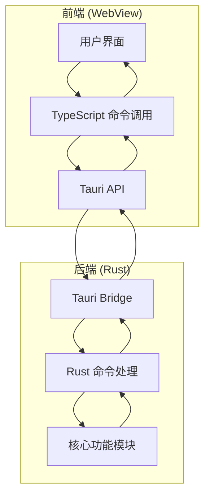
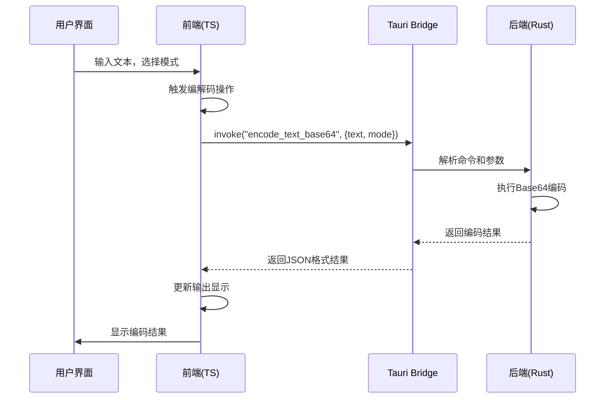
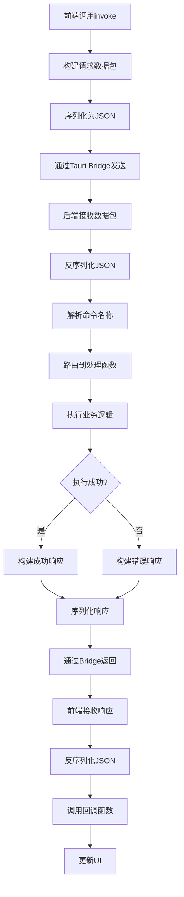
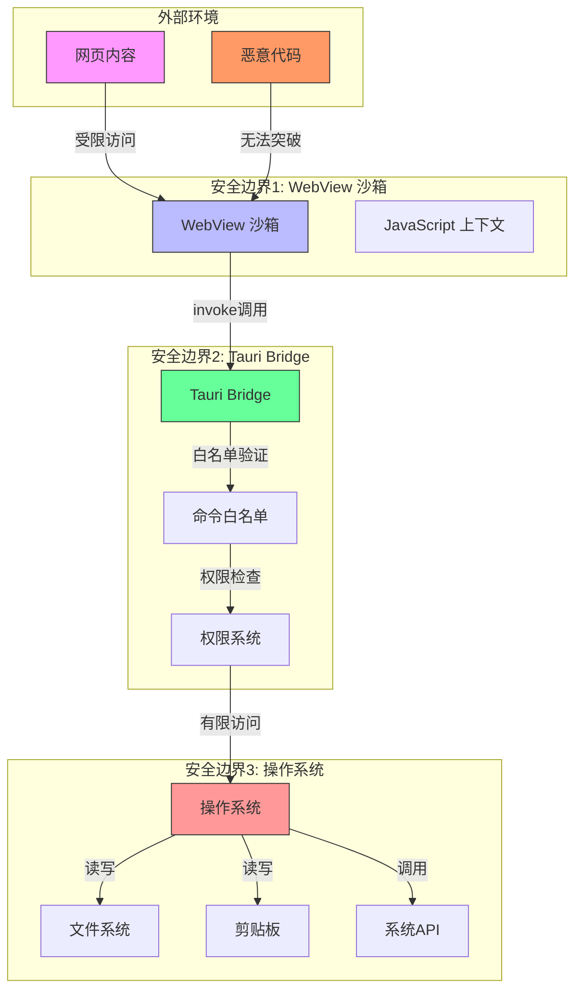

# 前后端通信协议

<cite>
**本文档引用的文件**  
- [main.rs](file://src-tauri/src/main.rs)
- [lib.rs](file://src-tauri/src/lib.rs)
- [tauri.conf.json](file://src-tauri/tauri.conf.json)
- [default.json](file://src-tauri/capabilities/default.json)
- [base64_text.ts](file://src/command/codec/base64_text.ts)
- [base64_text.rs](file://src-tauri/src/command/codec/base64_text.rs)
- [base64_image.rs](file://src-tauri/src/command/codec/base64_image.rs)
- [base64_helper.rs](file://src-tauri/src/command/codec/base64_helper.rs)
- [error.rs](file://src-tauri/src/error.rs)
- [Cargo.toml](file://src-tauri/Cargo.toml)
- [App.tsx](file://src/App.tsx)
- [base64_text.tsx](file://src/view/codec/base64_text.tsx)
</cite>

## 目录
1. [引言](#引言)
2. [通信架构概述](#通信架构概述)
3. [Tauri Bridge 通信机制](#tauri-bridge-通信机制)
4. [数据序列化与反序列化](#数据序列化与反序列化)
5. [通信安全机制](#通信安全机制)
6. [完整通信流程示例：Base64 编解码](#完整通信流程示例base64-编解码)
7. [通信协议数据包结构](#通信协议数据包结构)
8. [安全边界示意图](#安全边界示意图)
9. [错误处理机制](#错误处理机制)
10. [结论](#结论)

## 引言
devkimi 是一个基于 Tauri 框架构建的桌面应用程序，采用 Rust 作为后端语言，TypeScript 作为前端语言。本项目通过 Tauri Bridge 实现前后端之间的安全、高效通信。本文档详细分析 devkimi 项目的前后端通信协议，重点阐述基于 Tauri Bridge 的通信机制、数据序列化/反序列化过程、安全机制以及完整的通信流程。

**Section sources**
- [App.tsx](file://src/App.tsx#L1-L47)
- [tauri.conf.json](file://src-tauri/tauri.conf.json#L1-L46)

## 通信架构概述
devkimi 项目采用典型的前后端分离架构，前端运行在 WebView 中，使用 SolidJS 框架构建用户界面；后端运行在本地操作系统上，使用 Rust 编写核心功能模块。两者通过 Tauri 提供的 Bridge 机制进行通信，实现了安全的进程间通信（IPC）。

Tauri Bridge 作为通信的核心，提供了命令调用、事件监听、状态管理等能力。前端通过 `@tauri-apps/api/core` 提供的 `invoke` 函数调用后端命令，后端通过 `#[tauri::command]` 宏暴露可调用的函数。这种设计模式实现了前后端的解耦，同时保证了通信的安全性。



**Diagram sources**
- [App.tsx](file://src/App.tsx#L1-L47)
- [lib.rs](file://src-tauri/src/lib.rs#L4-L56)

**Section sources**
- [App.tsx](file://src/App.tsx#L1-L47)
- [lib.rs](file://src-tauri/src/lib.rs#L4-L56)

## Tauri Bridge 通信机制
Tauri Bridge 是 devkimi 项目前后端通信的核心机制。它基于进程间通信（IPC）实现，前端通过 JavaScript API 调用后端 Rust 函数，后端处理完成后将结果返回给前端。

### 前端调用机制
前端通过 `@tauri-apps/api/core` 模块提供的 `invoke` 函数调用后端命令。每个命令调用都包含命令名称和参数对象。例如，在 Base64 文本编解码功能中，前端调用如下：

```typescript
import { invoke } from "@tauri-apps/api/core";

const encodeTextBase64 = async (text: string, mode: string) => {
  return invoke<string>("encode_text_base64", {
    text,
    mode,
  });
};
```

### 后端命令注册
后端通过 `tauri::generate_handler!` 宏注册可被前端调用的命令。在 `lib.rs` 文件中，所有可调用的命令都被集中注册：

```rust
tauri::Builder::default()
    .invoke_handler(tauri::generate_handler![
        command::fs::open_file,
        command::fs::copy_file,
        command::font::get_system_fonts,
        command::formatter::json::format_json,
        command::codec::base64_text::encode_text_base64,
        command::codec::base64_text::decode_text_base64,
        // 其他命令...
    ])
```

### 命令处理装饰器
后端命令使用 `#[tauri::command]` 宏进行标记，表明该函数可以被前端调用。该宏会自动生成必要的绑定代码，处理参数解析和结果序列化。

```rust
#[tauri::command]
pub fn encode_text_base64(text: &str, mode: Base64Mode) -> Result<String, Error> {
    Ok(mode.encode(text.as_bytes()))
}
```

**Section sources**
- [base64_text.ts](file://src/command/codec/base64_text.ts#L1-L18)
- [lib.rs](file://src-tauri/src/lib.rs#L11-L43)
- [base64_text.rs](file://src-tauri/src/command/codec/base64_text.rs#L7-L10)

## 数据序列化与反序列化
devkimi 项目的前后端通信依赖于高效的数据序列化和反序列化机制，主要使用 JSON 作为数据交换格式。

### JSON 数据格式规范
Tauri Bridge 使用 serde 库进行数据序列化和反序列化。前端传递的参数对象和后端返回的结果都会被自动转换为 JSON 格式。参数类型必须是可序列化的，如字符串、数字、布尔值、对象和数组。

在 Base64 编解码示例中，前端传递的参数对象包含 `text` 和 `mode` 两个字段，这些字段会被序列化为 JSON 发送到后端：

```json
{
  "text": "Hello, World!",
  "mode": "Standard"
}
```

### 二进制数据处理
对于二进制数据的处理，devkimi 项目采用了 Base64 编码的方式。在图像编解码功能中，前端传递图像文件路径，后端读取文件内容并进行 Base64 编码，返回编码后的字符串。

```rust
#[tauri::command]
pub fn encode_image_base64(image: &str, mode: Base64Mode) -> Result<String, Error> {
    let bytes = read(image)?;
    Ok(mode.encode(&bytes))
}
```

对于解码操作，后端将 Base64 字符串解码为字节流，保存到临时文件中，并返回文件路径：

```rust
#[tauri::command]
pub fn decode_image_base64(base64: &str, mode: Base64Mode) -> Result<PathBuf, Error> {
    let bytes = mode.decode(base64)?;
    let tempdir = tempfile::tempdir().map(|f| f.keep())?;
    let filename = format!("{}.{}", Uuid::new_v4().simple(), format.extensions_str()[0]);
    let tempfile = tempdir.join(filename);
    std::fs::write(&tempfile, &bytes)?;
    Ok(tempfile)
}
```

### 序列化依赖
项目在 `Cargo.toml` 中明确声明了 serde 依赖，确保序列化功能的正常工作：

```toml
serde = { version = "1.0", features = ["derive"] }
serde_json = { version = "1.0", features = ["preserve_order"] }
```

**Section sources**
- [base64_text.rs](file://src-tauri/src/command/codec/base64_text.rs#L8-L10)
- [base64_image.rs](file://src-tauri/src/command/codec/base64_image.rs#L8-L11)
- [Cargo.toml](file://src-tauri/Cargo.toml#L41-L42)

## 通信安全机制
devkimi 项目通过多层次的安全机制确保前后端通信的安全性，防止恶意代码执行和数据泄露。

### 命令白名单配置
Tauri 框架采用白名单机制控制哪些命令可以被前端调用。在 `lib.rs` 文件中，只有明确注册的命令才能被 `invoke` 调用：

```rust
.invoke_handler(tauri::generate_handler![
    command::fs::open_file,
    command::fs::copy_file,
    // ... 其他明确授权的命令
])
```

未在白名单中的命令无法被前端调用，有效防止了未经授权的系统操作。

### 权限能力配置
项目通过 `capabilities/default.json` 文件定义了详细的权限策略，实现了细粒度的访问控制：

```json
{
  "permissions": [
    "core:default",
    "clipboard-manager:allow-write-text",
    "clipboard-manager:allow-read-text",
    "dialog:allow-open",
    "dialog:allow-save",
    "fs:allow-read-text-file",
    "fs:allow-write-text-file",
    "fs:allow-copy-file",
    // ... 其他明确授权的权限
  ]
}
```

### 文件系统访问限制
对于文件系统操作，项目通过路径模式限制访问范围。在能力配置中，只允许访问特定目录：

```json
{
  "identifier": "opener:allow-open-path",
  "allow": [
    {
      "path": "$TEMP/**"
    }
  ]
}
```

这种配置确保了应用程序只能访问临时目录，防止对用户重要文件的未授权访问。

### CSP 安全策略
在 `tauri.conf.json` 中，项目配置了内容安全策略（CSP），虽然当前设置为 null，但框架提供了配置接口，可以限制资源加载来源，防止跨站脚本攻击：

```json
"security": {
  "csp": null,
  "assetProtocol": {
    "enable": true,
    "scope": [
      "$TEMP/**"
    ]
  }
}
```

**Section sources**
- [lib.rs](file://src-tauri/src/lib.rs#L11-L43)
- [default.json](file://src-tauri/capabilities/default.json#L8-L30)
- [tauri.conf.json](file://src-tauri/tauri.conf.json#L24-L32)

## 完整通信流程示例：Base64 编解码
以 Base64 文本编解码功能为例，展示 devkimi 项目前后端通信的完整流程。

### 前端调用
用户在界面中输入文本并选择编码模式，触发编解码操作。前端组件调用命令模块：

```tsx
const [input, setInput] = createSignal("");
const [output, setOutput] = createSignal("");

// 监听输入变化，自动执行编解码
createEffect(() => {
  if (input().length > 0) {
    let promise;
    if (encode()) {
      promise = encodeTextBase64(input(), mode()).then(setOutput);
    } else {
      promise = decodeTextBase64(input(), mode()).then(setOutput);
    }
    promise.then(setOutput).catch((e) => setOutput(e.toString()));
  } else {
    setOutput("");
  }
});
```

### 协议封装
`invoke` 函数将命令名称和参数封装为 IPC 消息，通过 Tauri Bridge 发送。消息包含：
- 命令名称：`encode_text_base64` 或 `decode_text_base64`
- 参数对象：包含 `text` 和 `mode` 字段的 JSON 对象

### 后端解析
Rust 后端接收到消息后，根据命令名称路由到相应的处理函数：

```rust
#[tauri::command]
pub fn encode_text_base64(text: &str, mode: Base64Mode) -> Result<String, Error> {
    Ok(mode.encode(text.as_bytes()))
}
```

参数自动反序列化为 Rust 类型，`text` 被解析为字符串切片，`mode` 被解析为 `Base64Mode` 枚举。

### 执行处理
后端执行实际的编解码逻辑。`Base64Mode` 枚举实现了 `encode` 和 `decode` 方法，根据不同的模式调用相应的 Base64 引擎：

```rust
impl Base64Mode {
    pub fn encode(&self, bytes: &[u8]) -> String {
        match self {
            Base64Mode::Standard => BASE64_STANDARD.encode(bytes),
            Base64Mode::StandardNoPad => BASE64_STANDARD_NO_PAD.encode(bytes),
            Base64Mode::UrlSafe => BASE64_URL_SAFE.encode(bytes),
            Base64Mode::UrlSafeNoPad => BASE64_URL_SAFE_NO_PAD.encode(bytes),
        }
    }
}
```

### 结果返回
处理结果通过 `Result<String, Error>` 类型返回。成功时返回编码后的字符串，失败时返回错误信息。结果被自动序列化为 JSON 并通过 Bridge 返回前端。

### 前端解包
前端接收到结果后，更新界面显示。成功结果显示在输出区域，错误信息被捕获并显示给用户：

```typescript
promise.then(setOutput).catch((e) => setOutput(e.toString()));
```



**Diagram sources**
- [base64_text.tsx](file://src/view/codec/base64_text.tsx#L30-L48)
- [base64_text.ts](file://src/command/codec/base64_text.ts#L3-L7)
- [base64_text.rs](file://src-tauri/src/command/codec/base64_text.rs#L8-L10)

**Section sources**
- [base64_text.tsx](file://src/view/codec/base64_text.tsx#L1-L111)
- [base64_text.ts](file://src/command/codec/base64_text.ts#L1-L18)
- [base64_text.rs](file://src-tauri/src/command/codec/base64_text.rs#L1-L22)

## 通信协议数据包结构
devkimi 项目的通信协议数据包遵循 Tauri 的标准格式，包含命令元数据和有效载荷。

### 请求数据包结构
```json
{
  "cmd": "encode_text_base64",
  "callback": 12345,
  "error": 12346,
  "payload": {
    "text": "Hello, World!",
    "mode": "Standard"
  }
}
```

- `cmd`: 命令名称，标识要执行的操作
- `callback`: 回调函数ID，用于标识成功响应
- `error`: 错误回调函数ID，用于标识错误响应
- `payload`: 参数有效载荷，包含命令执行所需的数据

### 响应数据包结构
成功响应：
```json
{
  "cmd": "callback",
  "callback": 12345,
  "payload": "SGVsbG8sIFdvcmxkIQ=="
}
```

错误响应：
```json
{
  "cmd": "error",
  "callback": 12346,
  "payload": "utf-8 error: invalid utf-8 sequence of 1 bytes from index 0"
}
```

### 数据包处理流程


**Diagram sources**
- [base64_text.ts](file://src/command/codec/base64_text.ts#L3-L7)
- [base64_text.rs](file://src-tauri/src/command/codec/base64_text.rs#L8-L10)

## 安全边界示意图
devkimi 项目通过多层次的安全边界保护系统资源，确保应用程序的安全运行。



### 边界说明
1. **WebView 沙箱边界**：隔离网页内容，防止恶意代码直接访问系统资源
2. **Tauri Bridge 边界**：通过命令白名单和权限系统控制访问，只有授权的命令才能执行
3. **操作系统边界**：通过能力配置限制文件系统访问范围，保护用户数据安全

**Diagram sources**
- [tauri.conf.json](file://src-tauri/tauri.conf.json#L24-L32)
- [default.json](file://src-tauri/capabilities/default.json#L8-L30)
- [lib.rs](file://src-tauri/src/lib.rs#L11-L43)

## 错误处理机制
devkimi 项目实现了完善的错误处理机制，确保通信过程中的异常能够被正确捕获和处理。

### 错误类型定义
项目使用 `thiserror` 和 `serde` 库定义可序列化的错误类型。在 `error.rs` 中定义了通用的错误宏：

```rust
#[macro_export]
macro_rules! command_error {
    ($(($ident:ident, $msg:literal $(, $($tt:tt)*)?)),+ $(,)?) => {
        #[derive(Debug, thiserror::Error)]
        pub enum Error {
            $(
                #[error($msg)]
                $ident$(($($tt)*))?,
            )+
        }

        $crate::serialize_error!(Error);
    };
}
```

### 具体错误实现
在 Base64 处理模块中，定义了具体的错误类型：

```rust
command_error! {
    (Utf8, "utf-8 error: {0}", #[from] FromUtf8Error),
    (DecodeBase64, "decode base64 error: {0}", #[from] base64::DecodeError),
}
```

这定义了两种错误：
- `Utf8`: UTF-8 编码错误
- `DecodeBase64`: Base64 解码错误

### 错误传播与处理
错误通过 `Result` 类型在函数间传播，最终返回给前端：

```rust
pub fn decode_text_base64(base64: &str, mode: Base64Mode) -> Result<String, Error> {
    let bytes = mode.decode(base64)?;
    String::from_utf8(bytes).map_err(Into::into)
}
```

前端通过 Promise 的 catch 方法处理错误：

```typescript
promise.then(setOutput).catch((e) => setOutput(e.toString()));
```

**Section sources**
- [error.rs](file://src-tauri/src/error.rs#L1-L31)
- [base64_text.rs](file://src-tauri/src/command/codec/base64_text.rs#L18-L21)

## 结论
devkimi 项目的前后端通信协议基于 Tauri Bridge 构建，实现了安全、高效、可靠的进程间通信。通过命令白名单、权限系统和沙箱机制，项目建立了多层次的安全边界，有效保护了系统资源。

通信协议采用 JSON 作为数据交换格式，通过 serde 库实现高效的序列化和反序列化。对于二进制数据，采用 Base64 编码的方式进行传输，确保了数据的完整性和兼容性。

错误处理机制完善，通过 Result 类型和自定义错误枚举，实现了错误的精确捕获和友好提示。整个通信流程清晰，从前端调用到后端处理再到结果返回，形成了完整的闭环。

该通信架构不仅满足了当前功能需求，还具备良好的扩展性，可以方便地添加新的命令和功能模块，为项目的持续发展奠定了坚实的基础。