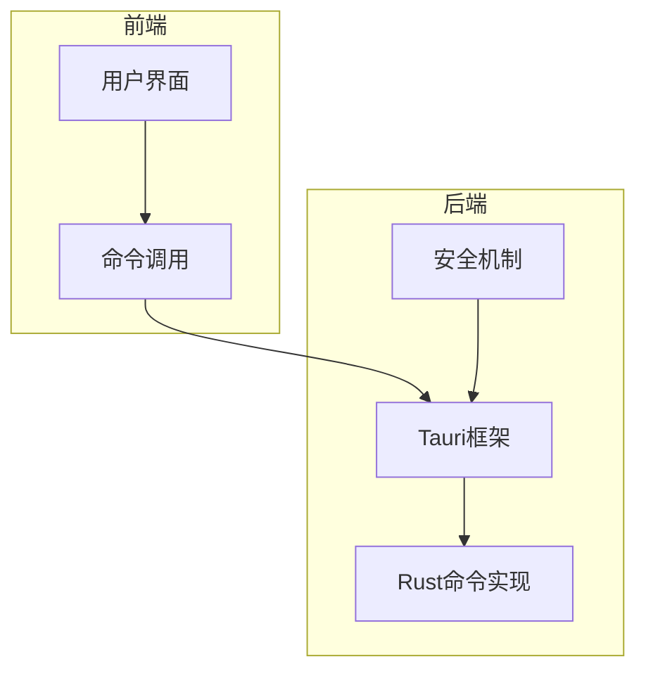
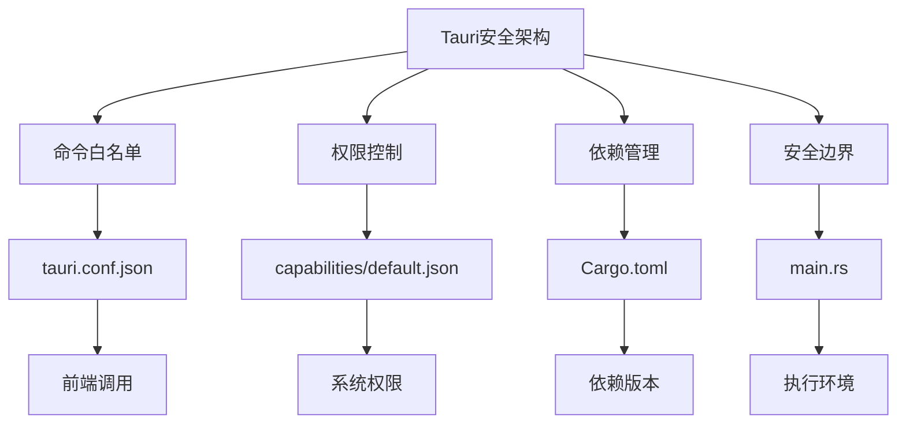
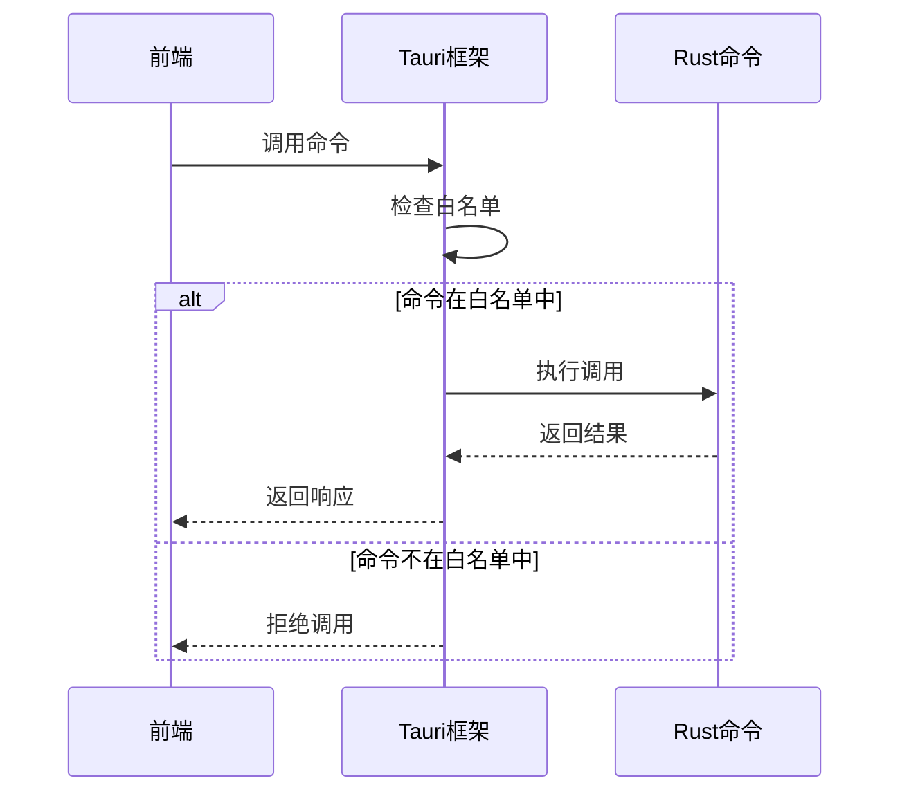
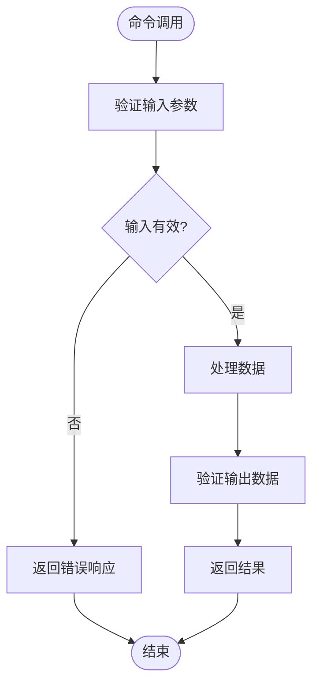
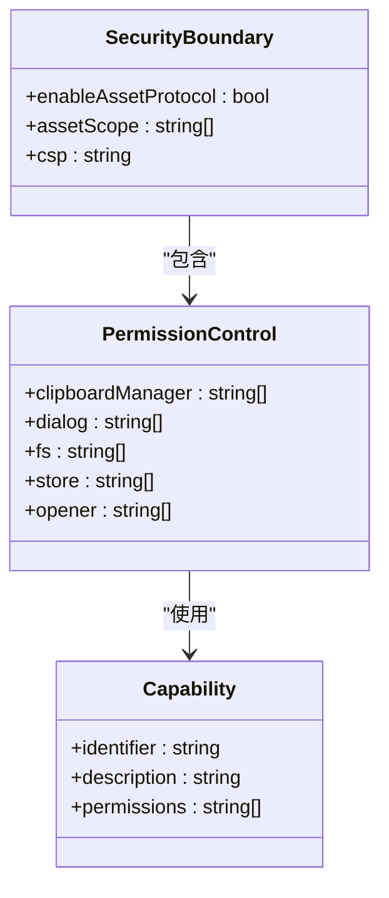
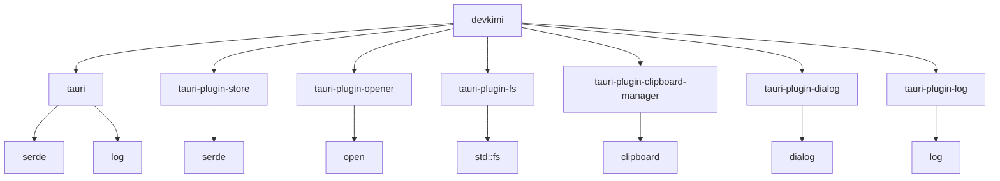

# 通信安全机制

<cite>
**本文档引用的文件**
- [tauri.conf.json](file://src-tauri/tauri.conf.json)
- [Cargo.toml](file://src-tauri/Cargo.toml)
- [main.rs](file://src-tauri/src/main.rs)
- [lib.rs](file://src-tauri/src/lib.rs)
- [default.json](file://src-tauri/capabilities/default.json)
- [fs.rs](file://src-tauri/src/command/fs.rs)
- [font.rs](file://src-tauri/src/command/font.rs)
- [hash.rs](file://src-tauri/src/command/generator/hash.rs)
- [base64_text.rs](file://src-tauri/src/command/codec/base64_text.rs)
- [rsa.rs](file://src-tauri/src/command/crypto/rsa.rs)
- [error.rs](file://src-tauri/src/error.rs)
</cite>

## 目录
1. [引言](#引言)
2. [项目结构](#项目结构)
3. [核心组件](#核心组件)
4. [架构概述](#架构概述)
5. [详细组件分析](#详细组件分析)
6. [依赖分析](#依赖分析)
7. [性能考虑](#性能考虑)
8. [故障排除指南](#故障排除指南)
9. [结论](#结论)

## 引言
本文档详细分析devkimi项目的通信安全机制，重点研究Tauri框架下的安全策略实现。文档深入探讨了命令白名单机制、参数验证流程、供应链安全和权限控制等关键安全特性，展示了如何通过配置和代码实现来保障前后端通信的安全性。

## 项目结构
devkimi项目采用Tauri框架构建，具有清晰的前后端分离结构。前端代码位于src目录，后端Rust代码位于src-tauri目录。项目通过Tauri的安全机制实现前后端通信，确保只有授权的函数调用能够执行。



**图示来源**
- [tauri.conf.json](file://src-tauri/tauri.conf.json#L1-L46)
- [lib.rs](file://src-tauri/src/lib.rs#L1-L57)

**本节来源**
- [tauri.conf.json](file://src-tauri/tauri.conf.json#L1-L46)
- [Cargo.toml](file://src-tauri/Cargo.toml#L1-L70)

## 核心组件
devkimi项目的核心安全组件包括Tauri配置文件、Rust命令实现和权限控制系统。这些组件共同构建了一个安全的通信框架，防止未经授权的函数调用和恶意代码执行。

**本节来源**
- [tauri.conf.json](file://src-tauri/tauri.conf.json#L1-L46)
- [lib.rs](file://src-tauri/src/lib.rs#L1-L57)
- [main.rs](file://src-tauri/src/main.rs#L1-L7)

## 架构概述
devkimi项目采用Tauri框架的安全架构，通过多层防护机制确保通信安全。架构包括命令白名单、权限控制、依赖管理和安全边界设置等关键组件。



**图示来源**
- [tauri.conf.json](file://src-tauri/tauri.conf.json#L1-L46)
- [default.json](file://src-tauri/capabilities/default.json#L1-L31)
- [Cargo.toml](file://src-tauri/Cargo.toml#L1-L70)
- [main.rs](file://src-tauri/src/main.rs#L1-L7)

## 详细组件分析

### 命令白名单机制分析
devkimi项目通过Tauri框架的命令白名单机制防止未经授权的Rust函数调用。所有可被前端调用的Rust函数都必须在lib.rs文件中明确注册。



**图示来源**
- [lib.rs](file://src-tauri/src/lib.rs#L11-L43)
- [tauri.conf.json](file://src-tauri/tauri.conf.json#L24-L32)

**本节来源**
- [lib.rs](file://src-tauri/src/lib.rs#L11-L43)
- [tauri.conf.json](file://src-tauri/tauri.conf.json#L24-L32)

### 参数验证流程分析
devkimi项目在Rust命令实现中包含严格的参数验证流程，确保输入数据的安全性和有效性。每个命令函数都对输入参数进行类型检查和边界验证。



**图示来源**
- [fs.rs](file://src-tauri/src/command/fs.rs#L9-L28)
- [hash.rs](file://src-tauri/src/command/generator/hash.rs#L20-L47)
- [base64_text.rs](file://src-tauri/src/command/codec/base64_text.rs#L8-L15)

**本节来源**
- [fs.rs](file://src-tauri/src/command/fs.rs#L9-L28)
- [hash.rs](file://src-tauri/src/command/generator/hash.rs#L20-L47)
- [base64_text.rs](file://src-tauri/src/command/codec/base64_text.rs#L8-L15)

### 供应链安全分析
devkimi项目通过Cargo.toml文件中的依赖版本控制来保障供应链安全。项目明确指定了所有依赖库的版本，防止引入已知漏洞的依赖包。

```mermaid
graph TB
A[Cargo.toml] --> B[依赖管理]
B --> C[base64 = "0.22"]
B --> D[chrono = "0.4"]
B --> E[cron = "0.15"]
B --> F[flate2 = "1.1"]
B --> G[font-kit = "0.14"]
B --> H[image = "0.25"]
B --> I[jsonpath-rust = "1.0"]
B --> J[log = "0.4"]
B --> K[markdown = "1.0"]
B --> L[md-5 = "0.10"]
B --> M[open = "5.3"]
B --> N[pem = "3.0"]
B --> O[pkcs1 = "0.7"]
B --> P[pkcs8 = { version = "0.10", features = ["encryption"] }]
B --> Q[qrcode = "0.14"]
B --> R[quick-xml = "0.38"]
B --> S[quircs = "0.10"]
B --> T[rand = "0.8"]
B --> U[regex = "1.12"]
B --> V[rsa = "0.9"]
B --> W[serde = { version = "1.0", features = ["derive"] }]
B --> X[serde_json = { version = "1.0", features = ["preserve_order"] }]
B --> Y[serde_yaml = "0.9"]
B --> Z[sha1 = "0.10"]
B --> AA[sha2 = "0.10"]
B --> AB[sm3 = "0.4"]
B --> AC[sm4 = "0.5"]
B --> AD[sqlformat = "0.5.0"]
B --> AE[tauri = { version = "2.9.1", features = ["protocol-asset"] }]
B --> AF[tauri-plugin-clipboard-manager = "2"]
B --> AG[tauri-plugin-dialog = "2"]
B --> AH[tauri-plugin-fs = "2"]
B --> AI[tauri-plugin-log = "2"]
B --> AJ[tauri-plugin-opener = "2"]
B --> AK[tauri-plugin-store = "2"]
B --> AL[tempfile = "3.23"]
B --> AM[thiserror = "2.0"]
B --> AN[urlencoding = "2.1"]
B --> AO[uuid = { version = "1.18", features = ["v1", "v4", "v7"] }]
```

**图示来源**
- [Cargo.toml](file://src-tauri/Cargo.toml#L21-L59)

**本节来源**
- [Cargo.toml](file://src-tauri/Cargo.toml#L21-L59)

### 安全边界与权限控制分析
devkimi项目在main.rs和capabilities/default.json中设置了安全边界和权限控制，防止恶意代码执行。项目通过最小权限原则限制应用的系统访问能力。



**图示来源**
- [tauri.conf.json](file://src-tauri/tauri.conf.json#L24-L32)
- [default.json](file://src-tauri/capabilities/default.json#L1-L31)
- [main.rs](file://src-tauri/src/main.rs#L1-L7)

**本节来源**
- [tauri.conf.json](file://src-tauri/tauri.conf.json#L24-L32)
- [default.json](file://src-tauri/capabilities/default.json#L1-L31)
- [main.rs](file://src-tauri/src/main.rs#L1-L7)

## 依赖分析
devkimi项目的依赖关系清晰，通过Tauri插件系统实现了功能模块化。核心依赖包括tauri框架本身和多个安全相关的插件。



**图示来源**
- [Cargo.toml](file://src-tauri/Cargo.toml#L49-L55)
- [lib.rs](file://src-tauri/src/lib.rs#L6-L10)

**本节来源**
- [Cargo.toml](file://src-tauri/Cargo.toml#L49-L55)
- [lib.rs](file://src-tauri/src/lib.rs#L6-L10)

## 性能考虑
devkimi项目在安全性和性能之间取得了良好平衡。通过优化Rust代码和合理配置Tauri参数，确保了应用的高效运行。

**本节来源**
- [Cargo.toml](file://src-tauri/Cargo.toml#L61-L69)
- [tauri.conf.json](file://src-tauri/tauri.conf.json#L6-L11)

## 故障排除指南
当遇到通信安全相关问题时，应检查以下方面：命令白名单配置、权限设置、参数验证逻辑和依赖版本兼容性。

**本节来源**
- [error.rs](file://src-tauri/src/error.rs#L1-L31)
- [lib.rs](file://src-tauri/src/lib.rs#L44-L53)
- [tauri.conf.json](file://src-tauri/tauri.conf.json#L24-L32)

## 结论
devkimi项目通过Tauri框架的多层次安全机制，构建了一个安全可靠的通信系统。命令白名单、权限控制、依赖管理和安全边界设置等特性共同保障了应用的安全性。建议持续更新依赖库版本，定期审查权限配置，并遵循最小权限原则来进一步增强安全性。