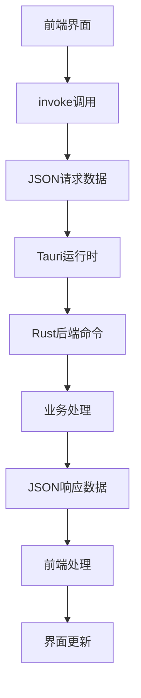
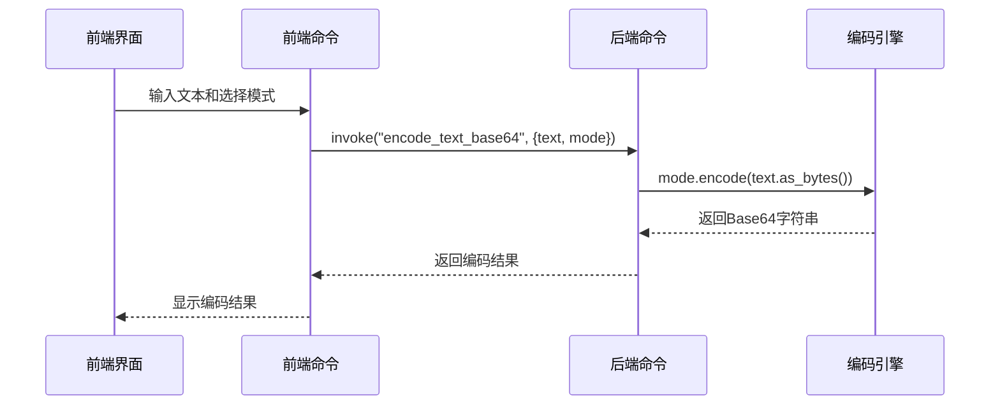
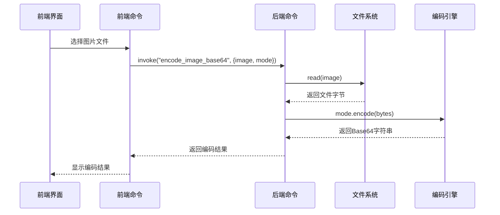
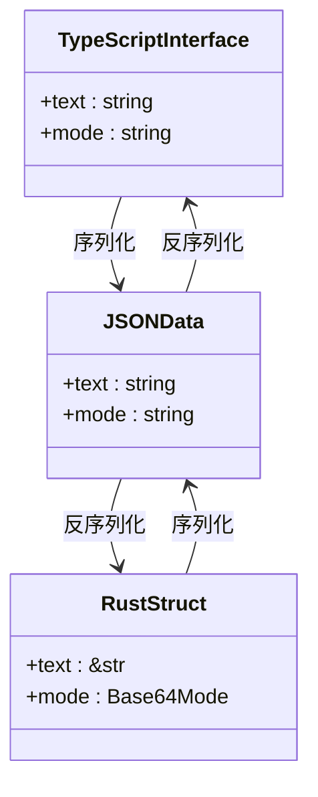
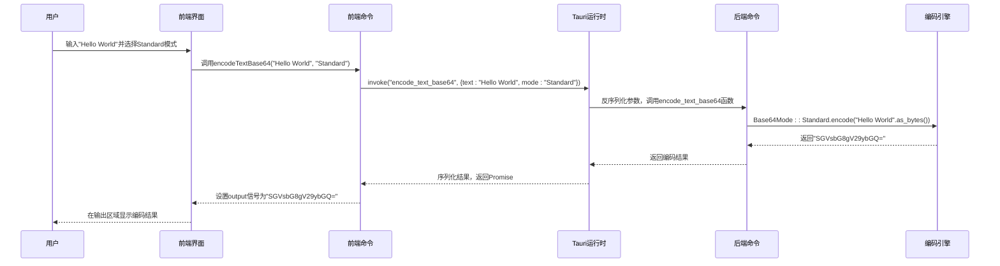

# 通信数据格式

<cite>
**本文档引用的文件**  
- [base64_text.ts](file://src/command/codec/base64_text.ts)
- [base64_image.ts](file://src/command/codec/base64_image.ts)
- [base64_text.rs](file://src-tauri/src/command/codec/base64_text.rs)
- [base64_image.rs](file://src-tauri/src/command/codec/base64_image.rs)
- [base64_helper.rs](file://src-tauri/src/command/codec/base64_helper.rs)
- [lib.rs](file://src-tauri/src/lib.rs)
- [error.rs](file://src-tauri/src/error.rs)
- [url.rs](file://src-tauri/src/command/codec/url.rs)
- [Cargo.toml](file://src-tauri/Cargo.toml)
- [store.tsx](file://src/store.tsx)
- [base64_text.tsx](file://src/view/codec/base64_text.tsx)
- [base64_image.tsx](file://src/view/codec/base64_image.tsx)
</cite>

## 目录
1. [引言](#引言)
2. [通信架构概述](#通信架构概述)
3. [前端请求数据格式](#前端请求数据格式)
4. [后端响应数据格式](#后端响应数据格式)
5. [Base64编解码机制](#base64编解码机制)
6. [数据序列化与反序列化](#数据序列化与反序列化)
7. [错误处理机制](#错误处理机制)
8. [典型数据流转示例](#典型数据流转示例)
9. [数据一致性保障](#数据一致性保障)
10. [配置数据持久化](#配置数据持久化)

## 引言
devkimi项目采用Tauri框架构建，实现了前后端分离的桌面应用架构。本项目通过Tauri的`invoke`机制实现前端TypeScript代码与后端Rust代码之间的通信，采用JSON格式作为数据交换标准。本文档详细分析了项目中通信数据的结构规范、编解码机制、序列化处理以及数据一致性保障策略。

## 通信架构概述
devkimi项目采用Tauri框架提供的前后端通信机制，前端使用SolidJS框架，后端使用Rust语言。通信基于`@tauri-apps/api/core`提供的`invoke`函数，通过异步调用后端注册的命令函数实现功能交互。整个通信过程遵循请求-响应模式，数据以JSON格式进行序列化传输。



**图示来源**  
- [base64_text.ts](file://src/command/codec/base64_text.ts#L3-L7)
- [lib.rs](file://src-tauri/src/lib.rs#L11-L43)

## 前端请求数据格式
前端通过`invoke`函数发起请求，请求数据以JSON对象形式传递。每个请求包含命令名称和参数对象，参数对象的属性名与后端函数参数名保持一致。请求参数采用字符串、数字、布尔值等基本类型，复杂数据结构通过JSON对象传递。

### Base64文本编码请求
在Base64文本编码功能中，前端通过`encodeTextBase64`函数发起请求，传递文本内容和编码模式两个参数。参数对象包含`text`和`mode`两个属性，分别对应待编码的文本和Base64编码模式。

```mermaid
flowchart TD
A[用户输入文本] --> B[选择编码模式]
B --> C[构建参数对象]
C --> D["{ text: string, mode: string }"]
D --> E[invoke("encode_text_base64", 参数)]
E --> F[发送JSON请求]
```

**图示来源**  
- [base64_text.ts](file://src/command/codec/base64_text.ts#L3-L7)
- [base64_text.tsx](file://src/view/codec/base64_text.tsx#L40-L44)

### Base64图片编码请求
图片编码请求与文本编码类似，但参数中的`image`属性为文件路径字符串。前端通过文件选择器获取图片文件路径，然后将其作为参数传递给后端命令。

```mermaid
flowchart TD
A[用户选择图片] --> B[获取文件路径]
B --> C[构建参数对象]
C --> D["{ image: string, mode: string }"]
D --> E[invoke("encode_image_base64", 参数)]
E --> F[发送JSON请求]
```

**图示来源**  
- [base64_image.ts](file://src/command/codec/base64_image.ts#L3-L5)
- [base64_image.tsx](file://src/view/codec/base64_image.tsx#L45-L47)

## 后端响应数据格式
后端响应数据遵循统一的JSON格式，包含成功结果和错误信息两种情况。成功响应返回具体的数据结果，错误响应返回错误描述。Rust的`Result<T, Error>`类型被自动序列化为相应的JSON结构。

### 成功响应格式
成功响应直接返回数据结果，数据类型根据具体命令而定。例如，Base64编码命令返回字符串类型的编码结果，UUID生成命令返回字符串类型的UUID。

```json
"encoded_string_result"
```

### 错误响应格式
错误响应通过`thiserror`和`serde`库实现自动序列化。错误类型被转换为字符串描述，包含错误类型和具体错误信息。错误处理宏`command_error!`定义了各种错误类型的序列化方式。

```json
"decode base64 error: Invalid byte 43, offset 12"
```

**节来源**  
- [base64_text.rs](file://src-tauri/src/command/codec/base64_text.rs#L18-L21)
- [error.rs](file://src-tauri/src/error.rs#L17-L31)

## Base64编解码机制
Base64编解码功能是devkimi项目的核心功能之一，支持多种编码模式，包括标准模式、无填充模式、URL安全模式等。编解码逻辑在后端Rust代码中实现，前端通过命令调用触发相应功能。

### 编码模式定义
Base64编码模式通过Rust枚举类型`Base64Mode`定义，包含四种模式：Standard、StandardNoPad、UrlSafe、UrlSafeNoPad。这些模式对应不同的Base64字符集和填充规则。

```mermaid
classDiagram
class Base64Mode {
+Standard
+StandardNoPad
+UrlSafe
+UrlSafeNoPad
}
Base64Mode : +encode(bytes : &[u8]) String
Base64Mode : +decode(base64 : &str) Result<Vec<u8>, DecodeError>
```

**图示来源**  
- [base64_helper.rs](file://src-tauri/src/command/codec/base64_helper.rs#L7-L35)

### 文本Base64编码流程
文本Base64编码流程从用户输入开始，经过前端界面收集参数，通过`invoke`调用后端命令，后端将文本字符串转换为字节数组，然后根据指定模式进行Base64编码。



**图示来源**  
- [base64_text.ts](file://src/command/codec/base64_text.ts#L3-L7)
- [base64_text.rs](file://src-tauri/src/command/codec/base64_text.rs#L7-L10)

### 图片Base64编码流程
图片Base64编码流程与文本编码类似，但处理的是二进制文件数据。后端读取图片文件的原始字节，然后进行Base64编码。解码时，后端将Base64字符串解码为字节数据，并保存为临时文件供前端显示。



**图示来源**  
- [base64_image.rs](file://src-tauri/src/command/codec/base64_image.rs#L8-L11)
- [base64_image.ts](file://src/command/codec/base64_image.ts#L3-L5)

## 数据序列化与反序列化
devkimi项目使用Serde库实现Rust结构体与JSON数据之间的序列化和反序列化。Serde的`Serialize`和`Deserialize`特性通过`#[derive]`宏自动为数据类型生成序列化代码，确保前后端数据格式的一致性。

### TypeScript接口与Rust结构体映射
前端TypeScript接口与后端Rust结构体通过JSON格式进行数据交换。虽然两者语法不同，但通过约定的属性名和数据类型实现映射。例如，前端的`mode: string`参数对应后端的`mode: Base64Mode`枚举。



**图示来源**  
- [base64_text.ts](file://src/command/codec/base64_text.ts#L3-L7)
- [base64_text.rs](file://src-tauri/src/command/codec/base64_text.rs#L8-L9)
- [base64_helper.rs](file://src-tauri/src/command/codec/base64_helper.rs#L7-L13)

### Serde序列化机制
Serde序列化机制通过`#[derive(Serialize, Deserialize)]`宏为Rust类型自动生成序列化代码。`Base64Mode`枚举类型实现了这两个特性，使其能够自动转换为JSON字符串并在反序列化时正确解析。

```rust
#[derive(Debug, Clone, Copy, Serialize, Deserialize)]
pub enum Base64Mode {
    Standard,
    StandardNoPad,
    UrlSafe,
    UrlSafeNoPad,
}
```

当JSON数据包含`"Standard"`字符串时，Serde能够自动将其反序列化为`Base64Mode::Standard`枚举值。这种机制确保了前后端数据类型的一致性，避免了手动解析的错误。

**节来源**  
- [base64_helper.rs](file://src-tauri/src/command/codec/base64_helper.rs#L7-L13)
- [Cargo.toml](file://src-tauri/Cargo.toml#L41)

## 错误处理机制
devkimi项目采用统一的错误处理机制，通过自定义错误类型和宏简化错误处理代码。错误类型使用`thiserror`库定义，并通过`serde`库实现JSON序列化，确保错误信息能够正确传递到前端。

### 自定义错误类型
项目使用`command_error!`宏定义命令相关的错误类型。该宏生成包含多个错误变体的`Error`枚举类型，并自动实现`std::error::Error`和`serde::Serialize`特性。

```rust
command_error! {
    (Utf8, "utf-8 error: {0}", #[from] FromUtf8Error),
    (DecodeBase64, "decode base64 error: {0}", #[from] base64::DecodeError),
}
```

每个错误变体都有对应的错误消息模板，占位符`{0}`会被实际的错误信息替换。`#[from]`属性实现了`From`特性，允许自动转换底层错误类型。

**节来源**  
- [error.rs](file://src-tauri/src/error.rs#L17-L31)
- [base64_text.rs](file://src-tauri/src/command/codec/base64_text.rs#L18-L21)

### 错误序列化实现
错误序列化通过`serialize_error!`宏实现，该宏为错误类型生成`serde::Serialize`特性的实现。序列化时，错误被转换为字符串形式，包含错误类型和具体信息。

```mermaid
flowchart TD
A[发生错误] --> B[创建Error实例]
B --> C[调用to_string()]
C --> D[获取错误描述]
D --> E[序列化为JSON字符串]
E --> F[返回前端]
F --> G[显示错误信息]
```

这种设计简化了错误处理流程，前端接收到的错误信息可以直接显示给用户，无需额外的解析处理。

**节来源**  
- [error.rs](file://src-tauri/src/error.rs#L2-14)

## 典型数据流转示例
以Base64文本编码功能为例，展示从前端调用到后端处理的完整数据流转过程。该示例涵盖了参数传递、数据处理、结果返回等各个环节，体现了整个通信流程的完整性。

### 完整数据流转流程


**图示来源**  
- [base64_text.tsx](file://src/view/codec/base64_text.tsx#L40-L44)
- [base64_text.rs](file://src-tauri/src/command/codec/base64_text.rs#L7-L10)
- [lib.rs](file://src-tauri/src/lib.rs#L22)

### 数据包结构示例
请求数据包结构：
```json
{
  "cmd": "encode_text_base64",
  "payload": {
    "text": "Hello World",
    "mode": "Standard"
  }
}
```

响应数据包结构（成功）：
```json
"SGVsbG8gV29ybGQ="
```

响应数据包结构（错误）：
```json
"utf-8 error: invalid utf-8 sequence of 1 bytes from index 5"
```

## 数据一致性保障
devkimi项目通过多种机制保障通信数据的一致性和完整性，包括类型安全、序列化验证、错误处理等。这些机制共同确保了前后端数据交换的可靠性。

### 类型安全机制
项目充分利用TypeScript和Rust的类型系统，确保数据类型在编译时得到验证。前端TypeScript接口定义了参数的类型约束，后端Rust函数签名明确了参数和返回值的类型。

```typescript
const encodeTextBase64 = async (text: string, mode: string) => {
  return invoke<string>("encode_text_base64", {
    text,
    mode,
  });
};
```

```rust
#[tauri::command]
pub fn encode_text_base64(text: &str, mode: Base64Mode) -> Result<String, Error> {
    Ok(mode.encode(text.as_bytes()))
}
```

尽管前端传递的`mode`参数为字符串类型，但后端会通过Serde自动将其转换为`Base64Mode`枚举类型，如果转换失败则返回相应的错误信息。

**节来源**  
- [base64_text.ts](file://src/command/codec/base64_text.ts#L3-L7)
- [base64_text.rs](file://src-tauri/src/command/codec/base64_text.rs#L8-L9)

### 数据完整性验证
数据完整性通过多层验证机制保障。首先，Serde在反序列化时验证JSON数据的结构和类型；其次，业务逻辑代码对输入数据进行语义验证；最后，错误处理机制捕获并报告任何数据异常。

对于Base64解码操作，系统会验证输入字符串是否符合所选模式的Base64编码规则。如果包含非法字符或长度不符合要求，`base64`库会返回`DecodeError`，该错误会被转换为相应的`Error`类型并返回给前端。

**节来源**  
- [base64_helper.rs](file://src-tauri/src/command/codec/base64_helper.rs#L27-L34)
- [base64_text.rs](file://src-tauri/src/command/codec/base64_text.rs#L14-L15)

## 配置数据持久化
项目使用`tauri-plugin-store`插件实现配置数据的持久化存储。用户设置通过JSON格式保存到`store.json`文件中，确保应用重启后配置信息不会丢失。

### 配置数据结构
配置数据定义了应用的通用设置和编辑器设置，包括主题、配置面板状态、自动换行模式、字体等。这些设置通过SolidJS的响应式系统与界面保持同步。

```typescript
export type Settings = {
  common: {
    theme: string;
    openConfigCollapse: boolean,
  },
  editor: {
    wordWrap: WordWrap;
    font: {
      family: string;
      size: number;
    };
  }
};
```

当设置发生变化时，`createEffect`函数会自动将新的设置保存到`store.json`文件中。同时，`trackStore`函数监控设置对象的变化，确保只有实际修改的属性才会触发保存操作。

**节来源**  
- [store.tsx](file://src/store.tsx#L20-L34)
- [store.tsx](file://src/store.tsx#L56-L64)

### 配置数据流
```mermaid
flowchart TD
A[用户更改设置] --> B[更新响应式状态]
B --> C[createEffect触发]
C --> D[trackStore检测变化]
D --> E[store.set("settings", 新值)]
E --> F[store.save()]
F --> G[写入store.json文件]
G --> H[持久化完成]
```

主题设置还会触发DOM属性的更新，通过修改`document.documentElement`的`data-theme`属性来实现主题的实时切换。

**节来源**  
- [store.tsx](file://src/store.tsx#L68-L72)
- [store.tsx](file://src/store.tsx#L56-L64)