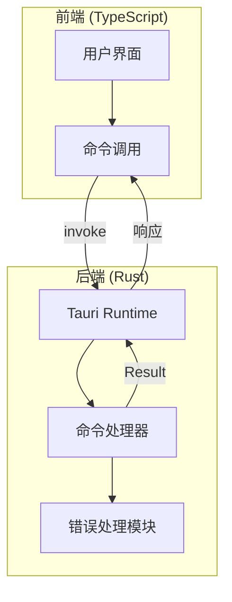
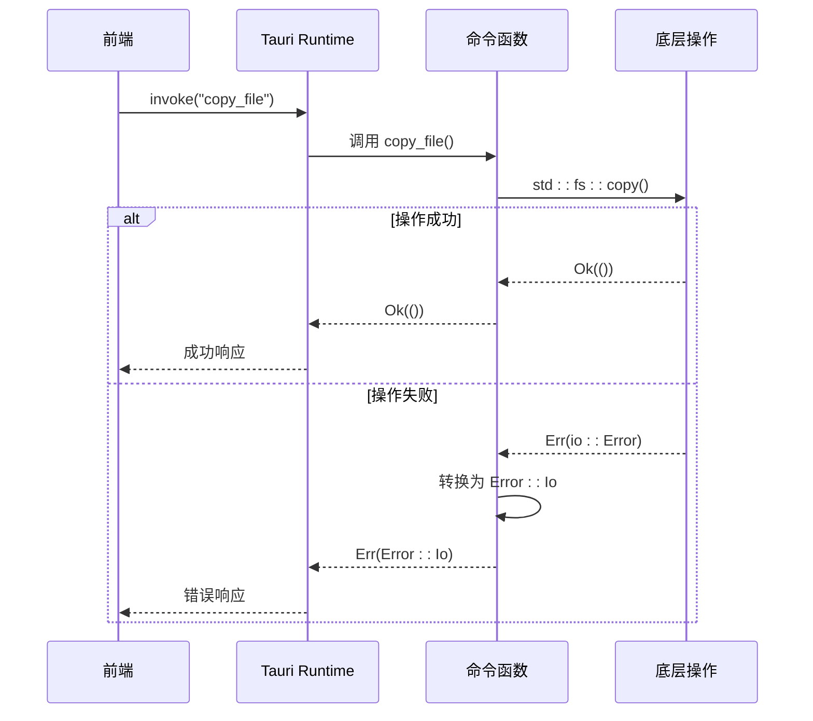
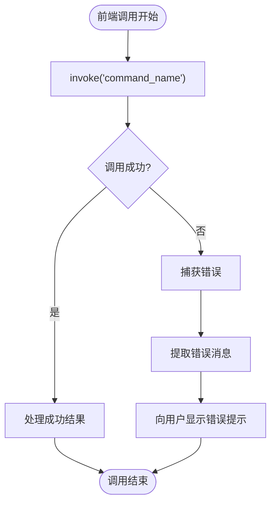
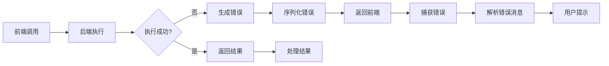

# 通信错误处理

<cite>
**本文档引用的文件**
- [error.rs](file://src-tauri/src/error.rs)
- [lib.rs](file://src-tauri/src/lib.rs)
- [fs.rs](file://src-tauri/src/command/fs.rs)
- [hash.rs](file://src-tauri/src/command/generator/hash.rs)
- [rsa.rs](file://src-tauri/src/command/crypto/rsa.rs)
- [json_yaml.rs](file://src-tauri/src/command/converter/json_yaml.rs)
- [json.ts](file://src/command/formatter/json.ts)
- [base64_text.ts](file://src/command/codec/base64_text.ts)
- [main.rs](file://src-tauri/src/main.rs)
- [App.tsx](file://src/App.tsx)
</cite>

## 目录
1. [引言](#引言)
2. [项目结构与通信机制](#项目结构与通信机制)
3. [Rust端错误类型体系](#rust端错误类型体系)
4. [Result<T, E>错误传递机制](#resultt-e错误传递机制)
5. [前端TypeScript错误捕获机制](#前端typescript错误捕获机制)
6. [前后端错误处理链路分析](#前后端错误处理链路分析)
7. [错误码定义规范](#错误码定义规范)
8. [异常处理最佳实践](#异常处理最佳实践)
9. [结论](#结论)

## 引言
devkimi项目是一个基于Tauri框架的桌面应用，采用Rust作为后端语言，TypeScript作为前端语言。本项目在前后端通信过程中建立了完善的错误处理机制，确保系统在面对各种异常情况时能够保持健壮性。本文档将深入分析该项目的通信错误处理机制，涵盖从Rust后端错误定义到前端用户提示的完整链路。

## 项目结构与通信机制
devkimi项目采用典型的前后端分离架构。前端使用TypeScript编写，位于`src/`目录下；后端使用Rust编写，位于`src-tauri/`目录下。前后端通过Tauri提供的`invoke`机制进行通信，前端调用后端定义的命令函数，后端返回结果或错误信息。



**Diagram sources**
- [lib.rs](file://src-tauri/src/lib.rs#L4-L56)
- [App.tsx](file://src/App.tsx)

**Section sources**
- [lib.rs](file://src-tauri/src/lib.rs#L1-L57)
- [main.rs](file://src-tauri/src/main.rs#L1-L7)

## Rust端错误类型体系
devkimi项目在`src-tauri/src/error.rs`中定义了统一的错误处理宏，通过`command_error!`宏为各个模块创建特定的错误类型。该宏利用`thiserror`库生成带有描述信息的错误枚举，并自动实现`std::error::Error` trait。

每个命令模块（如`fs`、`crypto`、`formatter`等）都定义了自己的错误类型，这些错误类型通常包含：
- 具体的错误变体（如`Io`、`Json`、`Rsa`等）
- 错误消息模板（使用`#[error(...)]`属性）
- 源错误类型的自动转换（使用`#[from]`属性）

```mermaid
classDiagram
class Error {
+Io(String)
+InvalidFileName(String)
+Rsa(rsa : : Error)
+Json(serde_json : : Error)
+Yaml(serde_yaml : : Error)
+Base64Decode(base64 : : DecodeError)
+Utf8(std : : string : : FromUtf8Error)
+Spki(String)
}
Error : 实现 std : : fmt : : Display
Error : 实现 std : : error : : Error
Error : 实现 serde : : Serialize
```

**Diagram sources**
- [error.rs](file://src-tauri/src/error.rs#L1-L31)
- [fs.rs](file://src-tauri/src/command/fs.rs#L30-L33)
- [rsa.rs](file://src-tauri/src/command/crypto/rsa.rs#L70-L77)

**Section sources**
- [error.rs](file://src-tauri/src/error.rs#L1-L31)
- [fs.rs](file://src-tauri/src/command/fs.rs#L30-L33)
- [rsa.rs](file://src-tauri/src/command/crypto/rsa.rs#L70-L77)

## Result<T, E>错误传递机制
devkimi项目广泛使用Rust的`Result<T, E>`类型来处理可能失败的操作。所有暴露给前端的命令函数都返回`Result<T, Error>`类型，其中`Error`是模块定义的错误枚举。

当底层操作发生错误时，通过`?`操作符将错误自动转换为模块的`Error`类型并向上层传递。对于标准库错误类型，通过`#[from]`属性实现了自动转换，简化了错误处理代码。



**Diagram sources**
- [fs.rs](file://src-tauri/src/command/fs.rs#L17-L27)
- [hash.rs](file://src-tauri/src/command/generator/hash.rs#L29-L31)
- [json_yaml.rs](file://src-tauri/src/command/converter/json_yaml.rs#L4-L6)

**Section sources**
- [fs.rs](file://src-tauri/src/command/fs.rs#L9-L27)
- [hash.rs](file://src-tauri/src/command/generator/hash.rs#L29-L31)
- [json_yaml.rs](file://src-tauri/src/command/converter/json_yaml.rs#L4-L6)

## 前端TypeScript错误捕获机制
前端通过Tauri提供的`invoke`函数调用后端命令，返回一个Promise。开发者使用async/await语法或Promise链来处理异步调用的结果，并通过try-catch语句捕获可能发生的错误。

虽然具体的前端调用代码未在上下文中提供，但根据Tauri的标准实践，前端错误处理通常如下模式：



**Diagram sources**
- [json.ts](file://src/command/formatter/json.ts)
- [base64_text.ts](file://src/command/codec/base64_text.ts)

**Section sources**
- [json.ts](file://src/command/formatter/json.ts)
- [base64_text.ts](file://src/command/codec/base64_text.ts)

## 前后端错误处理链路分析
devkimi项目的错误处理形成了完整的闭环链路。从前端发起调用，到后端处理并可能产生错误，再到错误信息序列化返回前端，最后前端解析错误并向用户展示。

该链路的关键环节包括：
1. 后端命令函数返回`Result<T, Error>`
2. Tauri运行时自动序列化错误为JSON
3. 前端Promise的reject状态携带错误信息
4. 前端捕获错误并提取用户可读的消息
5. 向用户展示友好的错误提示



**Diagram sources**
- [lib.rs](file://src-tauri/src/lib.rs#L11-L43)
- [error.rs](file://src-tauri/src/error.rs#L2-L13)
- [App.tsx](file://src/App.tsx)

**Section sources**
- [lib.rs](file://src-tauri/src/lib.rs#L11-L43)
- [error.rs](file://src-tauri/src/error.rs#L1-L31)

## 错误码定义规范
devkimi项目虽然没有显式的错误码系统，但通过统一的错误类型定义规范实现了类似的效果。错误定义遵循以下原则：

1. **语义化错误类型**：每个错误变体都有明确的语义，如`Io`、`Json`、`Rsa`等
2. **参数化错误消息**：错误消息模板包含占位符，可插入具体的错误详情
3. **自动源错误转换**：使用`#[from]`属性自动转换底层错误类型
4. **统一序列化**：所有错误都实现`serde::Serialize`，确保可被JSON序列化

这种设计使得错误信息既具有机器可读性，又便于人类理解，为前端提供了充足的错误处理依据。

**Section sources**
- [error.rs](file://src-tauri/src/error.rs#L18-L24)
- [fs.rs](file://src-tauri/src/command/fs.rs#L30-L33)
- [rsa.rs](file://src-tauri/src/command/crypto/rsa.rs#L70-L77)

## 异常处理最佳实践
基于devkimi项目的实现，总结出以下异常处理最佳实践：

1. **分层错误处理**：在每个模块内部定义特定的错误类型，避免错误信息的过度泛化
2. **自动转换机制**：利用`#[from]`属性实现错误类型的自动转换，减少样板代码
3. **用户友好消息**：错误消息应包含足够的上下文信息，便于用户理解和排查问题
4. **完整错误链**：保持错误的源信息，便于调试和日志记录
5. **统一序列化**：确保所有错误都能被正确序列化，避免通信过程中的信息丢失

这些实践共同确保了系统的健壮性和可维护性，为用户提供可靠的使用体验。

**Section sources**
- [error.rs](file://src-tauri/src/error.rs)
- [lib.rs](file://src-tauri/src/lib.rs)
- [fs.rs](file://src-tauri/src/command/fs.rs)

## 结论
devkimi项目通过精心设计的错误处理机制，实现了前后端之间可靠、清晰的错误通信。Rust端利用`Result<T, E>`模式和自定义错误类型，确保了错误信息的丰富性和准确性；前端通过标准的Promise错误处理机制，能够有效地捕获和展示错误。整个错误处理链路完整、规范，体现了良好的工程实践，为类似项目的开发提供了有价值的参考。