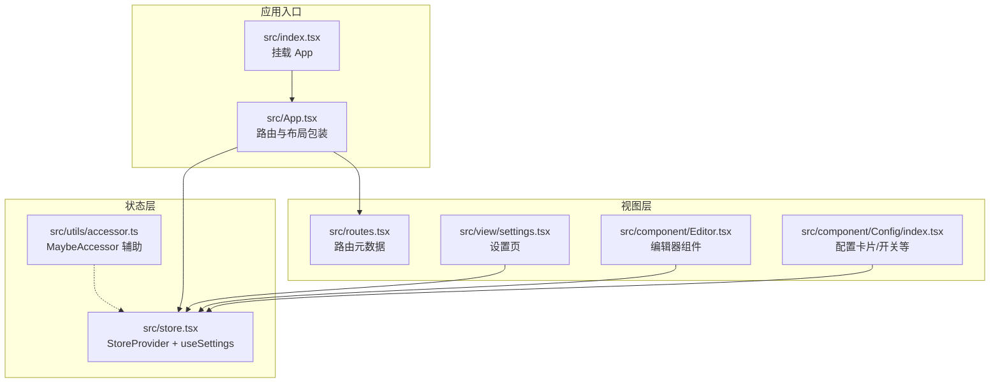
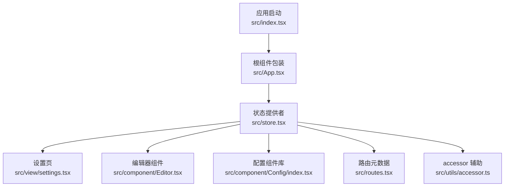
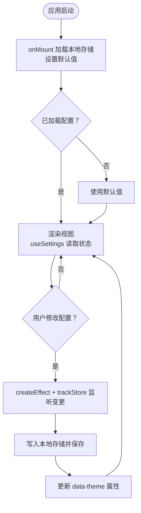
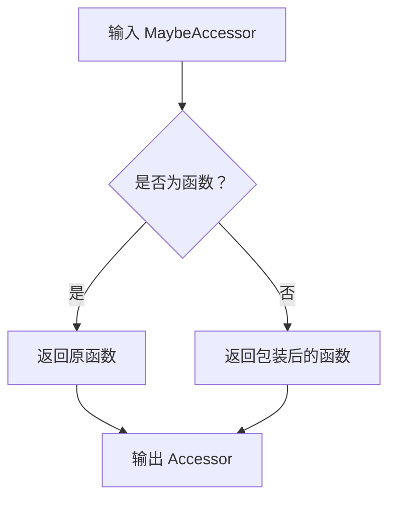
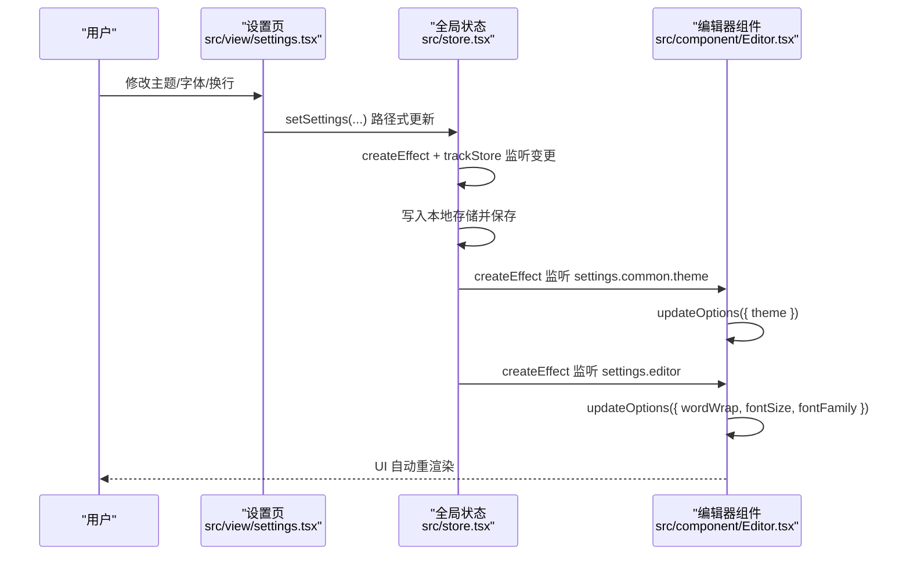
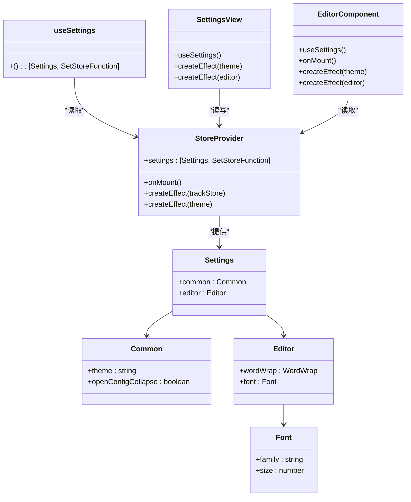
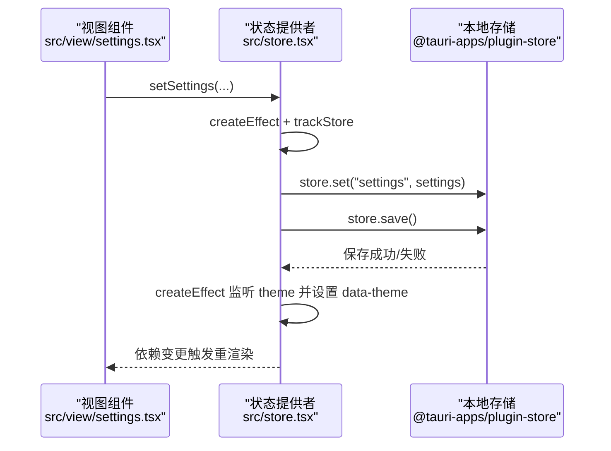
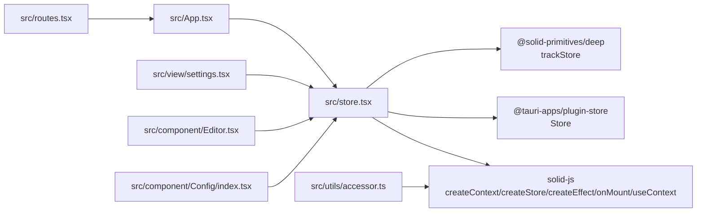

# 前端状态管理

<cite>
**本文引用的文件**
- [src/store.tsx](file://src/store.tsx)
- [src/utils/accessor.ts](file://src/utils/accessor.ts)
- [src/App.tsx](file://src/App.tsx)
- [src/index.tsx](file://src/index.tsx)
- [src/view/settings.tsx](file://src/view/settings.tsx)
- [src/component/Editor.tsx](file://src/component/Editor.tsx)
- [src/component/Config/index.tsx](file://src/component/Config/index.tsx)
- [src/routes.tsx](file://src/routes.tsx)
</cite>

## 目录
1. [简介](#简介)
2. [项目结构](#项目结构)
3. [核心组件](#核心组件)
4. [架构总览](#架构总览)
5. [详细组件分析](#详细组件分析)
6. [依赖分析](#依赖分析)
7. [性能考虑](#性能考虑)
8. [故障排查指南](#故障排查指南)
9. [结论](#结论)
10. [附录](#附录)

## 简介
本文件聚焦于 devkimi 项目的前端状态管理，系统性解析 store.tsx 中基于 SolidJS 的响应式状态模型与持久化策略，阐述 accessor 模式在状态访问中的作用，并通过类图与时序图展示状态变量、依赖关系与更新流程。同时给出在新功能模块中正确使用全局状态的最佳实践与示例路径，帮助开发者快速、安全地扩展状态管理能力。

## 项目结构
devkimi 使用 SolidJS + Tauri 架构，状态管理位于 src/store.tsx，通过 Provider 将全局状态注入至应用树；视图层通过 useSettings 钩子读取与修改状态；编辑器组件根据状态动态更新主题与字体等参数；设置页负责用户配置的可视化编辑与持久化。

图表来源
- [src/index.tsx](file://src/index.tsx#L1-L37)
- [src/App.tsx](file://src/App.tsx#L1-L47)
- [src/store.tsx](file://src/store.tsx#L1-L88)
- [src/utils/accessor.ts](file://src/utils/accessor.ts#L1-L11)
- [src/routes.tsx](file://src/routes.tsx#L1-L242)
- [src/view/settings.tsx](file://src/view/settings.tsx#L1-L122)
- [src/component/Editor.tsx](file://src/component/Editor.tsx#L1-L139)
- [src/component/Config/index.tsx](file://src/component/Config/index.tsx#L1-L37)

章节来源
- [src/index.tsx](file://src/index.tsx#L1-L37)
- [src/App.tsx](file://src/App.tsx#L1-L47)
- [src/store.tsx](file://src/store.tsx#L1-L88)
- [src/utils/accessor.ts](file://src/utils/accessor.ts#L1-L11)
- [src/routes.tsx](file://src/routes.tsx#L1-L242)

## 核心组件
- 全局状态定义与默认值
  - 类型 Settings 包含 common 与 editor 两部分，分别管理主题、配置折叠状态与编辑器字体、换行等。
  - 默认值 defaultSettings 提供初始状态，确保首次加载可用。
- StoreProvider
  - 使用 createStore 创建响应式 settings，并通过 onMount 异步从本地存储加载用户配置。
  - 使用 createEffect 结合 trackStore 监听 settings 变更，写入本地存储并保存。
  - 使用 createEffect 监听 settings.common.theme，动态设置根元素的 data-theme 属性，实现主题切换。
  - 通过 createContext 暴露 [settings, setSettings] 给子树使用。
- useSettings
  - 从上下文中取出 settings 与 setSettings，若未找到 Provider 则抛出错误，避免误用。

章节来源
- [src/store.tsx](file://src/store.tsx#L1-L88)

## 架构总览
下图展示了状态管理的整体架构：应用启动后，StoreProvider 在顶层注入全局状态；各视图组件通过 useSettings 访问与修改状态；状态变更经由 trackStore 触发持久化与主题更新；编辑器组件订阅编辑器相关设置并动态调整。

图表来源
- [src/index.tsx](file://src/index.tsx#L1-L37)
- [src/App.tsx](file://src/App.tsx#L1-L47)
- [src/store.tsx](file://src/store.tsx#L1-L88)
- [src/view/settings.tsx](file://src/view/settings.tsx#L1-L122)
- [src/component/Editor.tsx](file://src/component/Editor.tsx#L1-L139)
- [src/component/Config/index.tsx](file://src/component/Config/index.tsx#L1-L37)
- [src/routes.tsx](file://src/routes.tsx#L1-L242)
- [src/utils/accessor.ts](file://src/utils/accessor.ts#L1-L11)

## 详细组件分析

### 状态模型与持久化
- 数据结构
  - Settings.common：主题 theme、配置面板默认展开 openConfigCollapse。
  - Settings.editor：wordWrap（自动换行）、font（family、size）。
- 初始化与加载
  - onMount 异步加载本地存储的 settings，若不存在则回退到 defaultSettings。
- 持久化策略
  - createEffect + trackStore 监听 settings 变更，写入本地存储并保存，保证用户配置跨会话持久化。
- 主题联动
  - createEffect 监听 settings.common.theme，设置 documentElement 的 data-theme，驱动全局样式切换。

图表来源
- [src/store.tsx](file://src/store.tsx#L1-L88)

章节来源
- [src/store.tsx](file://src/store.tsx#L1-L88)

### accessor 模式与 MaybeAccessor
- accessor 函数用于统一“值或函数”的访问形式，返回一个稳定的 Accessor 形态，便于在需要函数式访问的地方复用。
- MaybeAccessor<T> 支持直接传入 T 或 (() => T)，在需要惰性求值或延迟计算时非常有用。
- 在状态管理中，accessor 可作为辅助工具，为某些需要函数式访问的场景提供一致的接口。

图表来源
- [src/utils/accessor.ts](file://src/utils/accessor.ts#L1-L11)

章节来源
- [src/utils/accessor.ts](file://src/utils/accessor.ts#L1-L11)

### 设置页与编辑器联动
- 设置页
  - 通过 useSettings 获取 settings 与 setSettings。
  - 使用 createEffect 监听 settings.common.theme，同步更新所有已注册编辑器的主题。
  - 使用 createEffect + trackStore 监听 settings.editor，批量更新编辑器的 wordWrap、fontSize、fontFamily。
  - 通过 Config 组件族（Select、Switch、NumberInput）绑定到 setSettings 的路径式更新。
- 编辑器组件
  - onMount 时根据 settings 初始化编辑器选项。
  - createEffect 监听 settings.common.theme、settings.editor，动态 updateOptions。
  - 通过 props.value 与本地状态保持双向同步。

图表来源
- [src/view/settings.tsx](file://src/view/settings.tsx#L1-L122)
- [src/store.tsx](file://src/store.tsx#L1-L88)
- [src/component/Editor.tsx](file://src/component/Editor.tsx#L1-L139)

章节来源
- [src/view/settings.tsx](file://src/view/settings.tsx#L1-L122)
- [src/component/Editor.tsx](file://src/component/Editor.tsx#L1-L139)
- [src/store.tsx](file://src/store.tsx#L1-L88)

### 类图：状态与组件关系

图表来源
- [src/store.tsx](file://src/store.tsx#L1-L88)
- [src/view/settings.tsx](file://src/view/settings.tsx#L1-L122)
- [src/component/Editor.tsx](file://src/component/Editor.tsx#L1-L139)

章节来源
- [src/store.tsx](file://src/store.tsx#L1-L88)
- [src/view/settings.tsx](file://src/view/settings.tsx#L1-L122)
- [src/component/Editor.tsx](file://src/component/Editor.tsx#L1-L139)

### 时序图：状态更新与持久化

图表来源
- [src/view/settings.tsx](file://src/view/settings.tsx#L1-L122)
- [src/store.tsx](file://src/store.tsx#L1-L88)

章节来源
- [src/view/settings.tsx](file://src/view/settings.tsx#L1-L122)
- [src/store.tsx](file://src/store.tsx#L1-L88)

### 在新功能模块中正确使用全局状态
- 步骤
  - 在模块组件中引入 useSettings，解构得到 [settings, setSettings]。
  - 对于只读使用，直接读取 settings.xxx；对于可变配置，使用 setSettings 的路径式更新。
  - 若存在深层嵌套对象，优先使用路径式更新，避免破坏响应式结构。
  - 如需对某一部分进行细粒度监听，结合 trackStore 或 createEffect 实现局部刷新。
- 示例路径
  - 读取主题与配置折叠状态：[src/component/Config/index.tsx](file://src/component/Config/index.tsx#L1-L37)
  - 路由与页面包装：[src/App.tsx](file://src/App.tsx#L1-L47)
  - 应用入口挂载：[src/index.tsx](file://src/index.tsx#L1-L37)
  - 路由元数据与设置页：[src/routes.tsx](file://src/routes.tsx#L1-L242)

章节来源
- [src/component/Config/index.tsx](file://src/component/Config/index.tsx#L1-L37)
- [src/App.tsx](file://src/App.tsx#L1-L47)
- [src/index.tsx](file://src/index.tsx#L1-L37)
- [src/routes.tsx](file://src/routes.tsx#L1-L242)

## 依赖分析
- 外部依赖
  - @solid-primitives/deep：提供 trackStore，用于深度监听 store 变更。
  - @tauri-apps/plugin-store：提供本地存储读写能力。
  - solid-js：createContext、createStore、createEffect、onMount、useContext 等。
- 内部依赖
  - accessor.ts 为 MaybeAccessor 提供统一访问器封装。
  - App.tsx 与 routes.tsx 负责应用结构与路由组织。
  - settings.tsx 与 Editor.tsx、Config 组件共同构成状态消费方。

图表来源
- [src/store.tsx](file://src/store.tsx#L1-L88)
- [src/utils/accessor.ts](file://src/utils/accessor.ts#L1-L11)
- [src/App.tsx](file://src/App.tsx#L1-L47)
- [src/routes.tsx](file://src/routes.tsx#L1-L242)
- [src/view/settings.tsx](file://src/view/settings.tsx#L1-L122)
- [src/component/Editor.tsx](file://src/component/Editor.tsx#L1-L139)
- [src/component/Config/index.tsx](file://src/component/Config/index.tsx#L1-L37)

章节来源
- [src/store.tsx](file://src/store.tsx#L1-L88)
- [src/utils/accessor.ts](file://src/utils/accessor.ts#L1-L11)
- [src/App.tsx](file://src/App.tsx#L1-L47)
- [src/routes.tsx](file://src/routes.tsx#L1-L242)
- [src/view/settings.tsx](file://src/view/settings.tsx#L1-L122)
- [src/component/Editor.tsx](file://src/component/Editor.tsx#L1-L139)
- [src/component/Config/index.tsx](file://src/component/Config/index.tsx#L1-L37)

## 性能考虑
- 深度监听成本
  - trackStore 会对整个 settings 进行深度监听，频繁变更可能带来额外开销。建议：
    - 合理拆分状态，减少不必要的深层变更。
    - 对高频更新的字段采用局部监听（仅监听必要子树）。
- 主题切换
  - 主题变更通过设置根元素属性触发，影响范围有限，但应避免在大量组件中重复设置相同属性。
- 编辑器联动
  - 编辑器数量较多时，批量更新 options 可能造成抖动。建议：
    - 合理控制更新频率，必要时合并多次更新。
    - 对编辑器实例进行缓存与复用，避免重复创建销毁。

## 故障排查指南
- 缺少 StoreProvider
  - 现象：调用 useSettings 抛出异常。
  - 排查：确认根组件已包裹 StoreProvider。
  - 参考：[src/store.tsx](file://src/store.tsx#L70-L88)、[src/App.tsx](file://src/App.tsx#L1-L47)
- 本地存储保存失败
  - 现象：控制台打印保存失败日志。
  - 排查：检查插件初始化与权限，确认 store.set 与 store.save 是否被调用。
  - 参考：[src/store.tsx](file://src/store.tsx#L55-L66)
- 主题未生效
  - 现象：切换主题后 UI 未改变。
  - 排查：确认 data-theme 已设置，且样式依赖该属性。
  - 参考：[src/store.tsx](file://src/store.tsx#L67-L73)
- 编辑器未按预期更新
  - 现象：修改字体/换行后编辑器不刷新。
  - 排查：确认已监听 settings.editor 并调用 updateOptions；检查路径式更新是否正确。
  - 参考：[src/view/settings.tsx](file://src/view/settings.tsx#L30-L46)、[src/component/Editor.tsx](file://src/component/Editor.tsx#L80-L100)

章节来源
- [src/store.tsx](file://src/store.tsx#L55-L88)
- [src/App.tsx](file://src/App.tsx#L1-L47)
- [src/view/settings.tsx](file://src/view/settings.tsx#L30-L46)
- [src/component/Editor.tsx](file://src/component/Editor.tsx#L80-L100)

## 结论
devkimi 的状态管理以 SolidJS 为核心，通过 createStore + trackStore 实现响应式与持久化双轮驱动。accessor 模式为访问器提供了统一形态，便于在复杂组件中稳定使用。设置页与编辑器组件展示了路径式更新与细粒度监听的最佳实践。整体架构清晰、耦合度低、易于扩展，适合在新功能模块中继续沿用该模式。

## 附录
- 关键 API 与路径
  - 全局状态提供与钩子：[src/store.tsx](file://src/store.tsx#L1-L88)
  - accessor 辅助：[src/utils/accessor.ts](file://src/utils/accessor.ts#L1-L11)
  - 应用入口与包装：[src/index.tsx](file://src/index.tsx#L1-L37)、[src/App.tsx](file://src/App.tsx#L1-L47)
  - 设置页与编辑器联动：[src/view/settings.tsx](file://src/view/settings.tsx#L1-L122)、[src/component/Editor.tsx](file://src/component/Editor.tsx#L1-L139)
  - 路由与页面组织：[src/routes.tsx](file://src/routes.tsx#L1-L242)