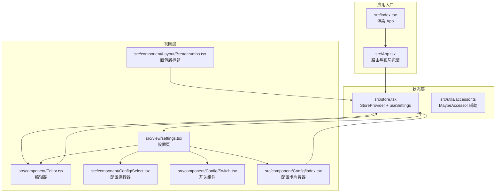
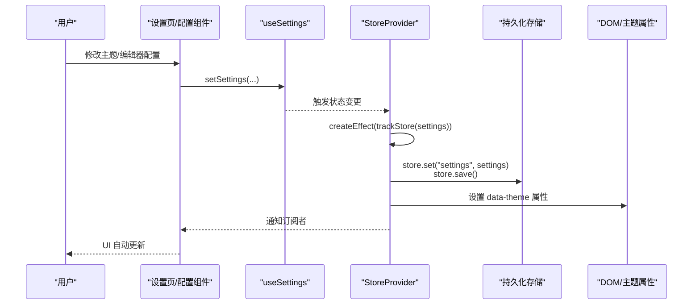
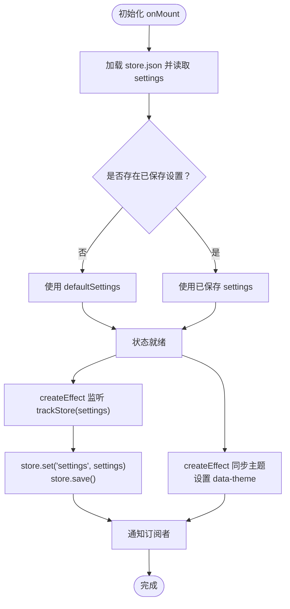
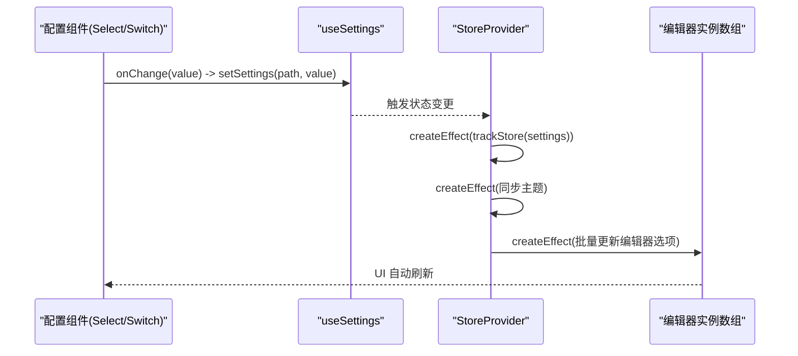
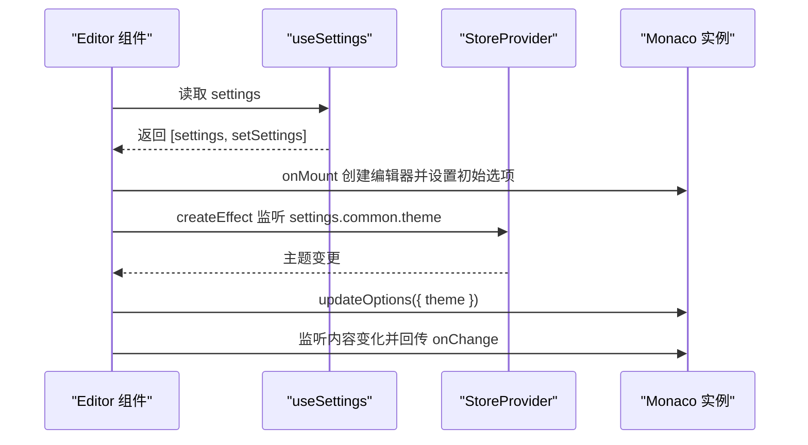
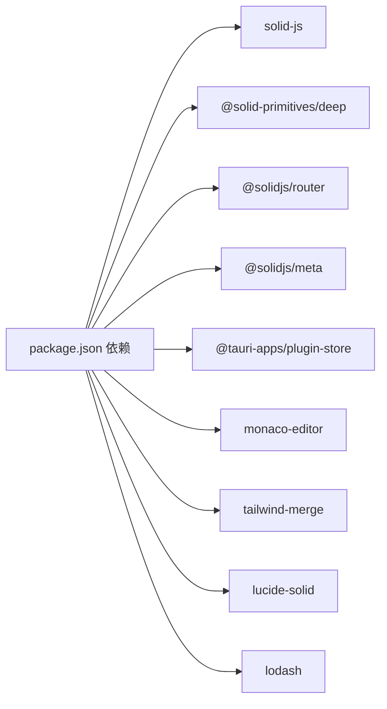

# 响应式状态系统

<cite>
**本文引用的文件**
- [src/store.tsx](file://src/store.tsx)
- [src/utils/accessor.ts](file://src/utils/accessor.ts)
- [src/App.tsx](file://src/App.tsx)
- [src/index.tsx](file://src/index.tsx)
- [src/view/settings.tsx](file://src/view/settings.tsx)
- [src/component/Editor.tsx](file://src/component/Editor.tsx)
- [src/component/Config/Select.tsx](file://src/component/Config/Select.tsx)
- [src/component/Config/Switch.tsx](file://src/component/Config/Switch.tsx)
- [src/component/Config/index.tsx](file://src/component/Config/index.tsx)
- [src/component/Layout/Breadcrumbs.tsx](file://src/component/Layout/Breadcrumbs.tsx)
- [package.json](file://package.json)
</cite>

## 目录
1. [简介](#简介)
2. [项目结构](#项目结构)
3. [核心组件](#核心组件)
4. [架构总览](#架构总览)
5. [详细组件分析](#详细组件分析)
6. [依赖分析](#依赖分析)
7. [性能考量](#性能考量)
8. [故障排查指南](#故障排查指南)
9. [结论](#结论)
10. [附录：在新组件中订阅与更新全局状态](#附录在新组件中订阅与更新全局状态)

## 简介
本文件聚焦于 devkimi 项目中的响应式状态系统，围绕 store.tsx 中基于 SolidJS 的响应式模型进行深入解析。重点包括：
- 使用 createStore 管理全局 Settings 状态，结合 createEffect 实现持久化与主题同步
- 使用 createMemo 进行派生计算与优化
- 通过 useSettings 订阅上下文中的状态，并在多个组件中实现自动更新
- 展示信号流与依赖关系，说明主题设置、编辑器配置变更如何驱动 UI 自动刷新
- 提供架构图、序列图与流程图，帮助读者建立整体认知

## 项目结构
devkimi 采用 SolidJS + Tauri 技术栈，状态管理集中在 store.tsx，通过 Provider 注入到应用根部，子组件通过自定义 Hook useSettings 订阅状态并触发局部更新。

图表来源
- [src/index.tsx](file://src/index.tsx#L1-L37)
- [src/App.tsx](file://src/App.tsx#L1-L47)
- [src/store.tsx](file://src/store.tsx#L1-L88)
- [src/view/settings.tsx](file://src/view/settings.tsx#L1-L122)
- [src/component/Editor.tsx](file://src/component/Editor.tsx#L1-L139)
- [src/component/Config/Select.tsx](file://src/component/Config/Select.tsx#L1-L30)
- [src/component/Config/Switch.tsx](file://src/component/Config/Switch.tsx#L1-L24)
- [src/component/Config/index.tsx](file://src/component/Config/index.tsx#L1-L14)
- [src/component/Layout/Breadcrumbs.tsx](file://src/component/Layout/Breadcrumbs.tsx#L1-L25)

章节来源
- [src/index.tsx](file://src/index.tsx#L1-L37)
- [src/App.tsx](file://src/App.tsx#L1-L47)
- [src/store.tsx](file://src/store.tsx#L1-L88)

## 核心组件
- 全局状态定义与默认值：Settings 类型与 defaultSettings
- StoreProvider：初始化状态、持久化写入、主题同步
- useSettings：从上下文中读取状态与更新函数
- 派生计算：createMemo 在组件中用于轻量派生数据
- 可选辅助：accessor.ts 提供 MaybeAccessor 包装，便于统一处理值或访问器

章节来源
- [src/store.tsx](file://src/store.tsx#L1-L88)
- [src/utils/accessor.ts](file://src/utils/accessor.ts#L1-L11)

## 架构总览
下图展示了响应式状态在应用中的流转路径：用户交互触发 setSettings 更新，createEffect 触发持久化与主题同步，useSettings 订阅的组件根据依赖自动重渲染。

图表来源
- [src/view/settings.tsx](file://src/view/settings.tsx#L1-L122)
- [src/store.tsx](file://src/store.tsx#L1-L88)

## 详细组件分析

### StoreProvider 与 useSettings
- 状态结构：Settings 包含 common（主题、默认展开）与 editor（换行、字体家族与字号）
- 初始化：onMount 异步加载本地存储并回填默认值
- 持久化：trackStore(settings) + createEffect 监听变更，写入 store.json 并保存
- 主题同步：createEffect 读取 settings.common.theme，设置 documentElement 的 data-theme 属性
- 上下文暴露：StoreContext.Provider 暴露 [settings, setSettings]，useSettings 返回该元组

图表来源
- [src/store.tsx](file://src/store.tsx#L1-L88)

章节来源
- [src/store.tsx](file://src/store.tsx#L1-L88)

### 设置页（Settings）中的响应式行为
- 订阅全局设置：const [settings, setSettings] = useSettings()
- 字体资源：createResource 获取系统字体列表，供配置选择器使用
- 主题联动：createEffect 读取 settings.common.theme，批量更新已注册的编辑器实例
- 编辑器联动：createEffect + trackStore(settings.editor) 读取 wordWrap、fontSize、fontFamily，批量更新编辑器实例
- 配置组件：Select、Switch 等组件直接绑定 settings 的字段，onChange 调用 setSettings 完成局部更新

图表来源
- [src/view/settings.tsx](file://src/view/settings.tsx#L1-L122)
- [src/component/Config/Select.tsx](file://src/component/Config/Select.tsx#L1-L30)
- [src/component/Config/Switch.tsx](file://src/component/Config/Switch.tsx#L1-L24)
- [src/store.tsx](file://src/store.tsx#L1-L88)

章节来源
- [src/view/settings.tsx](file://src/view/settings.tsx#L1-L122)
- [src/component/Config/Select.tsx](file://src/component/Config/Select.tsx#L1-L30)
- [src/component/Config/Switch.tsx](file://src/component/Config/Switch.tsx#L1-L24)

### 编辑器组件（Editor）中的响应式行为
- 初始化：onMount 创建 monaco 实例，读取 settings.common.theme、settings.editor.font.size、settings.editor.font.family、settings.editor.wordWrap
- 占位符与内容：createEffect 监听 props.placeholder 与 props.value，必要时更新编辑器
- 主题联动：createEffect 读取 settings.common.theme，动态更新编辑器主题
- 事件监听：onChange 回调将编辑器内容回传给父组件

图表来源
- [src/component/Editor.tsx](file://src/component/Editor.tsx#L1-L139)
- [src/store.tsx](file://src/store.tsx#L1-L88)

章节来源
- [src/component/Editor.tsx](file://src/component/Editor.tsx#L1-L139)
- [src/store.tsx](file://src/store.tsx#L1-L88)

### 面包屑标题（Breadcrumbs）中的派生计算
- 使用 createMemo 将路由匹配结果映射为面包屑与页面标题，减少不必要的重渲染
- 展示了在非状态组件中使用 createMemo 的典型模式

章节来源
- [src/component/Layout/Breadcrumbs.tsx](file://src/component/Layout/Breadcrumbs.tsx#L1-L25)

### MaybeAccessor 辅助工具
- accessor.ts 提供 MaybeAccessor<T> 与 accessor 函数，统一“值或访问器”的处理方式，便于在不同场景下复用逻辑

章节来源
- [src/utils/accessor.ts](file://src/utils/accessor.ts#L1-L11)

## 依赖分析
- SolidJS 生态：solid-js、@solid-primitives/deep、@solidjs/router、@solidjs/meta
- 存储与持久化：@tauri-apps/plugin-store
- 编辑器：monaco-editor
- UI 工具：tailwind-merge、lucide-solid、lodash
- 应用入口：index.tsx 渲染 App，App.tsx 作为路由与布局根容器

图表来源
- [package.json](file://package.json#L1-L43)

章节来源
- [package.json](file://package.json#L1-L43)

## 性能考量
- 使用 createStore 管理嵌套对象，配合 trackStore(settings) 仅在深层字段变更时触发持久化，避免全量写入
- 在 Settings 页面对编辑器实例进行批量更新，减少重复 setOptions 的次数
- 在 Editor 组件中，仅在 props.placeholder 或 props.value 发生变化时才更新编辑器，避免不必要的 setValue
- 对于非状态相关的派生数据，使用 createMemo 进行轻量缓存，降低渲染成本
- 避免在高频事件中直接写入大对象，建议合并更新或节流

## 故障排查指南
- 缺少 StoreProvider：useSettings 必须在 StoreProvider 下使用，否则会抛出错误
- 主题未生效：确认 settings.common.theme 是否被正确写入，以及 createEffect 是否执行
- 编辑器不随设置更新：检查是否在 Settings 中注册了编辑器实例，以及是否使用 trackStore(settings.editor) 触发更新
- 持久化失败：检查 store.set 与 store.save 的 Promise 链路，关注 catch 分支的日志输出

章节来源
- [src/store.tsx](file://src/store.tsx#L1-L88)
- [src/view/settings.tsx](file://src/view/settings.tsx#L1-L122)
- [src/component/Editor.tsx](file://src/component/Editor.tsx#L1-L139)

## 结论
devkimi 的响应式状态系统以 SolidJS 的 createStore 为核心，结合 createEffect 实现持久化与主题同步，通过 useSettings 将状态注入到多处 UI 组件，形成清晰的信号流与依赖链。在 Settings 与 Editor 等组件中，通过 trackStore 与 createEffect 的组合，实现了细粒度的自动更新；同时利用 createMemo 与 accessor 辅助工具，进一步提升了性能与可维护性。

## 附录：在新组件中订阅与更新全局状态
- 订阅全局状态
  - 在组件中导入 useSettings 并解构得到 [settings, setSettings]
  - 通过 settings 读取当前值，setSettings 执行局部更新
  - 示例路径参考：[src/view/settings.tsx](file://src/view/settings.tsx#L1-L122)、[src/component/Editor.tsx](file://src/component/Editor.tsx#L1-L139)
- 正确更新状态以避免性能问题
  - 使用 setSettings 的路径式更新，避免一次性替换整个对象
  - 对于编辑器等重型组件，尽量批量更新其选项，减少多次 updateOptions
  - 对于非状态派生数据，使用 createMemo 缓存计算结果
  - 示例路径参考：[src/view/settings.tsx](file://src/view/settings.tsx#L1-L122)、[src/component/Config/Switch.tsx](file://src/component/Config/Switch.tsx#L1-L24)
- 主题与编辑器联动
  - 在 StoreProvider 中通过 createEffect 同步 data-theme
  - 在 Settings 中使用 trackStore(settings.editor) 触发编辑器批量更新
  - 示例路径参考：[src/store.tsx](file://src/store.tsx#L1-L88)、[src/view/settings.tsx](file://src/view/settings.tsx#L1-L122)