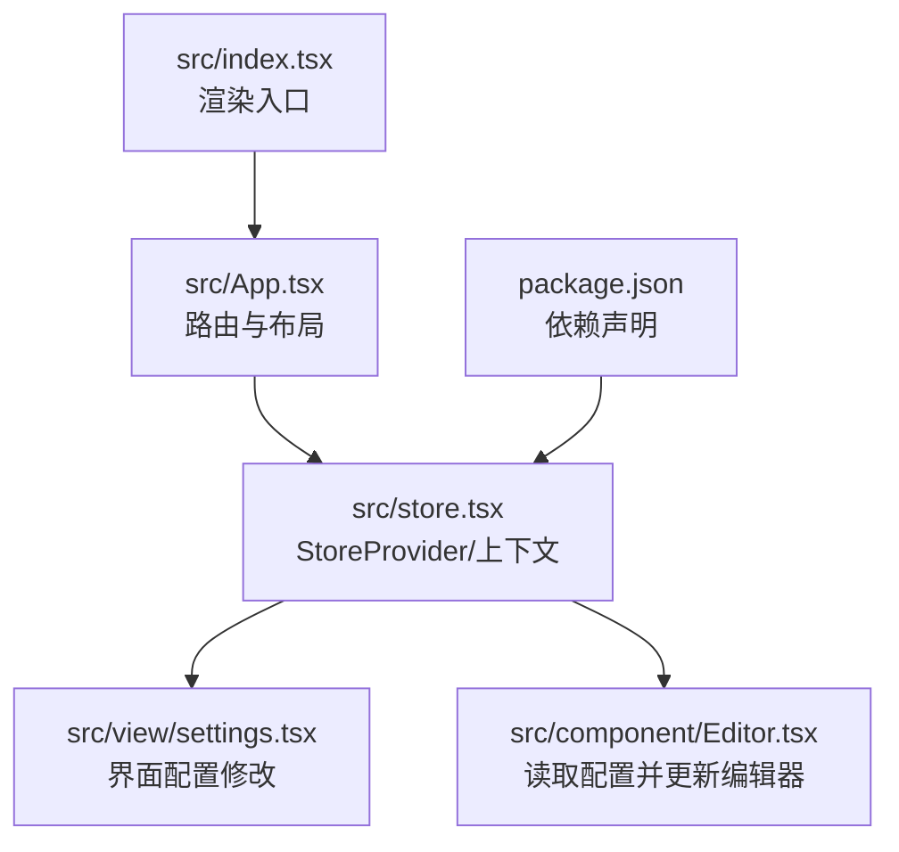
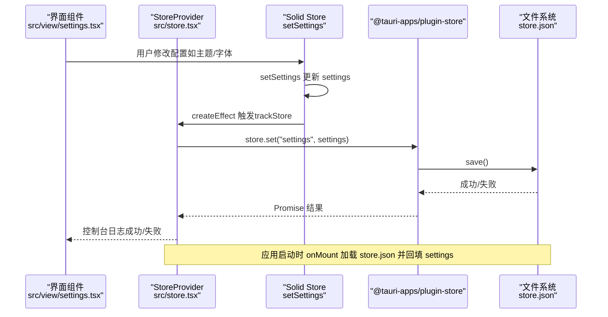
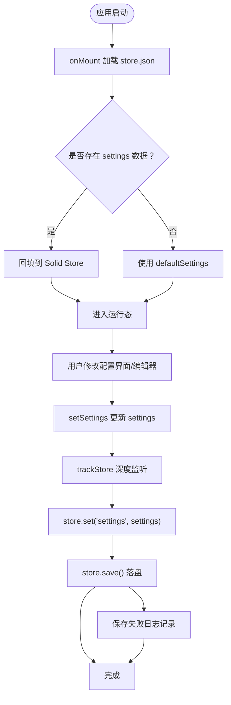

# 状态持久化机制

<cite>
**本文引用的文件**
- [src/store.tsx](file://src/store.tsx)
- [src/App.tsx](file://src/App.tsx)
- [src/index.tsx](file://src/index.tsx)
- [src/view/settings.tsx](file://src/view/settings.tsx)
- [src/component/Editor.tsx](file://src/component/Editor.tsx)
- [package.json](file://package.json)
</cite>

## 目录
1. [简介](#简介)
2. [项目结构](#项目结构)
3. [核心组件](#核心组件)
4. [架构总览](#架构总览)
5. [详细组件分析](#详细组件分析)
6. [依赖分析](#依赖分析)
7. [性能考量](#性能考量)
8. [故障排查指南](#故障排查指南)
9. [结论](#结论)
10. [附录](#附录)

## 简介
本文件聚焦于 devkimi 项目的“状态持久化”机制，系统性解析 store.tsx 中的状态持久化实现，阐明如何通过 Tauri 的 Store 插件与 Solid Store 协作，将用户配置（如主题、编辑器偏好）在应用重启后得以恢复。文档覆盖以下关键点：
- 持久化目标与数据模型
- 序列化与反序列化路径
- 状态变更监听与写入策略
- 错误处理与降级策略
- 完整流程图与最佳实践

## 项目结构
围绕状态持久化，涉及的关键文件与职责如下：
- src/store.tsx：定义 Settings 数据模型、创建 Provider、初始化加载与写入逻辑、主题切换副作用
- src/App.tsx：应用入口路由与 StoreProvider 包裹
- src/index.tsx：渲染入口
- src/view/settings.tsx：用户界面层，修改 Settings 并触发持久化
- src/component/Editor.tsx：读取 Settings 并动态更新编辑器选项
- package.json：声明 @tauri-apps/plugin-store、@solid-primitives/deep 等依赖

图表来源
- [src/index.tsx](file://src/index.tsx#L1-L37)
- [src/App.tsx](file://src/App.tsx#L1-L47)
- [src/store.tsx](file://src/store.tsx#L1-L88)
- [src/view/settings.tsx](file://src/view/settings.tsx#L1-L122)
- [src/component/Editor.tsx](file://src/component/Editor.tsx#L1-L139)
- [package.json](file://package.json#L1-L43)

章节来源
- [src/store.tsx](file://src/store.tsx#L1-L88)
- [src/App.tsx](file://src/App.tsx#L1-L47)
- [src/index.tsx](file://src/index.tsx#L1-L37)
- [src/view/settings.tsx](file://src/view/settings.tsx#L1-L122)
- [src/component/Editor.tsx](file://src/component/Editor.tsx#L1-L139)
- [package.json](file://package.json#L1-L43)

## 核心组件
- Settings 数据模型：包含 common（主题、配置面板默认展开）与 editor（自动换行、字体族、字号）两部分，默认值在初始化时提供。
- StoreProvider：负责：
  - 使用 Solid Store 创建 settings 状态
  - onMount 阶段加载持久化数据并回填到 settings
  - createEffect 监听 settings 变化，通过 @tauri-apps/plugin-store 写入并保存
  - 切换主题时为根节点设置 data-theme 属性
- useSettings：消费上下文，返回 [settings, setSettings]，供视图层使用
- 视图层（settings 页面与编辑器组件）：通过 setSettings 修改 settings，从而触发持久化

章节来源
- [src/store.tsx](file://src/store.tsx#L1-L88)
- [src/view/settings.tsx](file://src/view/settings.tsx#L1-L122)
- [src/component/Editor.tsx](file://src/component/Editor.tsx#L1-L139)

## 架构总览
下图展示了从用户修改配置到持久化落盘的端到端流程，包括初始化加载与运行时写入。

图表来源
- [src/store.tsx](file://src/store.tsx#L45-L88)
- [src/view/settings.tsx](file://src/view/settings.tsx#L1-L122)

## 详细组件分析

### StoreProvider 与 Settings 数据模型
- 数据模型定义：Settings 含 common 与 editor 两个分支，包含主题、配置面板默认展开、自动换行、字体族与字号等字段；提供 defaultSettings 作为兜底。
- 上下文提供：StoreContext 提供 [settings, setSettings]，供子树消费。
- 初始化加载：onMount 异步加载 store.json 中的 settings，若不存在则回退 defaultSettings。
- 运行时写入：createEffect 监听 settings（通过 trackStore 深度追踪），一旦有变更即调用 store.set("settings", settings)，随后执行 save() 将数据落盘；成功与失败分别输出调试与错误日志。
- 主题切换：另一个 createEffect 读取 settings.common.theme，并为 documentElement 设置 data-theme，使全局样式生效。

章节来源
- [src/store.tsx](file://src/store.tsx#L1-L88)

### 视图层与状态联动
- settings 页面：通过 Config 组件读取与写入 settings，包括主题、配置面板默认展开、字体、字号、自动换行等；每次 onChange 均调用 setSettings，进而触发持久化。
- 编辑器组件：首次 onMount 时读取 settings.common.theme、settings.editor.font.family/size、settings.editor.wordWrap 初始化编辑器；后续 createEffect 会根据 settings 的变化动态更新编辑器选项。

章节来源
- [src/view/settings.tsx](file://src/view/settings.tsx#L1-L122)
- [src/component/Editor.tsx](file://src/component/Editor.tsx#L1-L139)

### 序列化与反序列化流程
- 反序列化（启动加载）：onMount 时通过 store.get("settings") 读取 JSON 数据，若存在则回填到 Solid Store；若不存在则使用 defaultSettings。
- 序列化（运行时保存）：createEffect 中，store.set("settings", settings) 将当前 settings 对象写入 Store；随后调用 save() 将 JSON 数据落盘到 store.json。

章节来源
- [src/store.tsx](file://src/store.tsx#L45-L88)

### 状态变更监听与同步策略
- 深度追踪：使用 @solid-primitives/deep 的 trackStore 对 settings 进行深度监听，确保任意层级的修改都会触发持久化。
- 写入时机：每次 setSettings 后立即触发持久化，避免频繁写入导致的性能问题；如需进一步优化，可在上层引入节流/去抖策略。
- 主题同步：独立的 createEffect 将 settings.common.theme 同步到 documentElement 的 data-theme 属性，保证 UI 主题即时生效。

章节来源
- [src/store.tsx](file://src/store.tsx#L45-L88)
- [package.json](file://package.json#L1-L43)

### 错误处理与降级策略
- 已知行为：保存失败时记录错误日志；未见显式的 try/catch 或重试逻辑。
- 建议的降级策略（基于现有实现的扩展建议）：
  - 存储空间不足：捕获异常后提示用户清理磁盘空间或减少配置体积，并将本次变更暂存至内存，等待下次可用时再尝试保存。
  - 数据损坏：当 store.get 返回空或解析失败时，回退到 defaultSettings 并记录警告；同时可尝试备份旧版本文件以防数据丢失。
  - 网络/权限问题：在桌面环境下通常不会遇到网络问题，但可增加权限检查与错误提示，引导用户修复权限后再重试。
  - 性能优化：对高频变更进行节流（例如 200ms 内多次变更合并为一次保存），降低磁盘 IO 压力。

章节来源
- [src/store.tsx](file://src/store.tsx#L45-L88)

### 状态持久化流程图

图表来源
- [src/store.tsx](file://src/store.tsx#L45-L88)

## 依赖分析
- @tauri-apps/plugin-store：提供跨平台的键值存储能力，支持 JSON 序列化与异步写入。
- @solid-primitives/deep：提供深度追踪能力，确保多层嵌套的 settings 变更都能被感知。
- solid-js/store：提供响应式状态管理与 setSettings 接口。
- lucide-solid、monaco-editor、tailwind 等：用于界面与编辑器渲染，间接影响持久化效果（如主题、字体、字号等）。

章节来源
- [package.json](file://package.json#L1-L43)
- [src/store.tsx](file://src/store.tsx#L1-L88)

## 性能考量
- 写入频率：当前实现每次 setSettings 都会触发一次保存，可能在高频交互场景下造成频繁 IO。建议：
  - 在 StoreProvider 外层引入节流/去抖策略，合并短时间内多次变更。
  - 对于非关键路径的配置（如字体大小微调），可延迟保存或仅在失焦/离开页面时保存。
- 数据体积：Settings 结构相对简单，但若未来扩展更多配置项，应关注 JSON 文件大小与解析时间。
- 主题切换：主题同步为 DOM 属性设置，开销极低；无需额外优化。

## 故障排查指南
- 无法加载历史配置
  - 检查 store.json 是否存在且可读；若不存在或为空，将回退到 defaultSettings。
  - 查看控制台是否有错误日志（保存失败时会打印）。
- 主题不生效
  - 确认 settings.common.theme 是否正确；createEffect 会将其写入 documentElement 的 data-theme。
- 编辑器选项未更新
  - 确认 settings.editor 下的字段（wordWrap、font.family、font.size）是否被正确修改；编辑器组件会在 mount 后读取这些值并在后续 createEffect 中动态更新。
- 保存失败
  - 当前实现会记录错误日志；如需增强，可参考“错误处理与降级策略”中的建议增加重试与备份。

章节来源
- [src/store.tsx](file://src/store.tsx#L45-L88)
- [src/component/Editor.tsx](file://src/component/Editor.tsx#L1-L139)

## 结论
devkimi 的状态持久化以 Tauri Store 为核心，结合 Solid Store 的响应式能力，实现了用户配置（主题、编辑器偏好）的可靠持久化。其优势在于：
- 结构清晰：Settings 模型明确，Provider 负责加载与保存，视图层只负责修改。
- 实时性强：深度追踪确保任何层级的变更都会被持久化。
- 易于扩展：新增配置项只需扩展 Settings 类型与 Provider 的读写逻辑。

建议在未来迭代中加入节流/去抖、错误重试与备份等机制，以进一步提升稳定性与用户体验。

## 附录
- 最佳实践清单
  - 对高频变更进行节流/去抖，降低磁盘 IO 压力
  - 保存失败时记录详细日志并提示用户
  - 对 store.json 增加校验与回退策略，避免因损坏导致不可用
  - 将主题切换与配置保存解耦，确保 UI 即时反馈与持久化异步进行
  - 对复杂配置项采用分块存储或增量更新，减少整体写入成本