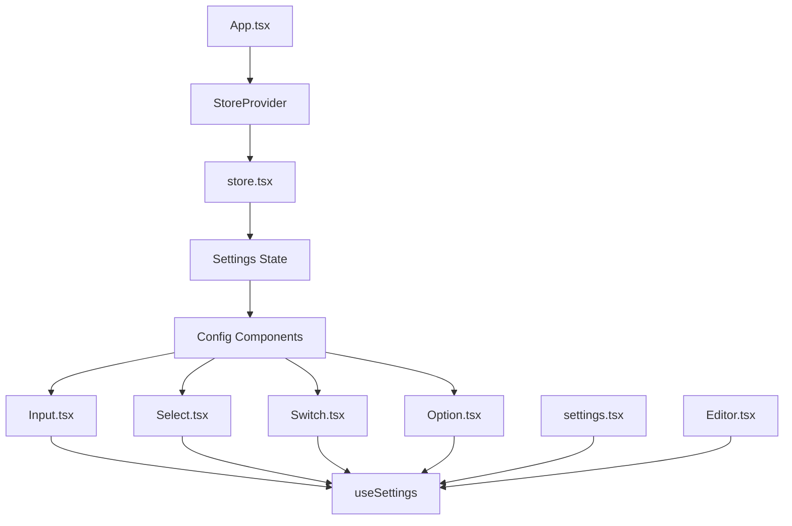
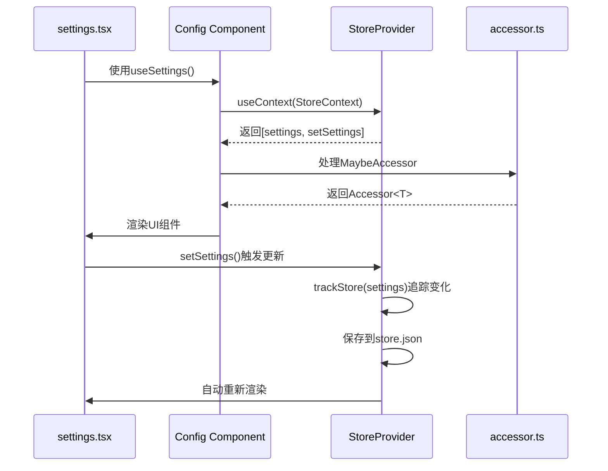
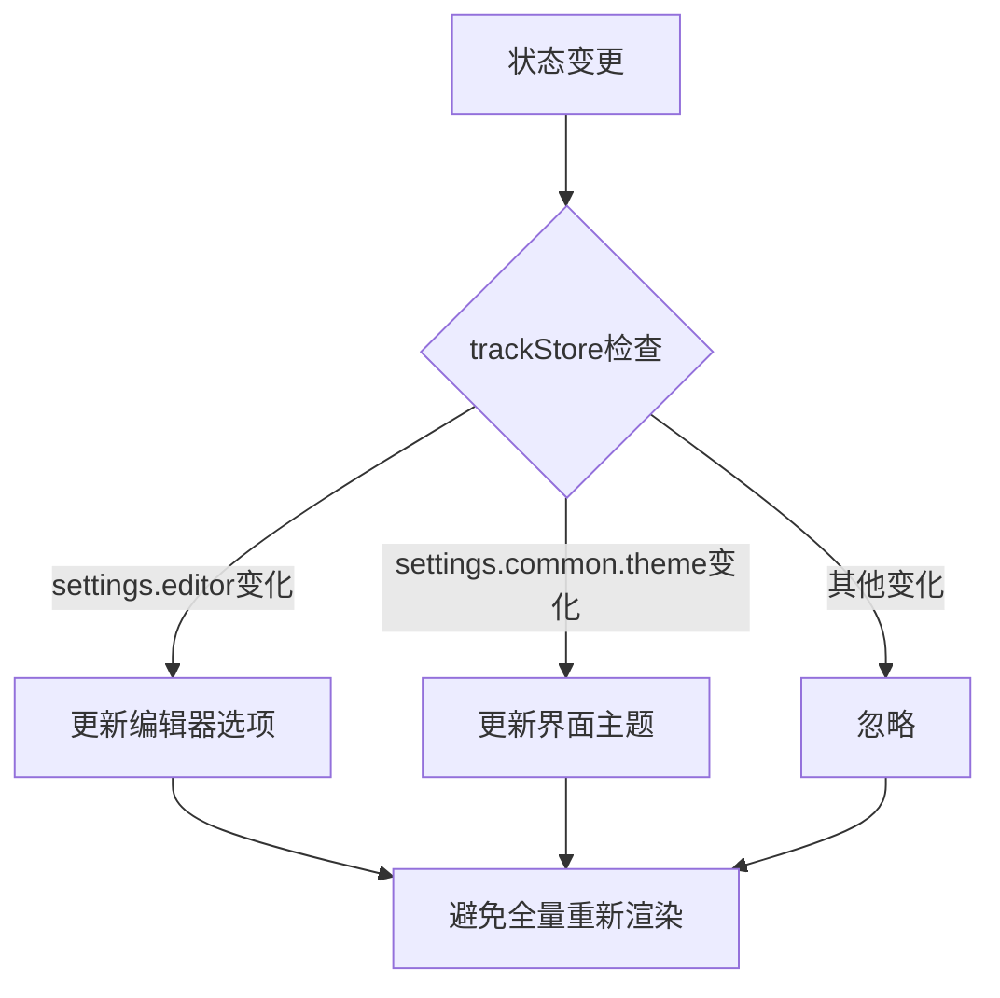
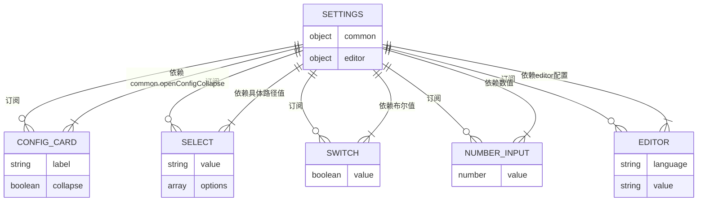

# 状态订阅模式

<cite>
**本文档中引用的文件**  
- [store.tsx](file://src/store.tsx)
- [accessor.ts](file://src/utils/accessor.ts)
- [Input.tsx](file://src/component/Config/Input.tsx)
- [Select.tsx](file://src/component/Config/Select.tsx)
- [Switch.tsx](file://src/component/Config/Switch.tsx)
- [Option.tsx](file://src/component/Config/Option.tsx)
- [index.tsx](file://src/component/Config/index.tsx)
- [settings.tsx](file://src/view/settings.tsx)
- [Editor.tsx](file://src/component/Editor.tsx)
- [App.tsx](file://src/App.tsx)
</cite>

## 目录
1. [简介](#简介)
2. [项目结构](#项目结构)
3. [核心状态管理机制](#核心状态管理机制)
4. [状态订阅实现细节](#状态订阅实现细节)
5. [细粒度订阅与性能优化](#细粒度订阅与性能优化)
6. [状态订阅关系图](#状态订阅关系图)
7. [正确订阅模式示例](#正确订阅模式示例)
8. [常见反模式](#常见反模式)
9. [结论](#结论)

## 简介
本项目采用SolidJS框架实现全局状态管理，通过`store.tsx`中的`StoreProvider`和`useSettings`钩子提供状态订阅功能。核心机制基于SolidJS的响应式系统，结合`@solid-primitives/deep`库的`trackStore`函数实现细粒度的状态追踪。配置组件通过访问器（Accessor）订阅全局状态变化，确保UI组件能够高效响应状态更新，同时避免不必要的重新渲染。

## 项目结构
项目采用模块化设计，主要分为命令（command）、组件（component）、工具（utils）、视图（view）等目录。状态管理相关代码集中在`src/store.tsx`，配置组件位于`src/component/Config`目录下，包括Input、Select、Switch等基础控件。视图层通过`useSettings`钩子访问全局状态，实现配置界面的动态更新。



**Diagram sources**  
- [App.tsx](file://src/App.tsx#L1-L47)
- [store.tsx](file://src/store.tsx#L1-L88)
- [Input.tsx](file://src/component/Config/Input.tsx#L1-L37)
- [Select.tsx](file://src/component/Config/Select.tsx#L1-L30)
- [Switch.tsx](file://src/component/Config/Switch.tsx#L1-L24)
- [Option.tsx](file://src/component/Config/Option.tsx#L1-L27)
- [index.tsx](file://src/component/Config/index.tsx#L1-L37)

**Section sources**  
- [App.tsx](file://src/App.tsx#L1-L47)
- [store.tsx](file://src/store.tsx#L1-L88)

## 核心状态管理机制
项目使用SolidJS的`createStore`创建响应式状态，并通过`createContext`提供全局访问。`StoreProvider`组件封装了状态初始化、持久化存储和主题切换逻辑。`useSettings`钩子提供便捷的状态访问接口，返回包含当前设置和设置更新函数的元组。

```mermaid
classDiagram
class StoreProvider {
+settings : [Settings, SetStoreFunction]
+onMount() : void
+createEffect() : void
}
class useSettings {
+context : StoreContext
+return : [Settings, SetStoreFunction]
}
class Settings {
+common : {theme : string, openConfigCollapse : boolean}
+editor : {wordWrap : WordWrap, font : {family : string, size : number}}
}
StoreProvider --> useSettings : "provides"
useSettings --> Settings : "returns"
```

**Diagram sources**  
- [store.tsx](file://src/store.tsx#L41-L87)

**Section sources**  
- [store.tsx](file://src/store.tsx#L41-L87)

## 状态订阅实现细节
配置组件通过`useSettings`钩子订阅全局状态。`accessor.ts`中的`accessor`函数用于处理可能的访问器类型，确保无论是直接值还是函数都能正确处理。`Config/index.tsx`中的`Card`组件直接订阅`settings.common.openConfigCollapse`状态，控制配置区域的展开/折叠。



**Diagram sources**  
- [settings.tsx](file://src/view/settings.tsx#L1-L122)
- [index.tsx](file://src/component/Config/index.tsx#L1-L37)
- [accessor.ts](file://src/utils/accessor.ts#L1-L11)

**Section sources**  
- [settings.tsx](file://src/view/settings.tsx#L1-L122)
- [index.tsx](file://src/component/Config/index.tsx#L1-L37)
- [accessor.ts](file://src/utils/accessor.ts#L1-L11)

## 细粒度订阅与性能优化
项目通过`trackStore`函数实现细粒度状态订阅，避免不必要的重新渲染。在`settings.tsx`中，编辑器配置的更新使用`trackStore(settings.editor)`，仅当编辑器相关设置变化时才触发重新渲染。主题切换使用`createEffect`单独监听`settings.common.theme`，确保主题变更不会影响其他组件的渲染性能。



**Diagram sources**  
- [settings.tsx](file://src/view/settings.tsx#L37-L46)

**Section sources**  
- [settings.tsx](file://src/view/settings.tsx#L37-L46)

## 状态订阅关系图
以下图表展示了主要UI组件与全局状态变量之间的依赖映射关系：



**Diagram sources**  
- [store.tsx](file://src/store.tsx#L20-L39)
- [index.tsx](file://src/component/Config/index.tsx#L10-L24)
- [settings.tsx](file://src/view/settings.tsx#L51-L119)

## 正确订阅模式示例
正确的订阅模式包括：使用`useSettings`获取状态访问器，通过`setSettings`的路径参数精确更新状态，利用`trackStore`进行细粒度追踪。在`settings.tsx`中，主题选择器通过`settings.common.theme`订阅状态，字体大小输入框通过`settings.editor.font.size`订阅，确保只有相关组件响应特定状态变化。

**Section sources**  
- [settings.tsx](file://src/view/settings.tsx#L53-L58)
- [settings.tsx](file://src/view/settings.tsx#L81-L85)

## 常见反模式
常见反模式包括：直接解构整个状态对象导致过度订阅，未使用`trackStore`进行深度追踪，以及在非必要情况下触发全量状态更新。应避免在组件中直接使用`const {settings} = useSettings()`解构所有状态，而应通过访问器按需读取特定字段。

**Section sources**  
- [settings.tsx](file://src/view/settings.tsx#L19-L20)

## 结论
devkimi项目通过SolidJS的响应式系统和`@solid-primitives/deep`库实现了高效的状态订阅模式。配置组件通过访问器精确订阅所需状态，结合`trackStore`实现细粒度追踪，有效避免了不必要的重新渲染。开发者应遵循按需订阅、精确更新的原则，充分利用路径参数和细粒度追踪功能，确保应用性能最优。