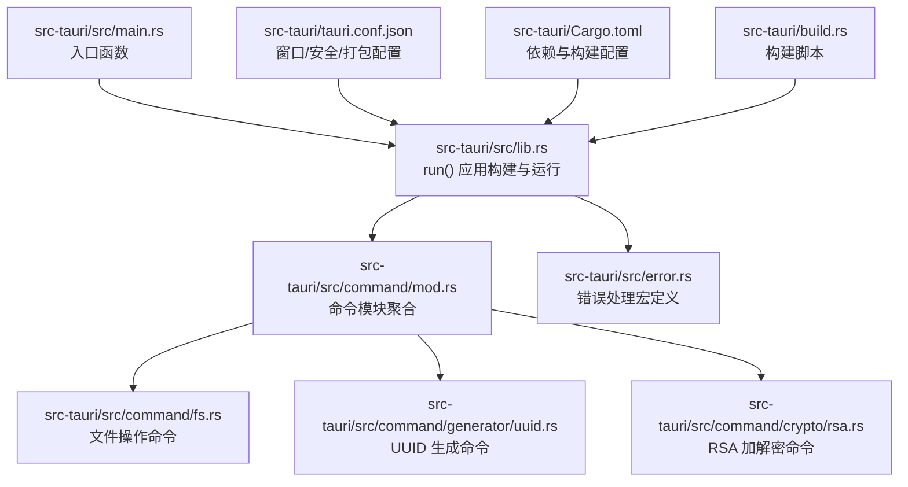
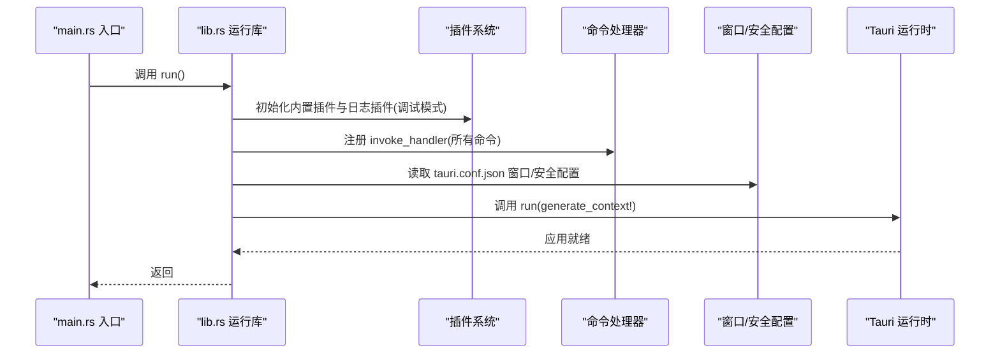
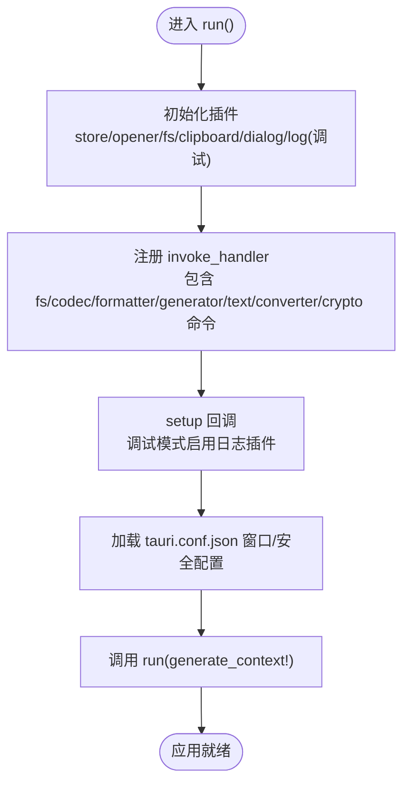
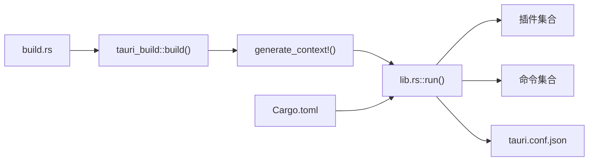

# 后端初始化流程

<cite>
**本文引用的文件**
- [src-tauri/src/main.rs](file://src-tauri/src/main.rs)
- [src-tauri/src/lib.rs](file://src-tauri/src/lib.rs)
- [src-tauri/tauri.conf.json](file://src-tauri/tauri.conf.json)
- [src-tauri/Cargo.toml](file://src-tauri/Cargo.toml)
- [src-tauri/src/command/mod.rs](file://src-tauri/src/command/mod.rs)
- [src-tauri/src/command/fs.rs](file://src-tauri/src/command/fs.rs)
- [src-tauri/src/command/generator/uuid.rs](file://src-tauri/src/command/generator/uuid.rs)
- [src-tauri/src/command/crypto/rsa.rs](file://src-tauri/src/command/crypto/rsa.rs)
- [src-tauri/src/error.rs](file://src-tauri/src/error.rs)
- [src-tauri/build.rs](file://src-tauri/build.rs)
</cite>

## 目录
1. [简介](#简介)
2. [项目结构](#项目结构)
3. [核心组件](#核心组件)
4. [架构总览](#架构总览)
5. [详细组件分析](#详细组件分析)
6. [依赖关系分析](#依赖关系分析)
7. [性能考量](#性能考量)
8. [故障排查指南](#故障排查指南)
9. [结论](#结论)

## 简介
本文件聚焦于 devkimi 项目的后端初始化流程，围绕 Tauri 应用的启动过程展开，涵盖以下主题：
- main.rs 中 Tauri 应用的启动入口与控制流
- lib.rs 中导出的公共接口与模块组织结构
- tauri.conf.json 配置文件与代码初始化的关联（窗口属性、安全设置、权限）
- 应用生命周期事件的注册与处理机制（启动前、启动后、关闭）
- 初始化流程的时序图，展示从 main 函数执行到应用就绪的完整过程

## 项目结构
后端初始化相关的关键位置如下：
- 启动入口：src-tauri/src/main.rs
- 应用运行逻辑：src-tauri/src/lib.rs
- 构建与打包配置：src-tauri/tauri.conf.json、src-tauri/Cargo.toml、src-tauri/build.rs
- 命令模块组织：src-tauri/src/command/mod.rs 及其子模块
- 错误处理宏：src-tauri/src/error.rs

图表来源
- [src-tauri/src/main.rs](file://src-tauri/src/main.rs#L1-L7)
- [src-tauri/src/lib.rs](file://src-tauri/src/lib.rs#L1-L57)
- [src-tauri/src/command/mod.rs](file://src-tauri/src/command/mod.rs#L1-L8)
- [src-tauri/src/command/fs.rs](file://src-tauri/src/command/fs.rs#L1-L34)
- [src-tauri/src/command/generator/uuid.rs](file://src-tauri/src/command/generator/uuid.rs#L1-L48)
- [src-tauri/src/command/crypto/rsa.rs](file://src-tauri/src/command/crypto/rsa.rs#L1-L78)
- [src-tauri/src/error.rs](file://src-tauri/src/error.rs#L1-L31)
- [src-tauri/tauri.conf.json](file://src-tauri/tauri.conf.json#L1-L46)
- [src-tauri/Cargo.toml](file://src-tauri/Cargo.toml#L1-L70)
- [src-tauri/build.rs](file://src-tauri/build.rs#L1-L3)

章节来源
- [src-tauri/src/main.rs](file://src-tauri/src/main.rs#L1-L7)
- [src-tauri/src/lib.rs](file://src-tauri/src/lib.rs#L1-L57)
- [src-tauri/src/command/mod.rs](file://src-tauri/src/command/mod.rs#L1-L8)
- [src-tauri/tauri.conf.json](file://src-tauri/tauri.conf.json#L1-L46)
- [src-tauri/Cargo.toml](file://src-tauri/Cargo.toml#L1-L70)
- [src-tauri/build.rs](file://src-tauri/build.rs#L1-L3)

## 核心组件
- 启动入口 main.rs：仅调用 app_lib::run()，用于隔离应用运行逻辑与入口职责。
- 应用运行库 lib.rs：集中完成插件初始化、命令处理器注册、生命周期 setup、以及最终运行应用。
- 命令模块：按功能域划分（fs、generator、crypto、formatter、codec、text、converter），统一在 lib.rs 的 invoke_handler 中注册。
- 配置文件 tauri.conf.json：定义窗口尺寸、最小尺寸、可调整性、全屏、标题等窗口属性；安全策略（如 CSP、资源协议）；打包图标等。
- 构建与依赖：Cargo.toml 指定 Tauri 版本与插件依赖；build.rs 调用 tauri_build::build() 完成构建集成。

章节来源
- [src-tauri/src/main.rs](file://src-tauri/src/main.rs#L1-L7)
- [src-tauri/src/lib.rs](file://src-tauri/src/lib.rs#L1-L57)
- [src-tauri/src/command/mod.rs](file://src-tauri/src/command/mod.rs#L1-L8)
- [src-tauri/tauri.conf.json](file://src-tauri/tauri.conf.json#L1-L46)
- [src-tauri/Cargo.toml](file://src-tauri/Cargo.toml#L1-L70)
- [src-tauri/build.rs](file://src-tauri/build.rs#L1-L3)

## 架构总览
下图展示了从 main 函数到应用就绪的高层流程，包括插件初始化、命令注册、生命周期 setup 与运行阶段。

图表来源
- [src-tauri/src/main.rs](file://src-tauri/src/main.rs#L1-L7)
- [src-tauri/src/lib.rs](file://src-tauri/src/lib.rs#L1-L57)
- [src-tauri/tauri.conf.json](file://src-tauri/tauri.conf.json#L1-L46)

## 详细组件分析

### 启动入口 main.rs
- 作用：作为 Windows 子系统入口，避免发布版本出现额外控制台窗口；仅负责调用 app_lib::run()。
- 关键点：入口简洁，职责单一，便于维护与测试。

章节来源
- [src-tauri/src/main.rs](file://src-tauri/src/main.rs#L1-L7)

### 应用运行库 lib.rs
- 插件初始化：
  - tauri_plugin_store：持久化存储
  - tauri_plugin_opener：系统默认应用打开文件
  - tauri_plugin_fs：文件系统访问
  - tauri_plugin_clipboard_manager：剪贴板
  - tauri_plugin_dialog：对话框
  - tauri_plugin_log：日志（仅调试模式启用）
- 命令注册：通过 generate_handler! 将所有命令函数注册为 invoke_handler，供前端调用。
- 生命周期 setup：在 setup 回调中根据是否为调试模式决定是否加载日志插件。
- 运行应用：调用 run(generate_context!) 并处理错误。

图表来源
- [src-tauri/src/lib.rs](file://src-tauri/src/lib.rs#L1-L57)
- [src-tauri/tauri.conf.json](file://src-tauri/tauri.conf.json#L1-L46)

章节来源
- [src-tauri/src/lib.rs](file://src-tauri/src/lib.rs#L1-L57)

### 模块组织与公共接口导出（lib.rs）
- 导出函数：run() 是对外唯一入口，封装了完整的应用构建与运行流程。
- 内部模块：command、error 等模块在 lib.rs 中被引入并使用。
- 命令模块：command/mod.rs 聚合各功能域子模块，便于集中管理与注册。

章节来源
- [src-tauri/src/lib.rs](file://src-tauri/src/lib.rs#L1-L57)
- [src-tauri/src/command/mod.rs](file://src-tauri/src/command/mod.rs#L1-L8)

### 命令模块与功能域
- 文件系统命令：open_file、copy_file 等，使用 open crate 与标准库进行文件操作，并通过自定义错误类型返回。
- 生成器命令：如 generate_uuid 支持多种 UUID 版本与格式化选项。
- 加密命令：RSA 密钥对生成、加密、解密，支持 PKCS#1 与 PKCS#8 格式。
- 文本与格式化：Markdown 解析、JSONPath、正则表达式、SQL/JSON/XML 格式化等。
- 编解码：Base64 文本/图片、URL、Gzip、二维码等。
- 转换器：Cron 表达式解析、JSON/YAML、YAML/Properties 互转。

章节来源
- [src-tauri/src/command/fs.rs](file://src-tauri/src/command/fs.rs#L1-L34)
- [src-tauri/src/command/generator/uuid.rs](file://src-tauri/src/command/generator/uuid.rs#L1-L48)
- [src-tauri/src/command/crypto/rsa.rs](file://src-tauri/src/command/crypto/rsa.rs#L1-L78)

### 配置文件 tauri.conf.json 与初始化关联
- 窗口属性：标题、宽高、最小宽高、可调整性、全屏等，直接影响应用窗口初始状态。
- 安全设置：CSP 置空、资源协议启用与作用域限制（如 $TEMP/**），影响前端资源加载与安全策略。
- 打包配置：图标集合、目标平台等，影响最终安装包与图标资源。

章节来源
- [src-tauri/tauri.conf.json](file://src-tauri/tauri.conf.json#L1-L46)

### 生命周期事件与处理机制
- 启动前（setup）：在 setup 回调中按需加载日志插件，便于调试期输出。
- 启动后：应用进入主循环，等待前端调用 invoke_handler 注册的命令。
- 关闭事件：当前代码未显式注册关闭回调；若需要在关闭时执行清理，可在 setup 中添加相应逻辑。

章节来源
- [src-tauri/src/lib.rs](file://src-tauri/src/lib.rs#L1-L57)

### 错误处理与序列化
- 自定义错误宏：command_error! 生成枚举并自动实现 serde::Serialize，确保错误信息可序列化传输给前端。
- serialize_error! 宏：为指定类型实现序列化，保证错误消息字符串化后可被前端接收。

章节来源
- [src-tauri/src/error.rs](file://src-tauri/src/error.rs#L1-L31)

## 依赖关系分析
- 构建依赖：tauri-build 在 build.rs 中调用，配合 tauri.conf.json 生成运行时所需资源与上下文。
- 运行时依赖：tauri 与各插件版本在 Cargo.toml 中声明，确保插件与运行时兼容。
- 命令依赖：各命令模块依赖第三方库（如 uuid、rsa、base64、regex 等），在 Cargo.toml 中统一管理。

图表来源
- [src-tauri/build.rs](file://src-tauri/build.rs#L1-L3)
- [src-tauri/Cargo.toml](file://src-tauri/Cargo.toml#L1-L70)
- [src-tauri/src/lib.rs](file://src-tauri/src/lib.rs#L1-L57)
- [src-tauri/tauri.conf.json](file://src-tauri/tauri.conf.json#L1-L46)

章节来源
- [src-tauri/build.rs](file://src-tauri/build.rs#L1-L3)
- [src-tauri/Cargo.toml](file://src-tauri/Cargo.toml#L1-L70)
- [src-tauri/src/lib.rs](file://src-tauri/src/lib.rs#L1-L57)
- [src-tauri/tauri.conf.json](file://src-tauri/tauri.conf.json#L1-L46)

## 性能考量
- 发布配置：Cargo.toml 中 release 配置启用了 LTO、优化级别与符号剥离，有助于减小二进制体积与提升运行性能。
- 插件按需加载：仅在调试模式启用日志插件，减少生产环境开销。
- 命令注册集中：通过 generate_handler! 统一注册，避免重复绑定与运行时查找成本。

章节来源
- [src-tauri/Cargo.toml](file://src-tauri/Cargo.toml#L61-L70)
- [src-tauri/src/lib.rs](file://src-tauri/src/lib.rs#L1-L57)

## 故障排查指南
- 启动失败：检查 lib.rs 中 run() 是否抛出异常；确认 generate_context! 生成的上下文有效。
- 插件未生效：核对 Cargo.toml 中插件版本与 tauri 版本兼容；确认插件初始化顺序正确。
- 命令调用失败：查看命令函数签名与参数类型是否匹配；检查错误宏生成的错误类型是否被前端正确解析。
- 窗口/安全问题：核对 tauri.conf.json 中窗口属性与安全策略；确认资源协议作用域覆盖所需路径。
- 日志缺失：确认处于调试模式且已启用日志插件；检查日志级别设置。

章节来源
- [src-tauri/src/lib.rs](file://src-tauri/src/lib.rs#L1-L57)
- [src-tauri/src/error.rs](file://src-tauri/src/error.rs#L1-L31)
- [src-tauri/tauri.conf.json](file://src-tauri/tauri.conf.json#L1-L46)

## 结论
devkimi 的后端初始化流程以 lib.rs 的 run() 为核心，通过集中化的插件初始化、命令注册与生命周期 setup，实现了清晰、可维护的应用启动过程。tauri.conf.json 提供了窗口与安全层面的配置支撑，Cargo.toml 与 build.rs 则保障了构建与运行时的一致性。若需增强生命周期控制，可在 setup 中扩展关闭事件处理，以满足更复杂的资源清理需求。