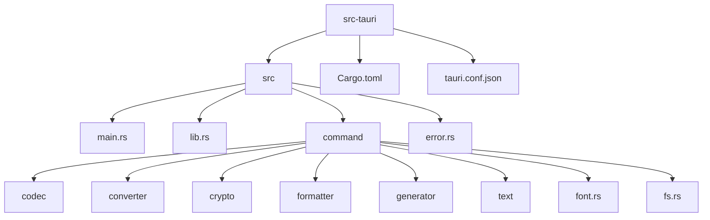
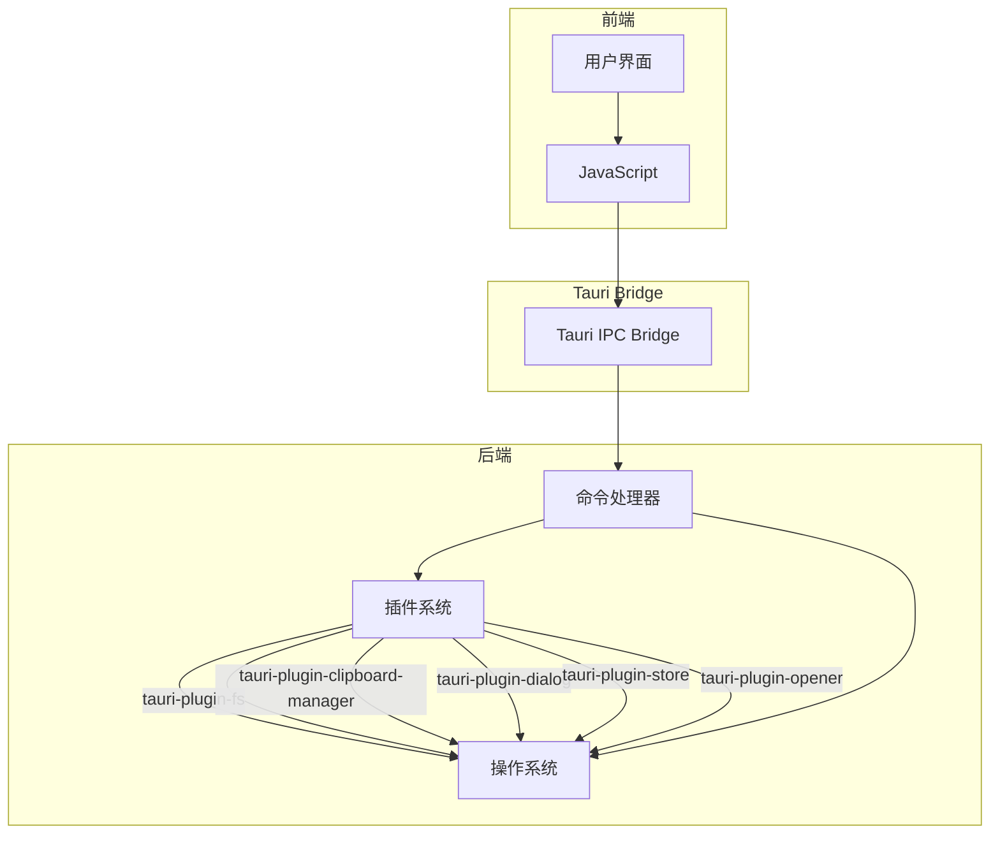
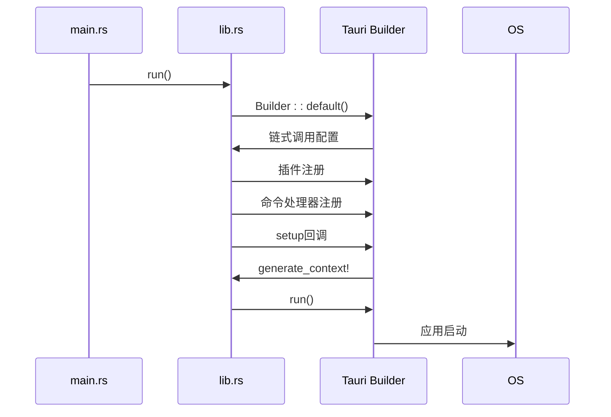
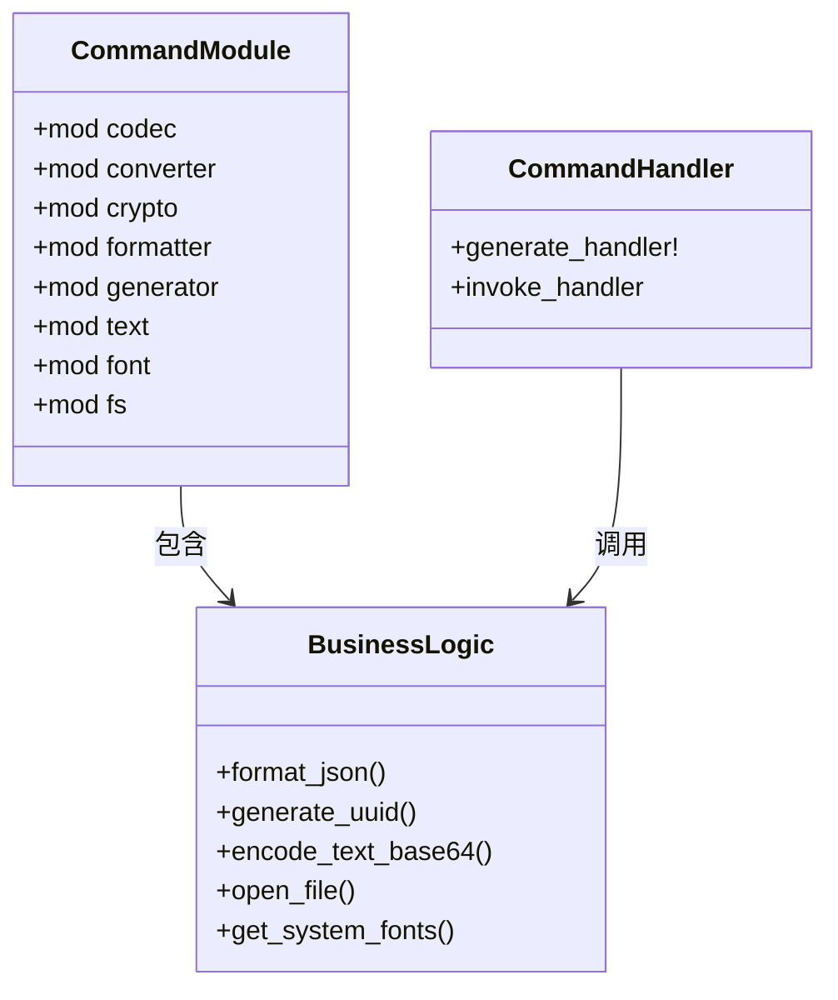
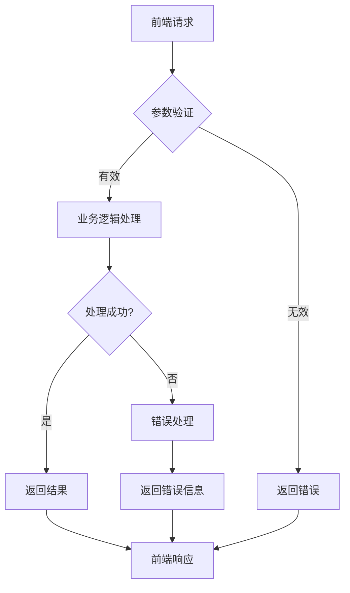
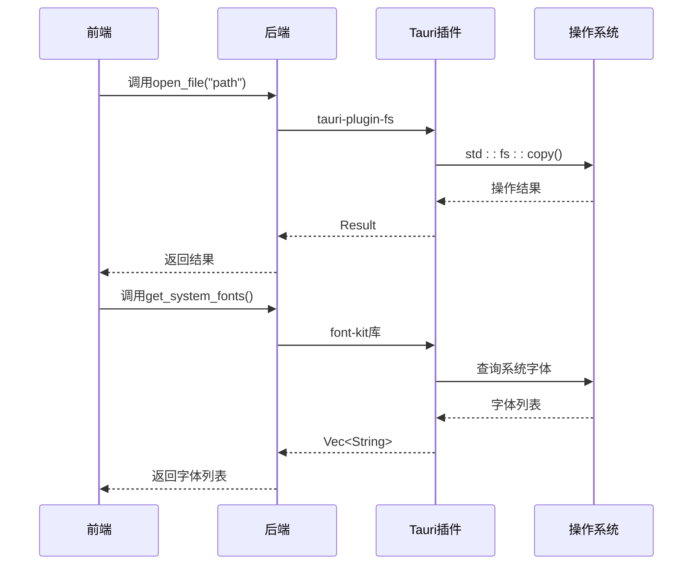
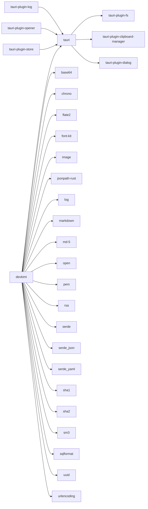

# 后端处理流程

<cite>
**本文档中引用的文件**  
- [main.rs](file://src-tauri/src/main.rs)
- [lib.rs](file://src-tauri/src/lib.rs)
- [mod.rs](file://src-tauri/src/command/mod.rs)
- [fs.rs](file://src-tauri/src/command/fs.rs)
- [font.rs](file://src-tauri/src/command/font.rs)
- [uuid.rs](file://src-tauri/src/command/generator/uuid.rs)
- [password.rs](file://src-tauri/src/command/generator/password.rs)
- [hash.rs](file://src-tauri/src/command/generator/hash.rs)
- [base64_text.rs](file://src-tauri/src/command/codec/base64_text.rs)
- [url.rs](file://src-tauri/src/command/codec/url.rs)
- [json.rs](file://src-tauri/src/command/formatter/json.rs)
- [markdown.rs](file://src-tauri/src/command/text/markdown.rs)
- [error.rs](file://src-tauri/src/error.rs)
- [Cargo.toml](file://src-tauri/Cargo.toml)
- [tauri.conf.json](file://src-tauri/tauri.conf.json)
</cite>

## 目录
1. [简介](#简介)
2. [项目结构](#项目结构)
3. [核心组件](#核心组件)
4. [架构概述](#架构概述)
5. [详细组件分析](#详细组件分析)
6. [依赖分析](#依赖分析)
7. [性能考虑](#性能考虑)
8. [故障排除指南](#故障排除指南)
9. [结论](#结论)

## 简介
本文档详细描述了devkimi项目的Rust后端处理流程，重点分析了应用初始化、命令路由机制、Tauri命令执行生命周期以及与操作系统资源的交互方式。文档涵盖了从请求接收到响应返回的完整路径，包括关键的中间件和安全检查点。

## 项目结构
devkimi项目采用典型的Tauri应用结构，前端使用TypeScript/React，后端使用Rust。后端代码位于`src-tauri`目录中，主要包含命令处理、错误处理和应用配置等核心模块。

**Diagram sources**
- [main.rs](file://src-tauri/src/main.rs#L1-L7)
- [lib.rs](file://src-tauri/src/lib.rs#L1-L57)

**Section sources**
- [main.rs](file://src-tauri/src/main.rs#L1-L7)
- [lib.rs](file://src-tauri/src/lib.rs#L1-L57)

## 核心组件
devkimi后端的核心组件包括应用初始化、命令路由、错误处理和系统资源访问。这些组件共同构成了一个完整的桌面应用后端处理框架。

**Section sources**
- [lib.rs](file://src-tauri/src/lib.rs#L4-L57)
- [main.rs](file://src-tauri/src/main.rs#L4-L6)

## 架构概述
devkimi后端采用模块化的架构设计，通过Tauri框架提供的插件系统实现功能扩展。应用启动时初始化各种插件，并注册所有可用的命令处理器。

**Diagram sources**
- [lib.rs](file://src-tauri/src/lib.rs#L5-L13)
- [Cargo.toml](file://src-tauri/Cargo.toml#L48-L54)

## 详细组件分析

### 应用初始化分析
devkimi应用的初始化过程从`main.rs`中的`main`函数开始，该函数调用`app_lib::run()`来启动应用。

**Diagram sources**
- [main.rs](file://src-tauri/src/main.rs#L4-L6)
- [lib.rs](file://src-tauri/src/lib.rs#L4-L57)

**Section sources**
- [main.rs](file://src-tauri/src/main.rs#L4-L6)
- [lib.rs](file://src-tauri/src/lib.rs#L4-L57)

### 命令路由机制分析
命令路由机制通过`command/mod.rs`文件中的模块声明和`lib.rs`中的`generate_handler!`宏实现，将前端请求映射到具体的业务逻辑处理函数。

**Diagram sources**
- [mod.rs](file://src-tauri/src/command/mod.rs#L1-L8)
- [lib.rs](file://src-tauri/src/lib.rs#L11-L43)

**Section sources**
- [mod.rs](file://src-tauri/src/command/mod.rs#L1-L8)
- [lib.rs](file://src-tauri/src/lib.rs#L11-L43)

### Tauri命令执行生命周期分析
Tauri命令执行生命周期包括参数验证、业务逻辑处理、错误处理和结果返回四个阶段。

**Diagram sources**
- [error.rs](file://src-tauri/src/error.rs#L1-L31)
- [base64_text.rs](file://src-tauri/src/command/codec/base64_text.rs#L7-L16)

**Section sources**
- [error.rs](file://src-tauri/src/error.rs#L1-L31)
- [base64_text.rs](file://src-tauri/src/command/codec/base64_text.rs#L7-L16)

### 系统资源交互分析
后端通过Tauri插件与操作系统资源进行交互，包括文件系统访问和剪贴板操作等。

**Diagram sources**
- [fs.rs](file://src-tauri/src/command/fs.rs#L8-L11)
- [font.rs](file://src-tauri/src/command/font.rs#L7-L12)

**Section sources**
- [fs.rs](file://src-tauri/src/command/fs.rs#L8-L11)
- [font.rs](file://src-tauri/src/command/font.rs#L7-L12)

## 依赖分析
devkimi后端依赖多个Rust crate来实现各种功能，这些依赖在Cargo.toml文件中定义。

**Diagram sources**
- [Cargo.toml](file://src-tauri/Cargo.toml#L20-L58)
- [lib.rs](file://src-tauri/src/lib.rs#L6-L10)

**Section sources**
- [Cargo.toml](file://src-tauri/Cargo.toml#L20-L58)
- [lib.rs](file://src-tauri/src/lib.rs#L6-L10)

## 性能考虑
devkimi后端在性能方面进行了多项优化，包括编译优化配置和高效的算法实现。

在`Cargo.toml`的`[profile.release]`部分，配置了多项优化选项：
- `codegen-units = 1`：允许LLVM执行更好的优化
- `lto = true`：启用链接时优化
- `opt-level = "s"`：优先考虑小的二进制文件大小
- `panic = "abort"`：通过禁用panic处理程序来提高性能
- `strip = true`：确保移除调试符号

这些配置确保了发布版本的二进制文件既小巧又高效。

## 故障排除指南
当遇到后端处理问题时，可以参考以下常见问题的解决方案：

**Section sources**
- [error.rs](file://src-tauri/src/error.rs#L1-L31)
- [fs.rs](file://src-tauri/src/command/fs.rs#L30-L33)

## 结论
devkimi项目的后端处理流程设计合理，通过Tauri框架实现了前后端的高效通信。应用初始化过程简洁明了，命令路由机制清晰，Tauri命令执行生命周期完整，与操作系统资源的交互安全可靠。整体架构模块化程度高，易于维护和扩展。