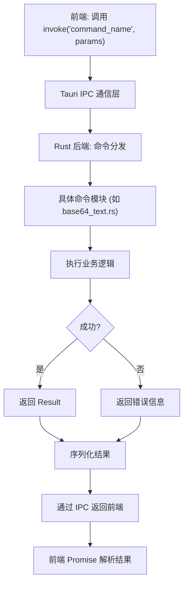

# 命令路由机制

<cite>
**本文档引用的文件**  
- [mod.rs](file://src-tauri/src/command/mod.rs)
- [lib.rs](file://src-tauri/src/lib.rs)
- [main.rs](file://src-tauri/src/main.rs)
- [base64_text.rs](file://src-tauri/src/command/codec/base64_text.rs)
- [json_yaml.rs](file://src-tauri/src/command/converter/json_yaml.rs)
- [fs.rs](file://src-tauri/src/command/fs.rs)
- [error.rs](file://src-tauri/src/error.rs)
- [base64_helper.rs](file://src-tauri/src/command/codec/base64_helper.rs)
- [uuid.rs](file://src-tauri/src/command/generator/uuid.rs)
- [json.rs](file://src-tauri/src/command/formatter/json.rs)
- [Cargo.toml](file://src-tauri/Cargo.toml)
- [base64_text.ts](file://src/command/codec/base64_text.ts)
- [json_yaml.ts](file://src/command/converter/json_yaml.ts)
- [routes.tsx](file://src/routes.tsx)
</cite>

## 目录

1. [项目结构概述](#项目结构概述)  
2. [命令模块组织方式](#命令模块组织方式)  
3. [命令注册与通信机制](#命令注册与通信机制)  
4. [核心命令实现分析](#核心命令实现分析)  
5. [错误处理机制](#错误处理机制)  
6. [前端命令调用流程](#前端命令调用流程)  
7. [命令命名规范与目录设计](#命令命名规范与目录设计)  
8. [安全性与性能保障](#安全性与性能保障)  
9. [命令调用流程图](#命令调用流程图)  
10. [总结](#总结)

## 项目结构概述

devkimi项目采用Tauri框架构建，分为前端（TypeScript/SolidJS）和后端（Rust）两大部分。后端命令系统位于`src-tauri/src/command`目录下，按功能划分为多个子模块，包括编解码、转换器、加密、格式化、生成器等。

前端命令接口位于`src/command`目录，与后端命令一一对应，通过Tauri的`invoke`机制进行跨语言调用。

**Section sources**  
- [mod.rs](file://src-tauri/src/command/mod.rs#L1-L8)
- [routes.tsx](file://src/routes.tsx#L1-L242)

## 命令模块组织方式

后端命令模块采用Rust的模块系统进行组织，`src-tauri/src/command/mod.rs`作为命令模块的根文件，通过`pub mod`声明了多个子模块：

```rust
pub mod codec;
pub mod converter;
pub mod font;
pub mod formatter;
pub mod fs;
pub mod generator;
pub mod text;
pub mod crypto;
```

每个子模块对应一个功能类别，如`codec`处理编码解码，`converter`处理格式转换。这种分层结构清晰地划分了功能边界，便于维护和扩展。

子模块内部进一步按具体功能组织，例如`codec`模块下包含`base64_text`、`base64_image`等文件，每个文件实现特定的编解码功能。

**Section sources**  
- [mod.rs](file://src-tauri/src/command/mod.rs#L1-L8)
- [lib.rs](file://src-tauri/src/lib.rs#L1-L57)

## 命令注册与通信机制

Tauri通过`#[tauri::command]`宏将Rust函数暴露给前端调用。在`src-tauri/src/lib.rs`中，通过`tauri::generate_handler!`宏批量注册所有命令：

```rust
.invoke_handler(tauri::generate_handler![
    command::fs::open_file,
    command::fs::copy_file,
    command::formatter::json::format_json,
    // ... 其他命令
])
```

这些命令通过Tauri的IPC（进程间通信）机制与前端建立桥梁。前端使用`@tauri-apps/api/core`提供的`invoke`函数调用后端命令，命令名与Rust函数名保持一致。

`main.rs`中通过`app_lib::run()`启动应用，加载所有注册的命令处理器。

**Section sources**  
- [lib.rs](file://src-tauri/src/lib.rs#L1-L57)
- [main.rs](file://src-tauri/src/main.rs#L1-L7)

## 核心命令实现分析

### Base64编解码实现

`base64_text.rs`实现了文本的Base64编解码功能，支持多种编码模式（标准、URL安全等）：

```rust
#[tauri::command]
pub fn encode_text_base64(text: &str, mode: Base64Mode) -> Result<String, Error> {
    Ok(mode.encode(text.as_bytes()))
}

#[tauri::command]
pub fn decode_text_base64(base64: &str, mode: Base64Mode) -> Result<String, Error> {
    let bytes = mode.decode(base64)?;
    String::from_utf8(bytes).map_err(Into::into)
}
```

参数通过引用传递（`&str`），避免不必要的内存拷贝。`Base64Mode`枚举定义了不同的编码模式，并通过`base64_helper.rs`中的实现进行具体编码。

### JSON-YAML转换实现

`json_yaml.rs`实现了JSON与YAML格式之间的相互转换：

```rust
#[tauri::command]
pub fn convert_json_to_yaml(json: &str) -> Result<String, Error> {
    let value = serde_json::from_str::<serde_json::Value>(json)?;
    serde_yaml::to_string(&value).map_err(Into::into)
}

#[tauri::command]
pub fn convert_yaml_to_json(yaml: &str) -> Result<String, Error> {
    let value = serde_yaml::from_str::<serde_yaml::Value>(yaml)?;
    serde_json::to_string_pretty(&value).map_err(Into::into)
}
```

使用`serde_json`和`serde_yaml`库进行反序列化和序列化，支持保留原始JSON对象的顺序（通过`preserve_order`特性）。

**Section sources**  
- [base64_text.rs](file://src-tauri/src/command/codec/base64_text.rs#L1-L22)
- [json_yaml.rs](file://src-tauri/src/command/converter/json_yaml.rs#L1-L19)
- [base64_helper.rs](file://src-tauri/src/command/codec/base64_helper.rs#L1-L36)

## 错误处理机制

项目定义了统一的错误处理宏`command_error!`和`serialize_error!`，位于`error.rs`中：

```rust
#[macro_export]
macro_rules! command_error {
    ($(($ident:ident, $msg:literal $(, $($tt:tt)*)?)),+ $(,)?) => {
        #[derive(Debug, thiserror::Error)]
        pub enum Error {
            $(
                #[error($msg)]
                $ident$(($($tt)*))?,
            )+
        }
        $crate::serialize_error!(Error);
    };
}
```

各命令模块使用该宏定义自己的错误类型，如`base64_text.rs`中：

```rust
command_error! {
    (Utf8, "utf-8 error: {0}", #[from] FromUtf8Error),
    (DecodeBase64, "decode base64 error: {0}", #[from] base64::DecodeError),
}
```

错误实现了`serde::Serialize`，可被序列化为JSON返回给前端，便于前端展示错误信息。

**Section sources**  
- [error.rs](file://src-tauri/src/error.rs#L1-L31)
- [base64_text.rs](file://src-tauri/src/command/codec/base64_text.rs#L18-L22)

## 前端命令调用流程

前端通过TypeScript封装的API调用后端命令。以Base64编解码为例：

```typescript
import { invoke } from "@tauri-apps/api/core";

const encodeTextBase64 = async (text: string, mode: string) => {
  return invoke<string>("encode_text_base64", {
    text,
    mode,
  });
};
```

`invoke`函数接收命令名和参数对象，返回Promise。参数对象的字段名必须与Rust函数参数名一致。

在视图组件中，通过导入这些封装函数进行调用，如`view/codec/base64_text.tsx`中使用`encodeTextBase64`进行文本编码。

**Section sources**  
- [base64_text.ts](file://src/command/codec/base64_text.ts#L1-L18)
- [json_yaml.ts](file://src/command/converter/json_yaml.ts#L1-L12)

## 命令命名规范与目录设计

### 命名规范

- **函数名**：使用蛇形命名法（snake_case），如`encode_text_base64`
- **模块名**：使用小写单数名词，如`codec`、`converter`
- **类型名**：使用帕斯卡命名法（PascalCase），如`Base64Mode`、`Version`

### 目录设计原则

- **功能分离**：按功能划分顶级模块（codec、converter等）
- **层次清晰**：模块下按具体功能组织文件
- **前后端对应**：前端`src/command`与后端`src-tauri/src/command`结构保持一致
- **可扩展性**：新增功能可轻松添加新模块或文件

这种设计保证了代码的可维护性和可读性。

**Section sources**  
- [mod.rs](file://src-tauri/src/command/mod.rs#L1-L8)
- [routes.tsx](file://src/routes.tsx#L1-L242)

## 安全性与性能保障

### 安全性

- **输入验证**：通过类型系统确保参数类型安全
- **错误隔离**：每个命令模块独立定义错误类型，避免错误传播
- **权限控制**：Tauri插件系统提供细粒度权限控制（如文件系统访问）

### 性能

- **零拷贝传递**：使用`&str`而非`String`传递字符串参数
- **预分配内存**：如`generate_uuid`中使用`Vec::with_capacity`
- **高效序列化**：使用`serde`进行高性能JSON/YAML处理
- **编译优化**：`Cargo.toml`中配置了release优化选项（LTO、panic=abort等）

```toml
[profile.release]
codegen-units = 1
lto = true
opt-level = "s"
panic = "abort"
strip = true
```

**Section sources**  
- [Cargo.toml](file://src-tauri/Cargo.toml#L1-L70)
- [uuid.rs](file://src-tauri/src/command/generator/uuid.rs#L1-L48)

## 命令调用流程图



**Diagram sources**  
- [lib.rs](file://src-tauri/src/lib.rs#L11-L43)
- [base64_text.ts](file://src/command/codec/base64_text.ts#L3-L7)
- [base64_text.rs](file://src-tauri/src/command/codec/base64_text.rs#L7-L16)

## 总结

devkimi项目的命令路由机制基于Tauri框架构建，具有以下特点：

1. **模块化设计**：清晰的功能划分和层次结构
2. **声明式注册**：通过`#[tauri::command]`宏简化命令暴露
3. **类型安全**：Rust类型系统保证参数安全
4. **统一错误处理**：宏定义的错误系统便于维护
5. **前后端分离**：明确的职责划分和通信接口
6. **高性能**：零拷贝、高效序列化和编译优化

该机制为桌面应用提供了安全、高效、易维护的前后端通信解决方案。