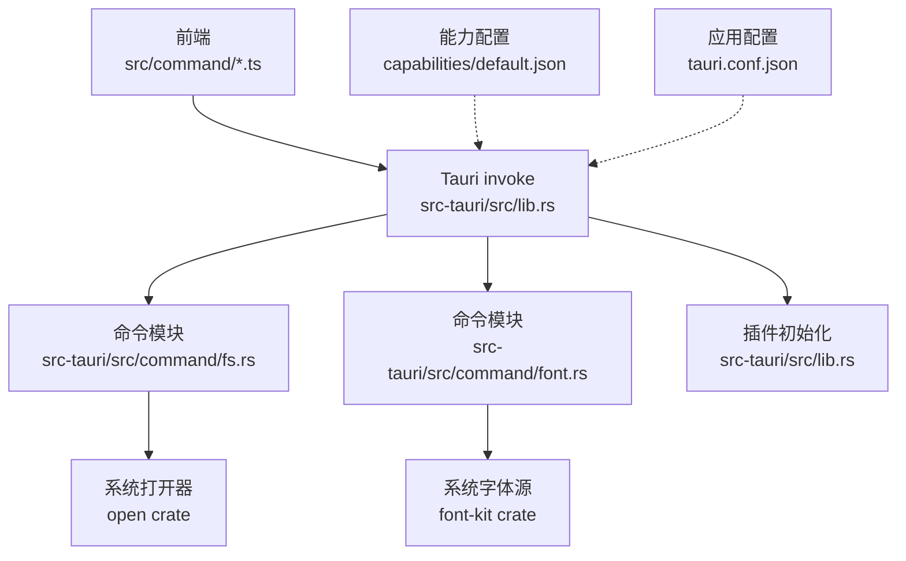
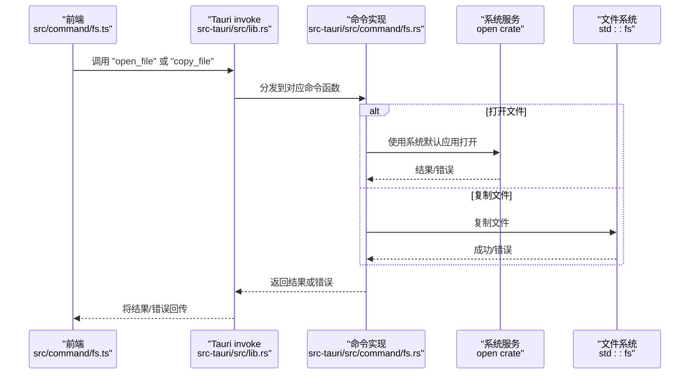
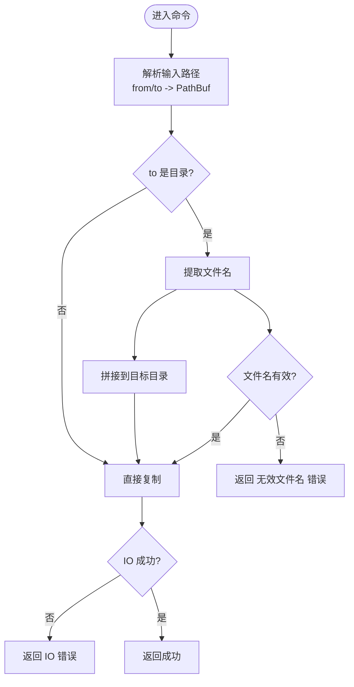
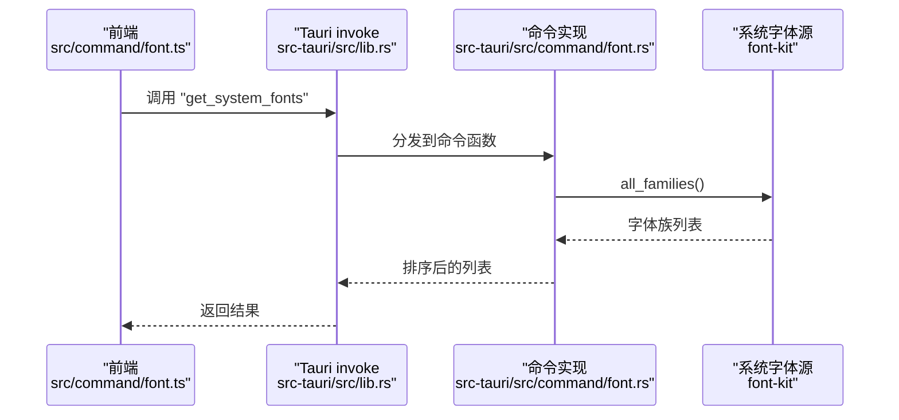
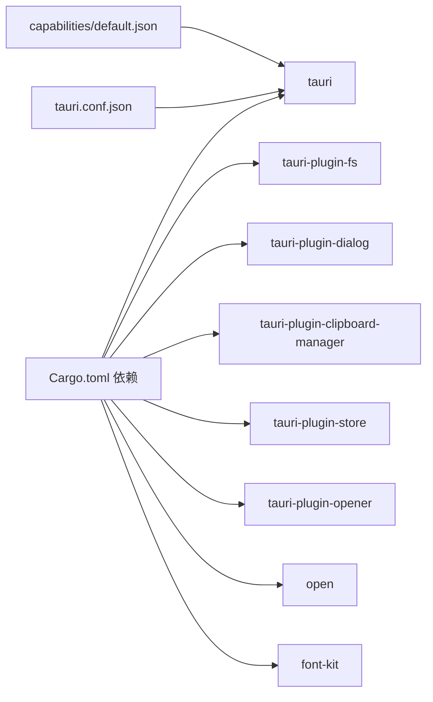

# 系统资源交互

<cite>
**本文引用的文件**
- [src-tauri/src/command/fs.rs](file://src-tauri/src/command/fs.rs)
- [src-tauri/src/command/font.rs](file://src-tauri/src/command/font.rs)
- [src-tauri/src/lib.rs](file://src-tauri/src/lib.rs)
- [src-tauri/src/error.rs](file://src-tauri/src/error.rs)
- [src-tauri/Cargo.toml](file://src-tauri/Cargo.toml)
- [src-tauri/capabilities/default.json](file://src-tauri/capabilities/default.json)
- [src-tauri/tauri.conf.json](file://src-tauri/tauri.conf.json)
- [src/command/fs.ts](file://src/command/fs.ts)
- [src/command/font.ts](file://src/command/font.ts)
</cite>

## 目录
1. [简介](#简介)
2. [项目结构](#项目结构)
3. [核心组件](#核心组件)
4. [架构总览](#架构总览)
5. [详细组件分析](#详细组件分析)
6. [依赖关系分析](#依赖关系分析)
7. [性能考量](#性能考量)
8. [故障排查指南](#故障排查指南)
9. [结论](#结论)
10. [附录](#附录)

## 简介
本文件聚焦于devkimi项目在Tauri后端中的系统资源交互实现，重点覆盖：
- 文件系统操作：文件读写、目录遍历、路径处理与安全性
- 字体功能：系统字体库交互与可用字体枚举
- 权限管理与安全沙箱：能力配置、插件权限、协议作用域
- 依赖管理：系统相关crate的声明与用途
- 防护措施与最佳实践：输入校验、作用域限制、错误传播

## 项目结构
devkimi采用前后端分离的Tauri架构：
- 前端（Solid + Tauri API）通过invoke调用后端命令
- 后端（Rust）通过Tauri插件与系统资源交互，并以命令形式暴露给前端
- 能力与安全策略由配置文件集中定义

图表来源
- [src-tauri/src/lib.rs](file://src-tauri/src/lib.rs#L1-L57)
- [src-tauri/src/command/fs.rs](file://src-tauri/src/command/fs.rs#L1-L34)
- [src-tauri/src/command/font.rs](file://src-tauri/src/command/font.rs#L1-L29)
- [src-tauri/Cargo.toml](file://src-tauri/Cargo.toml#L20-L60)
- [src-tauri/capabilities/default.json](file://src-tauri/capabilities/default.json#L1-L31)
- [src-tauri/tauri.conf.json](file://src-tauri/tauri.conf.json#L1-L46)

章节来源
- [src-tauri/src/lib.rs](file://src-tauri/src/lib.rs#L1-L57)
- [src-tauri/capabilities/default.json](file://src-tauri/capabilities/default.json#L1-L31)
- [src-tauri/tauri.conf.json](file://src-tauri/tauri.conf.json#L1-L46)

## 核心组件
- 文件系统命令：提供“打开文件”和“复制文件”两个命令，前者委托系统默认应用打开，后者支持将文件复制到目录或重命名为新文件名
- 字体命令：从系统字体源枚举所有字体族名称并排序返回
- 错误体系：统一的错误宏生成错误类型，并序列化为字符串传递给前端
- 插件与能力：通过Tauri插件启用文件系统、对话框、剪贴板、日志、存储、打开器等能力；并通过能力配置授予具体权限

章节来源
- [src-tauri/src/command/fs.rs](file://src-tauri/src/command/fs.rs#L1-L34)
- [src-tauri/src/command/font.rs](file://src-tauri/src/command/font.rs#L1-L29)
- [src-tauri/src/error.rs](file://src-tauri/src/error.rs#L1-L31)
- [src-tauri/src/lib.rs](file://src-tauri/src/lib.rs#L1-L57)

## 架构总览
下图展示从前端调用到后端命令执行再到系统资源交互的整体流程。

图表来源
- [src-tauri/src/lib.rs](file://src-tauri/src/lib.rs#L1-L57)
- [src-tauri/src/command/fs.rs](file://src-tauri/src/command/fs.rs#L1-L34)
- [src/command/fs.ts](file://src/command/fs.ts#L1-L24)

## 详细组件分析

### 文件系统命令（fs.rs）
- 功能概述
  - 打开文件：调用系统默认应用打开指定路径
  - 复制文件：支持将文件复制到目标路径或复制到目录（自动保留原文件名）
- 路径处理与安全性
  - 输入参数为字符串路径，内部转换为PathBuf进行处理
  - 当目标为目录时，从源路径提取文件名并拼接到目标目录，避免直接覆盖目录
  - 若无法提取有效文件名，返回“无效文件名”错误
  - 复制操作通过标准库IO完成，错误映射为统一错误类型
- 错误模型
  - 统一错误类型包含IO错误与无效文件名两类，便于前端识别与提示
- 前端调用
  - 前端通过invoke调用后端命令，返回Promise，错误通过异常传播

图表来源
- [src-tauri/src/command/fs.rs](file://src-tauri/src/command/fs.rs#L1-L34)
- [src-tauri/src/error.rs](file://src-tauri/src/error.rs#L16-L31)

章节来源
- [src-tauri/src/command/fs.rs](file://src-tauri/src/command/fs.rs#L1-L34)
- [src-tauri/src/error.rs](file://src-tauri/src/error.rs#L1-L31)
- [src/command/fs.ts](file://src/command/fs.ts#L1-L24)

### 字体命令（font.rs）
- 功能概述
  - 从系统字体源获取所有字体族名称，排序后返回
- 依赖与交互
  - 依赖font-kit的SystemSource用于枚举系统字体
  - 返回值为字符串向量，前端可直接使用
- 错误模型
  - 统一错误类型包含字体选择错误，便于前端捕获与提示

图表来源
- [src-tauri/src/command/font.rs](file://src-tauri/src/command/font.rs#L1-L29)
- [src-tauri/src/lib.rs](file://src-tauri/src/lib.rs#L1-L57)
- [src/command/font.ts](file://src/command/font.ts#L1-L8)

章节来源
- [src-tauri/src/command/font.rs](file://src-tauri/src/command/font.rs#L1-L29)
- [src-tauri/src/lib.rs](file://src-tauri/src/lib.rs#L1-L57)
- [src/command/font.ts](file://src/command/font.ts#L1-L8)

### 错误模型与传播
- 宏定义
  - 通过自定义宏生成统一错误类型，自动实现序列化，便于跨语言传递
- 错误分类
  - 文件系统：IO错误、无效文件名
  - 字体：字体选择错误
- 前端处理
  - 前端通过invoke捕获错误并显示友好提示

章节来源
- [src-tauri/src/error.rs](file://src-tauri/src/error.rs#L1-L31)
- [src-tauri/src/command/fs.rs](file://src-tauri/src/command/fs.rs#L30-L34)
- [src-tauri/src/command/font.rs](file://src-tauri/src/command/font.rs#L14-L17)

## 依赖关系分析
- Rust依赖
  - tauri、tauri-plugin-*系列插件：提供命令分发、文件系统、对话框、剪贴板、日志、存储、打开器等能力
  - open：系统默认应用打开器
  - font-kit：系统字体源
  - 其他工具库：base64、image、regex、serde、uuid等
- 能力与安全
  - 能力配置授予文件系统读写、复制、对话框打开/保存、剪贴板读写、存储读写、打开器路径开放等权限
  - 应用配置设置资源协议作用域为临时目录，限制静态资源加载范围

图表来源
- [src-tauri/Cargo.toml](file://src-tauri/Cargo.toml#L20-L60)
- [src-tauri/capabilities/default.json](file://src-tauri/capabilities/default.json#L1-L31)
- [src-tauri/tauri.conf.json](file://src-tauri/tauri.conf.json#L1-L46)

章节来源
- [src-tauri/Cargo.toml](file://src-tauri/Cargo.toml#L20-L60)
- [src-tauri/capabilities/default.json](file://src-tauri/capabilities/default.json#L1-L31)
- [src-tauri/tauri.conf.json](file://src-tauri/tauri.conf.json#L1-L46)

## 性能考量
- 文件复制
  - 使用标准库复制，适合一般场景；大文件建议在后台线程执行并提供进度反馈
- 字体枚举
  - 枚举系统字体可能较慢，建议缓存结果并在需要时刷新
- 插件初始化
  - 仅在调试构建时启用日志插件，减少发布版本开销

[本节为通用指导，不直接分析具体文件]

## 故障排查指南
- 打不开文件
  - 检查路径是否有效且存在
  - 确认系统默认应用已正确关联该文件类型
- 复制失败
  - 检查源路径是否存在、目标路径是否为目录且可写
  - 若目标为目录，确认源文件名可提取
- 字体列表为空
  - 检查系统字体源是否可用
  - 确认字体枚举调用未被拦截
- 权限不足
  - 检查能力配置是否包含所需权限
  - 检查应用配置的作用域限制是否影响资源加载

章节来源
- [src-tauri/src/command/fs.rs](file://src-tauri/src/command/fs.rs#L1-L34)
- [src-tauri/src/command/font.rs](file://src-tauri/src/command/font.rs#L1-L29)
- [src-tauri/capabilities/default.json](file://src-tauri/capabilities/default.json#L1-L31)
- [src-tauri/tauri.conf.json](file://src-tauri/tauri.conf.json#L1-L46)

## 结论
devkimi通过Tauri命令与插件机制实现了对系统资源的安全可控访问：
- 文件系统命令提供了基础的打开与复制能力，并在路径处理上加入基本校验
- 字体命令通过系统字体源提供字体族枚举
- 能力与安全配置共同构成权限边界，结合作用域限制降低风险
- 建议在生产环境中进一步强化输入校验、限制作用域、提供异步与进度反馈，并完善错误分类与用户提示

[本节为总结性内容，不直接分析具体文件]

## 附录

### 前后端调用示例（路径参考）
- 前端调用文件系统命令
  - 参考路径：[src/command/fs.ts](file://src/command/fs.ts#L1-L24)
- 前端调用字体命令
  - 参考路径：[src/command/font.ts](file://src/command/font.ts#L1-L8)
- 后端命令注册与插件初始化
  - 参考路径：[src-tauri/src/lib.rs](file://src-tauri/src/lib.rs#L1-L57)

### 能力与安全配置要点
- 能力配置
  - 文件系统：允许读取文本文件、写入文本文件、复制文件
  - 对话框：允许打开、保存
  - 存储：允许加载、保存、获取、设置、枚举
  - 打开器：允许打开特定路径（示例为临时目录通配）
- 应用配置
  - 资源协议作用域限定为临时目录，限制静态资源加载范围

章节来源
- [src-tauri/capabilities/default.json](file://src-tauri/capabilities/default.json#L1-L31)
- [src-tauri/tauri.conf.json](file://src-tauri/tauri.conf.json#L1-L46)