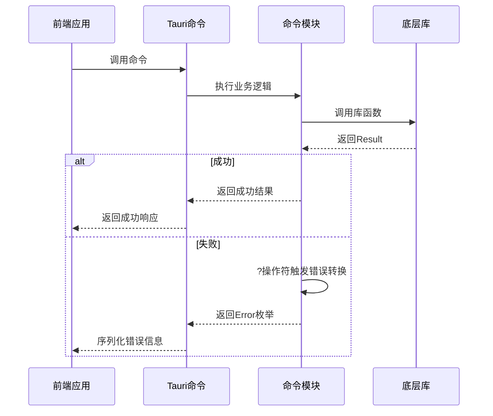
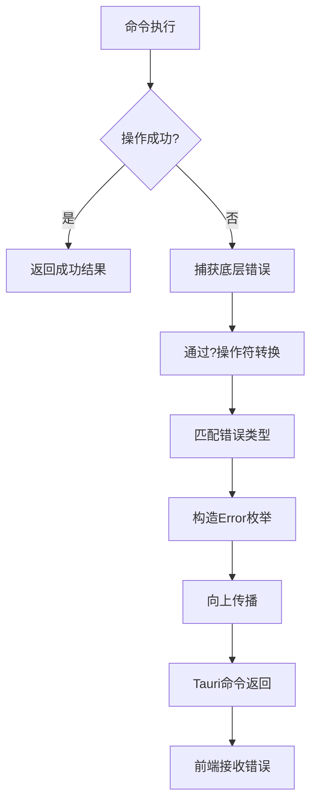
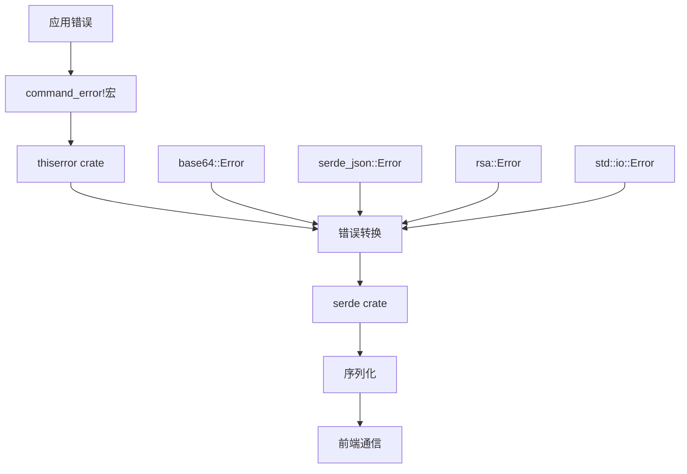

# 错误处理策略

<cite>
**本文档引用的文件**
- [error.rs](file://src-tauri/src/error.rs)
- [Cargo.toml](file://src-tauri/Cargo.toml)
- [base64_text.rs](file://src-tauri/src/command/codec/base64_text.rs)
- [json_yaml.rs](file://src-tauri/src/command/converter/json_yaml.rs)
- [rsa.rs](file://src-tauri/src/command/crypto/rsa.rs)
- [fs.rs](file://src-tauri/src/command/fs.rs)
- [lib.rs](file://src-tauri/src/lib.rs)
- [regex.rs](file://src-tauri/src/command/text/regex.rs)
</cite>

## 目录
1. [简介](#简介)
2. [自定义错误类型定义](#自定义错误类型定义)
3. [错误转换与传播机制](#错误转换与传播机制)
4. [模块级错误处理实现](#模块级错误处理实现)
5. [前端错误交互机制](#前端错误交互机制)
6. [错误日志与调试支持](#错误日志与调试支持)
7. [依赖管理与错误处理crate](#依赖管理与错误处理crate)
8. [结论](#结论)

## 简介
devkimi项目采用Rust语言构建后端逻辑，通过Tauri框架实现跨平台桌面应用。本项目在错误处理方面采用了系统化的设计策略，确保后端各模块能够统一、高效地处理和传播错误。错误处理机制贯穿于命令执行、数据转换、文件操作等核心功能中，为前端提供清晰、可理解的错误信息。本文档详细分析项目的错误处理架构，包括自定义错误类型的定义、错误转换机制、模块间错误传播、与前端的交互方式以及依赖管理策略。

**Section sources**
- [lib.rs](file://src-tauri/src/lib.rs#L1-L57)
- [Cargo.toml](file://src-tauri/Cargo.toml#L1-L70)

## 自定义错误类型定义

devkimi项目通过宏定义实现了灵活且统一的错误类型系统。在`error.rs`文件中定义了两个核心宏：`serialize_error!`和`command_error!`，用于生成可序列化的错误类型。

`serialize_error!`宏为任意错误类型实现了`serde::Serialize` trait，将错误转换为字符串后进行序列化，确保错误信息能够通过Tauri命令接口传递给前端。

`command_error!`宏是项目错误处理的核心，它生成一个带有`thiserror::Error`属性的枚举类型`Error`，并自动实现序列化。该宏允许开发者声明错误变体、错误消息模板以及错误转换来源。每个命令模块都使用此宏定义其特定的错误类型，实现了模块化且一致的错误处理模式。

```mermaid
classDiagram
class Error {
+Utf8(String)
+DecodeBase64(base64 : : DecodeError)
+Json(serde_json : : Error)
+Yaml(serde_yaml : : Error)
+Rsa(rsa : : Error)
+Io(std : : io : : Error)
+InvalidFileName(String)
}
note right of Error
通过command_error!宏生成的
统一错误枚举类型
end note
```

**Diagram sources**
- [error.rs](file://src-tauri/src/error.rs#L1-L38)
- [base64_text.rs](file://src-tauri/src/command/codec/base64_text.rs#L18-L21)

**Section sources**
- [error.rs](file://src-tauri/src/error.rs#L1-L38)

## 错误转换与传播机制

项目采用Rust的标准错误传播模式，结合`?`操作符和`thiserror`库实现优雅的错误转换与传播。当底层操作失败时，错误会自动转换为模块定义的`Error`类型，并向上传播到Tauri命令层。

在`base64_text.rs`中，`decode_text_base64`函数使用`String::from_utf8(bytes).map_err(Into::into)`将`FromUtf8Error`转换为模块定义的`Error::Utf8`。这种模式在所有命令模块中保持一致，确保了错误处理的一致性。

`thiserror`库的`#[from]`属性在错误枚举定义中被广泛使用，自动为指定的错误类型实现`From` trait，简化了错误转换代码。例如，在`json_yaml.rs`中，`serde_json::Error`和`serde_yaml::Error`都被标记为`#[from]`，使得这些错误可以无缝转换为模块的`Error`类型。



**Diagram sources**
- [base64_text.rs](file://src-tauri/src/command/codec/base64_text.rs#L13-L16)
- [json_yaml.rs](file://src-tauri/src/command/converter/json_yaml.rs#L4-L13)

**Section sources**
- [base64_text.rs](file://src-tauri/src/command/codec/base64_text.rs#L13-L16)
- [json_yaml.rs](file://src-tauri/src/command/converter/json_yaml.rs#L4-L13)
- [regex.rs](file://src-tauri/src/command/text/regex.rs#L39-L58)

## 模块级错误处理实现

各个功能模块均采用一致的错误处理模式，通过`command_error!`宏定义模块特定的错误类型，并在命令函数中使用`Result<T, Error>`返回类型。

在`fs.rs`模块中，文件操作相关的错误被统一处理。`copy_file`函数在路径验证失败时，会创建`Error::InvalidFileName`错误；在文件系统操作失败时，`std::io::Error`会自动转换为`Error::Io`。这种分层错误处理方式既保留了底层错误的详细信息，又提供了语义化的错误分类。

`rsa.rs`模块展示了复杂的错误处理场景，需要处理多种密码学相关的错误类型。该模块定义了`Rsa`、`Pkcs1`、`Pkcs8`、`Spki`等多种错误变体，覆盖了密钥生成、加密、解密等操作中可能出现的所有错误情况。特别地，对于无法直接转换的错误（如`spki`错误），模块使用`String`类型存储错误信息，提供了最大的灵活性。



**Diagram sources**
- [fs.rs](file://src-tauri/src/command/fs.rs#L17-L28)
- [rsa.rs](file://src-tauri/src/command/crypto/rsa.rs#L60-L68)

**Section sources**
- [fs.rs](file://src-tauri/src/command/fs.rs#L1-L34)
- [rsa.rs](file://src-tauri/src/command/crypto/rsa.rs#L1-L78)
- [json_yaml.rs](file://src-tauri/src/command/converter/json_yaml.rs#L1-L19)

## 前端错误交互机制

后端通过Tauri的命令系统与前端进行通信，所有错误都通过`Result<T, Error>`类型返回。`serialize_error!`宏确保了自定义错误类型可以被序列化为JSON格式，使得前端能够接收和解析错误信息。

当命令执行失败时，Tauri会将`Error`枚举的`to_string()`结果序列化并传递给前端。前端JavaScript/TypeScript代码可以捕获这些错误，并根据错误消息内容进行相应的用户界面反馈。例如，"utf-8 error: invalid utf-8 sequence"这样的错误消息可以直接显示给用户，帮助其理解问题所在。

这种设计避免了复杂的错误代码系统，采用直观的错误消息传递机制，降低了前后端的耦合度。同时，由于错误消息是通过格式化字符串定义的（如"json error: {0}"），既保证了消息的一致性，又包含了底层错误的详细信息。

**Section sources**
- [error.rs](file://src-tauri/src/error.rs#L2-L13)
- [lib.rs](file://src-tauri/src/lib.rs#L11-L43)

## 错误日志与调试支持

项目在调试模式下启用了日志记录功能。在`lib.rs`的`setup`函数中，通过条件编译`cfg!(debug_assertions)`判断是否启用`tauri_plugin_log`插件。当处于调试模式时，应用会记录信息级别（Info）的日志，包括错误信息。

`thiserror`库提供的`#[error(...)]`属性不仅定义了错误的显示格式，也为日志记录提供了标准化的错误消息。结合`log` crate的使用，开发者可以在开发过程中跟踪错误的发生和传播路径，便于调试和问题定位。

错误的`Debug`派生实现（通过`#[derive(Debug)]`）为开发者提供了详细的错误信息输出，包括错误类型和关联数据，这对于分析复杂错误场景非常有帮助。

**Section sources**
- [lib.rs](file://src-tauri/src/lib.rs#L44-L53)
- [Cargo.toml](file://src-tauri/Cargo.toml#L53)

## 依赖管理与错误处理crate

项目的`Cargo.toml`文件明确声明了错误处理相关的依赖项，体现了对错误处理机制的重视。

`thiserror = "2.0"`是核心依赖，提供了`#[error(...)]`宏和`#[from]`属性，极大地简化了自定义错误类型的定义和转换。`serde = { version = "1.0", features = ["derive"] }`和`serde_json`用于数据序列化，确保错误信息能够跨语言边界传递。

其他依赖如`base64`、`serde_yaml`、`rsa`等库都提供了自己的错误类型，这些错误类型通过`#[from]`属性被整合到项目的统一错误系统中。这种依赖管理策略实现了"错误透明化"，即底层库的错误能够无缝地融入上层应用的错误处理流程。



**Diagram sources**
- [Cargo.toml](file://src-tauri/Cargo.toml#L57-L58)
- [error.rs](file://src-tauri/src/error.rs#L1-L38)

**Section sources**
- [Cargo.toml](file://src-tauri/Cargo.toml#L40-L58)

## 结论
devkimi项目构建了一个健壮、一致且易于维护的错误处理系统。通过宏定义实现了错误类型的自动化生成和序列化，采用`thiserror`库简化了错误转换逻辑，确保了各模块错误处理的一致性。错误信息能够有效传递到前端，为用户提供清晰的反馈。调试支持和日志记录功能为开发和维护提供了便利。整体错误处理策略体现了Rust语言的安全性和表达力，为应用的稳定运行提供了保障。