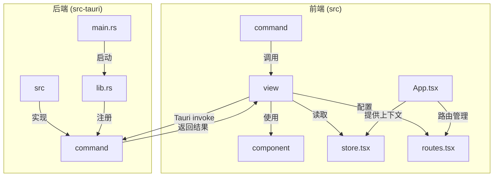
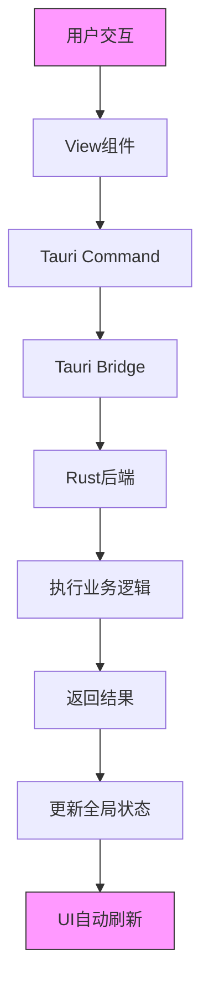
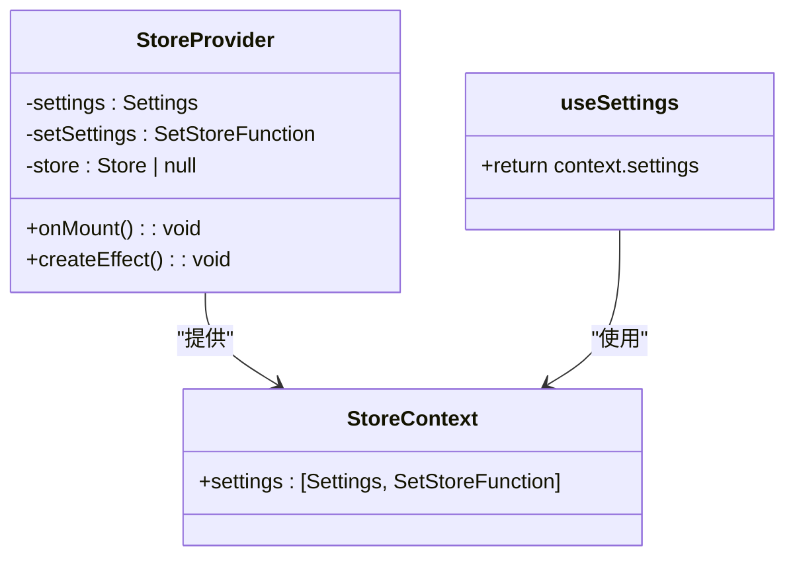
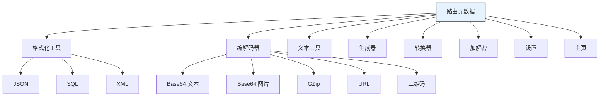
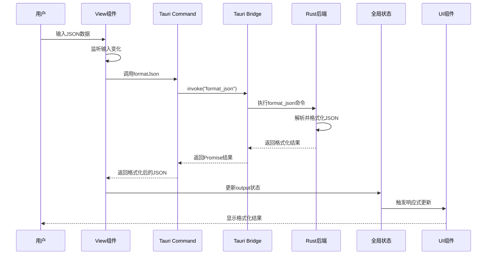
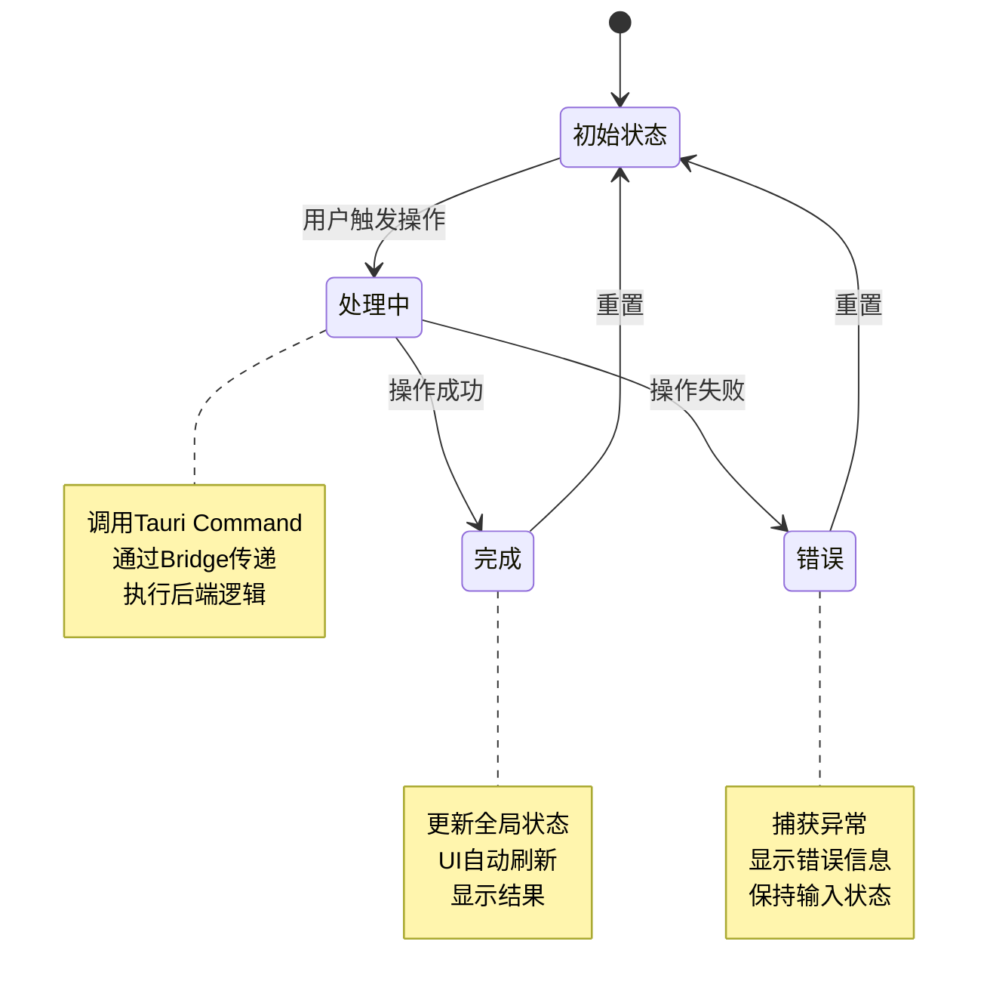
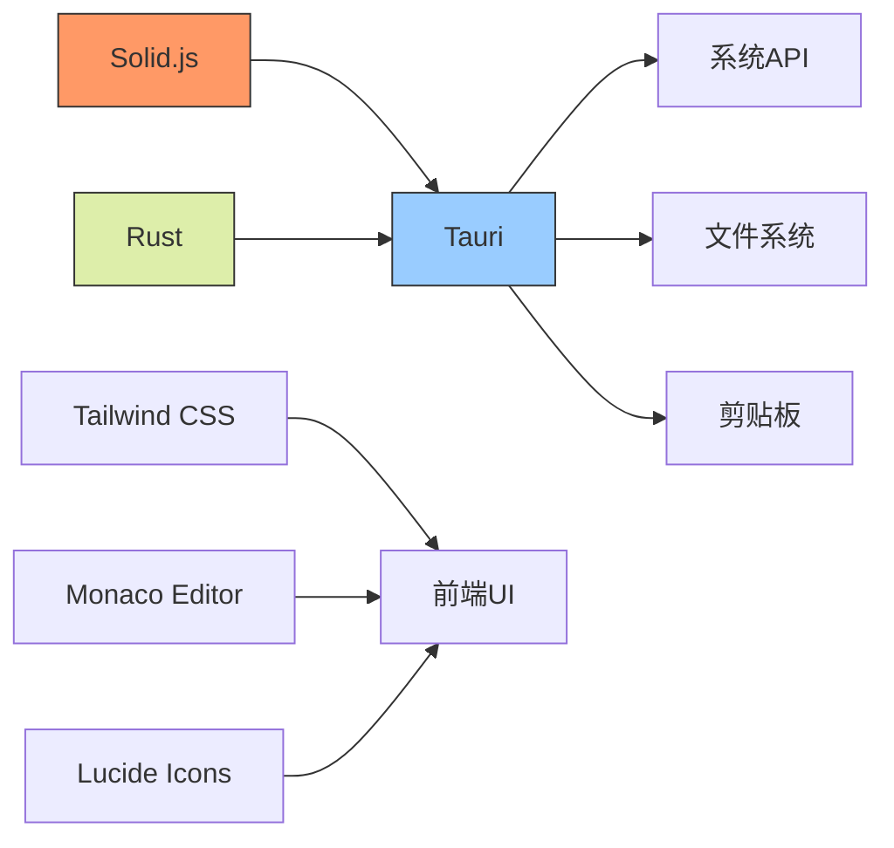

# 数据流

<cite>
**本文档中引用的文件**  
- [main.rs](file://src-tauri/src/main.rs)
- [lib.rs](file://src-tauri/src/lib.rs)
- [store.tsx](file://src/store.tsx)
- [routes.tsx](file://src/routes.tsx)
- [App.tsx](file://src/App.tsx)
- [index.tsx](file://src/index.tsx)
- [json.ts](file://src/command/formatter/json.ts)
- [json.rs](file://src-tauri/src/command/formatter/json.rs)
- [json.tsx](file://src/view/formatter/json.tsx)
</cite>

## 目录
1. [简介](#简介)
2. [项目结构](#项目结构)
3. [核心组件](#核心组件)
4. [架构概述](#架构概述)
5. [详细组件分析](#详细组件分析)
6. [依赖分析](#依赖分析)
7. [性能考虑](#性能考虑)
8. [故障排除指南](#故障排除指南)
9. [结论](#结论)
10. [附录](#附录)（如有必要）

## 简介
本文档详细描述了devkimi项目的完整数据流过程，从用户交互到结果展示的整个流程。系统采用Tauri框架构建，实现了前端Solid.js与后端Rust的高效集成。数据流始于用户在View组件中的操作，通过Tauri Command触发后端处理，经由Tauri Bridge传递到Rust后端执行系统操作或业务逻辑，处理结果返回前端后更新全局状态(store.tsx)，最终驱动UI自动刷新。文档深入解析了store.tsx中的状态管理机制，包括响应式更新和状态持久化，以及routes.tsx如何配合实现页面状态管理。通过时序图和状态转换图，清晰展示了关键数据在前后端间的传递过程和格式转换。

## 项目结构
devkimi项目采用清晰的分层架构，前端和后端代码分离，便于维护和扩展。前端代码位于src目录，后端Rust代码位于src-tauri目录。前端主要包含命令(command)、组件(component)、工具(utils)、视图(view)等模块，后端则包含各种命令实现和核心逻辑。

**Diagram sources**
- [App.tsx](file://src/App.tsx#L1-L47)
- [routes.tsx](file://src/routes.tsx#L1-L242)
- [store.tsx](file://src/store.tsx#L1-L88)
- [lib.rs](file://src-tauri/src/lib.rs#L1-L57)

**Section sources**
- [App.tsx](file://src/App.tsx#L1-L47)
- [routes.tsx](file://src/routes.tsx#L1-L242)
- [store.tsx](file://src/store.tsx#L1-L88)

## 核心组件
devkimi项目的核心组件包括状态管理(store.tsx)、路由管理(routes.tsx)、视图组件(view)和Tauri命令(command)。这些组件协同工作，实现了完整的数据流闭环。状态管理使用Solid.js的响应式系统和Tauri的持久化存储插件，确保状态变更能够自动触发UI更新，同时保持用户设置的持久性。路由管理通过SolidJS Router实现单页应用导航，视图组件负责用户界面展示和交互，Tauri命令则作为前后端通信的桥梁。

**Section sources**
- [store.tsx](file://src/store.tsx#L1-L88)
- [routes.tsx](file://src/routes.tsx#L1-L242)
- [App.tsx](file://src/App.tsx#L1-L47)

## 架构概述
devkimi项目采用前后端分离的架构，前端使用Solid.js框架构建响应式用户界面，后端使用Rust语言实现高性能的业务逻辑处理。Tauri框架作为桥梁，通过安全的IPC机制连接前后端。整体架构分为四层：视图层(View)负责用户交互，命令层(Command)负责发起后端调用，桥接层(Tauri Bridge)负责跨语言通信，服务层(Service)负责业务逻辑执行。

**Diagram sources**
- [main.rs](file://src-tauri/src/main.rs#L1-L7)
- [lib.rs](file://src-tauri/src/lib.rs#L1-L57)
- [App.tsx](file://src/App.tsx#L1-L47)

## 详细组件分析

### 状态管理分析
store.tsx文件实现了devkimi项目的全局状态管理，采用Solid.js的createStore和Tauri的持久化存储插件相结合的方式。状态管理包含设置状态和响应式更新机制，确保状态变更能够自动触发相关UI组件的重新渲染。

**Diagram sources**
- [store.tsx](file://src/store.tsx#L1-L88)

**Section sources**
- [store.tsx](file://src/store.tsx#L1-L88)

### 路由管理分析
routes.tsx文件定义了devkimi项目的路由配置和页面元数据，通过SolidJS Router实现单页应用的导航功能。路由配置包含路径、标签、图标和组件懒加载等信息，支持嵌套路由结构。

**Diagram sources**
- [routes.tsx](file://src/routes.tsx#L1-L242)

**Section sources**
- [routes.tsx](file://src/routes.tsx#L1-L242)

### 数据流时序分析
以下时序图展示了从用户操作到结果展示的完整数据流过程，以JSON格式化功能为例，详细说明了各组件间的交互顺序和数据传递。

**Diagram sources**
- [json.tsx](file://src/view/formatter/json.tsx#L1-L91)
- [json.ts](file://src/command/formatter/json.ts#L1-L8)
- [json.rs](file://src-tauri/src/command/formatter/json.rs#L1-L39)

**Section sources**
- [json.tsx](file://src/view/formatter/json.tsx#L1-L91)
- [json.ts](file://src/command/formatter/json.ts#L1-L8)
- [json.rs](file://src-tauri/src/command/formatter/json.rs#L1-L39)

### 状态转换分析
以下状态图展示了devkimi项目中关键数据的状态转换过程，从初始状态到处理中状态，再到完成或错误状态的完整生命周期。

**Diagram sources**
- [store.tsx](file://src/store.tsx#L1-L88)
- [json.tsx](file://src/view/formatter/json.tsx#L1-L91)

**Section sources**
- [store.tsx](file://src/store.tsx#L1-L88)
- [json.tsx](file://src/view/formatter/json.tsx#L1-L91)

## 依赖分析
devkimi项目依赖关系清晰，前端主要依赖Solid.js生态系统，后端依赖Rust标准库和第三方crate。Tauri框架作为核心依赖，提供了前后端通信、系统集成和安全控制等功能。

**Diagram sources**
- [package.json](file://package.json)
- [Cargo.toml](file://src-tauri/Cargo.toml#L1-L69)
- [tauri.conf.json](file://src-tauri/tauri.conf.json#L1-L46)

**Section sources**
- [package.json](file://package.json)
- [Cargo.toml](file://src-tauri/Cargo.toml#L1-L69)

## 性能考虑
devkimi项目在性能方面进行了多项优化。前端采用Solid.js的细粒度响应式系统，确保只有相关组件会重新渲染。后端使用Rust语言，保证了业务逻辑处理的高性能。Tauri框架的轻量级特性减少了资源占用，同时通过Web Workers处理编辑器相关任务，避免阻塞主线程。状态持久化采用异步保存策略，避免频繁的磁盘I/O操作影响用户体验。

## 故障排除指南
当遇到数据流问题时，可按照以下步骤进行排查：首先检查Tauri Command的调用是否正确，确认参数类型和名称匹配；其次验证Rust后端命令是否已正确注册到invoke_handler中；然后检查网络请求是否成功，查看开发者工具中的控制台输出；最后确认状态更新是否正确触发了UI重新渲染。对于持久化问题，检查store.json文件的读写权限和路径配置。

**Section sources**
- [store.tsx](file://src/store.tsx#L1-L88)
- [lib.rs](file://src-tauri/src/lib.rs#L1-L57)

## 结论
devkimi项目通过Tauri框架实现了高效的前后端集成，构建了完整的数据流闭环。从用户交互到结果展示的整个过程流畅高效，状态管理机制确保了用户体验的一致性。项目架构清晰，组件职责分明，便于维护和扩展。未来可进一步优化异步处理和错误恢复机制，提升系统的健壮性和用户体验。

## 附录
本项目充分利用了Tauri框架的优势，结合Solid.js的响应式特性和Rust的性能优势，打造了一个功能丰富且高效的开发者工具。数据流设计遵循单一数据源原则，确保状态的一致性和可预测性。通过合理的架构分层和组件化设计，项目具有良好的可维护性和扩展性。