# 架构设计

<cite>
**本文档中引用的文件**  
- [App.tsx](file://src/App.tsx)
- [routes.tsx](file://src/routes.tsx)
- [store.tsx](file://src/store.tsx)
- [index.tsx](file://src/index.tsx)
- [lib.rs](file://src-tauri/src/lib.rs)
- [main.rs](file://src-tauri/src/main.rs)
- [json.tsx](file://src/view/formatter/json.tsx)
- [json.ts](file://src/command/formatter/json.ts)
- [json.rs](file://src-tauri/src/command/formatter/json.rs)
- [Layout/index.tsx](file://src/component/Layout/index.tsx)
- [Content.tsx](file://src/component/Layout/Content.tsx)
- [Siderbar.tsx](file://src/component/Layout/Siderbar.tsx)
- [home.tsx](file://src/view/home.tsx)
- [package.json](file://package.json)
- [README.md](file://README.md)
</cite>

## 目录
1. [简介](#简介)
2. [项目结构](#项目结构)
3. [MVVM架构设计](#mvvm架构设计)
4. [Tauri Bridge通信机制](#tauri-bridge通信机制)
5. [全局状态管理](#全局状态管理)
6. [路由系统](#路由系统)
7. [系统上下文图](#系统上下文图)
8. [组件分解图](#组件分解图)
9. [技术决策与权衡](#技术决策与权衡)
10. [约束条件](#约束条件)

## 简介

devkimi是一个基于Tauri和SolidJS构建的多功能开发者工具集，采用前后端分离的MVVM（Model-View-ViewModel）架构模式。该项目提供了一系列常用的开发辅助工具，包括编解码、格式化、生成器、文本处理和转换器等功能模块。本架构设计文档详细描述了系统的整体架构、各层设计与交互、核心通信机制以及关键技术决策。

**Section sources**
- [README.md](file://README.md#L1-L122)

## 项目结构

devkimi项目采用清晰的分层目录结构，将前端和后端代码分离。前端代码位于`src/`目录下，后端Rust代码位于`src-tauri/`目录下。这种结构支持前后端独立开发和维护，同时通过Tauri Bridge实现无缝通信。

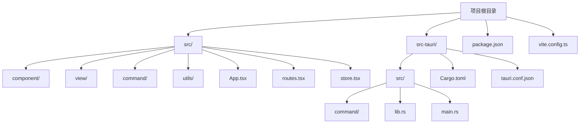

**Diagram sources**
- [README.md](file://README.md#L92-L114)

## MVVM架构设计

devkimi采用MVVM（Model-View-ViewModel）架构模式，实现了关注点分离和前后端解耦。该架构包含三个主要层次：View层（UI组件）、ViewModel层（状态管理）和Model层（业务逻辑）。

### View层（UI组件）

View层负责用户界面的展示和用户交互，使用SolidJS构建响应式UI组件。所有视图组件位于`src/view/`目录下，按功能模块组织。View层通过绑定和事件处理与ViewModel层通信，实现数据的双向绑定。

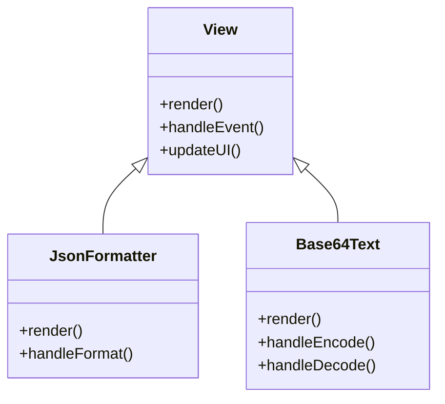

**Diagram sources**
- [json.tsx](file://src/view/formatter/json.tsx#L1-L91)
- [home.tsx](file://src/view/home.tsx#L1-L47)

### ViewModel层（状态管理）

ViewModel层作为View层和Model层之间的桥梁，负责管理UI状态和业务逻辑的转换。在devkimi中，ViewModel层主要通过SolidJS的响应式系统和自定义Hook实现，处理用户输入并调用相应的命令。

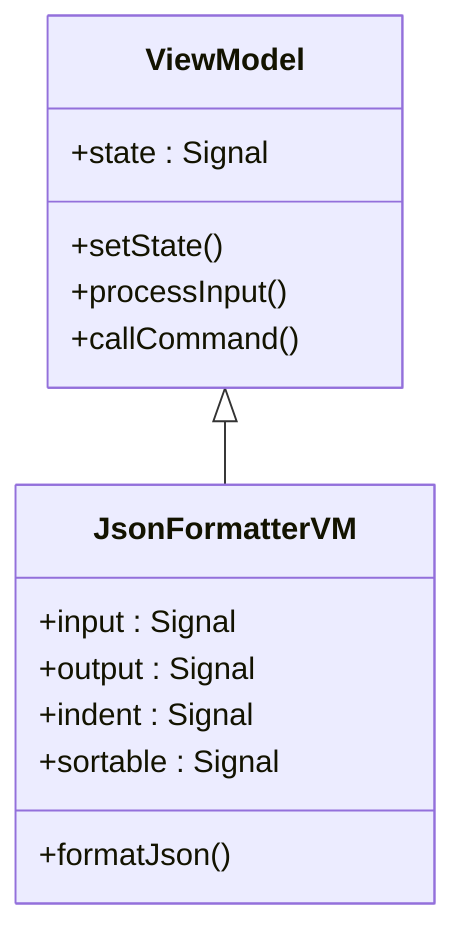

**Diagram sources**
- [json.tsx](file://src/view/formatter/json.tsx#L1-L91)

### Model层（业务逻辑）

Model层包含应用的核心业务逻辑和数据处理功能，使用Rust语言实现，位于`src-tauri/src/command/`目录下。Model层通过Tauri Bridge暴露API给前端调用，确保高性能和内存安全。

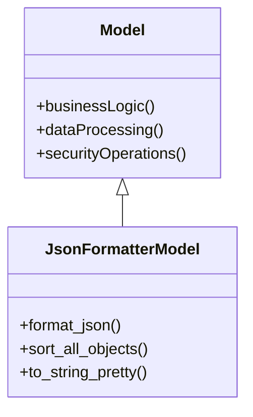

**Diagram sources**
- [json.rs](file://src-tauri/src/command/formatter/json.rs#L1-L39)

## Tauri Bridge通信机制

Tauri Bridge是devkimi前后端通信的核心机制，它提供了安全、高效的JavaScript与Rust之间的互操作。通过Tauri的`invoke`和`@tauri-command`机制，前端可以调用后端Rust函数，实现桌面应用的强大功能。

### 通信流程

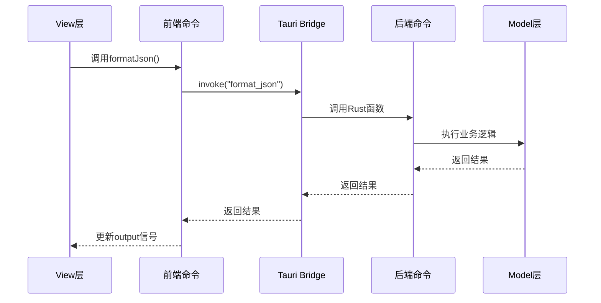

**Diagram sources**
- [json.ts](file://src/command/formatter/json.ts#L1-L8)
- [json.rs](file://src-tauri/src/command/formatter/json.rs#L1-L39)

### 前端调用实现

前端通过`@tauri-apps/api/core`的`invoke`函数调用后端Rust命令。这种机制提供了类型安全的RPC调用，确保前后端接口的一致性。

```typescript
import { invoke } from "@tauri-apps/api/core";

const formatJson = async (input: string, indent: string, sortable: boolean) => {
  return invoke<string>("format_json", { input, indent, sortable });
};
```

**Section sources**
- [json.ts](file://src/command/formatter/json.ts#L1-L8)

### 后端命令注册

后端通过`#[tauri::command]`宏将Rust函数暴露为可被前端调用的命令。这些命令在`src-tauri/src/lib.rs`中通过`generate_handler!`宏注册。

```rust
#[tauri::command]
pub fn format_json(input: &str, indent: Indent, sortable: bool) -> Result<String, Error> {
    // 实现业务逻辑
}
```

**Section sources**
- [json.rs](file://src-tauri/src/command/formatter/json.rs#L13-L24)
- [lib.rs](file://src-tauri/src/lib.rs#L11-L43)

## 全局状态管理

devkimi使用基于SolidJS的响应式状态管理机制，结合Tauri的store插件实现全局状态的持久化存储。`store.tsx`文件定义了应用的全局状态结构和管理逻辑。

### 状态管理实现

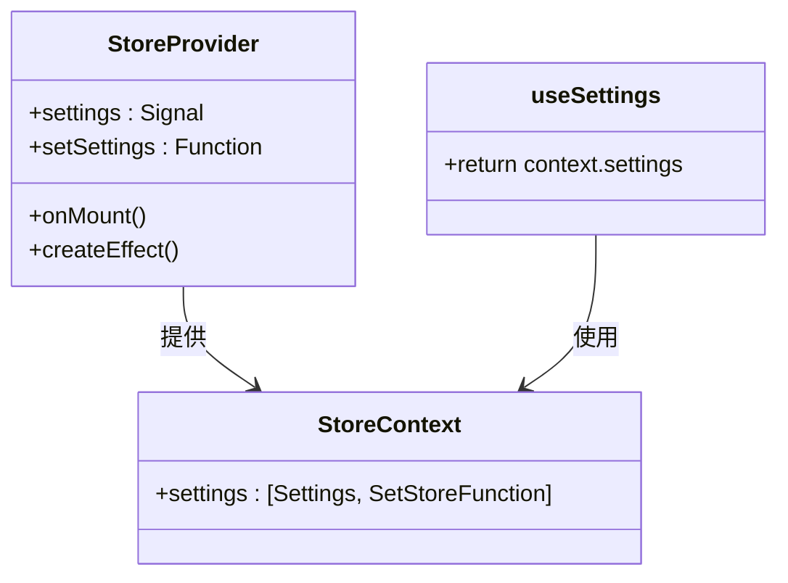

**Diagram sources**
- [store.tsx](file://src/store.tsx#L1-L88)

### 状态结构定义

全局状态包含通用配置和编辑器配置，支持主题切换、自动换行等个性化设置。

```typescript
export type Settings = {
  // 通用配置
  common: {
    theme: string;
    openConfigCollapse: boolean,
  },
  // 编辑器配置
  editor: {
    wordWrap: WordWrap;
    font: {
      family: string;
      size: number;
    };
  }
};
```

**Section sources**
- [store.tsx](file://src/store.tsx#L20-L34)

### 状态持久化

通过Tauri的`@tauri-apps/plugin-store`插件，应用状态在用户设置变更时自动保存到本地文件系统，确保用户体验的一致性。

```typescript
// 初始化时加载设置
onMount(async () => {
  store = await load("store.json");
  setSettings((await store.get<Settings>("settings")) || defaultSettings);
});

// 设置变更时保存
createEffect(() => {
  trackStore(settings);
  if (store) {
    store
      .set("settings", settings)
      .then(() => store!.save())
      .catch((e) => console.error("Settings save failed:", e));
  }
});
```

**Section sources**
- [store.tsx](file://src/store.tsx#L50-L65)

## 路由系统

devkimi使用`@solidjs/router`实现前端路由管理，通过`routes.tsx`文件集中配置所有路由规则。路由系统支持懒加载、嵌套路由和路由元数据，提供了灵活的页面导航机制。

### 路由配置

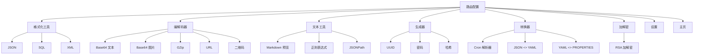

**Diagram sources**
- [routes.tsx](file://src/routes.tsx#L39-L218)

### 路由实现

路由系统通过`RouteMeta`接口定义路由元数据，包括标签、路径、图标和组件等信息。使用`lazy`函数实现组件的懒加载，优化应用启动性能。

```typescript
interface RouteMeta<T = unknown> {
  label: string;
  path: string;
  keywords?: string[];
  icon?: (props: Record<string, any>) => JSX.Element;
  component?: Component<RouteSectionProps<T>>;
  children?: RouteMeta[];
  hidden?: boolean;
}
```

**Section sources**
- [routes.tsx](file://src/routes.tsx#L29-L37)

### 页面导航逻辑

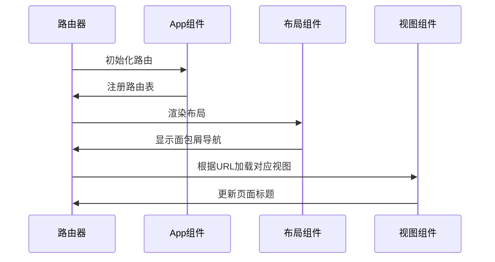

**Diagram sources**
- [App.tsx](file://src/App.tsx#L8-L47)
- [Layout/index.tsx](file://src/component/Layout/index.tsx#L1-L26)

## 系统上下文图

系统上下文图展示了devkimi应用与外部环境的交互关系，包括用户、文件系统、剪贴板等。

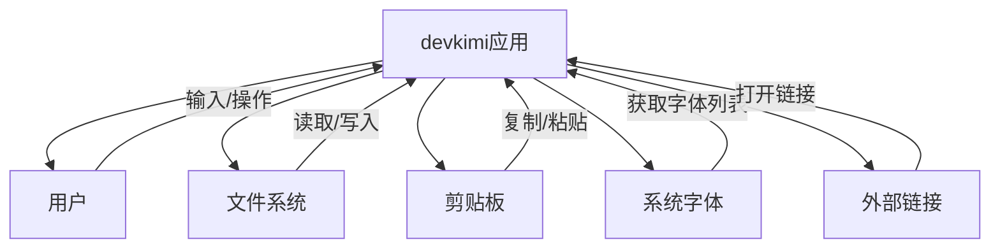

**Diagram sources**
- [lib.rs](file://src-tauri/src/lib.rs#L6-L10)
- [App.tsx](file://src/App.tsx#L6-L47)

## 组件分解图

组件分解图展示了devkimi应用的主要组件及其关系，反映了MVVM架构的分层设计。

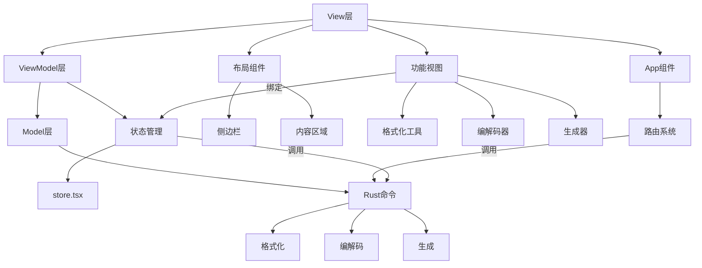

**Diagram sources**
- [App.tsx](file://src/App.tsx#L8-L47)
- [store.tsx](file://src/store.tsx#L1-L88)
- [lib.rs](file://src-tauri/src/lib.rs#L11-L43)

## 技术决策与权衡

### 前端框架选择

选择SolidJS作为前端框架，主要基于其高性能的响应式系统和接近原生JavaScript的语法。与React相比，SolidJS在运行时性能上有显著优势，特别适合桌面应用。

**Section sources**
- [package.json](file://package.json#L27-L40)

### 桌面应用框架选择

选择Tauri而非Electron，主要考虑以下因素：
- **安全性**：Tauri使用Rust构建，内存安全，减少了安全漏洞的风险
- **性能**：生成的应用体积更小，启动更快
- **资源占用**：相比Electron，Tauri应用的内存占用更低

**Section sources**
- [README.md](file://README.md#L47)
- [package.json](file://package.json#L16)

### 样式方案

采用TailwindCSS + DaisyUI的组合，实现了快速UI开发和一致的设计语言。TailwindCSS的实用优先方法提高了开发效率，而DaisyUI提供了丰富的预设组件。

**Section sources**
- [package.json](file://package.json#L14-L15)

### 构建工具

使用Vite作为构建工具，利用其快速的开发服务器和高效的生产构建。Vite的ES模块原生支持提供了极快的热重载体验。

**Section sources**
- [package.json](file://package.json#L23)
- [vite.config.ts](file://vite.config.ts)

## 约束条件

### 安全性

Tauri的架构设计提供了多层安全保护：
- **沙箱环境**：前端JavaScript运行在安全的沙箱中
- **API白名单**：只有明确暴露的Rust函数才能被前端调用
- **权限控制**：通过`tauri.conf.json`配置应用权限

**Section sources**
- [lib.rs](file://src-tauri/src/lib.rs#L5-L10)

### 可扩展性

架构设计考虑了未来的可扩展性：
- **模块化设计**：功能模块按目录组织，易于添加新功能
- **统一接口**：前后端通信采用一致的命令模式
- **插件系统**：Tauri支持插件扩展应用功能

**Section sources**
- [lib.rs](file://src-tauri/src/lib.rs#L11-L43)

### 部署拓扑

devkimi采用单体应用部署模式，前端和后端打包为单一可执行文件。这种部署方式简化了分发和安装过程，用户只需下载一个文件即可使用。

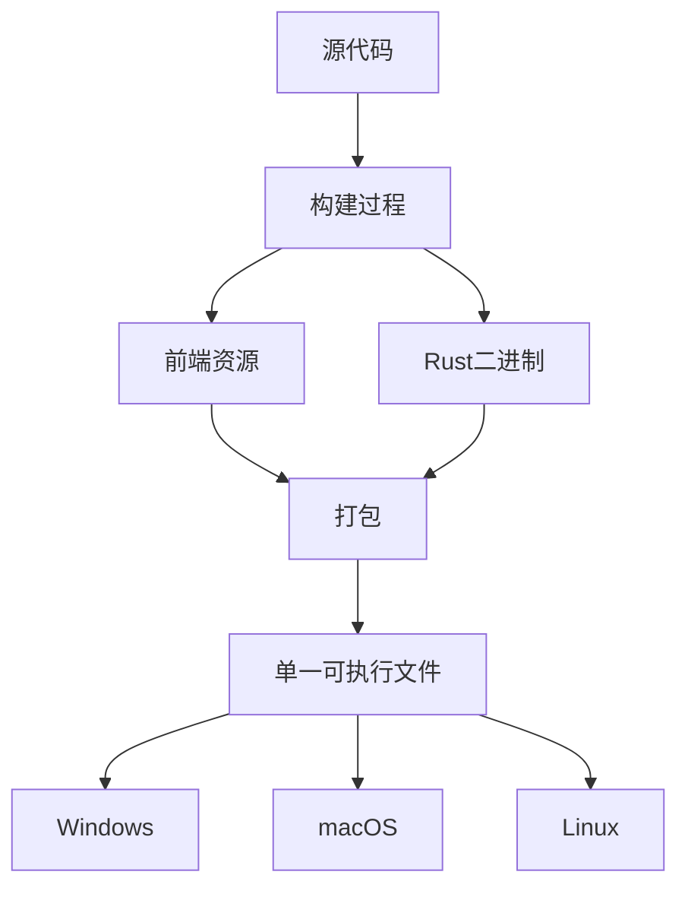

**Diagram sources**
- [Cargo.toml](file://src-tauri/Cargo.toml)
- [vite.config.ts](file://vite.config.ts)