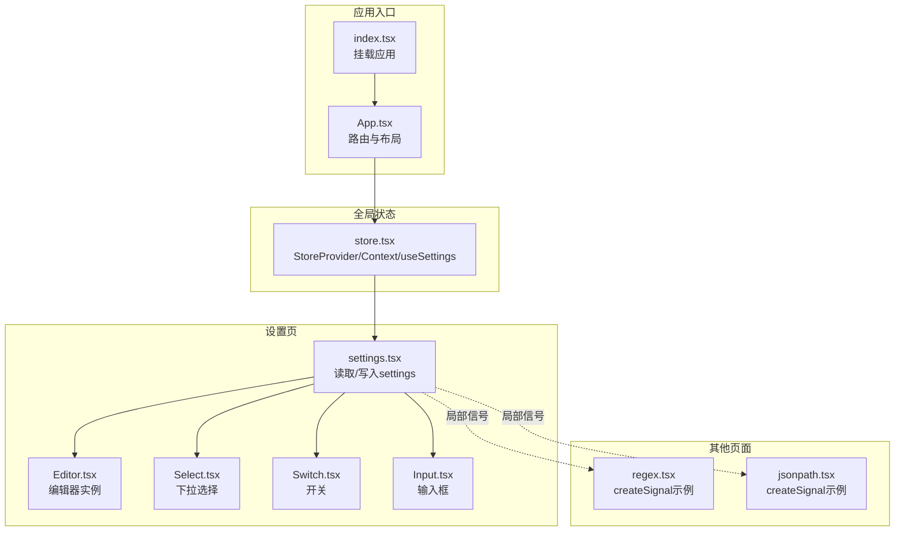
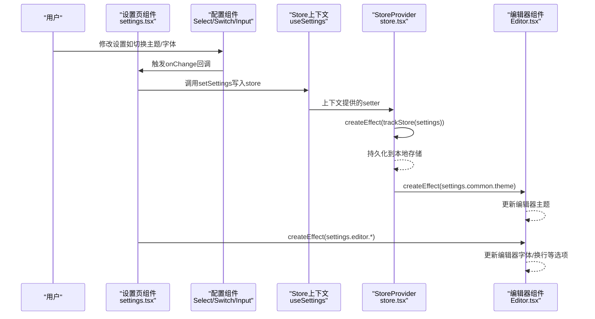
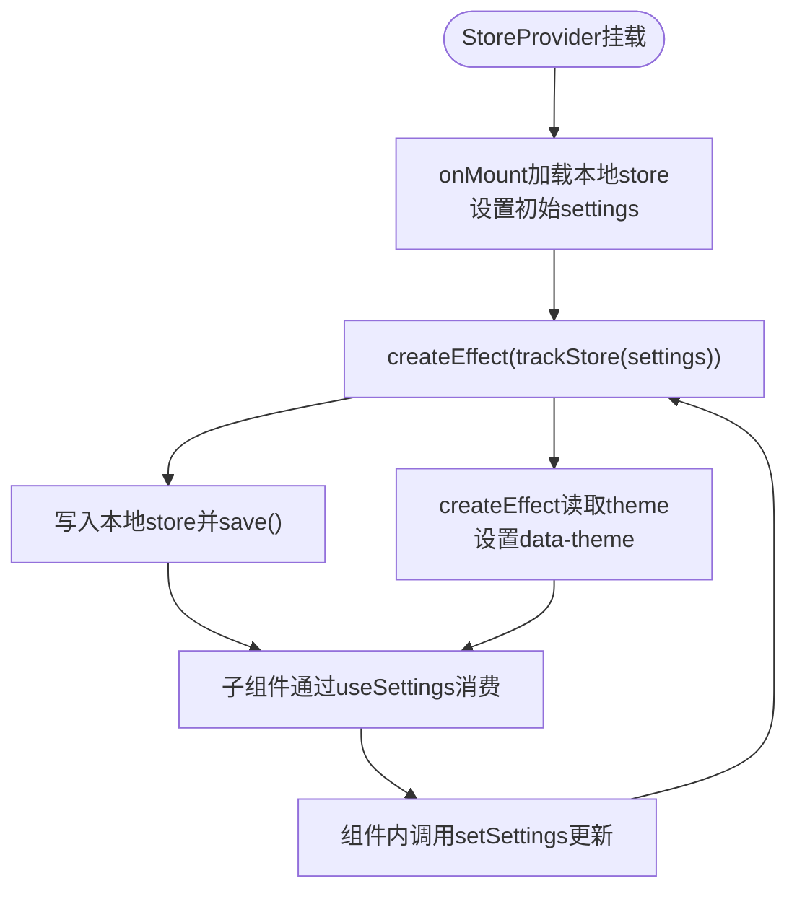
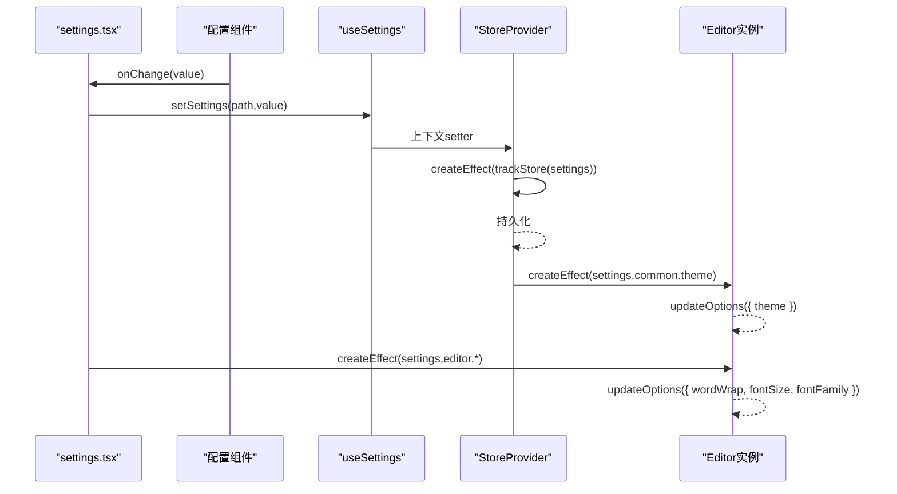
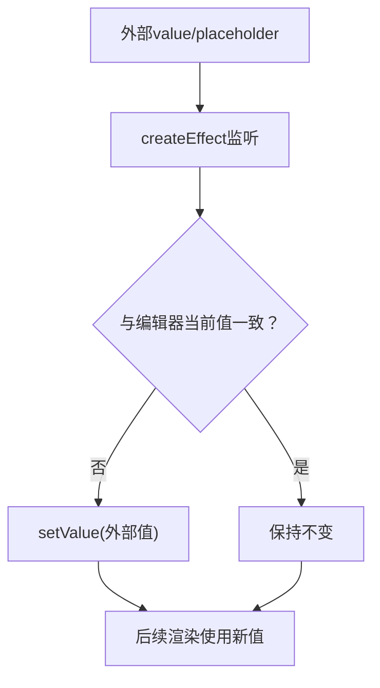
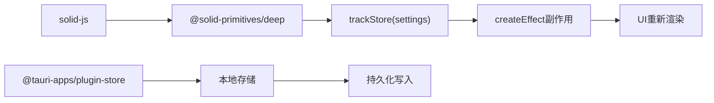

# 响应式原理

<cite>
**本文引用的文件**
- [store.tsx](file://src/store.tsx)
- [index.tsx](file://src/index.tsx)
- [App.tsx](file://src/App.tsx)
- [settings.tsx](file://src/view/settings.tsx)
- [Editor.tsx](file://src/component/Editor.tsx)
- [Select.tsx](file://src/component/Config/Select.tsx)
- [Switch.tsx](file://src/component/Config/Switch.tsx)
- [Input.tsx](file://src/component/Config/Input.tsx)
- [regex.tsx](file://src/view/text/regex.tsx)
- [jsonpath.tsx](file://src/view/text/jsonpath.tsx)
- [package.json](file://package.json)
</cite>

## 目录
1. [简介](#简介)
2. [项目结构](#项目结构)
3. [核心组件](#核心组件)
4. [架构总览](#架构总览)
5. [详细组件分析](#详细组件分析)
6. [依赖分析](#依赖分析)
7. [性能考量](#性能考量)
8. [故障排查指南](#故障排查指南)
9. [结论](#结论)

## 简介
本文件聚焦于devkimi项目中基于SolidJS信号（Signal）与store的响应式更新机制，系统阐述：
- 如何通过SolidJS的信号与store建立依赖追踪；
- 当状态变化时，如何自动触发相关UI组件的更新；
- 在store.tsx中创建与使用store的方式，以及其与UI渲染之间的订阅-发布机制；
- 通过具体代码路径展示状态变更如何精确传播到视图层，确保数据与UI一致。

## 项目结构
devkimi采用SolidJS作为前端框架，结合Tauri进行桌面应用开发。响应式核心位于store.tsx中，通过上下文将settings状态注入到各页面组件；同时，部分页面使用createSignal等原生信号实现局部状态响应。

图表来源
- [index.tsx](file://src/index.tsx#L1-L37)
- [App.tsx](file://src/App.tsx#L1-L47)
- [store.tsx](file://src/store.tsx#L41-L88)
- [settings.tsx](file://src/view/settings.tsx#L1-L122)
- [Editor.tsx](file://src/component/Editor.tsx#L94-L144)
- [Select.tsx](file://src/component/Config/Select.tsx#L1-L30)
- [Switch.tsx](file://src/component/Config/Switch.tsx#L1-L24)
- [Input.tsx](file://src/component/Config/Input.tsx#L1-L37)
- [regex.tsx](file://src/view/text/regex.tsx#L49-L80)
- [jsonpath.tsx](file://src/view/text/jsonpath.tsx#L1-L53)

章节来源
- [index.tsx](file://src/index.tsx#L1-L37)
- [App.tsx](file://src/App.tsx#L1-L47)
- [store.tsx](file://src/store.tsx#L41-L88)

## 核心组件
- 全局store提供者与上下文
  - StoreProvider负责创建settings的store，并通过createEffect监听settings变化，实现持久化与主题切换。
  - useSettings从上下文中取出settings与其setter，供页面组件使用。
- 设置页组件
  - settings.tsx通过useSettings读取settings并写回，同时使用createEffect对编辑器选项进行联动更新。
- 编辑器组件
  - Editor.tsx内部使用createEffect监听外部传入的value与placeholder等属性，保证编辑器与外部状态同步。
- 配置组件
  - Select/Switch/Input等组件作为受控输入，将用户交互事件转换为对store setter的调用，从而驱动响应式更新。

章节来源
- [store.tsx](file://src/store.tsx#L41-L88)
- [settings.tsx](file://src/view/settings.tsx#L1-L122)
- [Editor.tsx](file://src/component/Editor.tsx#L94-L144)
- [Select.tsx](file://src/component/Config/Select.tsx#L1-L30)
- [Switch.tsx](file://src/component/Config/Switch.tsx#L1-L24)
- [Input.tsx](file://src/component/Config/Input.tsx#L1-L37)

## 架构总览
SolidJS的响应式体系在devkimi中体现为“信号/存储 + 效果（Effect）”的组合：
- Signal用于局部状态（如regex.tsx、jsonpath.tsx中的createSignal）；
- Store用于全局状态（store.tsx中的createStore），并通过trackStore实现深层依赖追踪；
- createEffect用于建立依赖与副作用（如持久化、主题切换、编辑器联动）。

图表来源
- [settings.tsx](file://src/view/settings.tsx#L1-L122)
- [Select.tsx](file://src/component/Config/Select.tsx#L1-L30)
- [Switch.tsx](file://src/component/Config/Switch.tsx#L1-L24)
- [Input.tsx](file://src/component/Config/Input.tsx#L1-L37)
- [store.tsx](file://src/store.tsx#L41-L88)
- [Editor.tsx](file://src/component/Editor.tsx#L94-L144)

## 详细组件分析

### StoreProvider与useSettings：全局状态的创建与消费
- 创建与初始化
  - 使用createStore创建settings及其setter，并在onMount阶段从本地存储加载初始值，避免硬编码覆盖用户偏好。
- 持久化与依赖追踪
  - 通过createEffect包裹trackStore(settings)，在settings任一字段发生变化时触发副作用：将settings写回本地存储并保存。
- 主题切换
  - 另一个createEffect读取settings.common.theme，动态设置html元素的data-theme属性，实现主题即时切换。
- 提供与消费
  - StoreProvider通过Context向子树提供[settings, setSettings]，useSettings在组件内解构使用，未找到Provider时抛出错误，确保上下文完整性。

图表来源
- [store.tsx](file://src/store.tsx#L41-L88)

章节来源
- [store.tsx](file://src/store.tsx#L41-L88)

### settings.tsx：从store读取到写回的完整链路
- 读取与写回
  - 通过useSettings获取settings与setSettings，将UI状态与store绑定。
  - 用户在配置组件中触发onChange，setSettings以路径形式更新嵌套字段，SolidJS自动追踪依赖并触发相关effect与渲染。
- 编辑器联动
  - 使用createEffect读取settings.editor并调用编辑器实例的updateOptions方法，实现字体、字号、换行策略等的实时更新。
  - 另一个createEffect读取settings.common.theme，批量更新已注册的编辑器实例，确保主题一致性。

图表来源
- [settings.tsx](file://src/view/settings.tsx#L1-L122)
- [store.tsx](file://src/store.tsx#L41-L88)
- [Editor.tsx](file://src/component/Editor.tsx#L94-L144)

章节来源
- [settings.tsx](file://src/view/settings.tsx#L1-L122)

### Editor.tsx：外部状态驱动内部状态的同步
- 外部状态监听
  - 组件内部通过createEffect监听外部传入的value与placeholder等属性，若与当前编辑器内容不一致则主动setValue，确保双向同步。
- 事件回调
  - 若提供了onChange回调，会监听编辑器内容变化事件并将新值回传给父组件，形成从编辑器到父组件的数据流闭环。

图表来源
- [Editor.tsx](file://src/component/Editor.tsx#L94-L144)

章节来源
- [Editor.tsx](file://src/component/Editor.tsx#L94-L144)

### 配置组件：受控输入与store setter的桥接
- Select/Switch/Input等组件均以受控方式接收value与onChange回调，用户交互直接映射为对setSettings的调用，从而触发响应式更新。
- 这些组件本身不持有全局状态，仅承担UI与store之间的桥接职责，符合SolidJS的“最小状态”原则。

章节来源
- [Select.tsx](file://src/component/Config/Select.tsx#L1-L30)
- [Switch.tsx](file://src/component/Config/Switch.tsx#L1-L24)
- [Input.tsx](file://src/component/Config/Input.tsx#L1-L37)

### 局部信号示例：regex.tsx与jsonpath.tsx
- 两个页面各自使用createSignal维护局部状态，如正则开关、输入文本、捕获结果等。
- createEffect根据信号组合计算新的结果并更新状态，体现了SolidJS在局部场景下的高效响应式能力。

章节来源
- [regex.tsx](file://src/view/text/regex.tsx#L49-L80)
- [jsonpath.tsx](file://src/view/text/jsonpath.tsx#L1-L53)

## 依赖分析
- SolidJS生态
  - @solid-primitives/deep提供trackStore，使createStore支持深层依赖追踪，是store.tsx响应式更新的关键。
  - @tauri-apps/plugin-store提供跨平台本地存储能力，配合createEffect实现自动持久化。
- 项目依赖
  - package.json明确声明了solid-js、@solid-primitives/deep、@tauri-apps/plugin-store等核心依赖，支撑响应式与持久化两大能力。

图表来源
- [package.json](file://package.json#L26-L42)
- [store.tsx](file://src/store.tsx#L41-L88)

章节来源
- [package.json](file://package.json#L26-L42)
- [store.tsx](file://src/store.tsx#L41-L88)

## 性能考量
- 深度追踪的成本
  - trackStore对整个settings对象建立依赖图，建议在大型store中谨慎使用深层嵌套，必要时拆分模块或使用更细粒度的信号。
- Effect的触发频率
  - 将频繁更新的逻辑放入独立createEffect，避免在一个effect中同时处理多类副作用，减少不必要的重渲染。
- 本地存储写入节流
  - 对频繁变更的设置，可在上层增加节流/防抖策略，降低持久化写入频率，提升用户体验。

## 故障排查指南
- 缺少StoreProvider
  - useSettings未找到上下文会抛出异常，需确认App.tsx中StoreProvider包裹范围包含目标组件。
- 主题切换无效
  - 检查settings.common.theme是否被正确写入，以及createEffect是否执行；确认html元素上data-theme属性是否更新。
- 编辑器不随设置变化
  - 确认settings.tsx中对editor的updateOptions调用是否被执行；检查编辑器实例是否已注册到列表。
- 本地存储未保存
  - 检查createEffect中的trackStore与store.set/save流程是否成功；确认权限与路径正确。

章节来源
- [store.tsx](file://src/store.tsx#L41-L88)
- [settings.tsx](file://src/view/settings.tsx#L1-L122)
- [Editor.tsx](file://src/component/Editor.tsx#L94-L144)
- [App.tsx](file://src/App.tsx#L1-L47)

## 结论
devkimi通过SolidJS的信号与store实现了清晰、高效的响应式更新：
- 全局settings使用createStore与trackStore建立深层依赖，结合createEffect完成持久化与主题切换；
- 页面组件通过受控组件与setSettings实现UI与状态的精确绑定；
- 编辑器组件通过createEffect确保外部状态与内部实例保持一致；
- 局部页面使用createSignal满足轻量级响应式需求。

该设计在保证数据与UI一致性的同时，具备良好的扩展性与可维护性。