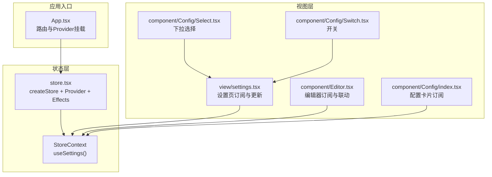
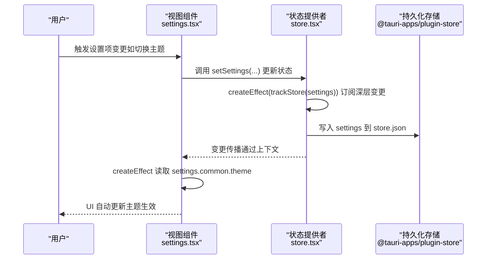
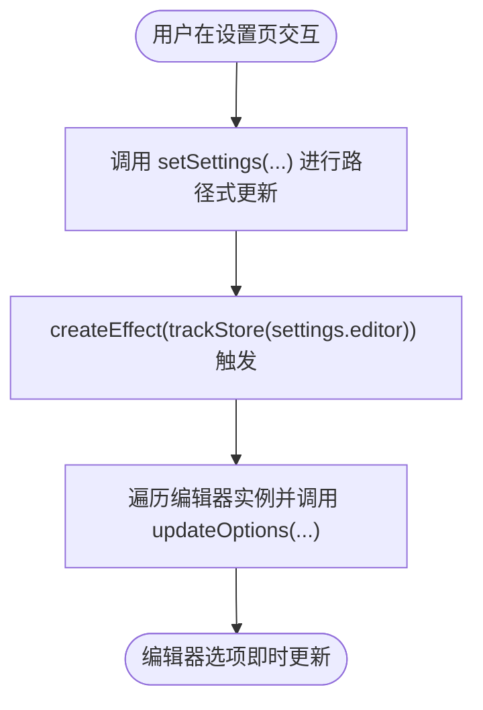
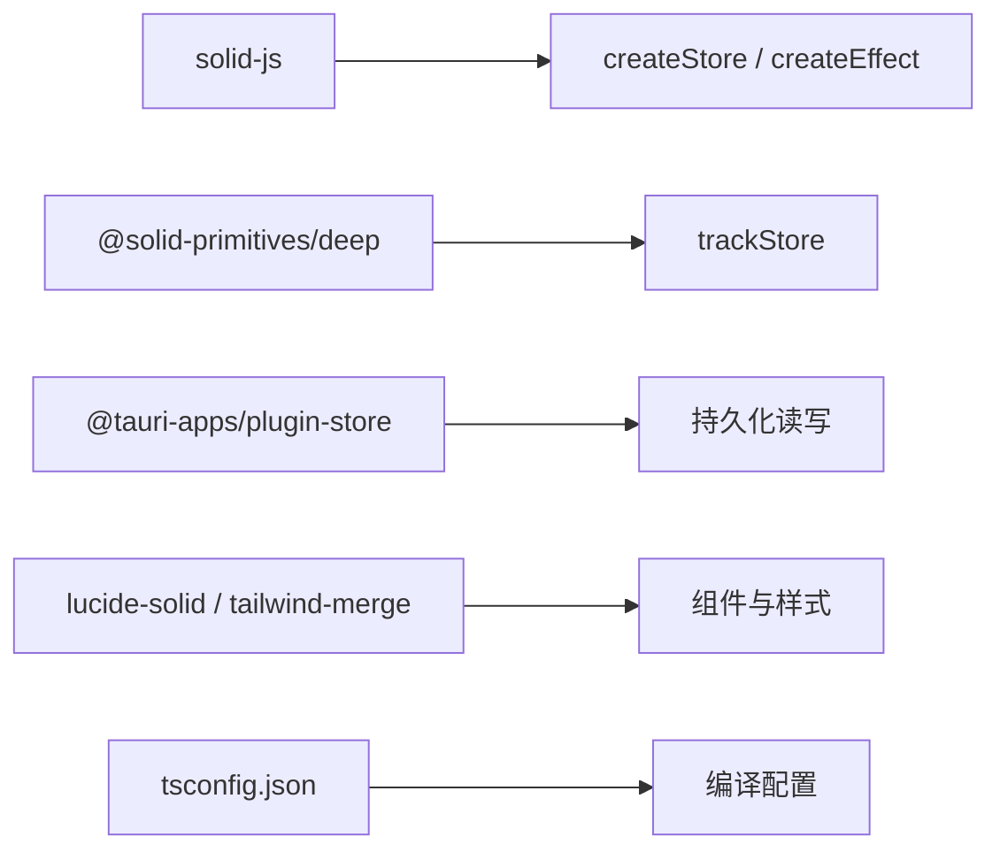

# 响应式更新

<cite>
**本文引用的文件**
- [src/store.tsx](file://src/store.tsx)
- [src/App.tsx](file://src/App.tsx)
- [src/view/settings.tsx](file://src/view/settings.tsx)
- [src/component/Editor.tsx](file://src/component/Editor.tsx)
- [src/component/Config/index.tsx](file://src/component/Config/index.tsx)
- [src/component/Config/Select.tsx](file://src/component/Config/Select.tsx)
- [src/component/Config/Switch.tsx](file://src/component/Config/Switch.tsx)
- [src/utils/accessor.ts](file://src/utils/accessor.ts)
- [package.json](file://package.json)
- [tsconfig.json](file://tsconfig.json)
</cite>

## 目录
1. [简介](#简介)
2. [项目结构](#项目结构)
3. [核心组件](#核心组件)
4. [架构总览](#架构总览)
5. [详细组件分析](#详细组件分析)
6. [依赖分析](#依赖分析)
7. [性能考虑](#性能考虑)
8. [故障排查指南](#故障排查指南)
9. [结论](#结论)

## 简介
本文件聚焦于devkimi项目中的“响应式更新”机制，围绕SolidJS信号与store系统，系统性解析以下要点：
- 基于SolidJS信号的响应式原理：如何通过createEffect、createStore、trackStore等实现状态变更驱动UI自动更新。
- store.tsx中状态更新函数（如setSettings）的实现细节与原子性保障。
- 如何通过trackStore与createEffect实现细粒度订阅，避免不必要重渲染。
- 在实际组件中（如设置页、编辑器）的状态订阅与更新调用模式。
- 性能优化策略：避免重复渲染、使用trackStore提升订阅精度、利用上下文隔离作用域。

## 项目结构
devkimi采用SolidJS作为前端框架，状态管理基于createStore与上下文提供者StoreProvider，配合@solid-primitives/deep的trackStore实现深层状态追踪；UI层通过useSettings钩子订阅状态，并在组件内部使用createEffect对状态变更做出响应。

图表来源
- [src/App.tsx](file://src/App.tsx#L1-L47)
- [src/store.tsx](file://src/store.tsx#L1-L88)
- [src/view/settings.tsx](file://src/view/settings.tsx#L1-L122)
- [src/component/Editor.tsx](file://src/component/Editor.tsx#L61-L144)
- [src/component/Config/index.tsx](file://src/component/Config/index.tsx#L1-L14)
- [src/component/Config/Select.tsx](file://src/component/Config/Select.tsx#L1-L30)
- [src/component/Config/Switch.tsx](file://src/component/Config/Switch.tsx#L1-L24)

章节来源
- [src/App.tsx](file://src/App.tsx#L1-L47)
- [src/store.tsx](file://src/store.tsx#L1-L88)

## 核心组件
- 状态定义与提供者
  - 使用createStore创建Settings类型的响应式store，包含common与editor两部分。
  - StoreProvider在onMount阶段从持久化存储加载初始值，并在每次settings变更时写回持久化存储。
  - 提供useSettings()钩子，返回[settings, setSettings]元组，供子树组件订阅与更新。
- 深层追踪
  - 通过@solid-primitives/deep的trackStore对深层嵌套的settings.editor进行订阅，确保仅当该分支发生变化时才触发相关副作用。
- 主题与DOM联动
  - 通过createEffect监听settings.common.theme，动态为documentElement设置data-theme属性，实现主题切换。

章节来源
- [src/store.tsx](file://src/store.tsx#L1-L88)

## 架构总览
SolidJS的响应式更新链路如下：
- 组件通过useSettings()订阅状态。
- 用户交互触发setSettings()更新store。
- createEffect依赖trackStore(settings)或直接读取settings字段，感知变更并执行副作用（如更新DOM属性、写入持久化存储）。
- 由于createStore的不可变更新语义与trackStore的深度追踪，只有被修改的分支会触发对应副作用，从而避免全量重渲染。

图表来源
- [src/view/settings.tsx](file://src/view/settings.tsx#L1-L122)
- [src/store.tsx](file://src/store.tsx#L1-L88)

## 详细组件分析

### 状态提供者与上下文（store.tsx）
- 数据模型
  - Settings类型包含common（主题、默认展开）与editor（换行、字体族与字号）两个子域。
  - 默认值在defaultSettings中定义，首次启动时作为兜底。
- 提供者逻辑
  - onMount异步加载持久化store.json中的settings，若不存在则回退默认值。
  - createEffect(trackStore(settings))：对整个settings进行深度追踪，一旦有变更即写回store.json并保存。
  - createEffect(settings.common.theme)：监听主题变更，同步到documentElement的data-theme属性，使全局样式生效。
- 订阅与更新
  - useSettings()返回[settings, setSettings]，组件通过解构拿到当前状态与更新函数。
  - setSettings支持路径式更新，如setSettings("common", "theme", value)，保证原子性与一致性。

章节来源
- [src/store.tsx](file://src/store.tsx#L1-L88)

### 设置页（view/settings.tsx）
- 字体资源加载
  - 使用createResource异步获取系统字体列表，映射为下拉选项。
- 主题联动
  - createEffect读取settings.common.theme，遍历已注册的Monaco编辑器实例，调用updateOptions({ theme })即时生效。
- 编辑器联动
  - createEffect(trackStore(settings.editor))：仅当editor分支变更时才更新编辑器选项（wordWrap、fontSize、fontFamily）。
- 更新调用模式
  - 下拉选择与开关组件通过onChange回调调用setSettings的路径式更新，例如：
    - 切换主题：setSettings("common", "theme", value)
    - 切换默认展开：setSettings("common", "openConfigCollapse", value)
    - 修改字体族：setSettings("editor", "font", "family", value)
    - 修改字号：setSettings("editor", "font", "size", value)
    - 修改换行：setSettings("editor", "wordWrap", value)

图表来源
- [src/view/settings.tsx](file://src/view/settings.tsx#L1-L122)

章节来源
- [src/view/settings.tsx](file://src/view/settings.tsx#L1-L122)

### 编辑器组件（component/Editor.tsx）
- 初始化与默认选项
  - onMount创建Monaco编辑器实例，初始选项从全局settings读取（主题、字体、字号、换行）。
- 动态更新
  - createEffect读取local.placeholder并调用updateOptions，实现占位符的响应式更新。
  - createEffect对比local.value与编辑器当前值，必要时setValue，保持外部受控值与编辑器一致。
- 与全局主题联动
  - 组件内部同样读取settings.common.theme，用于初始化编辑器主题；设置页的createEffect也会同步更新已存在的编辑器实例。

章节来源
- [src/component/Editor.tsx](file://src/component/Editor.tsx#L61-L144)

### 配置组件（Config/*）
- Select与Switch
  - Select组件通过onChange回调将用户选择传递给父组件，父组件再调用setSettings进行状态更新。
  - Switch组件通过onChange回调传递布尔值，父组件同样使用setSettings进行路径式更新。
- 卡片组件
  - Config/Card内部也使用useSettings()读取settings，实现卡片折叠状态等与全局设置的联动。

章节来源
- [src/component/Config/Select.tsx](file://src/component/Config/Select.tsx#L1-L30)
- [src/component/Config/Switch.tsx](file://src/component/Config/Switch.tsx#L1-L24)
- [src/component/Config/index.tsx](file://src/component/Config/index.tsx#L1-L14)

### 辅助工具（utils/accessor.ts）
- accessor函数将MaybeAccessor<T>统一为Accessor<T>，便于在需要函数式访问器的场景复用。
- 虽非状态核心，但体现了SolidJS中对“函数式访问器”的通用处理方式。

章节来源
- [src/utils/accessor.ts](file://src/utils/accessor.ts#L1-L11)

## 依赖分析
- 框架与库
  - solid-js：响应式核心（createStore、createEffect、useContext等）
  - @solid-primitives/deep：trackStore用于深层状态追踪
  - @tauri-apps/plugin-store：持久化存储读写
  - lucide-solid、tailwind-merge：UI与样式
- 类型与编译
  - tsconfig.json启用jsx preserve与solid-js的jsxImportSource，确保组件按SolidJS语法编译。

图表来源
- [package.json](file://package.json#L1-L43)
- [tsconfig.json](file://tsconfig.json#L1-L20)

章节来源
- [package.json](file://package.json#L1-L43)
- [tsconfig.json](file://tsconfig.json#L1-L20)

## 性能考虑
- 避免不必要重渲染
  - 使用trackStore对深层分支进行精确订阅，仅当被跟踪的子树发生变化时才触发副作用，减少无关组件的重渲染。
- 原子性与一致性
  - setSettings的路径式更新保证单次调用内完成一次原子性的状态变更，避免中间态导致的多次无效渲染。
- DOM联动与副作用最小化
  - 对编辑器的updateOptions调用集中在createEffect中，且只在相关字段变化时执行，降低DOM操作频率。
- 上下文隔离
  - StoreProvider将状态注入到应用根部，子树通过useSettings()订阅，避免跨组件的冗余依赖，提升订阅粒度与性能。

章节来源
- [src/store.tsx](file://src/store.tsx#L1-L88)
- [src/view/settings.tsx](file://src/view/settings.tsx#L1-L122)
- [src/component/Editor.tsx](file://src/component/Editor.tsx#L61-L144)

## 故障排查指南
- 缺失StoreProvider
  - useSettings()必须在StoreProvider内部使用，否则会抛出异常。请确认App.tsx中已正确包裹StoreProvider。
- 持久化存储未保存
  - 若设置页更改后未持久化，请检查StoreProvider中的createEffect与trackStore是否正确运行，以及store.json的读写权限。
- 主题切换未生效
  - 确认createEffect(settings.common.theme)是否执行，以及documentElement上是否正确设置了data-theme属性。
- 编辑器未随设置更新
  - 检查设置页的createEffect(trackStore(settings.editor))是否运行，以及编辑器实例是否已注册到数组中以便批量更新。

章节来源
- [src/store.tsx](file://src/store.tsx#L1-L88)
- [src/App.tsx](file://src/App.tsx#L1-L47)

## 结论
devkimi项目通过SolidJS的createStore与上下文提供者实现了清晰、可维护的状态管理；借助@solid-primitives/deep的trackStore，系统能够在深层嵌套的数据结构上实现细粒度订阅，显著降低不必要的重渲染。设置页与编辑器组件展示了典型的响应式更新模式：组件订阅状态、用户交互触发setSettings的路径式更新、createEffect根据订阅触发副作用，最终实现UI的自动更新与持久化同步。遵循上述实践，可在复杂界面中保持良好的性能与可维护性。